# CloudFront & Global Accelerator — Full Reference Guide

**AWS SAA-C03 · Edge Services** · Lab: private S3 + OAC + CloudFront + custom domain

---

## Table of Contents

**Reference**
- [Architecture Diagram](#architecture-diagram)
- [Acronyms and What They Mean](#acronyms-and-what-they-mean)
- [Questions I Asked During This Session](#questions-i-asked-during-this-session)

**Part A — CloudFront Theory**
- [Module 1 — What a CDN Is](#module-1--what-a-cdn-is)
- [Module 2 — Cache Hit, Cache Miss, and TTL](#module-2--cache-hit-cache-miss-and-ttl)
- [Module 3 — Cache Invalidation](#module-3--cache-invalidation)
- [Module 4 — Origins and OAC](#module-4--origins-and-oac)
- [Module 5 — VPC Origins vs the Old Public Method](#module-5--vpc-origins-vs-the-old-public-method)
- [Module 6 — Geo Restriction](#module-6--geo-restriction)
- [Module 7 — CloudFront vs S3 Cross-Region Replication](#module-7--cloudfront-vs-s3-cross-region-replication)

**Part B — Global Accelerator Theory**
- [Module 8 — The Problem + Unicast vs Anycast](#module-8--the-problem--unicast-vs-anycast)
- [Module 9 — How Global Accelerator Works](#module-9--how-global-accelerator-works)
- [Module 10 — CloudFront vs Global Accelerator](#module-10--cloudfront-vs-global-accelerator)

**Detour**
- [Stateful vs Stateless — Security Groups vs NACLs](#stateful-vs-stateless--security-groups-vs-nacls)

**Part C — Hands-On Lab (copy-paste redo guide)**
- [Lab Prerequisites](#lab-prerequisites)
- [Stage 0 — Prepare the Site Files](#stage-0--prepare-the-site-files)
- [Stage 1 — Create the Private S3 Bucket](#stage-1--create-the-private-s3-bucket)
  - [Step 1.1 — Create bucket](#step-11--create-bucket)
  - [Step 1.2 — Upload the site](#step-12--upload-the-site)
  - [Step 1.3 — Prove the bucket is private](#step-13--prove-the-bucket-is-private)
- [Stage 2 — Create the Distribution with OAC](#stage-2--create-the-distribution-with-oac)
  - [Step 2.1 — Choose a plan](#step-21--choose-a-plan)
  - [Step 2.2 — Distribution options](#step-22--distribution-options)
  - [Step 2.3 — Specify origin](#step-23--specify-origin)
  - [Step 2.4 — Enable security (WAF)](#step-24--enable-security-waf)
  - [Step 2.5 — Review and create](#step-25--review-and-create)
  - [Step 2.6 — Verify the bucket policy](#step-26--verify-the-bucket-policy)
  - [Step 2.7 — Test through CloudFront](#step-27--test-through-cloudfront)
- [Stage 3 — Default Root Object](#stage-3--default-root-object)
- [Stage 4 — Cache Invalidation](#stage-4--cache-invalidation)
  - [Step 4.1 — Edit and upload](#step-41--edit-and-upload)
  - [Step 4.2 — Prove the cache is stale](#step-42--prove-the-cache-is-stale)
  - [Step 4.3 — Invalidate](#step-43--invalidate)
  - [Step 4.4 — Confirm the fix](#step-44--confirm-the-fix)
- [Stage 5 — Geo Restriction via CLI](#stage-5--geo-restriction-via-cli)
  - [Step 5.1 — Export the config](#step-51--export-the-config)
  - [Step 5.2 — Build the modified config](#step-52--build-the-modified-config)
  - [Step 5.3 — Apply the change](#step-53--apply-the-change)
  - [Step 5.4 — Test the block](#step-54--test-the-block)
  - [Step 5.5 — Revert](#step-55--revert)
- [Stage 6 — Custom Domain with HTTPS](#stage-6--custom-domain-with-https)
  - [Step 6.1 — Route 53 hosted zone](#step-61--route-53-hosted-zone)
  - [Step 6.2 — Point the registrar at Route 53](#step-62--point-the-registrar-at-route-53)
  - [Step 6.3 — Request the ACM certificate](#step-63--request-the-acm-certificate)
  - [Step 6.4 — Validate the certificate](#step-64--validate-the-certificate)
  - [Step 6.5 — Attach domain and certificate](#step-65--attach-domain-and-certificate)
  - [Step 6.6 — Create alias records](#step-66--create-alias-records)
  - [Step 6.7 — Final verification](#step-67--final-verification)
- [Teardown](#teardown)

**Wrap-up**
- [Errors and Fixes — Index](#errors-and-fixes--index)
- [Console vs Course Video Differences](#console-vs-course-video-differences)
- [Exam Quick Reference](#exam-quick-reference)

---

## Architecture Diagram

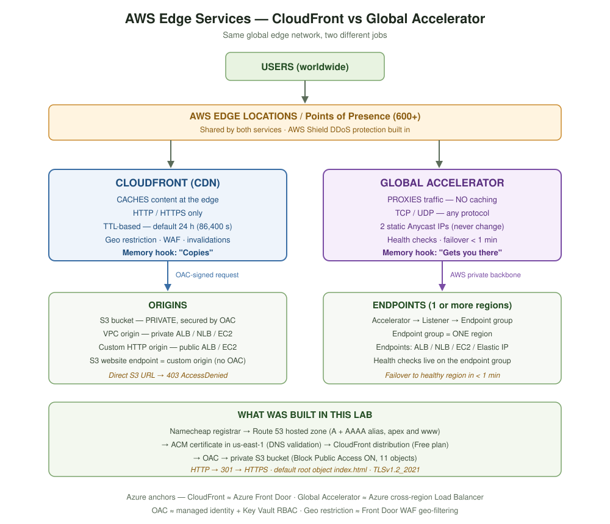

---

## Acronyms and What They Mean

| Acronym | Full form | Meaning in one line |
|---|---|---|
| **ACM** | AWS Certificate Manager | Issues and auto-renews free TLS certificates |
| **ALB** | Application Load Balancer | Layer 7 load balancer (HTTP/HTTPS) |
| **ARN** | Amazon Resource Name | Globally unique identifier for any AWS resource |
| **CDN** | Content Delivery Network | Cached copies of content near users |
| **CNAME** | Canonical Name (DNS record) | Points one hostname at another hostname |
| **CRR** | Cross-Region Replication | Async copy of S3 objects to a bucket in another region |
| **DDoS** | Distributed Denial of Service | Flooding a target from many sources |
| **DNS** | Domain Name System | Turns names into IP addresses |
| **EIP** | Elastic IP | Static public IPv4 address you own |
| **NACL** | Network Access Control List | **Stateless** subnet-level firewall |
| **NLB** | Network Load Balancer | Layer 4 load balancer (TCP/UDP) |
| **OAC** | Origin Access Control | Lets CloudFront read a **private** S3 bucket; replaces OAI |
| **OAI** | Origin Access Identity | **Legacy** predecessor to OAC; no SSE-KMS support |
| **PoP** | Point of Presence | An AWS edge location |
| **SAA** | Solutions Architect – Associate | The AWS certification this maps to |
| **SG** | Security Group | **Stateful** instance-level firewall |
| **SOA** | Start of Authority (DNS record) | Authoritative metadata for a DNS zone |
| **SRR** | Same-Region Replication | Like CRR, but within one region |
| **SSE-KMS** | Server-Side Encryption with KMS | S3 encryption using a KMS-managed key |
| **SSE-S3** | Server-Side Encryption with S3 keys | S3 encryption using AWS-managed keys |
| **TLS** | Transport Layer Security | The encryption behind HTTPS |
| **TTL** | Time To Live | How long a cached copy stays valid |
| **VPC** | Virtual Private Cloud | Your isolated network inside AWS |
| **WAF** | Web Application Firewall | Filters malicious HTTP requests |

---

## Questions I Asked During This Session

Kept here because the answers are the parts that didn't stick the first time.

<details>
<summary><b>What does OAC stand for, and what does it actually do?</b></summary>

**Origin Access Control.**
- **Origin** — the backend CloudFront pulls from (here, the S3 bucket)
- **Access** — permission to read the objects in it
- **Control** — a rule about *who* gets that permission

**Restaurant analogy:** the kitchen is the private S3 bucket. **CloudFront is the waiter.**
**OAC is the waiter's staff badge.** A customer who walks straight into the kitchen (a direct
S3 URL) is turned away with AccessDenied.

It takes **two pieces**: OAC on the CloudFront side signs every request, and the **bucket
policy** on the S3 side trusts only that distribution. The badge is useless if the door
doesn't check for it.
</details>

<details>
<summary><b>What is the difference between stateless and stateful?</b></summary>

**Parking garage analogy.**

| | Remembers the request? | Reply needs its own rule? |
|---|---|---|
| **Stateful** (Security Group) | Yes — the entrance gate gives you a **ticket** | No |
| **Stateless** (NACL) | No — the exit gate has never seen you | **Yes** |

State = memory of the connection. Full detail in
[Stateful vs Stateless](#stateful-vs-stateless--security-groups-vs-nacls).
</details>

<details>
<summary><b>What is the difference between CRR and cache invalidation?</b></summary>

They operate at completely different layers.

| | S3 CRR | CloudFront Invalidation |
|---|---|---|
| Service | **S3** | **CloudFront** |
| What it does | **Copies** objects to another bucket | **Deletes** cached copies at the edges |
| Where | Bucket → bucket in another region | Every edge location |
| When | Continuously, automatically | Once, when you trigger it |
| Touches the origin? | Yes — creates new objects | **No** |

**CRR adds** a full copy somewhere new. **Invalidation removes** a temporary copy so a fresh
one gets pulled.
</details>

<details>
<summary><b>Do we need Origin path?</b></summary>

No — leave it blank. It **prepends a folder** to every request before CloudFront asks S3.

| Origin path | Browser requests | CloudFront asks S3 for |
|---|---|---|
| *(blank)* | `/index.html` | `index.html` ✅ |
| `/images` | `/index.html` | `images/index.html` ❌ 404 |

Use it when one bucket holds several sites (`site-a/`, `site-b/`) and you want one
distribution per site without changing any HTML.
</details>

<details>
<summary><b>How do I convert a .avif file to .jpg?</b></summary>

Renaming does **not** work — the extension is only a label, and S3 sets `Content-Type` from
the extension, so a renamed file is served as `image/jpeg` while containing AVIF bytes.

```bash
# macOS, built in
sips -s format jpeg input.avif --out output.jpg

# ImageMagick, any OS
magick input.avif output.jpg
```

Or ask Unsplash for JPEG directly by replacing `auto=format` with `fm=jpg` in the URL.
</details>

---

# Part A — CloudFront Theory

## Module 1 — What a CDN Is

A **CDN (Content Delivery Network)** is a worldwide network of servers holding copies of your
content close to users. **CloudFront is AWS's CDN.**

> [!TIP]
> **Exam trigger:** any question mentioning "CDN" → the answer is CloudFront.

**Building blocks**

| Term | Meaning |
|---|---|
| **Origin** | Where the content actually lives (e.g. an S3 bucket in one region) |
| **Edge location / PoP** | One of 600+ worldwide sites that cache copies |
| **Regional edge cache** | A larger middle layer between edges and the origin |

> [!NOTE]
> The course video says "216 points of presence." That figure is outdated — it is 600+ today.

**Flow — user in the US, origin in Australia**

1. User requests the site
2. Request goes to the **nearest US edge location**, not to Australia
3. Edge has no copy → fetches from the S3 origin in Australia
4. Edge **caches** a copy locally
5. The next US user is served **straight from the edge**

**Why it matters**

- **Lower latency** worldwide
- **Less load on the origin** — most requests never reach it
- **DDoS protection** — attack traffic lands across hundreds of edges, plus AWS Shield

**Azure anchor:** **Azure Front Door**. App Gateway is a *regional* Layer 7 entry point;
Front Door is the *global* version with edge caching.

---

## Module 2 — Cache Hit, Cache Miss, and TTL

Every cached copy has an expiry timer: the **TTL (Time To Live)**.

**Analogy:** TTL is the expiry date on milk in your fridge. Before that date you just drink it.
After it, you go back to the store (the origin).

**Request flow**

```
User → Edge location
         │
         ├─ In cache AND TTL still valid? → CACHE HIT → serve immediately
         │
         └─ Not in cache, or TTL expired? → CACHE MISS
                   │
                   ▼
            Regional edge cache
                   │
                   └─ Still missing? → fetch from ORIGIN
                                          │
                              cache it with a fresh TTL → serve user
```

**Where TTL comes from**

- CloudFront **default TTL = 86,400 seconds (24 hours)**
- A **cache policy** sets Minimum, Default and Maximum TTL
- The origin can send `Cache-Control: max-age=<n>` to suggest its own value

**How the three settings interact**

| Situation | Result |
|---|---|
| Origin sends **no** `Cache-Control` | Use the **Default TTL** |
| Origin sends `max-age=600`, Min 0 / Max 1 yr | Cached **600 s** (inside the range) |
| Origin sends `max-age=999999999`, Max 1 yr | **Capped** at the Max |

Min and Max are **guardrails**; Default is the **fallback**.

**The trade-off**

| | Long TTL | Short TTL |
|---|---|---|
| Speed | Faster (more cache hits) | Slower (more origin trips) |
| Origin load | Lower | Higher |
| Freshness | Risk of **stale** content | Stays up to date |

**Teach-back (final wording)**

> TTL is how long an edge keeps a cached copy before checking the origin for a fresh one.
> A **long TTL** gives more cache hits, less origin load and faster responses, but content can
> go **stale** after the origin updates. A **short TTL** keeps content fresher but sends more
> requests to the origin.

> [!NOTE]
> Edges cache **independently**, so users in different places can briefly see different
> versions. S3 has strong read-after-write consistency — any staleness you see comes from the
> CloudFront cache, not from S3.

**Azure anchor:** Azure Front Door caching works the same way and also respects
`Cache-Control` from the origin.

---

## Module 3 — Cache Invalidation

**The problem:** you update the origin, but edges keep serving the old copy until the TTL
expires — up to 24 hours by default.

**The fix:** a **cache invalidation** tells CloudFront *"remove these files from every edge
cache now."* The next request becomes a cache miss and pulls the fresh version.

**Analogy:** a **product recall**. Instead of waiting for the milk's expiry date, every fridge
is told to throw that carton out today.

**Paths**

| Path | Clears |
|---|---|
| `/index.html` | One specific file |
| `/images/*` | Everything under `/images/` |
| `/*` | The entire cache |

```bash
aws cloudfront create-invalidation \
  --distribution-id <DISTRIBUTION_ID> \
  --paths "/index.html" "/images/*"
```

> [!IMPORTANT]
> Invalidation **removes** files from the cache. It does **not** push new content out.
> Edges only **pull**, and only when someone asks. The origin object is never touched.

**Billing:** the first **1,000 paths per month** are free on pay-as-you-go. A wildcard such as
`/images/*` counts as **one path**, however many files it matches.

**The alternative: versioned file names**

For content that changes often, ship `app-v42.js` instead of overwriting `app.js`.

| | Overwrite same name | New versioned name |
|---|---|---|
| Edge can tell it changed? | **No** — must force it with an invalidation | **Yes** — new name = new cache entry |
| Unchanged files | Wiped too if you use `/*` | Stay cached |
| Cost at 20 deploys/day | ~600 invalidations/month | **Zero** |

The cache stores files **by name**. Same name + new content = the edge cannot tell.
New name = the edge naturally treats it as new.

> [!TIP]
> **Kubernetes tie-in:** pushing `myapp:latest` is like overwriting `app.js` — a node with
> `latest` cached may keep running the old image. Pushing `myapp:v42` is versioned naming.
> Same lesson, different tool — which is why `:latest` is discouraged in production.

**When invalidation is still right:** occasional fixes, files that must keep the same name
(`index.html`, `robots.txt`), and emergencies.

**Teach-back (final wording)**

> Use **cache invalidation** for occasional updates or files that must keep the same name.
> Use **versioned file names** for frequent updates — a new name causes a cache miss
> automatically, and everything unchanged stays cached.

**Azure anchor:** Azure Front Door calls this **Purge cache**.

---

## Module 4 — Origins and OAC

An **origin** is the backend CloudFront fetches from on a cache miss.

| Origin type | Used for |
|---|---|
| **S3 bucket** (REST endpoint) | Files — secured with **OAC** |
| **Custom origin (HTTP)** | Public ALB, EC2, on-premises server, **S3 static website endpoint** |
| **VPC origin** | Private ALB / NLB / EC2 — see [Module 5](#module-5--vpc-origins-vs-the-old-public-method) |

### OAC — Origin Access Control

**Problem:** keep the bucket private, let CloudFront read it, and stop users bypassing
CloudFront via the S3 URL.

```
User ──✅──> CloudFront ──(OAC-signed request)──> S3 bucket (PRIVATE)
User ──❌────────────────────────────────────────> S3 bucket → AccessDenied
```

1. CloudFront **signs** every request to S3, proving which distribution it is
2. The **bucket policy** trusts **only** that distribution
3. Everyone else gets **AccessDenied**

**The policy CloudFront writes for you**

```json
{
  "Sid": "AllowCloudFrontServicePrincipal",
  "Effect": "Allow",
  "Principal": { "Service": "cloudfront.amazonaws.com" },
  "Action": "s3:GetObject",
  "Resource": "arn:aws:s3:::<BUCKET>/*",
  "Condition": {
    "ArnLike": {
      "AWS:SourceArn": "arn:aws:cloudfront::<ACCOUNT_ID>:distribution/<DISTRIBUTION_ID>"
    }
  }
}
```

Line by line:

| Element | Meaning |
|---|---|
| `Principal: Service: cloudfront.amazonaws.com` | **Who** — the CloudFront service principal, not a user or role |
| `Action: s3:GetObject` | **What** — read objects only. No Put, no Delete, no List. Least privilege. |
| `Resource: .../*` | **Which** — every object in the bucket (the `/*` is required) |
| `Condition: ArnLike AWS:SourceArn` | **The line that matters** — narrows it to *this* distribution in *this* account |

> [!WARNING]
> Without the `Condition`, **any** CloudFront distribution in **any** AWS account could read
> your bucket. That one block is the difference between "CloudFront can read this" and
> "*my* CloudFront can read this."

> [!NOTE]
> AWS generates `ArnLike`, not `StringEquals`. `ArnLike` is the ARN-aware comparison operator
> that supports wildcards in ARN segments. Use the value the console actually produced.

**Exam facts**

| Fact | Detail |
|---|---|
| OAI vs OAC | **OAI is legacy.** OAC replaces it and supports **SSE-KMS** encrypted objects |
| S3 website endpoint | `bucket.s3-website-<region>.amazonaws.com` = a **custom HTTP origin** → **cannot use OAC**, must be public |
| S3 REST endpoint | `bucket.s3.<region>.amazonaws.com` = the only one OAC works with |
| SSE-KMS | Also needs the **KMS key policy** to allow CloudFront `kms:Decrypt` |

> [!TIP]
> **Exam pattern:** "static website endpoint" + "private bucket" or "OAC" = the setup won't
> work. Switch to the **REST endpoint** with OAC and set a **default root object**.

**Teach-back (final wording)**

> OAC lets CloudFront prove its identity by signing every request to the private S3 bucket.
> The bucket policy trusts only that distribution. You need **both** — OAC shows the badge,
> the bucket policy checks it. Miss either one and CloudFront gets AccessDenied.

**Azure anchor:** App Gateway used a **user-assigned managed identity**, and Key Vault trusted
**only that identity** via RBAC. Same shape: prove identity, trust only that identity.

---

## Module 5 — VPC Origins vs the Old Public Method

**The problem:** your app runs on an ALB or EC2, not S3, and you don't want the backend
exposed to the internet.

### The new way — VPC origins

```
User → CloudFront edge → VPC origin → [PRIVATE SUBNET]
                                         ├─ internal ALB → EC2
                                         ├─ internal NLB
                                         └─ private EC2
```

1. ALB / NLB / EC2 lives in **private subnets**, no public IP
2. Create a **VPC origin** in CloudFront pointing at it
3. CloudFront reaches it over the **AWS private network**
4. You choose what to expose; everything else stays private

### The old way — public origin + locked-down security group

1. Make the EC2 or ALB **public**
2. Look up the list of **CloudFront edge public IP ranges**
3. Update the **security group** to allow only those IPs
4. For an ALB, keep the EC2 instances private behind it using **SG-to-SG trust**

> [!WARNING]
> **Why the old way is weaker:** the security group is the *only* barrier. One bad rule
> (`0.0.0.0/0`) exposes the backend directly to the internet — bypassing CloudFront **and any
> WAF attached to it**. The IP list also has to be maintained as AWS changes it.

**Analogy:** the old way is a kitchen with a **street door** and a guard checking IDs against a
list. VPC origin means **there is no street door at all** — the only way in is a private
corridor from the dining room.

**Valid VPC origins:** ALB, NLB, EC2.
**Not valid:** S3 (uses OAC instead), RDS or DynamoDB (databases sit *behind* the app tier).

> [!NOTE]
> **Plan gate observed in the console:** VPC origin is **greyed out on the Free plan** — it
> requires the **Business plan**. Confirmed live during this lab.
>
> 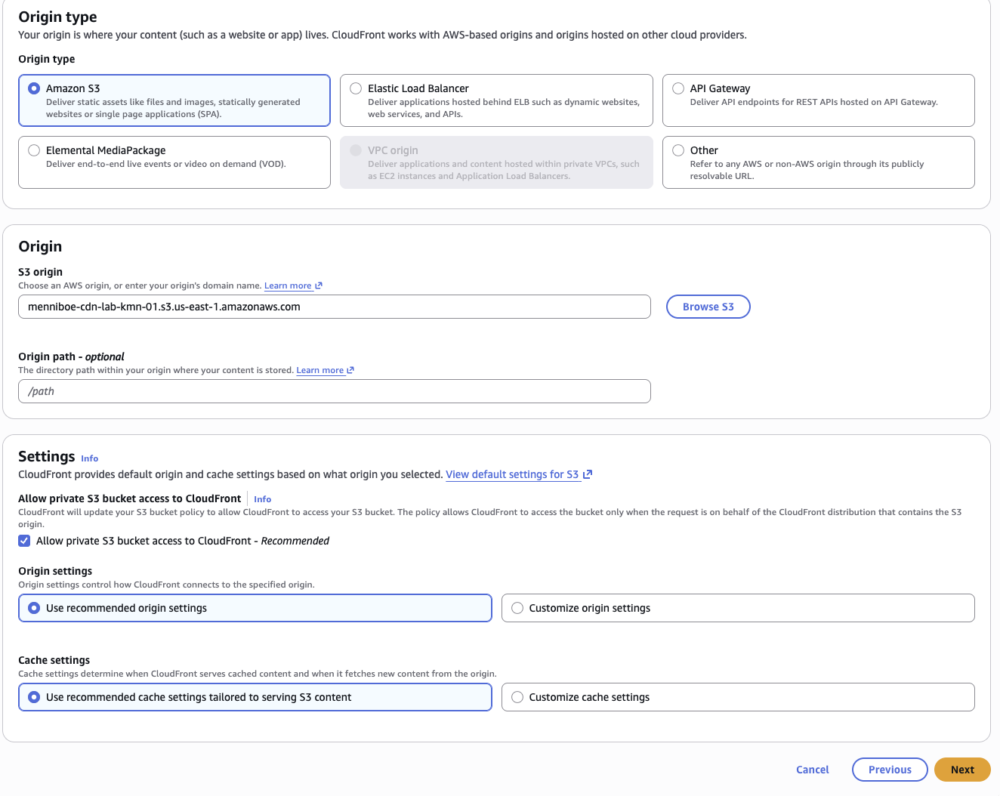

**Teach-back (final wording)**

> The old method required a **public** ALB or EC2 protected only by a security group allowing
> CloudFront's IP ranges — tedious to maintain, and one bad rule exposes the backend.
> **VPC origins** let CloudFront reach private ALBs, NLBs and EC2 in private subnets, so the
> backend has **no public address** and that entire class of risk disappears.

**Azure anchor:** **Azure Front Door Premium with Private Link origins**, and the same spirit
as the Azure **Private Endpoint** lab — public access disabled, private path only.

---

## Module 6 — Geo Restriction

Control access based on the **country** a request comes from.

| Mode | Behaviour | Use when |
|---|---|---|
| **Allow list** (`whitelist`) | Only the listed countries get in | Few countries allowed |
| **Block list** (`blacklist`) | Everyone **except** the listed countries | Few countries blocked |

The country comes from matching the request's **IP address** against a third-party **GeoIP
database** — not the user's physical location.

**Blocked users get HTTP 403**, with a CloudFront-generated error page. A custom error page
can replace it.

**Main use case:** copyright and licensing (streaming "not available in your region").

> [!IMPORTANT]
> Geo restriction applies to the **whole distribution**. To block a country on only one path
> (e.g. `/premium/*`), or to combine country with another condition such as a header or rate
> limit, use an **AWS WAF geo match rule** instead.

> [!WARNING]
> **A VPN defeats it.** A US user on a German VPN exit is seen as German and blocked; a user
> in a blocked country on a US exit gets in. Geo restriction is a **compliance** control,
> not a security boundary.

**Teach-back (final wording)**

> An **allow list** lets in only the listed countries (best when few are allowed). A **block
> list** keeps out only the listed countries (best when few are blocked). Both use a GeoIP
> database mapping the request's IP to a country, and both apply to the whole distribution.
> Use a **WAF geo match rule** when the country must be combined with another condition.

**Azure anchor:** **geo-filtering** in a Front Door **WAF policy** — the same WAF policy blade
used in the App Gateway lab.

---

## Module 7 — CloudFront vs S3 Cross-Region Replication

Both put copies of content in more places, but for different jobs.

| | CloudFront | S3 CRR |
|---|---|---|
| Reach | **Global** — every edge | Only the regions you pick |
| Mechanism | **Caches** copies (TTL) | **Copies** the whole bucket, async |
| Freshness | Can be stale until TTL expires | **Near real-time** |
| Best for | **Static** content, global users | **Dynamic** content, a few regions |
| Other uses | DDoS protection, geo restriction | Compliance, disaster recovery, data locality |

**Analogy:** CloudFront = **convenience stores** worldwide stocking popular items with expiry
dates. CRR = a **second full warehouse** in a few chosen cities, restocked continuously.

**CRR exam facts**

> [!IMPORTANT]
> - **Versioning must be enabled on BOTH** source and destination buckets
> - CRR replicates **new objects only** — existing objects need **S3 Batch Replication**
> - **SRR** (Same-Region Replication) is the same feature within one region, used for log
>   aggregation or prod/test separation

> [!TIP]
> **Exam pattern:** "new objects replicate, old ones don't" → **S3 Batch Replication**.

**Teach-back (final wording)**

> Choose **CloudFront** for static content that must be fast globally — it caches at edges
> worldwide for the TTL. Choose **S3 CRR** for dynamic content that changes constantly and
> must be low-latency in a few specific regions — it copies objects asynchronously in near
> real-time, with no cache to go stale.

**Azure anchors:** CloudFront ≈ **Front Door**; S3 CRR ≈ **Blob object replication** (also
requires versioning).

---

# Part B — Global Accelerator Theory

## Module 8 — The Problem + Unicast vs Anycast

### The problem

App deployed in **one region** (say India), users worldwide.

```
USER (America)  ─hop─hop─hop─hop─hop─> ALB (India)   ← public internet
USER (Europe)   ─hop─hop─hop─hop─────> ALB (India)
USER (Australia)─hop─hop─hop─────────> ALB (India)
```

Every hop adds **latency**, **risk of dropped connections**, and **unpredictability** as
routes change.

**Goal:** get users onto **AWS's private global network** as early as possible.

### Unicast vs Anycast

| | Behaviour |
|---|---|
| **Unicast** | **One server = one IP.** The IP you dial decides the server you reach. |
| **Anycast** | **Many servers share the SAME IP.** You are routed to the **nearest** one. |

```
UNICAST:  Client → 12.34.56.78 → Server A only
          Client → 98.76.54.32 → Server B only

ANYCAST:  Client (Paris)  → 1.2.3.4 → nearest server (Europe)
          Client (Sydney) → 1.2.3.4 → nearest server (Australia)
                           same IP, different destination
```

Routers advertise the same IP from multiple locations and each picks the **shortest network
path** — so "nearest" means nearest in *network* terms, usually but not always geographically.

**Analogy:** an **emergency number (911)**. Same number everywhere; you reach the **nearest
dispatch centre**. A unicast address is one specific office's direct line.

> [!NOTE]
> **You have already met anycast:** the 13 DNS **root server** addresses are served from
> hundreds of physical machines worldwide via anycast, and so is `8.8.8.8`.

**Why it helps distant users:** they enter at a **nearby edge** after only a few public
internet hops, then travel the rest of the way on a **private network**.

**Azure anchor:** Azure's **cross-region (global) Load Balancer** gives a single anycast
frontend IP routing to the nearest healthy regional load balancer.

---

## Module 9 — How Global Accelerator Works

Global Accelerator gives your app **2 static anycast IP addresses**. Users reach the nearest
edge, then traffic rides the **AWS private global network** to your app.

```
User (America)   ─few hops─> Edge (US)  ═══ AWS backbone ═══╗
User (Europe)    ─few hops─> Edge (EU)  ═══ AWS backbone ═══╬══> ALB (India)
User (Australia) ─few hops─> Edge (AU)  ═══ AWS backbone ═══╝
                 ↑ public internet ↑        ↑ private, fast, stable ↑
```

**Building blocks**

```
Accelerator          (global — owns the 2 static IPs)
 └── Listener        (protocol + port, e.g. TCP 80; client affinity none | source IP)
      └── Endpoint group   (ONE per REGION — health checks, traffic dial %)
           └── Endpoint    (ALB / NLB / EC2 / Elastic IP — public or private, plus weight)
```

> [!IMPORTANT]
> **Health checks are configured on the ENDPOINT GROUP**, not the accelerator, listener or
> individual endpoint. Typical lab values: HTTP, path `/`, port 80, 10-second interval,
> threshold 2.

**What it gives you**

| Benefit | Detail |
|---|---|
| Consistent performance | Intelligent routing to the lowest-latency healthy endpoint |
| Fast failover | Endpoint or region fails → traffic moves in **under 1 minute** (great for DR) |
| No client cache problem | The 2 IPs **never change** — unlike Route 53 DNS failover, where clients hold cached answers until the TTL expires |
| Security | Clients allowlist just **2 IPs**; automatic DDoS protection via AWS Shield |
| Protocols | **Layer 4 — TCP and UDP**, so not limited to HTTP |

> [!WARNING]
> **Teardown order:** you must **disable** the accelerator before you can **delete** it, then
> terminate the EC2 instances in **both** regions. Endpoints also show unhealthy until
> provisioning finishes — wait before troubleshooting.

**Teach-back (final wording)**

> Users connect to one of Global Accelerator's **2 static anycast IPs**, which routes them to
> the **nearest edge location** after only a few public internet hops. From the edge, traffic
> travels over the **AWS private network** to the app's endpoint (ALB, NLB, EC2 or EIP).
> Health checks on each endpoint group trigger **failover** to a healthy region in under a
> minute, and the IPs never change.

**Azure anchor:** Azure **cross-region Load Balancer** — Layer 4, static anycast frontend IP,
nearest healthy regional LB, fast global failover.

---

## Module 10 — CloudFront vs Global Accelerator

**Shared:** the same AWS global edge network, and AWS Shield DDoS protection.

| | CloudFront | Global Accelerator |
|---|---|---|
| **Core job** | **Caches** content at the edge | **Proxies** traffic to your app |
| **Caching** | Yes | **No** — every request reaches your app |
| **Protocols** | HTTP / HTTPS | **TCP / UDP** |
| **IPs** | Changing, resolved via DNS | **2 static anycast IPs** |
| **Best for** | Images, video, websites, API acceleration | **Gaming, IoT, VoIP**, HTTP needing static IPs, fast regional failover |

> [!TIP]
> **Memory hook**
> - **CloudFront = Copies** — keeps copies of your content near users
> - **Global Accelerator = Gets you there** — a fast private road to your app

**Exam decision rules**

| Question says… | Answer |
|---|---|
| "cache", "static content", "CDN" | **CloudFront** |
| "UDP", "gaming", "IoT", "VoIP" | **Global Accelerator** |
| "static IPs" / "allowlist IPs in a firewall" | **Global Accelerator** |
| "deterministic, fast regional failover" | **Global Accelerator** |
| "reduce origin load" + static assets | **CloudFront** |

> [!NOTE]
> **Common trap:** an ALB **cannot** have an Elastic IP — only an NLB can. If a question
> offers "attach Elastic IPs to the ALB," it's wrong.

---

# Detour

## Stateful vs Stateless — Security Groups vs NACLs

This came up mid-session and is guaranteed SAA content.

**Parking garage analogy**

| | Entrance | Exit |
|---|---|---|
| **Stateful garage (Security Group)** | Gate gives you a **ticket** | Gate scans the ticket — "I know this car" — and opens |
| **Stateless garage (NACL)** | Gate checks the entry list | Gate has **no idea you were ever inside** — checks a separate **exit list** |

The car driving in is the **request**; the car driving out is the **reply**; the ticket is
**connection tracking** — which is what "state" means.

| | Remembers the request? | Reply needs its own rule? |
|---|---|---|
| **Stateful** (SG) | Yes | **No** |
| **Stateless** (NACL) | No | **Yes** — ephemeral ports 1024–65535 |

> [!WARNING]
> **The misconception that cost me three wrong answers:** I believed the SG *superseded* the
> NACL. It does not. They are **independent layers** and traffic must pass **both** —
> either one can block it. Two locked doors in a row: one open door doesn't help.

```
INBOUND:   Internet → [NACL: subnet border] → [SG: instance] → EC2
OUTBOUND:  EC2 → [SG: instance] → [NACL: subnet border] → Internet
```

**Azure anchor:** in the Azure VM lab, ICMP was blocked by an **NSG** *and* by **Windows
Firewall** as two separate layers — either alone could drop the ping. Same model.

**2-step checklist for any SG-vs-NACL question**

1. **Security Group** — is inbound allowed? If yes, **stop checking the SG.** Its outbound
   rules don't matter for replies.
2. **NACL** — check **both directions**. Inbound allowed? Outbound allowed to **1024–65535**?
   If not, that's the fix.

> [!TIP]
> The reply does **not** go *to* port 443 — it goes *from* 443 back to the client's random
> ephemeral port. So an outbound rule must cover **1024–65535**, not the service port.
> Also: **NACLs can DENY a specific IP; SGs can only ALLOW.** "Block a malicious IP" → NACL.

**Teach-back (final wording)**

> The SG didn't need an outbound rule because it's **stateful** — it remembers the request, so
> the reply is automatically allowed. The NACL did need one because it's **stateless** — it
> has no memory of the request, so the reply needs its own outbound rule to ephemeral ports
> 1024–65535.

**Mini-lab to do later:** in a test VPC, attach a custom NACL with inbound 80 and no outbound
rules, watch the request time out, then add outbound 1024–65535 and watch it work.

---

# Part C — Hands-On Lab

## Lab Prerequisites

| Requirement | This lab used |
|---|---|
| AWS account | Personal account, `us-east-1` |
| AWS CLI | Configured and authenticated |
| Editor | VS Code |
| Shell | zsh on macOS |
| Site files | A static HTML page + 10 JPEG images |
| Domain (optional) | Registered at Namecheap, DNS moved to Route 53 |

**Placeholders used throughout — substitute your own:**

```
<BUCKET>            e.g. menniboe-cdn-lab-kmn-01
<DISTRIBUTION_ID>   e.g. E1XXXXXXXXXXXX
<DIST_DOMAIN>       e.g. dXXXXXXXXXXXXX.cloudfront.net
<ACCOUNT_ID>        your 12-digit AWS account ID
<CERT_ARN>          arn:aws:acm:us-east-1:<ACCOUNT_ID>:certificate/<uuid>
```

> [!WARNING]
> **Before committing to a public repo,** redact your AWS account ID from screenshots and
> JSON output. It is not a credential, but it is used for reconnaissance. Also add the
> exported config files to `.gitignore`:
>
> ```
> dist-config*.json
> ```

---

## Stage 0 — Prepare the Site Files

Build a folder with the page at the root and images in a subfolder:

```
menniboe-cdn-lab/
├── index.html
└── images/
    ├── goats.jpg          ├── tomatoes.jpg         ├── dairy.jpg
    ├── pigs.jpg           ├── root-vegetables.jpg  ├── honey.jpg
    ├── chickens.jpg       └── leafy-greens.jpg     └── farm-visits.jpg
    └── cattle.jpg
```

> [!IMPORTANT]
> **The images must be local files referenced by relative paths.** The original page pulled
> all images from `https://images.unsplash.com/...`, which means nothing would have been
> served from S3 or CloudFront and the lab would have proven nothing. All `src` attributes
> were rewritten to `images/<name>.jpg`.

### ❌ Error — broken image card

**Symptom:** one card rendered its `alt` text instead of a photo.

**Cause:** the Unsplash URL for that image was truncated in the source HTML, so no file was
ever downloaded for it. The page structure was fine — the referenced file simply didn't exist
in `images/`.

**Fix:** supply the missing file, or delete that card from the HTML.

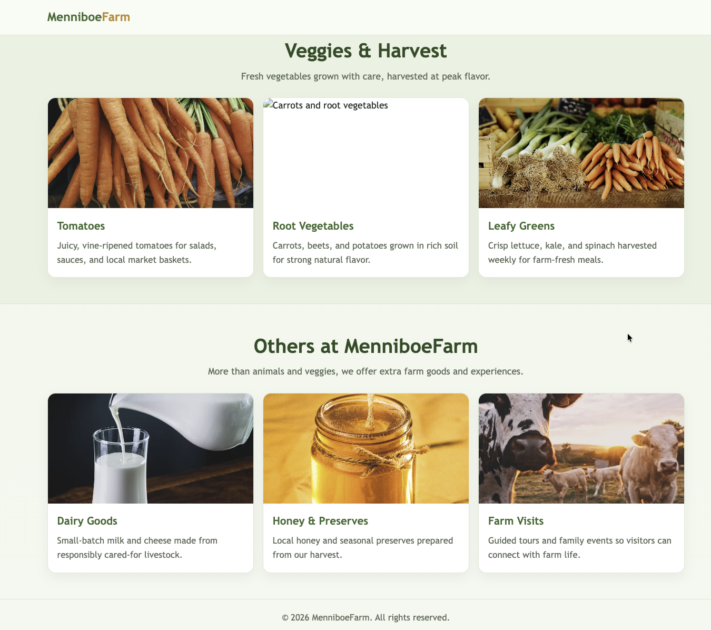

### ❌ Error — `.avif` files won't display as `.jpg`

**Symptom:** downloaded images were `.avif`; renaming them to `.jpg` produced broken images.

**Cause:** the extension is only a label. S3 sets `Content-Type` from the extension, so a
renamed file is served as `image/jpeg` while containing AVIF bytes, and browsers refuse it.

**Fix — actually convert:**

```bash
# macOS, built in
sips -s format jpeg input.avif --out output.jpg

# ImageMagick, any OS
magick input.avif output.jpg
```

> [!TIP]
> This is a real CloudFront troubleshooting scenario: S3 sets `Content-Type` at upload time
> from the file extension, and CloudFront passes it through. A wrong `Content-Type` means
> content that downloads instead of displaying.

**Always verify locally before uploading:**

```bash
cd ~/Desktop/menniboe-cdn-lab
open index.html
```

All images must render with no broken icons. This rules out the HTML entirely, so any later
breakage is definitely AWS-side.

*(No screenshot captured at this step — verify locally before uploading.)*

---

## Stage 1 — Create the Private S3 Bucket

**Goal:** a fully private bucket serving as the origin, with proof that direct S3 URLs are
blocked. This is the "before" evidence that makes Stage 2 meaningful.

### Step 1.1 — Create bucket

**Console → S3 → Buckets → Create bucket**

| Tab / Section | Field | Value |
|---|---|---|
| **General configuration** | Bucket type | General purpose |
| | Bucket name | `<BUCKET>` (globally unique) |
| | AWS Region | US East (N. Virginia) `us-east-1` |
| | Copy settings from existing bucket | *leave blank* |
| **Object Ownership** | | **ACLs disabled (recommended)** |
| **Block Public Access** | Block *all* public access | ✅ **CHECKED** — all 4 sub-boxes |
| **Bucket Versioning** | | **Disable** |
| **Tags** | `Project` | `cloudfront-lab` |
| | `Owner` | `<your-name>` |
| **Default encryption** | Encryption type | **SSE-S3** (Amazon S3 managed keys) |
| | Bucket Key | **Enable** |
| **Advanced settings** | Object Lock | **Disable** |

Click **Create bucket**.

> [!NOTE]
> **Why Block Public Access stays fully ON:** this is the entire point of the lab. OAC works
> with the bucket **completely locked down**, because the CloudFront bucket policy is not a
> *public* policy — it grants access to one specific service principal.

> [!TIP]
> **ACLs disabled** is correct because ACLs are the legacy permission model. Everything
> modern uses bucket policies — which is exactly what OAC will write.
>
> **Versioning disabled** avoids version cleanup at teardown. (If this were an **S3 CRR** lab,
> versioning would be **mandatory** on both buckets.)
>
> **Object Lock disabled** — Object Lock makes objects undeletable for a retention period,
> which would block teardown.

**CLI equivalent**

```bash
aws s3 mb s3://<BUCKET> --region us-east-1
```

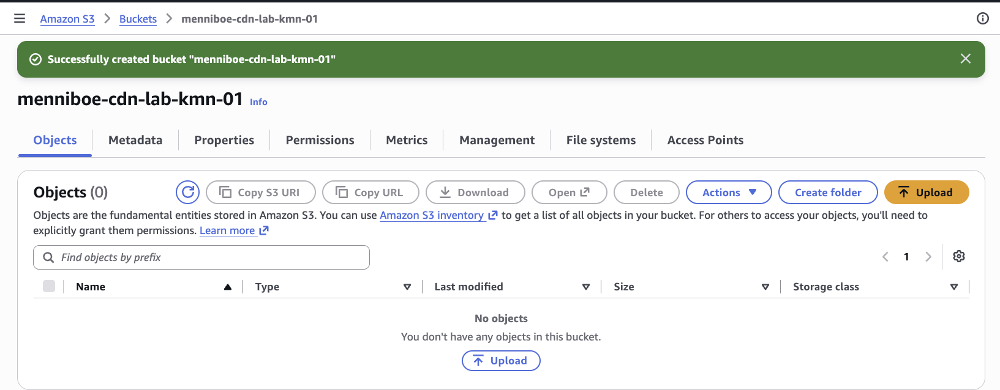

### Step 1.2 — Upload the site

```bash
cd ~/Desktop/menniboe-cdn-lab
aws s3 sync . s3://<BUCKET>/
aws s3 ls s3://<BUCKET>/ --recursive --human-readable
```

Expect **11 objects** — `index.html` plus 10 under `images/`.

> [!NOTE]
> Use `sync`, not `cp` — it preserves the `images/` folder structure, which matters for the
> `/images/*` wildcard invalidation later.
>
> The console shows **"Objects (2)"** at the top level because S3 displays `images/` as a
> single folder row. S3 has no real folders — `images/goats.jpg` is one flat key. Use
> `--recursive` to see all 11.

**Console alternative:** Upload → **Add files** (`index.html`) → **Add folder** (`images/`).

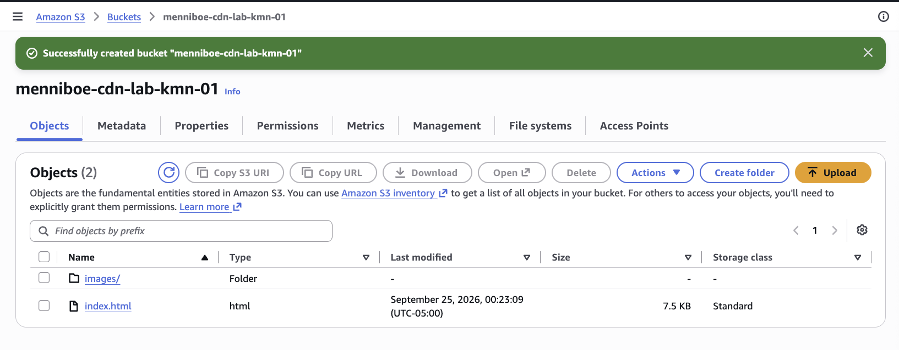

### Step 1.3 — Prove the bucket is private

**Test 1 — direct object URL**

Click `index.html` → copy **Object URL** → open in a new tab.

**Expected:**

```xml
<Error>
  <Code>AccessDenied</Code>
  <Message>Access Denied</Message>
  <RequestId>...</RequestId>
  <HostId>...</HostId>
</Error>
```

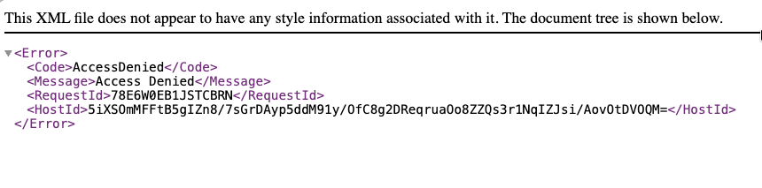

**Test 2 — pre-signed URL**

With `index.html` selected, click **Open** (allow pop-ups).

**Expected:** the page **loads**, but **all 10 images are broken**.

> [!IMPORTANT]
> **Why:** the pre-signed URL only signs `index.html`. Each image is a **separate private
> object**, and the browser requests them with no signature at all — so S3 denies every one.
>
> This broken-image page is the single best screenshot in the lab. In Stage 2 the identical
> page renders perfectly through CloudFront, with the bucket just as private. **That contrast
> is OAC.**

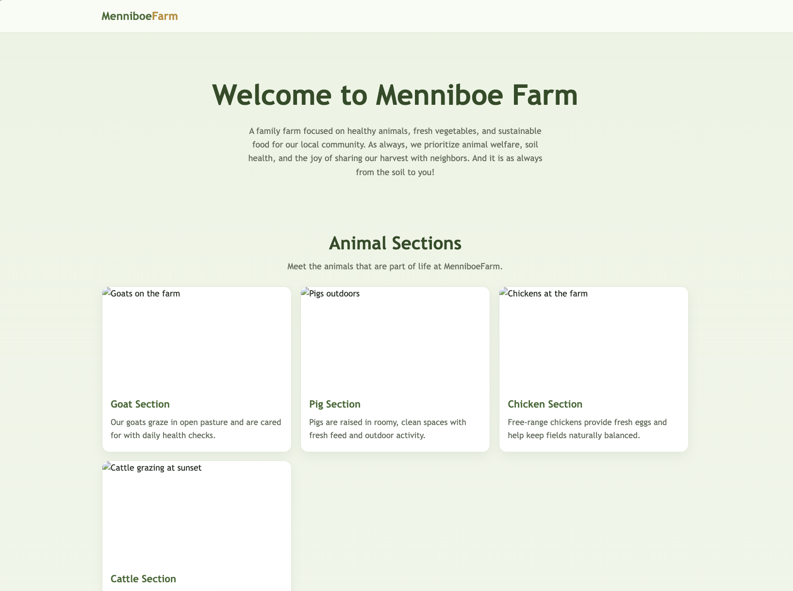

**Test 3 — verify from the CLI**

```bash
aws s3api get-public-access-block --bucket <BUCKET>
aws s3api get-bucket-policy --bucket <BUCKET>
```

**Expected:**

```json
{
    "PublicAccessBlockConfiguration": {
        "BlockPublicAcls": true,
        "IgnorePublicAcls": true,
        "BlockPublicPolicy": true,
        "RestrictPublicBuckets": true
    }
}
```

```
An error occurred (NoSuchBucketPolicy) when calling the GetBucketPolicy operation:
The bucket policy does not exist
```

> [!TIP]
> **Capture that `NoSuchBucketPolicy` error.** After Stage 2 the same command returns the OAC
> policy. The two outputs side by side are the cleanest evidence in the whole lab.

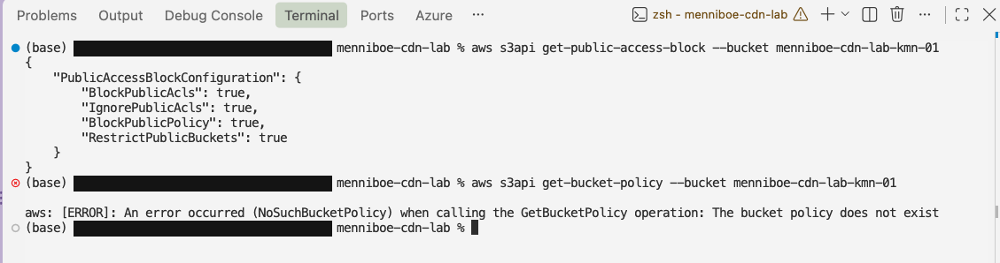

---

## Stage 2 — Create the Distribution with OAC

**Console → CloudFront → Distributions → Create distribution**

> [!NOTE]
> CloudFront is a **global** service — there is no Region selector in the top bar.

### Step 2.1 — Choose a plan

Select **Free plan**. It covers a global CDN, free TLS certificates and always-on DDoS
protection.

> [!WARNING]
> **Plan gates observed live:**
> - **VPC origins** → Business plan
> - **Layer 7 DDoS protection** → Business plan
> - **Cache tags for invalidation** → Pro plan
> - **WAF request logs** → Pro plan
> - **Standard logging** → Pro plan

### Step 2.2 — Distribution options

| Section | Field | Value |
|---|---|---|
| **Distribution options** | Distribution name | `menniboe-cdn-lab` |
| | Description | *leave blank* |
| | Distribution type | **Single website configuration** |
| **Domain** | Route 53 managed domain | *leave blank* |
| **Tags** | | optional |

### ❌ Gotcha — the Domain field only accepts Route 53 domains

**Symptom:** wanting to use a custom domain registered elsewhere.

**Cause:** the console states it explicitly — *"Enter a domain that's already registered with
Route 53 in your AWS account… If you have a domain from a different DNS provider, skip this
step and configure your domain later."* The shortcut needs to write validation records itself.

**Fix:** leave it blank and add the domain afterwards — see
[Stage 6](#stage-6--custom-domain-with-https). Adding an alternate domain name to an existing
distribution is a normal edit and loses nothing.

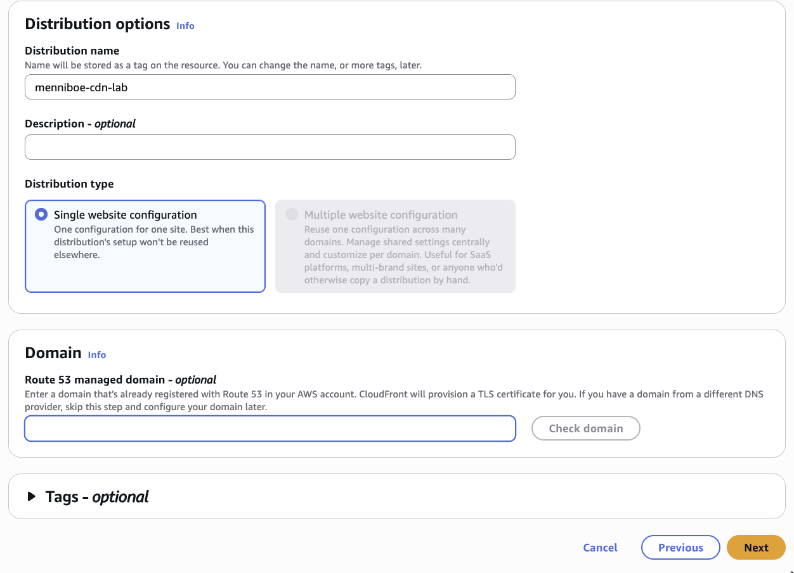

### Step 2.3 — Specify origin

| Section | Field | Value |
|---|---|---|
| **Origin type** | | **Amazon S3** |
| **Origin** | S3 origin | **Browse S3** → `<BUCKET>` |
| | Origin path | *leave blank* |
| **Settings** | **Allow private S3 bucket access to CloudFront** | ✅ **CHECKED** ← **this is OAC** |
| | Origin settings | Use recommended origin settings |
| | Cache settings | Use recommended cache settings tailored to serving S3 content |

> [!IMPORTANT]
> **"Allow private S3 bucket access to CloudFront" is the entire lab.** Checking it does two
> things at once: creates the **Origin Access Control**, and writes the **bucket policy** that
> trusts only this distribution.
>
> The console's own wording is a better definition than most documentation:
> *"Because you granted CloudFront access to your origin, CloudFront can write and update S3
> bucket policies that restrict access to your S3 origin to CloudFront."*

> [!TIP]
> **Origin path must stay blank.** It **prepends a folder** to every request:
>
> | Origin path | Browser requests | CloudFront asks S3 for |
> |---|---|---|
> | *(blank)* | `/index.html` | `index.html` ✅ |
> | `/images` | `/index.html` | `images/index.html` ❌ 404 |
>
> Use it only when one bucket holds several sites (`site-a/`, `site-b/`).

> [!NOTE]
> The S3 origin auto-fills as `<BUCKET>.s3.us-east-1.amazonaws.com` — the **REST endpoint**,
> not `s3-website-`. That is exactly what makes OAC possible. See
> [Module 4](#module-4--origins-and-oac).


### Step 2.4 — Enable security (WAF)

| Field | Value |
|---|---|
| Web Application Firewall (WAF) | *Included in plan at no additional charge* |
| **Use monitor mode** | ☐ **unchecked** |
| Protection against Layer 7 DDoS attacks | *greyed out — Business plan* |

> [!NOTE]
> **This differs from the course video**, where the instructor skipped WAF because it cost
> extra. The console now states *"Security protections from WAF are included in your plan at
> no additional charge"* and it is on by default with no opt-out on this screen.

> [!TIP]
> **Monitor mode explained:**
>
> | Mode | Behaviour |
> |---|---|
> | **ON** | WAF **counts** what it would have blocked, but lets everything through |
> | **OFF** | WAF actively **blocks** matching requests |
>
> Use monitor mode when rolling WAF onto an existing production site — run it a week, check
> for false positives, then switch to blocking.
>
> **Azure anchor:** this is exactly **Detection mode vs Prevention mode** in an Azure WAF
> policy. The App Gateway lab's SQL-injection test only got blocked because the policy was in
> **Prevention** mode.

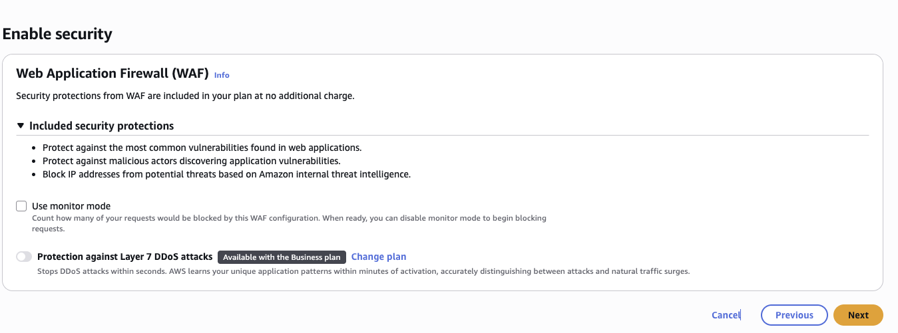

### Step 2.5 — Review and create

Confirm before clicking **Create distribution**:

| Field | Expected |
|---|---|
| Billing | Free plan ($0/month), today's pro-rated charge $0 |
| S3 origin | `<BUCKET>.s3.us-east-1.amazonaws.com` |
| Origin path | `-` |
| **Grant CloudFront access to origin** | **Yes** |
| Enable Origin Shield | No |
| Connection attempts / timeout | 3 / 10 |
| Security protections | Enabled, monitor mode No |

> [!TIP]
> **Origin Shield** (seen on this screen, left off) adds an extra caching layer in front of
> the origin so all edges pull through one shared cache instead of each hitting S3 separately.
> It cuts origin load further for high-traffic sites, at extra cost.

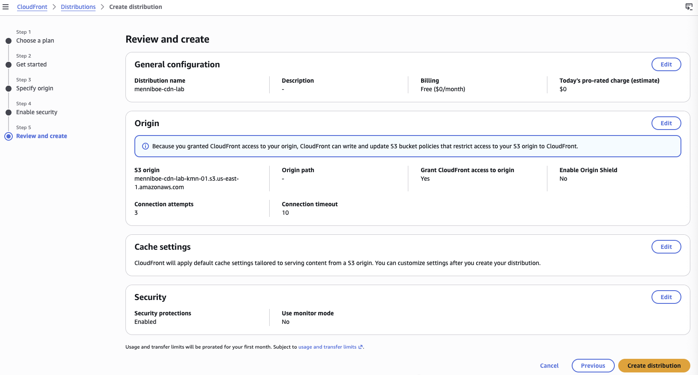

### Step 2.6 — Verify the bucket policy

```bash
aws s3api get-bucket-policy --bucket <BUCKET> --output text | python3 -m json.tool
```

**Expected** — compare with the `NoSuchBucketPolicy` from [Step 1.3](#step-13--prove-the-bucket-is-private):

```json
{
    "Version": "2008-10-17",
    "Id": "PolicyForCloudFrontPrivateContent",
    "Statement": [
        {
            "Sid": "AllowCloudFrontServicePrincipal",
            "Effect": "Allow",
            "Principal": {
                "Service": "cloudfront.amazonaws.com"
            },
            "Action": "s3:GetObject",
            "Resource": "arn:aws:s3:::<BUCKET>/*",
            "Condition": {
                "ArnLike": {
                    "AWS:SourceArn": "arn:aws:cloudfront::<ACCOUNT_ID>:distribution/<DISTRIBUTION_ID>"
                }
            }
        }
    ]
}
```

Confirm the bucket is **still** fully private:

```bash
aws s3api get-public-access-block --bucket <BUCKET>
```

All four values still `true`. **The bucket never became public** — that is the headline result.

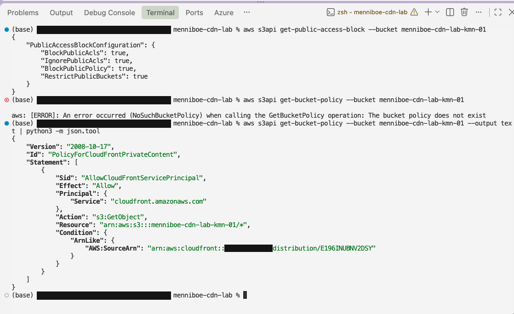

### Step 2.7 — Test through CloudFront

```bash
aws cloudfront list-distributions \
  --query "DistributionList.Items[].{Id:Id,Domain:DomainName,Status:Status}" \
  --output table
```

Wait for `Status: Deployed`, then run five tests:

| # | URL | Expected | Why |
|---|---|---|---|
| 1 | `https://<DIST_DOMAIN>/` | **403 AccessDenied** | No default root object yet — fixed in Stage 3 |
| 2 | `https://<DIST_DOMAIN>/index.html` | **Full page, all images** | OAC working |
| 3 | `https://<DIST_DOMAIN>/images/goats.jpg` | The image | Sub-path works |
| 4 | The direct S3 object URL | **Still AccessDenied** | Bucket still private |
| 5 | `curl` twice (below) | `Miss` → `Hit` | Caching working |

```bash
curl -sI https://<DIST_DOMAIN>/index.html | grep -i -E "x-cache|^age|content-type"
curl -sI https://<DIST_DOMAIN>/index.html | grep -i -E "x-cache|^age|content-type"
```

**Actual result:**

```
content-type: text/html
x-cache: Miss from cloudfront
---
content-type: text/html
x-cache: Hit from cloudfront
age: 12
```

> [!IMPORTANT]
> This is the best evidence in the lab. The first request was a **cache miss** — the edge
> fetched from S3 in us-east-1. Twelve seconds later the same request was a **cache hit**,
> served entirely from the nearest edge, and S3 was never contacted. The `age` header is the
> edge reporting how long it has held that copy.

**Test 1 — bare domain returns 403 (no default root object yet)**

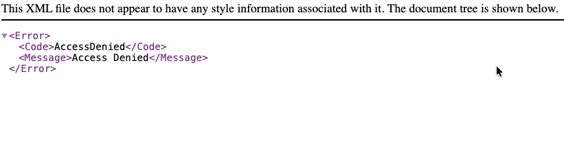

**Test 2 — `/index.html` renders fully through CloudFront**

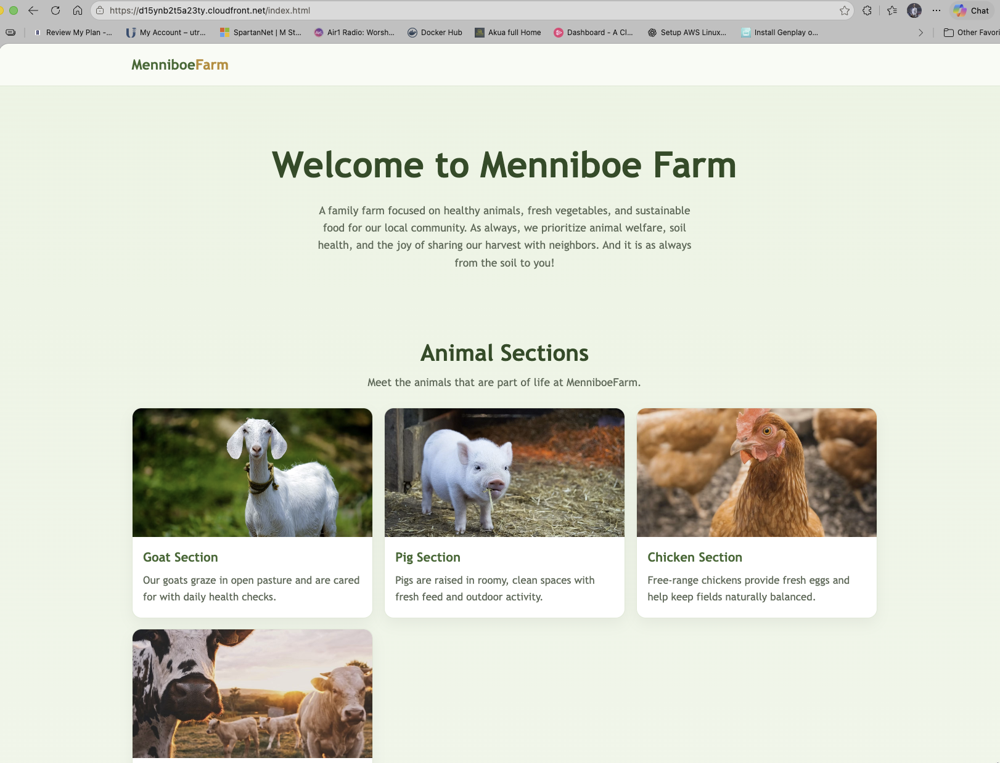

**Test 3 — a single image via its sub-path**

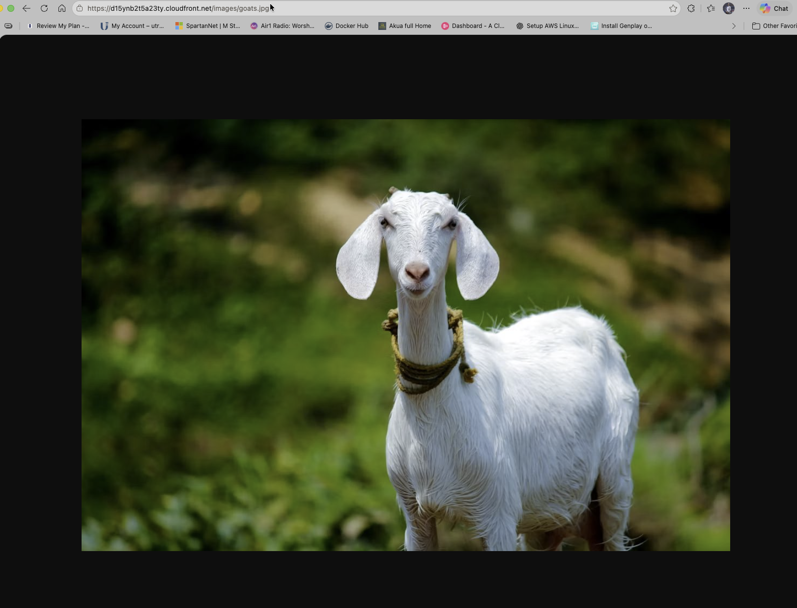

**Test 4 — the direct S3 URL is still denied**

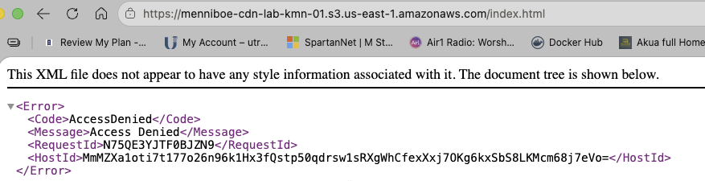

**Test 5 — cache miss, then cache hit**

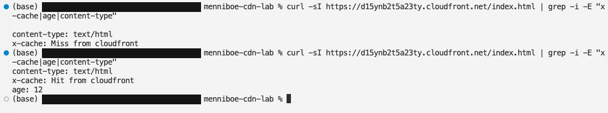

**Distribution list used to get the domain and status**

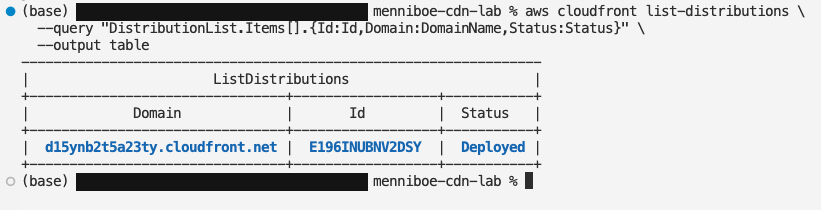

---

## Stage 3 — Default Root Object

**Problem:** `https://<DIST_DOMAIN>` returns AccessDenied.

**Cause:** with no path, CloudFront asks S3 for the object key `""` (empty string). That object
doesn't exist, and because the bucket is private, S3 answers **AccessDenied** rather than
**NoSuchKey** — it hides whether the object exists at all.

**Fix — CloudFront → Distributions → `<DISTRIBUTION_ID>` → General → Settings → Edit**

| Field | Value |
|---|---|
| **Default root object** | `index.html` |

Leave everything else. **Save changes**, wait for `Deployed`.

**Verify:**

```bash
curl -sI https://<DIST_DOMAIN> | head -5
```

**Actual result:**

```
HTTP/2 200
content-type: text/html
content-length: 7674
date: Fri, 25 Sep 2026 06:43:40 GMT
last-modified: Fri, 25 Sep 2026 05:23:09 GMT
```

### ❌ Error — `zsh: unknown file attribute: h`

**Symptom:** pasting a shell comment line before the command produced:

```
zsh: unknown file attribute: h
```

**Cause:** by default zsh does **not** treat `#` as a comment in an interactive shell, so it
tried to run the comment as a command — and choked on `(expect HTTP/2 200 and text/html)`,
because parentheses are **glob qualifiers** in zsh and `h` isn't a valid one.

**Fix:**

```bash
setopt interactive_comments          # this session
echo 'setopt interactive_comments' >> ~/.zshrc   # permanent
```

Or simply don't paste comment lines. This is a real zsh-vs-bash difference worth knowing on
macOS.

> [!WARNING]
> **The default root object only applies to the root, not subfolders.**
> - `https://<DIST_DOMAIN>/` serves `index.html` ✅
> - `https://<DIST_DOMAIN>/blog/` does **not** serve `blog/index.html` ❌
>
> Subfolder index behaviour needs a **CloudFront Function** to rewrite the URI. Common
> real-world gotcha for static sites.

> [!TIP]
> **Exam pattern:** private bucket + missing object → **403 AccessDenied**. Public bucket +
> missing object → **404 NoSuchKey**. A 403 on a CloudFront root URL almost always means
> "set a default root object."

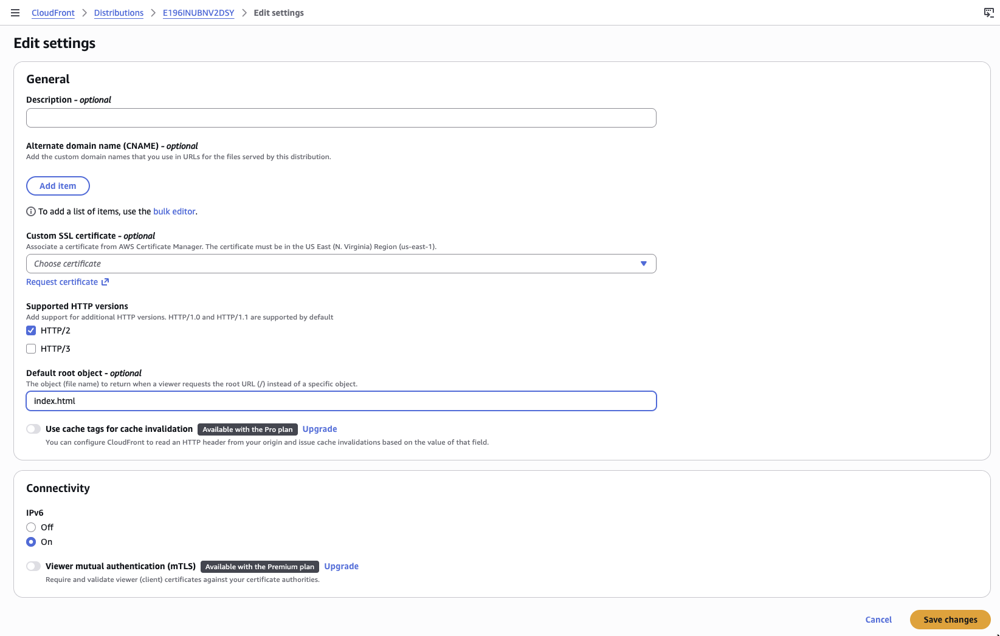

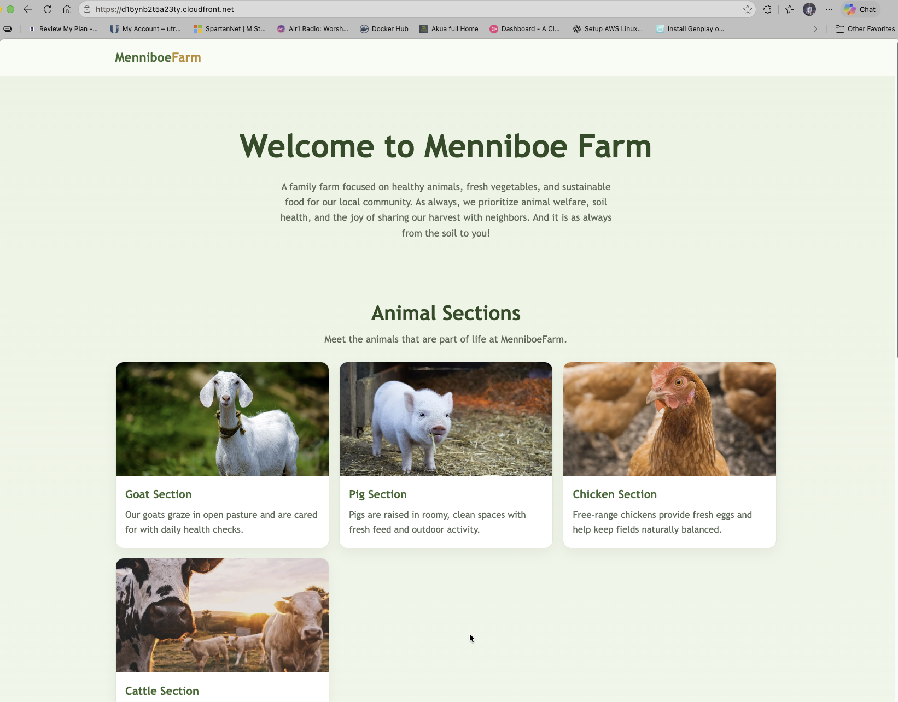

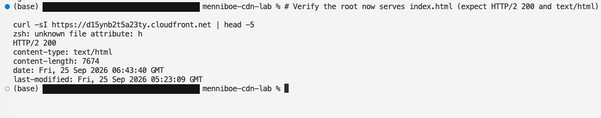

---

## Stage 4 — Cache Invalidation

The distribution uses the **CachingOptimized** policy, default TTL **86,400 s (24 hours)**.
Without invalidation, an edit wouldn't reach users for a full day.

### Step 4.1 — Edit and upload

Change something visible in `index.html`:

```html
<h1>Welcome to Menniboe Farm — Fall Harvest 2026</h1>
```

```bash
cd ~/Desktop/menniboe-cdn-lab
aws s3 cp index.html s3://<BUCKET>/index.html

aws s3api head-object --bucket <BUCKET> --key index.html \
  --query "{LastModified:LastModified,Size:ContentLength}"
```

**Actual result:**

```json
{
    "LastModified": "2026-09-25T09:19:11+00:00",
    "Size": 7697
}
```

### Step 4.2 — Prove the cache is stale

```bash
for i in 1 2 3; do
  curl -s  https://<DIST_DOMAIN>/ | grep "<h1>"
  curl -sI https://<DIST_DOMAIN>/ | grep -i -E "x-cache|^age"
  echo "---"
done
```

**Actual result — the OLD heading, three times:**

```
        <h1>Welcome to Menniboe Farm – From the Soil to You</h1>
x-cache: Hit from cloudfront
age: 690
---
        <h1>Welcome to Menniboe Farm – From the Soil to You</h1>
x-cache: Hit from cloudfront
age: 691
---
```

S3 holds the new file; the edge is confidently serving the old one. With a 24-hour TTL,
visitors would see this for another 23 hours and 48 minutes.

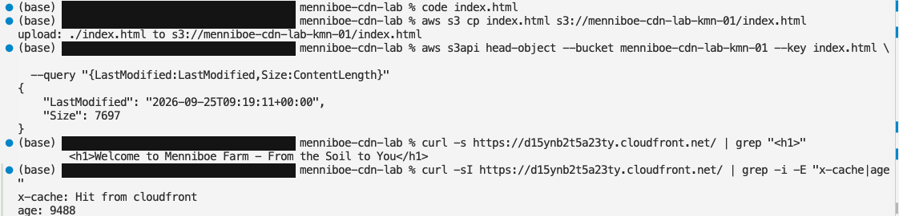

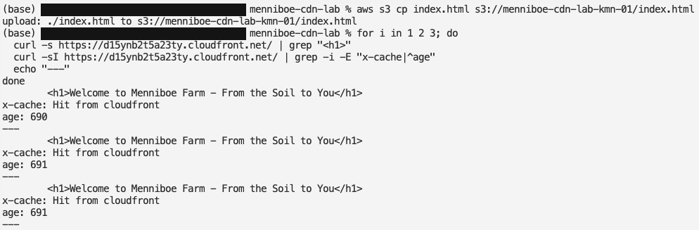

### ❌ Anomaly — GET and HEAD returned different versions

**Symptom:** on the first attempt, `curl -s` (GET) returned the **new** heading while
`curl -sI` (HEAD) reported `age: 9488` — a copy cached 2.6 hours earlier. Those two facts
cannot both describe the same cached object.

**Cause:** an edge location is **not one server** — it is a cluster of cache nodes. The GET and
the HEAD landed on **different nodes**. One had never seen the file (a miss, so it fetched
fresh), while the other still held the old copy.

**Fix / lesson:** re-run the test immediately after a known-good invalidation, so every node
starts from the same state. Run the check in a loop to make node-to-node variation visible.

> [!WARNING]
> **The cache is not one thing.** Different users — or even consecutive requests from you —
> can hit different nodes and briefly see different versions. This is precisely why
> invalidation exists rather than relying on one well-timed refresh.

### Step 4.3 — Invalidate

```bash
aws cloudfront create-invalidation \
  --distribution-id <DISTRIBUTION_ID> \
  --paths "/index.html" "/"
```

**Actual result:**

```json
{
    "Invalidation": {
        "Id": "IF0Q2FBH928YYAEHDK92V5KV2P",
        "Status": "InProgress",
        "InvalidationBatch": {
            "Paths": { "Quantity": 2, "Items": [ "/index.html", "/" ] }
        }
    }
}
```

> [!IMPORTANT]
> **Invalidate BOTH `/index.html` and `/`.** They are **separate cache entries** — `/` is how
> the edge cached the default-root request. Invalidating only one leaves the other stale.
> The course video does not mention this.

Check status:

```bash
aws cloudfront list-invalidations --distribution-id <DISTRIBUTION_ID> --output table
```

`InProgress` → **`Completed`**, typically 10–60 seconds.

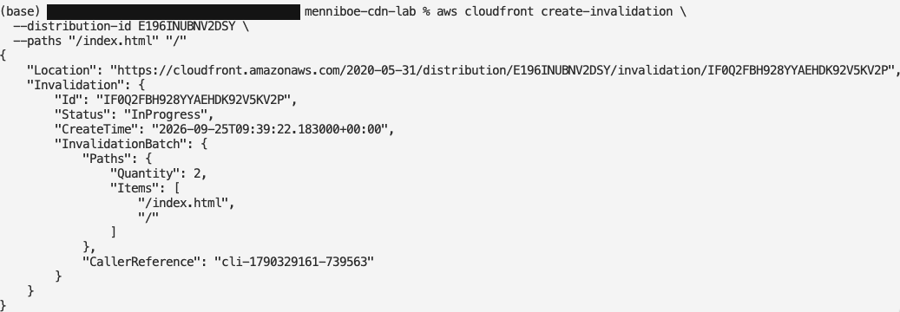

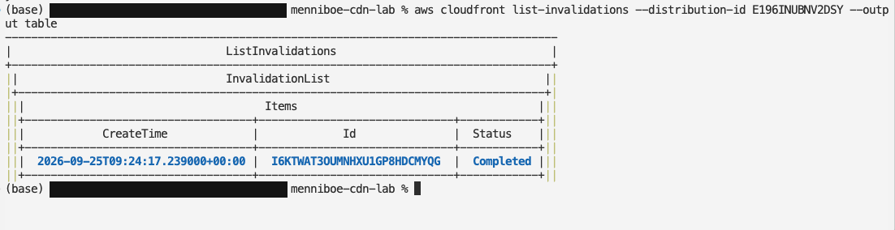

### Step 4.4 — Confirm the fix

```bash
sleep 30
for i in 1 2 3; do
  curl -s  https://<DIST_DOMAIN>/ | grep "<h1>"
  curl -sI https://<DIST_DOMAIN>/ | grep -i -E "x-cache|^age"
  echo "---"
done
```

**Actual result — the NEW heading, `age` reset:**

```
        <h1>Welcome to Menniboe Farm – Fall Harvest 2026</h1>
x-cache: Hit from cloudfront
---
        <h1>Welcome to Menniboe Farm – Fall Harvest 2026</h1>
x-cache: Hit from cloudfront
age: 1
```

> [!NOTE]
> The first two checks show **no `age` line at all**. CloudFront omits the `Age` header when
> the cached copy is under one second old — you caught the cache mid-refill.

**Before/after summary**

| | Heading served | age |
|---|---|---|
| **Before invalidation** | From the Soil to You (old) | 690 |
| **After invalidation** | Fall Harvest 2026 (new) | 1 |

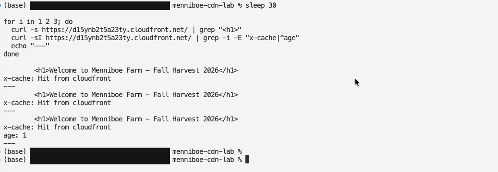

<details>
<summary>First attempt — the GET/HEAD anomaly described above</summary>

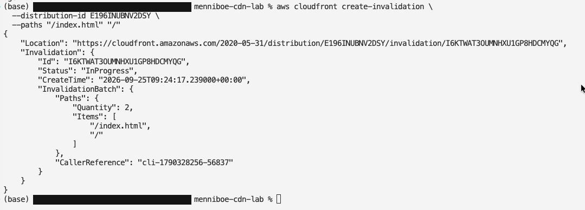

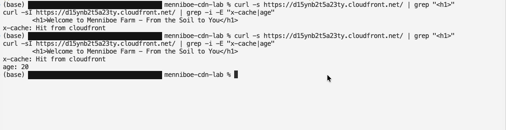

</details>

**Optional — wildcard invalidation**

```bash
aws s3 cp images/goats.jpg s3://<BUCKET>/images/goats.jpg

aws cloudfront create-invalidation \
  --distribution-id <DISTRIBUTION_ID> \
  --paths "/images/*"
```

`/images/*` counts as **one path** even though it clears 10 objects.

---

## Stage 5 — Geo Restriction via CLI

### ❌ Finding — geo restriction is no longer in the console

**Symptom:** **Distribution → Security tab** shows only WAF panels (protections, DDoS upgrade
banner, security trends, bot requests, WAF logs). There is **no "CloudFront geographic
restrictions" section**, even after scrolling to the bottom.

**Cause:** the console has been reorganised since the course was recorded. The instructor's
workaround — creating a second pay-as-you-go distribution — may no longer apply either.

**Fix:** configure it via the CLI. This is the better exercise anyway, because you see the
distribution's full config structure, which is what Terraform and CloudFormation manipulate
underneath.

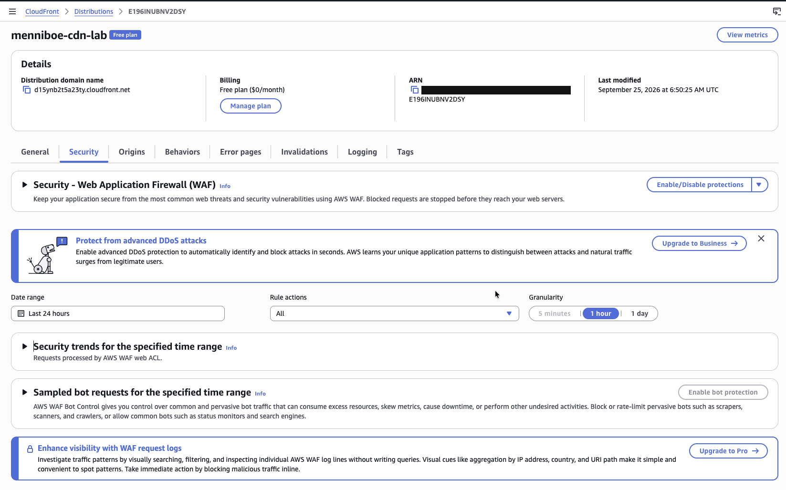

### Step 5.1 — Export the config

```bash
cd ~/Desktop/menniboe-cdn-lab

aws cloudfront get-distribution-config --id <DISTRIBUTION_ID> > dist-config.json

cat dist-config.json | python3 -c "
import json,sys
d = json.load(sys.stdin)
print('ETag:', d['ETag'])
print('Restrictions:', json.dumps(d['DistributionConfig']['Restrictions'], indent=2))
"
```

**Actual result:**

```
ETag: E3UN6WX5RRO2AG
Restrictions: {
  "GeoRestriction": {
    "RestrictionType": "none",
    "Quantity": 0
  }
}
```

> [!IMPORTANT]
> **Save the ETag.** It is a version token required by `update-distribution` via `--if-match`.
> It changes after every update, so re-export before each subsequent change.

### Step 5.2 — Build the modified config

```bash
python3 - <<'EOF'
import json
d = json.load(open('dist-config.json'))
cfg = d['DistributionConfig']
cfg['Restrictions'] = {
    "GeoRestriction": {
        "RestrictionType": "blacklist",
        "Quantity": 2,
        "Items": ["US", "CN"]
    }
}
json.dump(cfg, open('dist-config-updated.json','w'), indent=2)
print("Wrote dist-config-updated.json")
print(json.dumps(cfg['Restrictions'], indent=2))
EOF
```

> [!WARNING]
> **API vs console wording.** The API still uses the legacy values **`blacklist`** and
> **`whitelist`**, while the console says "block list" and "allow list." Terraform and
> CloudFormation require the **API** spelling.

> [!NOTE]
> Blocking your **own** country on purpose is deliberate — it lets you see the 403 yourself
> rather than taking it on trust. [Step 5.5](#step-55--revert) reverts it.

> [!TIP]
> `update-distribution` takes the **`DistributionConfig` object only**, not the full
> `get-distribution-config` response (which wraps it alongside the ETag). That is why the
> script extracts `d['DistributionConfig']` before writing the file.

### Step 5.3 — Apply the change

```bash
aws cloudfront update-distribution \
  --id <DISTRIBUTION_ID> \
  --if-match E3UN6WX5RRO2AG \
  --distribution-config file://dist-config-updated.json \
  --query "Distribution.DistributionConfig.Restrictions" \
  --output json
```

**Actual result:**

```json
{
    "GeoRestriction": {
        "RestrictionType": "blacklist",
        "Quantity": 2,
        "Items": [ "US", "CN" ]
    }
}
```

> [!TIP]
> **What `--if-match` does:** it is optimistic locking. If anything else had modified the
> distribution since you exported it, the call is rejected instead of silently overwriting
> someone else's change — the same idea as an HTTP conditional request or an S3 object version.

Wait for deployment:

```bash
aws cloudfront get-distribution --id <DISTRIBUTION_ID> \
  --query "Distribution.Status" --output text
```

Re-run until it says `Deployed` (2–5 minutes).

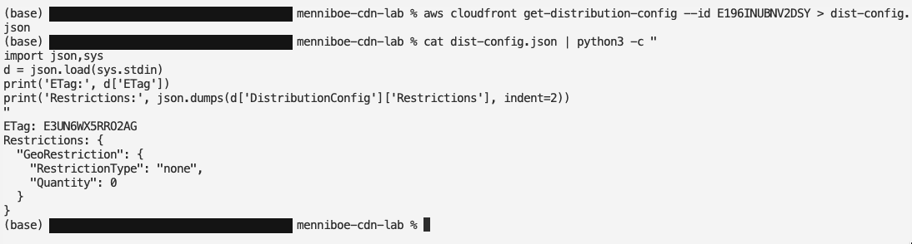

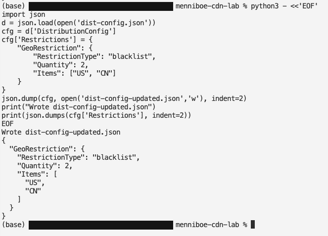

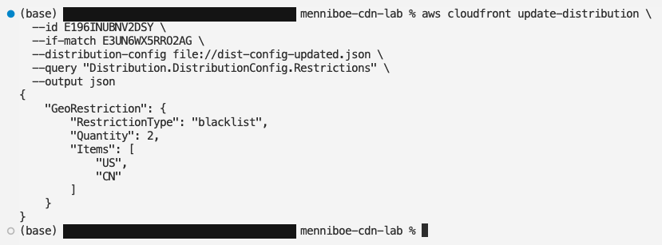

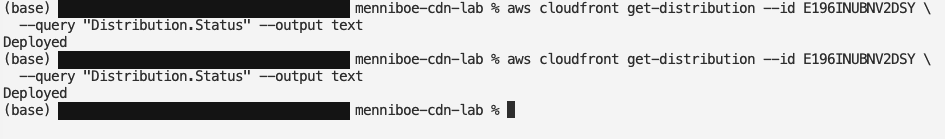

### Step 5.4 — Test the block

```bash
curl -s -o /dev/null -w "HTTP status: %{http_code}\n" https://<DIST_DOMAIN>/
```

**Actual result:**

```
HTTP status: 403
```

Browser:

```
403 ERROR
The request could not be satisfied.

The Amazon CloudFront distribution is configured to block access from your country.
...
Generated by cloudfront (CloudFront)
```

> [!IMPORTANT]
> **Two different 403s — learn to tell them apart:**
>
> | Source | Body | Meaning |
> |---|---|---|
> | **S3** | **XML** `<Error><Code>AccessDenied</Code>` | Bucket/object permission denied |
> | **CloudFront** | **HTML** "Generated by cloudfront" | Blocked at the edge before reaching the origin |
>
> Same status code, completely different cause. This matters when troubleshooting a real
> distribution.

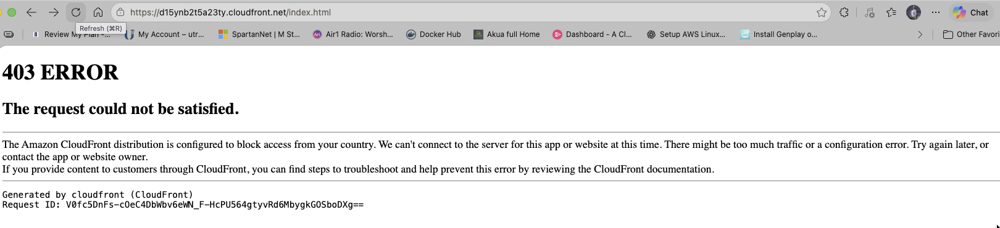

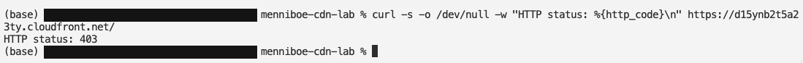

### Step 5.5 — Revert

Re-export to get a **fresh ETag**, then apply `none`:

```bash
aws cloudfront get-distribution-config --id <DISTRIBUTION_ID> > dist-config2.json

python3 - <<'EOF'
import json
d = json.load(open('dist-config2.json'))
print('New ETag:', d['ETag'])
cfg = d['DistributionConfig']
cfg['Restrictions'] = {
    "GeoRestriction": {
        "RestrictionType": "none",
        "Quantity": 0
    }
}
json.dump(cfg, open('dist-config-revert.json','w'), indent=2)
print("Wrote dist-config-revert.json")
EOF
```

```bash
aws cloudfront update-distribution \
  --id <DISTRIBUTION_ID> \
  --if-match <NEW_ETAG> \
  --distribution-config file://dist-config-revert.json \
  --query "Distribution.DistributionConfig.Restrictions" \
  --output json
```

Wait for `Deployed`, then verify:

```bash
curl -s -o /dev/null -w "HTTP status: %{http_code}\n" https://<DIST_DOMAIN>/
```

**Actual result:** `HTTP status: 200`

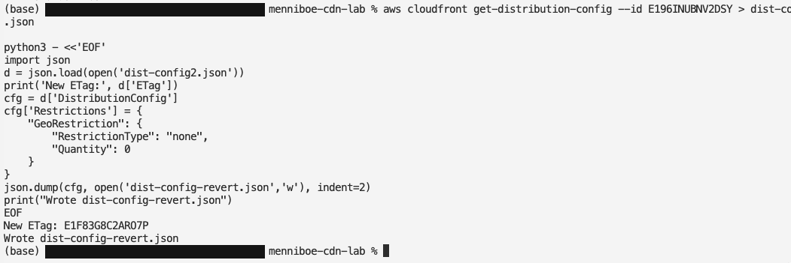

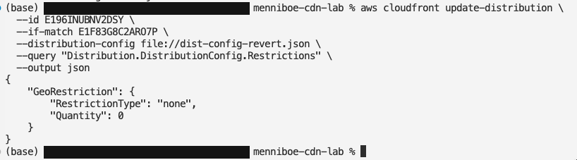

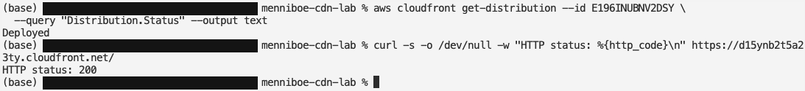

---

## Stage 6 — Custom Domain with HTTPS

> [!IMPORTANT]
> **The single most important fact in this stage:** a certificate used by CloudFront **must be
> in `us-east-1` (N. Virginia)**. CloudFront is global and only reads ACM certificates from
> that region. A cert issued anywhere else simply will not appear in the CloudFront dropdown,
> with no error explaining why.
>
> Contrast with an **ALB**, which needs its cert in the **same region as the ALB**. That
> distinction is exam material.

**The four pieces — all required**

```
1. ACM certificate (us-east-1)   → proves domain ownership, enables HTTPS
2. Alternate domain name (CNAME) → tells CloudFront to answer for the domain
3. Attach cert to distribution   → CloudFront serves TLS for that domain
4. Route 53 alias records        → points the domain at the distribution
```

### Step 6.1 — Route 53 hosted zone

**Console → Route 53 → Hosted zones → Create hosted zone**

| Field | Value |
|---|---|
| Domain name | `yourdomain.com` |
| Type | **Public hosted zone** |

Created with 2 records: **NS** and **SOA**.

**Cost:** ~$0.50/month per hosted zone.

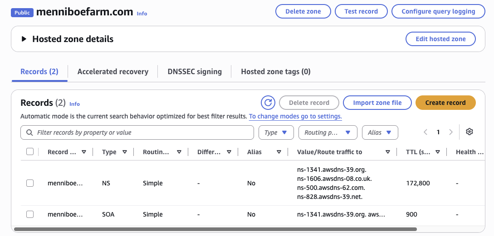

### Step 6.2 — Point the registrar at Route 53

Domain registered at **Namecheap**, DNS moving to Route 53.

**Namecheap → Domain List → Manage → NAMESERVERS → Custom DNS**

Paste the four `awsdns` nameservers from the hosted zone's **NS** record, one per row:

```
ns-XXXX.awsdns-XX.org
ns-XXXX.awsdns-XX.co.uk
ns-XXX.awsdns-XX.com
ns-XXX.awsdns-XX.net
```

> [!WARNING]
> Verify each value against the Route 53 console — they are unique per hosted zone and a
> single typo breaks resolution. Leave off any trailing dot; Namecheap doesn't want it.
> Propagation is usually 30 minutes to a few hours, occasionally up to 48.

**Verify:**

```bash
dig NS yourdomain.com +short
```

**Actual result — delegation live:**

```
ns-1606.awsdns-08.co.uk.
ns-500.awsdns-62.com.
ns-828.awsdns-39.net.
ns-1341.awsdns-39.org.
```

If you see `registrar-servers.com` instead, the change hasn't propagated yet.

### Step 6.3 — Request the ACM certificate

**Console → Certificate Manager → confirm Region is `us-east-1` → Request certificate**

| Screen | Field | Value |
|---|---|---|
| **Certificate type** | | **Request a public certificate** |
| **Domain names** | Fully qualified domain name | `yourdomain.com` |
| | Add another name | `www.yourdomain.com` |
| **Validation method** | | **DNS validation – recommended** |
| **Key algorithm** | | **RSA 2048** |
| **Tags** | `Project` | `cloudfront-lab` |

Click **Request**. Status shows **Pending validation**.

**Cost:** public ACM certificates are **free**.

> [!TIP]
> Confirm the Details panel says **"Can be used with: CloudFront, Elastic Load Balancing,
> API Gateway"** — that only appears for a `us-east-1` certificate.

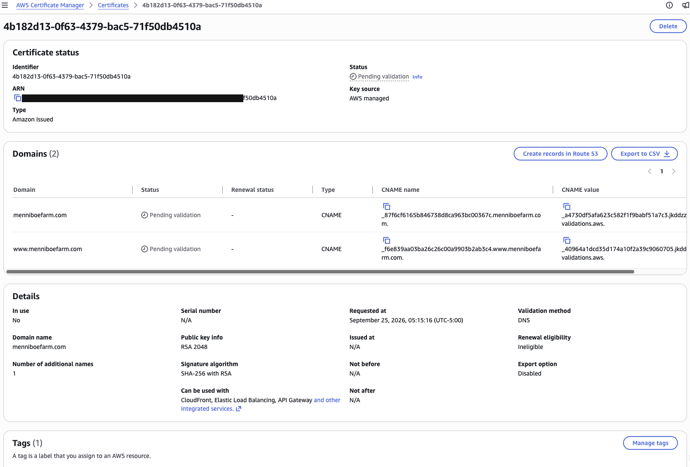

### Step 6.4 — Validate the certificate

On the certificate page, click **Create records in Route 53** → **Create records**.

ACM writes two CNAME records (`_<hash>.yourdomain.com` → `_<hash>.jkddzz...validations.aws.`)
into the hosted zone. ACM polls for them, then issues the certificate.

```bash
aws acm describe-certificate --region us-east-1 \
  --certificate-arn <CERT_ARN> \
  --query "Certificate.Status" --output text
```

`PENDING_VALIDATION` → **`ISSUED`**, usually within 5 minutes.

> [!TIP]
> This is the payoff for moving DNS to Route 53 — **one click**. Had DNS stayed at Namecheap,
> you would be hand-copying two long CNAME name/value pairs.

*(Status polled from the CLI — see the command above.)*

### Step 6.5 — Attach domain and certificate

**CloudFront → Distributions → `<DISTRIBUTION_ID>` → General → Settings → Edit**

| Field | Value |
|---|---|
| **Alternate domain name (CNAME)** | **Add item** → `yourdomain.com` |
| | **Add item** → `www.yourdomain.com` |
| **Custom SSL certificate** | Choose the ACM certificate just issued |
| **Security policy** | **TLSv1.2_2021 (recommended)** |
| Supported HTTP versions | HTTP/2 ✅ (HTTP/3 optional) |
| Default root object | `index.html` (unchanged) |

**Save changes**, wait for `Deployed`.

> [!IMPORTANT]
> **Both fields are required together.** The alternate domain name tells CloudFront to answer
> for that hostname; the certificate lets it serve HTTPS for that hostname. Add the domain
> without a matching cert and CloudFront rejects the save, because every browser request would
> hit a certificate mismatch.

> [!NOTE]
> **Security policy** only appears once a custom certificate is selected. It sets the minimum
> TLS version and cipher suites. Older options (TLSv1, TLSv1.1_2016) exist for legacy client
> support and weaken security. `TLSv1.3_2025` is stricter but can turn away older devices.
> With the default `*.cloudfront.net` certificate, AWS manages this for you.

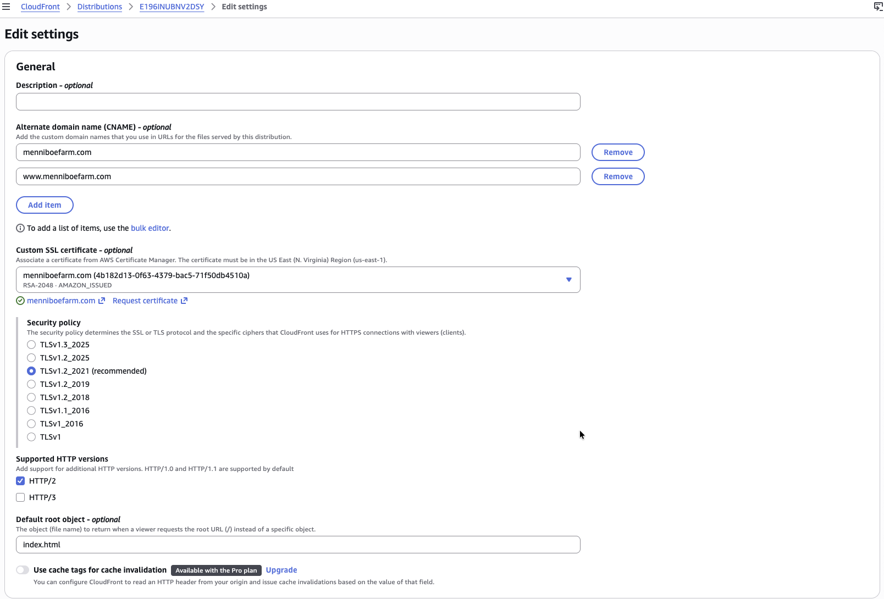

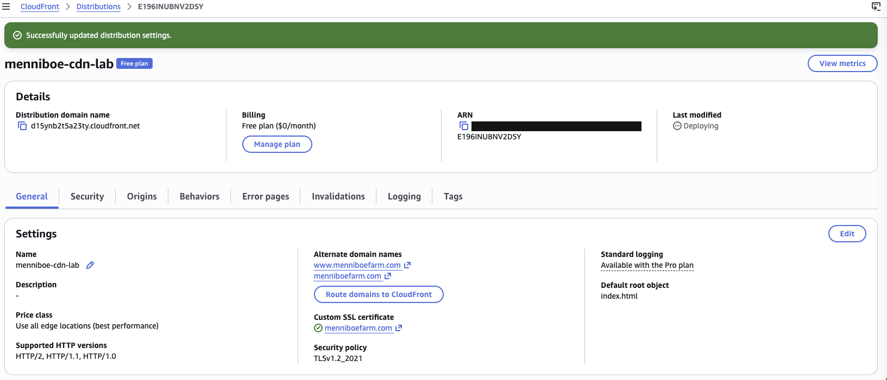

### Step 6.6 — Create alias records

On the distribution's General tab, click **Route domains to CloudFront**.

### ❌ Gotcha — the shortcut only creates the apex record

**Symptom:** after using the button, the hosted zone had an A/Alias record for the apex only —
`www` was missing.

**Cause:** the button handles the zone apex, not subdomains.

**Fix — create the `www` record manually:**

**Route 53 → hosted zone → Create record**

| Field | Value |
|---|---|
| **Record name** | `www` |
| **Record type** | **A** |
| **Alias** | **ON** |
| **Route traffic to** | Alias to CloudFront distribution |
| **Choose distribution** | `<DIST_DOMAIN>` |
| **Routing policy** | Simple routing |
| **Evaluate target health** | No |

Final zone contents — **8 records**:

| Record | Type | Alias |
|---|---|---|
| `yourdomain.com` | **A** | Yes → distribution |
| `yourdomain.com` | **AAAA** | Yes → distribution |
| `yourdomain.com` | NS | No |
| `yourdomain.com` | SOA | No |
| `www.yourdomain.com` | **A** | Yes → distribution |
| `www.yourdomain.com` | **AAAA** | Yes → distribution |
| `_<hash>.yourdomain.com` | CNAME | No (ACM validation) |
| `_<hash>.www.yourdomain.com` | CNAME | No (ACM validation) |

> [!TIP]
> **Why an alias and not a CNAME:** DNS forbids a CNAME at the **apex** of a zone, because the
> apex must coexist with the NS and SOA records. A **Route 53 alias** looks like an A record
> externally but resolves to the distribution internally, sidestepping the restriction
> entirely. This is the single biggest practical reason to keep DNS in Route 53.

> [!NOTE]
> **AAAA records appear automatically** because the distribution has **IPv6 enabled** (the
> toggle in Edit settings). A = IPv4, AAAA = IPv6, both aliasing the same distribution.

**After the shortcut — apex only, `www` missing (5 records)**

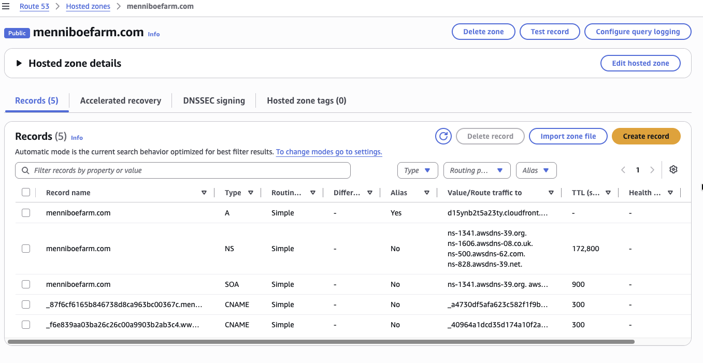

**After adding `www` manually — 8 records including A and AAAA pairs**

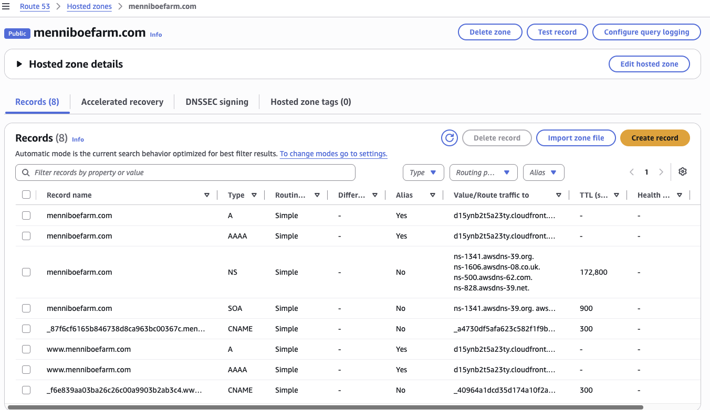

### Step 6.7 — Final verification

```bash
aws cloudfront get-distribution --id <DISTRIBUTION_ID> \
  --query "Distribution.Status" --output text

curl -s -o /dev/null -w "%{http_code}\n" https://yourdomain.com/
curl -s -o /dev/null -w "%{http_code}\n" https://www.yourdomain.com/
curl -sI http://yourdomain.com/ | head -3
```

**Actual results:**

```
Deployed
200
200
HTTP/1.1 301 Moved Permanently
Server: CloudFront
Date: Fri, 25 Sep 2026 10:39:07 GMT
```

> [!NOTE]
> The **301 redirect** comes free: CloudFront's recommended cache settings default the viewer
> protocol policy to **Redirect HTTP to HTTPS**, so anyone typing `http://` is bumped to the
> secure version automatically.

Open the site in a browser and confirm the **padlock**.

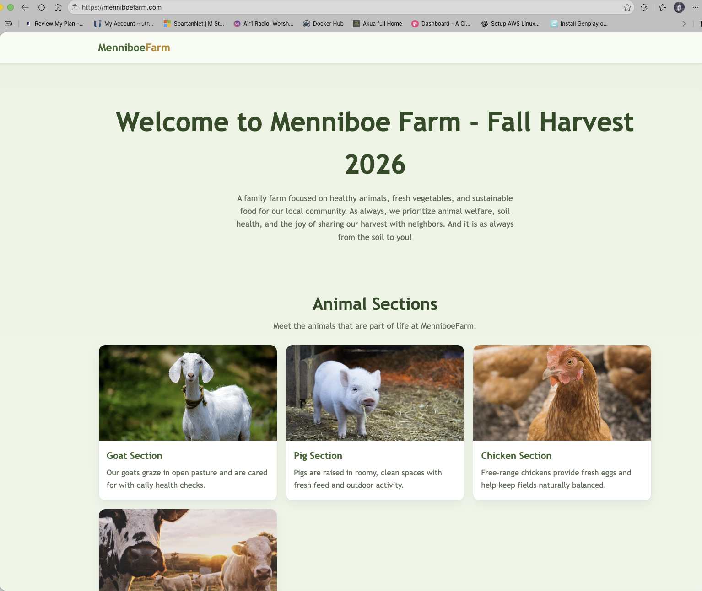

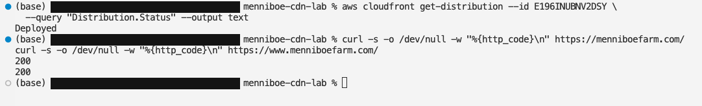

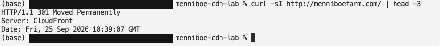

---

## Teardown

> [!WARNING]
> **Order matters.** Deleting the bucket before disabling the distribution leaves a
> distribution pointing at nothing and complicates cleanup.

```bash
# 1. Empty the bucket
aws s3 rm s3://<BUCKET> --recursive

# 2. Disable the distribution (required before delete)
aws cloudfront get-distribution-config --id <DISTRIBUTION_ID> > teardown.json
python3 - <<'EOF'
import json
d = json.load(open('teardown.json'))
print('ETag:', d['ETag'])
cfg = d['DistributionConfig']
cfg['Enabled'] = False
json.dump(cfg, open('teardown-disabled.json','w'), indent=2)
EOF

aws cloudfront update-distribution \
  --id <DISTRIBUTION_ID> \
  --if-match <ETAG> \
  --distribution-config file://teardown-disabled.json

# 3. Wait for Deployed, then delete (needs the ETag from AFTER the disable)
aws cloudfront delete-distribution --id <DISTRIBUTION_ID> --if-match <NEW_ETAG>

# 4. Delete the bucket
aws s3 rb s3://<BUCKET>
```

**Also clean up if you are not keeping the domain setup:**

- Route 53 alias records (A and AAAA, apex and www)
- Route 53 hosted zone (~$0.50/month if left)
- ACM certificate (free — safe to keep for a future distribution)
- Local files: `dist-config*.json`, `teardown*.json`

> [!NOTE]
> **This lab's distribution was intentionally kept** so the custom-domain work would have
> something to attach to. The Free plan is **$0/month** and 1.4 MB in S3 costs fractions of a
> cent.

**Global Accelerator teardown (for Lab B):**

1. **Disable** the accelerator — you cannot delete it while enabled
2. Delete the accelerator
3. **Terminate the EC2 instances in BOTH regions**

---

# Wrap-up

## Errors and Fixes — Index

| # | Where | Error / Finding | Fix |
|---|---|---|---|
| 1 | [Stage 0](#stage-0--prepare-the-site-files) | Broken image card showing alt text | Referenced file missing from `images/` — supply it or remove the card |
| 2 | [Stage 0](#stage-0--prepare-the-site-files) | `.avif` renamed to `.jpg` won't display | Actually convert with `sips` or `magick` — extension is only a label |
| 3 | [Stage 0](#stage-0--prepare-the-site-files) | Images loaded from Unsplash, not S3 | Rewrite all `src` to relative `images/...` paths |
| 4 | [Step 2.2](#step-22--distribution-options) | Domain field rejects non-Route 53 domains | Leave blank, add the alternate domain name later |
| 5 | [Stage 3](#stage-3--default-root-object) | Bare distribution domain returned 403 | Set **Default root object** = `index.html` |
| 6 | [Stage 3](#stage-3--default-root-object) | `zsh: unknown file attribute: h` | `setopt interactive_comments`, or don't paste comment lines |
| 7 | [Step 4.2](#step-42--prove-the-cache-is-stale) | GET and HEAD returned different versions | Different cache nodes in one edge location — re-test from a known state |
| 8 | [Stage 5](#stage-5--geo-restriction-via-cli) | Geo restriction missing from console Security tab | Configure via CLI `update-distribution` |
| 9 | [Step 5.2](#step-52--build-the-modified-config) | API rejects "block list" / "allow list" | API uses legacy `blacklist` / `whitelist` |
| 10 | [Step 6.6](#step-66--create-alias-records) | "Route domains to CloudFront" created apex only | Create the `www` A/Alias record manually |

---

## Console vs Course Video Differences

| Topic | Course video | Console today |
|---|---|---|
| Points of presence | "216" | 600+ |
| WAF | Skipped — cost extra | **Included free** on the Free plan, on by default |
| Geo restriction | Under distribution **Security** tab | **Not present** on Free plan — use the CLI |
| VPC origins | Mentioned as Business-plan only | Confirmed — **greyed out** with a Business badge |
| L7 DDoS protection | Not shown | Business plan badge |
| Cache tags / WAF logs / standard logging | Not shown | **Pro plan** badge |
| Custom domain at creation | Not covered | Route 53-managed domains only; others added afterwards |

---

## Exam Quick Reference

**CloudFront**

| Concept | Key fact |
|---|---|
| Default TTL | **86,400 s (24 h)** |
| No `Cache-Control` from origin | Use **Default TTL** |
| Min / Max TTL | Guardrails on the origin's `max-age` |
| Invalidation | **Removes** from cache; edges **pull** fresh. First **1,000 paths/month** free. Wildcard = **1 path** |
| Frequent deploys | Use **versioned file names**, not invalidations |
| Private S3 | **OAC** + bucket policy with `AWS:SourceArn` condition |
| OAI | **Legacy** — no SSE-KMS support → migrate to OAC |
| S3 website endpoint | **Custom origin**, must be public, **cannot use OAC** |
| SSE-KMS origin | Also needs **KMS key policy** allowing CloudFront `kms:Decrypt` |
| Private backends | **VPC origin** (Business plan) — ALB, NLB, EC2 |
| Geo restriction | Whole distribution. Path-level → **WAF geo match** |
| Certificate region | **us-east-1 ONLY** |
| Apex domain | **Route 53 alias**, never a CNAME |
| Root URL 403 | Set a **default root object** |

**Global Accelerator**

| Concept | Key fact |
|---|---|
| IPs | **2 static anycast IPs** that never change |
| Layer | **4 — TCP and UDP** |
| Caching | **None** — every request reaches your app |
| Health checks | On the **endpoint group** (= one region) |
| Failover | **Under 1 minute** |
| Endpoints | ALB, NLB, EC2, Elastic IP — public or private |
| Teardown | **Disable before delete** |

**Choosing between them**

| Clue in the question | Answer |
|---|---|
| CDN, cache, static content, reduce origin load | **CloudFront** |
| UDP, gaming, IoT, VoIP | **Global Accelerator** |
| Static IPs to allowlist in a firewall | **Global Accelerator** |
| Deterministic, fast regional failover | **Global Accelerator** |
| Dynamic data, latest version, a few specific regions | **S3 CRR** |
| New objects replicate, old ones don't | **S3 Batch Replication** |

**Security groups vs NACLs**

| Concept | Key fact |
|---|---|
| SG | **Stateful** — reply auto-allowed. **Allow rules only** |
| NACL | **Stateless** — reply needs outbound **1024–65535**. Supports **DENY** |
| Layering | **Independent** — traffic must pass **both** |
| Block one malicious IP | **NACL** |

---
