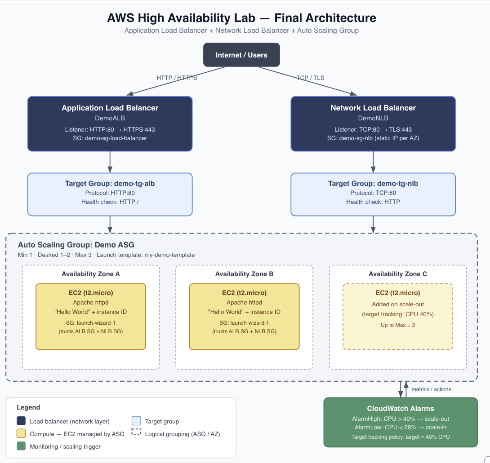

# AWS High Availability & Scalability — ELB & ASG

Reference notes covering the AWS SAA "High Availability and Scalability" domain: Elastic Load Balancing (ALB, NLB, GWLB, CLB) and Auto Scaling Groups, plus a full copy-paste redo of the hands-on lab.

## Table of Contents

- [Overview](#overview)
- [Acronyms and Key Terms](#acronyms-and-key-terms)
- [Concept Reference](#concept-reference)
  - [Module 1 Scalability vs High Availability](#module-1-scalability-vs-high-availability)
  - [Module 2 Load Balancing Fundamentals and Health Checks](#module-2-load-balancing-fundamentals-and-health-checks)
  - [Module 3 Load Balancer Types Overview](#module-3-load-balancer-types-overview)
  - [Module 4 Application Load Balancer Deep Dive](#module-4-application-load-balancer-deep-dive)
  - [Module 5 Network Load Balancer Deep Dive](#module-5-network-load-balancer-deep-dive)
  - [Module 6 Gateway Load Balancer](#module-6-gateway-load-balancer)
  - [Module 7 Load Balancer Security SG Chaining](#module-7-load-balancer-security-sg-chaining)
  - [Module 8 Sticky Sessions](#module-8-sticky-sessions)
  - [Module 9 Cross Zone Load Balancing](#module-9-cross-zone-load-balancing)
  - [Module 10 SSL TLS Certificates and SNI](#module-10-ssl-tls-certificates-and-sni)
  - [Module 11 Connection Draining and Deregistration Delay](#module-11-connection-draining-and-deregistration-delay)
  - [Module 12 Auto Scaling Group Fundamentals](#module-12-auto-scaling-group-fundamentals)
  - [Module 13 ASG Scaling Policies](#module-13-asg-scaling-policies)
- [Final Architecture Diagram](#final-architecture-diagram)
- [Hands On Build Full Redo Guide](#hands-on-build-full-redo-guide)
  - [Part 1 Launch Two EC2 Web Server Instances](#part-1-launch-two-ec2-web-server-instances)
  - [Part 2 Create an Application Load Balancer](#part-2-create-an-application-load-balancer)
  - [Part 3 Observe Unhealthy Instance Behavior](#part-3-observe-unhealthy-instance-behavior)
  - [Part 4 Lock Down EC2 Security Group](#part-4-lock-down-ec2-security-group)
  - [Part 5 Add an ALB Listener Rule](#part-5-add-an-alb-listener-rule)
  - [Part 6 Create a Network Load Balancer](#part-6-create-a-network-load-balancer)
  - [Part 7 Fix the NLB Health Check Failure](#part-7-fix-the-nlb-health-check-failure)
  - [Part 8 Enable Sticky Sessions](#part-8-enable-sticky-sessions)
  - [Part 9 Cross Zone Load Balancing Settings](#part-9-cross-zone-load-balancing-settings)
  - [Part 10 SSL TLS Listener Reference](#part-10-ssl-tls-listener-reference)
  - [Part 11 Deregistration Delay](#part-11-deregistration-delay)
  - [Part 12 Clean Up Instances Before ASG](#part-12-clean-up-instances-before-asg)
  - [Part 13 Create a Launch Template](#part-13-create-a-launch-template)
  - [Part 14 Create the Auto Scaling Group](#part-14-create-the-auto-scaling-group)
  - [Part 15 Manually Test Scale Out and Scale In](#part-15-manually-test-scale-out-and-scale-in)
  - [Part 16 Configure Target Tracking Scaling Policy](#part-16-configure-target-tracking-scaling-policy)
  - [Part 17 Stress Test to Trigger Scaling](#part-17-stress-test-to-trigger-scaling)
  - [Part 18 Cleanup Checklist](#part-18-cleanup-checklist)
- [Exam Trigger Phrase Cheat Sheet](#exam-trigger-phrase-cheat-sheet)
- [Troubleshooting Quick Reference](#troubleshooting-quick-reference)

---

## Overview

> [!NOTE]
> This session covered the full AWS SAA "High Availability and Scalability" domain: scalability vs. HA fundamentals, all four load balancer types, load balancer security/stickiness/cross-zone/SSL/draining features, and Auto Scaling Groups with dynamic/scheduled/predictive scaling — followed by a complete hands-on build of an ALB + NLB + ASG stack.

This guide is split into two halves:
1. **Concept Reference** — the "why" and "when to use," in tutorial form, organized to match the exam's mental model.
2. **Hands-On Build** — a full copy-paste redo guide for rebuilding the lab from scratch, with exact Portal field values, CLI commands, and every error/fix placed exactly where it occurred.

---

## Acronyms and Key Terms

| Term | Meaning |
|---|---|
| **AWS** | Amazon Web Services |
| **EC2** | Elastic Compute Cloud — AWS's virtual server service |
| **ELB** | Elastic Load Balancing — the umbrella AWS service for all load balancer types |
| **ALB** | Application Load Balancer — Layer 7 (HTTP/HTTPS) load balancer |
| **NLB** | Network Load Balancer — Layer 4 (TCP/UDP) load balancer |
| **GWLB** | Gateway Load Balancer — Layer 3 load balancer for third-party appliance chaining |
| **CLB** | Classic Load Balancer — deprecated, oldest-generation load balancer |
| **ASG** | Auto Scaling Group — automatically manages EC2 instance count |
| **VPC** | Virtual Private Cloud — your isolated network in AWS |
| **AZ** | Availability Zone — an isolated data center location within an AWS Region |
| **SG** | Security Group — a virtual, stateful firewall attached to resources |
| **TG** | Target Group — a named set of backend targets a load balancer routes to |
| **AMI** | Amazon Machine Image — the template used to launch an EC2 instance |
| **HVM** | Hardware Virtual Machine — the AMI virtualization type used (vs. older "paravirtual") |
| **EBS** | Elastic Block Store — the persistent disk volumes attached to EC2 instances |
| **SSL** | Secure Sockets Layer — older encryption-in-transit protocol |
| **TLS** | Transport Layer Security — the modern successor to SSL (people still say "SSL" colloquially) |
| **SNI** | Server Name Indication — lets a client specify the hostname during the TLS handshake so the server can pick the right certificate |
| **CIDR** | Classless Inter-Domain Routing — the notation for IP address ranges, e.g. `0.0.0.0/0` |
| **DNS** | Domain Name System |
| **TCP** | Transmission Control Protocol — connection-based, Layer 4 |
| **UDP** | User Datagram Protocol — connectionless, Layer 4 |
| **HTTP / HTTPS** | Hypertext Transfer Protocol (Secure) — Layer 7 |
| **CPU** | Central Processing Unit |
| **ACM** | AWS Certificate Manager — issues/manages SSL/TLS certificates |
| **IAM** | Identity and Access Management |
| **KMS** | Key Management Service — manages encryption keys (not certificates) |
| **HA** | High Availability |
| **IDS / IPS** | Intrusion Detection System / Intrusion Prevention System |
| **NVA** | Network Virtual Appliance (Azure's term for a GWLB-style third-party appliance) |
| **GENEVE** | Generic Network Virtualization Encapsulation — the protocol GWLB uses (port 6081) to talk to appliances |
| **X.509** | The standard certificate format used for SSL/TLS server certificates |

---

## Concept Reference

### Module 1 Scalability vs High Availability

**Scalability** = your system absorbs more load by adapting resources.
- **Vertical scaling (scale up/down):** make an *existing* resource bigger/smaller (e.g., resize an RDS/EC2 instance). Common for non-distributed systems like a single database. Has a **hardware ceiling** — smallest instance today is `t2.nano` (0.5 GB RAM, 1 vCPU), largest is `u-12tb1.metal` (12.3 TB RAM, 450 vCPUs).
- **Horizontal scaling / elasticity (scale out/in):** add/remove *copies* of a resource. No comparable hard ceiling — you can keep adding instances.

**High Availability (HA)** = running in **at least two data centers/AZs** so losing one doesn't take you offline. Related to but distinct from scaling — HA is about *surviving failure*, not *absorbing load*. HA can be **passive** (e.g., RDS Multi-AZ standby) or **active** (e.g., horizontally scaled instances across AZs all serving traffic).

> [!TIP]
> Exam pattern: "bigger" = vertical, "more copies" = horizontal, "survives losing a whole AZ/data center" = HA. A scenario can combine more than one of these — read for what's specifically being tested.

---

### Module 2 Load Balancing Fundamentals and Health Checks

A load balancer is a server (or fleet) that sits in front of your app and distributes traffic to backend instances. Clients only ever see **one endpoint**.

**Why use one:**
- Single point of access
- Seamless failure handling via health checks
- SSL/TLS termination
- Sticky sessions (optional)
- Cross-zone HA
- Public/private traffic separation

**Health checks:** the LB polls a **port + route** (e.g., HTTP `4567` `/health`). HTTP 200 = healthy; anything else = unhealthy, and the LB stops sending traffic there. The load balancer never touches the instance itself — it only changes routing.

ELB is a **managed service** — AWS handles patching, upgrades, and its own HA.

---

### Module 3 Load Balancer Types Overview

| Type | Released | Layer | Protocols | Status |
|---|---|---|---|---|
| **CLB** | 2009 | 4 & 7 | HTTP, HTTPS, TCP, SSL | Deprecated |
| **ALB** | 2016 | 7 | HTTP, HTTPS, WebSocket | Current |
| **NLB** | 2017 | 4 | TCP, TLS, UDP | Current |
| **GWLB** | 2020 | 3 | IP / GENEVE | Current, niche |

> [!TIP]
> Exam triggers: "path/host-based routing," "microservices" → **ALB**. "Millions of req/s," "UDP," "static IP" → **NLB**. "Firewall," "IDS/IPS," "third-party appliance," "GENEVE," "port 6081" → **GWLB**.

---

### Module 4 Application Load Balancer Deep Dive

- **Layer 7 only** (HTTP/HTTPS). Supports **HTTP/2** and **WebSockets**.
- Can **redirect** HTTP → HTTPS automatically at the LB level — no app code needed.
- Routes to **target groups** based on: **path**, **host**, **query string/parameter**, or **HTTP header**.
- Target group members can be: **EC2 instances**, **ECS tasks**, **Lambda functions**, or **private IP addresses only** (never public IPs).
- One ALB can front **many independent microservices** (vs. CLB needing one LB per app).
- Health checks happen at the **target group** level.
- Backend apps read the true client IP/port/protocol via `X-Forwarded-For`, `X-Forwarded-Port`, `X-Forwarded-Proto` headers (since the ALB terminates the client connection and opens a new one to the backend using its own IP).

---

### Module 5 Network Load Balancer Deep Dive

- **Layer 4** — TCP and UDP. Extreme performance: millions of req/s, ultra-low latency.
- **One static IP per AZ** — can assign an **Elastic IP** per AZ. This is the "fixed IP for a partner's firewall whitelist" answer.
- Target group members: **EC2 instances** or **private IP addresses** (hardcoded, manual registration — enables hybrid on-prem + cloud target groups).
- **NLB in front of an ALB** is a valid, tested pattern: NLB's static IP + ALB's Layer 7 routing rules.
- Health checks support **TCP, HTTP, or HTTPS** (not UDP, even though the NLB itself can carry UDP traffic).

---

### Module 6 Gateway Load Balancer

- **Layer 3** — works with raw IP packets.
- Purpose: transparently route **all VPC traffic** through third-party appliances (firewalls, IDS/IPS, deep packet inspection) before it reaches your application.
- Two combined roles: **transparent network gateway** (single entry/exit point) + **load balancer** (spreads traffic across the appliance fleet).
- Uses the **GENEVE protocol on port 6081** to talk to appliances — an unambiguous exam signal.
- Target group members: **EC2 instances** (by instance ID) or **private IP addresses**.

---

### Module 7 Load Balancer Security SG Chaining

Lock EC2 instances so they're **only reachable through the load balancer**, never directly:

1. **LB's security group** — inbound allowed from `0.0.0.0/0` on port 80/443 (it's the public entry point).
2. **EC2 instance's security group** — inbound HTTP allowed with **source = the LB's security group** (referenced by SG ID, not a CIDR range) — not `0.0.0.0/0`.

> [!IMPORTANT]
> If an instance sits behind **both** an ALB and an NLB, its security group needs **one inbound rule per load balancer's SG** — adding only one and forgetting the other causes that second load balancer's health checks to fail (see [Part 7](#part-7-fix-the-nlb-health-check-failure)).

Referencing a security group as the source (instead of a CIDR) keeps the rule valid even as the load balancer's underlying IPs change, since AWS load balancer nodes can shift over time.

---

### Module 8 Sticky Sessions

Also called **session affinity**. Solves the problem of session/cart data stored **locally in memory** on one instance — without stickiness, a client's next request could land on a different instance and appear to "lose" their session.

- Supported on **CLB, ALB, and NLB**.
- Implemented via a **cookie** with an expiration date; once expired, the client may be routed elsewhere.
- Two cookie types:

| Cookie type | Generated by | Name | Notes |
|---|---|---|---|
| Duration-based | Load balancer | `AWSALB` (ALB) / `AWSELB` (CLB) | LB controls expiration |
| Application-based | Your application | Custom name (never `AWSALB`, `AWSALBAPP`, `AWSALBCORS`) | App controls custom attributes |

> [!WARNING]
> Trade-off: a disproportionately "sticky" client can overload one instance, causing load imbalance across otherwise-healthy, identically-sized instances.

---

### Module 9 Cross Zone Load Balancing

Controls whether each load balancer **node** (one per enabled AZ) spreads its share of traffic across **all instances in all AZs** (ON) or only **instances in its own AZ** (OFF). Only matters when AZ instance counts are **uneven**.

| Load Balancer | Default | Cost if enabled | Cost if disabled |
|---|---|---|---|
| **ALB** | Always ON (target-group override available) | No charge | N/A |
| **NLB** | OFF | Charged for inter-AZ transfer | No charge |
| **GWLB** | OFF | Charged for inter-AZ transfer | No charge |
| **CLB** | OFF | No charge even if enabled | No charge |

> [!WARNING]
> Enabling cross-zone on an NLB/GWLB to fix uneven traffic distribution **will** incur inter-AZ data transfer charges — a common real "surprise billing" scenario.

---

### Module 10 SSL TLS Certificates and SNI

- **SSL/TLS termination:** client↔LB encrypted (HTTPS); LB↔instance runs plain HTTP inside the private VPC (LB decrypts — "terminates" — the connection).
- Certificates managed via **ACM** (request or import); IAM storage is possible but **not recommended**.
- **SNI** solves "multiple certs, one server": the client states the target hostname during the TLS handshake *before* the server picks a certificate, so one load balancer can serve multiple domains, each with its own cert.

| Load Balancer | Multiple certs? | Uses SNI? |
|---|---|---|
| **CLB** | No — one cert only; need multiple CLBs for multiple domains | No |
| **ALB** | Yes | Yes |
| **NLB** | Yes | Yes |

---

### Module 11 Connection Draining and Deregistration Delay

Same concept, different name by generation: **CLB** calls it **Connection Draining**; **ALB/NLB** call it **Deregistration Delay**.

- In-flight requests on a draining instance are allowed to **complete**.
- **New** requests are never sent to a draining instance.
- Range: **1–3,600 seconds**, default **300s**. Set to **0** to disable entirely (immediate removal, in-flight requests cut off).
- Short requests → short delay (fast replacement cycles). Long-lived requests (uploads, etc.) → longer delay.

---

### Module 12 Auto Scaling Group Fundamentals

- **Scale out** = add instances. **Scale in** = remove instances. (Contrast with vertical **scale up/down** from Module 1.)
- Three capacity settings: **Minimum**, **Desired**, **Maximum** — desired moves within min/max.
- Paired with a load balancer, an ASG gets two "superpowers":
  1. New instances **auto-register** into the target group.
  2. Instances the LB marks **unhealthy** are **terminated and replaced** automatically.
- ASGs are **free** — you only pay for the resources they create.
- A **Launch Template** (successor to the deprecated **Launch Configuration**) defines AMI, instance type, user data, EBS volumes, security groups, key pair, IAM role, networking, and target group association.
- Scaling is triggered by **CloudWatch alarms** watching a metric against a threshold.

---

### Module 13 ASG Scaling Policies

**Dynamic scaling:**
- **Target tracking** — simplest; you set a metric + target value (e.g., CPU 40%), AWS creates/manages the CloudWatch alarms for you.
- **Simple / step scaling** — you manually define the alarms; step scaling adds granular "how far past threshold" tiers.

**Scheduled scaling** — you already know the date/time (e.g., Black Friday) and set capacity directly, no alarm involved.

**Predictive scaling** — AWS's ML model **learns** a recurring pattern from historical data and proactively schedules ahead of forecasted demand, without you manually scheduling it.

**Good metrics to scale on:** CPU utilization, `RequestCountPerTarget`, average network in/out, custom CloudWatch metrics.

**Scaling cooldown:** default **300s** after any scaling activity — the ASG won't launch/terminate again until it passes, giving new instances time to boot and metrics time to stabilize.

> [!TIP]
> Using a pre-baked, ready-to-serve AMI (instead of a long user-data bootstrap) lets instances become productive faster, which means the cooldown period can safely be shortened for more responsive scaling.

---

## Final Architecture Diagram



> [!NOTE]
> Diagram legend: navy = load balancer (network layer), pale blue = target group, amber = EC2 compute managed by the ASG, emerald = CloudWatch monitoring/scaling trigger, dashed borders = logical grouping (ASG boundary / Availability Zone).

---

## Hands On Build Full Redo Guide

> [!NOTE]
> Region used below: `us-east-1` — substitute your own region throughout. Load balancers (ALB/NLB) are **not** fully Free Tier covered (~$0.02–0.03/hr each) — always finish with [Part 18 Cleanup Checklist](#part-18-cleanup-checklist).

### Part 1 Launch Two EC2 Web Server Instances

Console: **EC2 → Instances → Launch instances**

| Field | Value |
|---|---|
| Name | `My First Instance` |
| AMI | Amazon Linux 2 AMI (HVM), 64-bit (x86) |
| Instance type | `t2.micro` |
| Key pair | Proceed without a key pair |
| VPC / Subnet | Default VPC, no subnet preference |
| Auto-assign public IP | Enable |
| Security group | `launch-wizard-1` — SSH (22) from My IP, HTTP (80) from `0.0.0.0/0` (temporary) |
| Storage | 8 GiB gp2/gp3 (default) |

**User data** (Advanced details → User data):
```bash
#!/bin/bash
yum update -y
yum install -y httpd
systemctl start httpd
systemctl enable httpd
EC2_AVAIL_ZONE=$(curl -s http://169.254.169.254/latest/meta-data/placement/availability-zone)
INSTANCE_ID=$(curl -s http://169.254.169.254/latest/meta-data/instance-id)
echo "<h1>Hello World from instance $INSTANCE_ID in AZ $EC2_AVAIL_ZONE</h1>" > /var/www/html/index.html
```

- Number of instances: **2** → **Launch instance**
- Rename the second instance to `My Second Instance`
- Copy each instance's Public IPv4 into a browser separately — confirm each shows its own instance ID


✅ **Checkpoint:** both instances respond individually with distinct instance IDs.

[↑ Back to top](#table-of-contents)

---

### Part 2 Create an Application Load Balancer

Console: **EC2 → Load Balancers → Create load balancer → Application Load Balancer**

| Field | Value |
|---|---|
| Name | `DemoALB` |
| Scheme | Internet-facing |
| IP address type | IPv4 |
| VPC | Default VPC |
| Mappings | All Availability Zones |
| Security group | New: `demo-sg-load-balancer` — inbound HTTP (80) from `0.0.0.0/0` |
| Listener | HTTP : 80 |

**Target group (created inline):**

| Field | Value |
|---|---|
| Target type | Instances |
| Name | `demo-tg-alb` |
| Protocol / Port | HTTP / 80 |
| Protocol version | HTTP1 |
| Health check | HTTP, path `/` |
| Registered targets | My First Instance, My Second Instance |

- **Create load balancer** → wait for **Active**
- Browse the ALB's DNS name → confirm Hello World, alternating instance IDs on refresh
- **Target Groups → demo-tg-alb → Targets** → confirm both **Healthy**


[↑ Back to top](#table-of-contents)

---

### Part 3 Observe Unhealthy Instance Behavior

- Stop "My First Instance"

> [!WARNING]
> After ~30 seconds, **Target Groups → demo-tg-alb → Targets** shows the stopped instance as **Unhealthy**. Refreshing the ALB DNS name now only ever returns the second instance's ID.

> [!TIP]
> Fix: **Start** the instance again. Once it re-passes health checks (~1–2 min), the ALB resumes alternating between both instances automatically — no manual re-registration needed.

[↑ Back to top](#table-of-contents)

---

### Part 4 Lock Down EC2 Security Group

Console: **EC2 → Instances → select an instance → Security tab → click the security group**

- **Edit inbound rules** → **delete** the HTTP rule with source `0.0.0.0/0`
- **Add rule:** Type `HTTP`, Source = **Custom**, search "demo-sg-load-balancer" and select it (an SG reference, not a CIDR)
- **Save rules**

> [!IMPORTANT]
> Test immediately: an instance's **public IP directly in a browser should now time out**, while the **ALB's DNS name still works fine**. If the direct IP still works, the rule wasn't saved correctly or the old `0.0.0.0/0` rule wasn't fully removed.

[↑ Back to top](#table-of-contents)

---

### Part 5 Add an ALB Listener Rule

Console: **Load Balancers → DemoALB → Listeners → HTTP:80 → Manage rules**

| Field | Value |
|---|---|
| Rule name | `DemoRule` |
| Condition | Path = `/error` |
| Action | Return fixed response |
| Response code | `404` |
| Response body | `Not found - custom error` |
| Content type | `text/plain` |
| Priority | `5` |

- Test: browse `http://<ALB-DNS-name>/error` → confirm the custom 404 response instead of the normal target group response

[↑ Back to top](#table-of-contents)

---

### Part 6 Create a Network Load Balancer

Console: **EC2 → Load Balancers → Create load balancer → Network Load Balancer**

| Field | Value |
|---|---|
| Name | `DemoNLB` |
| Scheme | Internet-facing |
| IP address type | IPv4 |
| VPC | Default VPC |
| Mappings | All Availability Zones |
| Security group | New: `demo-sg-nlb` — inbound HTTP (80) from `0.0.0.0/0` |
| Listener | TCP : 80 |

**Target group (created inline):**

| Field | Value |
|---|---|
| Target type | Instances |
| Name | `demo-tg-nlb` |
| Protocol / Port | TCP / 80 |
| Health check protocol | HTTP |
| Healthy threshold | 2 |
| Timeout | 2 seconds |
| Interval | 5 seconds |
| Registered targets | Both instances |

- **Create load balancer** → wait for **Active**

> [!WARNING]
> Browsing to the NLB's DNS name at this point **will likely time out**. This is expected — continue to [Part 7](#part-7-fix-the-nlb-health-check-failure) to fix it.

[↑ Back to top](#table-of-contents)

---

### Part 7 Fix the NLB Health Check Failure

- **Target Groups → demo-tg-nlb → Targets** → confirm both show **Unhealthy**

> [!IMPORTANT]
> **Root cause:** the EC2 security group only trusts `demo-sg-load-balancer` (added in Part 4) — it has no rule allowing the **NLB's** security group, so the NLB's health check probes are blocked.

**Fix:**
- Instance → Security tab → security group → **Edit inbound rules → Add rule**
- Type `HTTP`, Source = **Custom** → select `demo-sg-nlb`
- **Save rules** (the instance's SG now has two separate HTTP source rules — one per load balancer)

> [!TIP]
> Wait ~30–60 seconds, then refresh the target group — both instances should flip to **Healthy**, and the NLB DNS name should now return Hello World with alternating instance IDs.


[↑ Back to top](#table-of-contents)

---

### Part 8 Enable Sticky Sessions

Console: **Target Groups → demo-tg-alb → Attributes → Edit**

| Field | Value |
|---|---|
| Stickiness | Turn on |
| Type | Load balancer generated cookie |
| Duration | 1 day (default) |

- **Save changes**
- Browser DevTools → **Network** tab → refresh the ALB DNS repeatedly → confirm the **same** instance ID keeps responding
- Inspect response **Cookies** → look for `AWSALB` with an expiration date
- (Optional) Repeat with **Application-based cookie**, name `MYCUSTOMCOOKIEAPP` (never `AWSALB`, `AWSALBAPP`, `AWSALBCORS`)
- When done: toggle **Turn off** → **Save changes** to restore normal round-robin

[↑ Back to top](#table-of-contents)

---

### Part 9 Cross Zone Load Balancing Settings

- **Load Balancers → DemoNLB → Attributes** → confirm **Off** by default → **Edit** → toggle **On** → note the inter-AZ charge warning → revert after observing
- **Load Balancers → DemoALB → Attributes** → confirm **On**, not toggleable at the LB level
- **Target Groups → demo-tg-alb → Attributes → Edit** → **Cross-zone load balancing**: **Inherit from load balancer** / **On** / **Off** — leave as **Inherit**

> [!WARNING]
> Enabling cross-zone on the NLB incurs inter-AZ data transfer charges. Only enable it if you specifically need even per-instance distribution across unevenly sized AZs.

[↑ Back to top](#table-of-contents)

---

### Part 10 SSL TLS Listener Reference

> [!NOTE]
> Requires an owned domain and a validated ACM certificate. Read-only reference if you don't have a domain to test with.

**ACM (prerequisite):** Certificate Manager → Request a certificate → Public certificate → domain name → **DNS validation** → complete validation via your DNS provider.

**ALB HTTPS listener:** Load Balancers → DemoALB → Listeners → Add listener → Protocol `HTTPS`, Port `443` → forward to `demo-tg-alb` → security policy default → default SSL certificate from ACM → (optional) add more certs for other domains (SNI handles selection).

**NLB TLS listener:** Load Balancers → DemoNLB → Listeners → Add listener → Protocol `TLS`, Port `443` → forward to `demo-tg-nlb` → same certificate/security-policy pattern.

[↑ Back to top](#table-of-contents)

---

### Part 11 Deregistration Delay

Console: **Target Groups → demo-tg-alb (or demo-tg-nlb) → Attributes → Edit**

- **Deregistration delay**: default `300`s → try `30`s → **Save changes**
- **Targets** tab → select an instance → **Deregister** → observe status **draining** for up to the configured delay, then **unused**

[↑ Back to top](#table-of-contents)

---

### Part 12 Clean Up Instances Before ASG

- **Instances** → select both → **Instance state → Terminate instance** → wait for **Terminated**
- Target groups and load balancers stay in place; the ASG registers new instances automatically in Part 14.

[↑ Back to top](#table-of-contents)

---

### Part 13 Create a Launch Template

Console: **EC2 → Launch Templates → Create launch template**

| Field | Value |
|---|---|
| Name | `my-demo-template` |
| Description | `Template for Demo ASG` |
| AMI | Amazon Linux 2 AMI (HVM), 64-bit (x86) |
| Instance type | `t2.micro` |
| Key pair | Existing key pair, or "Don't include in launch template" |
| Subnet | Don't include (ASG handles placement) |
| Security group | `launch-wizard-1` (now trusts both ALB and NLB SGs) |
| Storage | 8 GiB gp2/gp3 (default) |

**User data** (same script as Part 1):
```bash
#!/bin/bash
yum update -y
yum install -y httpd
systemctl start httpd
systemctl enable httpd
EC2_AVAIL_ZONE=$(curl -s http://169.254.169.254/latest/meta-data/placement/availability-zone)
INSTANCE_ID=$(curl -s http://169.254.169.254/latest/meta-data/instance-id)
echo "<h1>Hello World from instance $INSTANCE_ID in AZ $EC2_AVAIL_ZONE</h1>" > /var/www/html/index.html
```

- **Create launch template**

[↑ Back to top](#table-of-contents)

---

### Part 14 Create the Auto Scaling Group

Console: **EC2 → Auto Scaling Groups → Create Auto Scaling group**

| Field | Value |
|---|---|
| Name | `Demo ASG` |
| Launch template | `my-demo-template`, version 1 (Latest) |
| VPC / Subnets | Default VPC, all subnets |
| AZ distribution | Balanced best effort |
| Load balancer | Attach to existing → target group `demo-tg-alb` |
| VPC Lattice | No |
| Health checks | EC2 health checks ✔ + **Elastic Load Balancing health checks ✔** |
| Health check grace period | 300s (default) |
| Desired / Min / Max capacity | 1 / 1 / 1 (raised in Part 15/16) |
| Scaling policies | None yet |
| Notifications / Tags | Skip |

- **Create Auto Scaling group**
- **Activity** tab → confirm "Launching a new EC2 instance"
- **Target Groups → demo-tg-alb → Targets** → confirm the new instance registers and shows **Healthy**
- Browse ALB DNS name → confirm Hello World


[↑ Back to top](#table-of-contents)

---

### Part 15 Manually Test Scale Out and Scale In

- **Scale out:** Demo ASG → Details → Edit → Max `2`, Desired `2` → Update → watch Activity tab for a launch event → confirm both instances Healthy and alternating on the ALB
- **Scale in:** Edit → Desired `1` (Max stays 2) → Update → watch Activity tab for a termination event → confirm ASG settles at 1 healthy instance

[↑ Back to top](#table-of-contents)

---

### Part 16 Configure Target Tracking Scaling Policy

- Details → Edit → Max `3` → Update
- **Automatic scaling** tab → **Create dynamic scaling policy**

| Field | Value |
|---|---|
| Policy type | Target tracking scaling |
| Name | `target-tracking-policy` |
| Metric type | Average CPU utilization |
| Target value | `40` |

- **Create** — this auto-creates two CloudWatch alarms: `AlarmHigh` (scale-out) and `AlarmLow` (scale-in)
- **CloudWatch → Alarms** → confirm both exist

[↑ Back to top](#table-of-contents)

---

### Part 17 Stress Test to Trigger Scaling

- Instances → select the ASG-managed instance → **Connect → EC2 Instance Connect → Connect**

```bash
sudo amazon-linux-extras install epel -y
sudo yum install -y stress
stress -c 4
```

> [!NOTE]
> `stress -c 4` drives CPU to ~100% using 4 workers. Scaling reacts to **sustained** CPU, not an instant spike — `AlarmHigh` needs CPU > 40% for 3 datapoints within 3 minutes by default, so allow a few minutes.

- **Demo ASG → Monitoring** tab → watch CPU Utilization climb
- **Activity** tab → confirm a scale-out event, up to Max `3`

**Stop the stress test** — press `Ctrl+C` in the session, or reboot the instance from the console.

> [!NOTE]
> `AlarmLow` requires CPU < 28% sustained for 15 datapoints by default — scale-in can take up to ~15 minutes to trigger. This is expected, not a fault.

- **Activity** tab → confirm scale-in events bring capacity back down toward 1

[↑ Back to top](#table-of-contents)

---

### Part 18 Cleanup Checklist

> [!WARNING]
> Skipping this step leaves the ALB and NLB running and billing hourly. Delete in this order to avoid dependency errors.

1. **Auto Scaling Groups** → `Demo ASG` → Delete (auto-terminates its instances)
2. **Load Balancers** → delete `DemoALB` and `DemoNLB`
3. **Target Groups** → delete `demo-tg-alb` and `demo-tg-nlb`
4. **Launch Templates** → delete `my-demo-template`
5. **CloudWatch → Alarms** → delete the two target-tracking alarms if not auto-removed
6. **Security Groups** → delete `demo-sg-load-balancer` and `demo-sg-nlb` (only after their load balancers are gone)
7. **EC2 → Instances** → confirm nothing is still running
8. (If completed) **ACM** → delete any test certificate from Part 10

[↑ Back to top](#table-of-contents)

---

## Exam Trigger Phrase Cheat Sheet

| Phrase in the scenario | Think |
|---|---|
| "Path-based routing," "host-based routing," "microservices," "containers" | **ALB** |
| "Millions of requests per second," "ultra-low latency," "UDP," "static IP per AZ" | **NLB** |
| "Firewall," "intrusion detection," "deep packet inspection," "GENEVE," "port 6081" | **GWLB** |
| "Single non-distributed database," "can't split across nodes" | **Vertical scaling** |
| "Grow and shrink automatically to match demand" | **Horizontal scaling / ASG** |
| "Survive loss of an entire AZ/data center" | **High availability** |
| "Multiple SSL certs on one load balancer" | **ALB or NLB** (never CLB) — via **SNI** |
| "Keep a user on the same backend instance" | **Sticky sessions** |
| "Uneven traffic per instance across AZs" | **Cross-zone load balancing** (check default per LB type) |
| "Fixed IP for a partner's firewall whitelist" | **NLB static IP** |
| "Need static IP AND smart HTTP routing" | **NLB in front of ALB** |
| "Graceful instance removal, finish in-flight requests" | **Deregistration delay (ALB/NLB) / Connection draining (CLB)** |
| "Unexpected inter-AZ billing charges" | **Cross-zone load balancing enabled on NLB/GWLB** |

[↑ Back to top](#table-of-contents)

---

## Troubleshooting Quick Reference

| Symptom | Likely cause | Fix |
|---|---|---|
| Target Unhealthy right after launch | Instance still bootstrapping | Wait 1–2 min; `curl localhost` on the instance |
| NLB target Unhealthy, ALB fine | EC2 SG doesn't allow the NLB's SG | [Part 7](#part-7-fix-the-nlb-health-check-failure) |
| Direct instance IP still reachable | EC2 SG still has `0.0.0.0/0` HTTP rule | [Part 4](#part-4-lock-down-ec2-security-group) |
| ASG instance loops unhealthy → replaced | User data script error or SG misconfig | Instance Connect in, check `/var/log/cloud-init-output.log` |
| Scaling policy doesn't trigger | Alarm needs sustained threshold breach | Be patient — default 3 datapoints/3 min high, more for low |
| Unexpected inter-AZ charges | Cross-zone enabled on NLB/GWLB | [Part 9](#part-9-cross-zone-load-balancing-settings) |

[↑ Back to top](#table-of-contents)