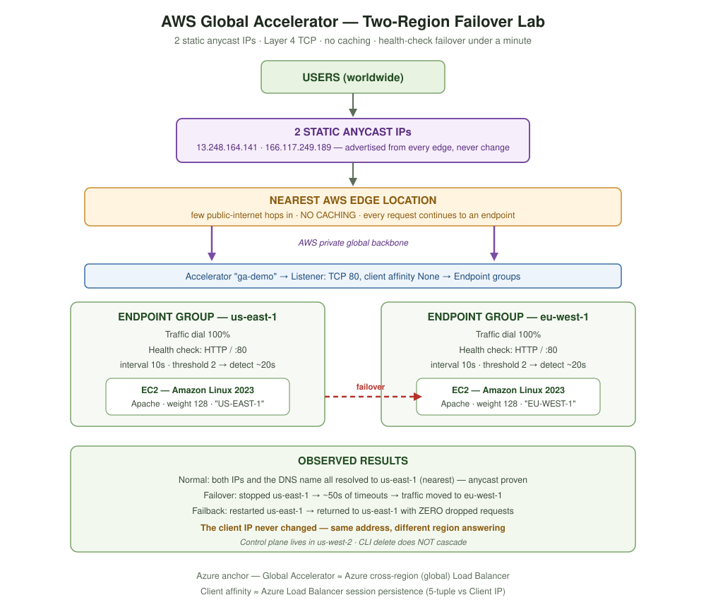
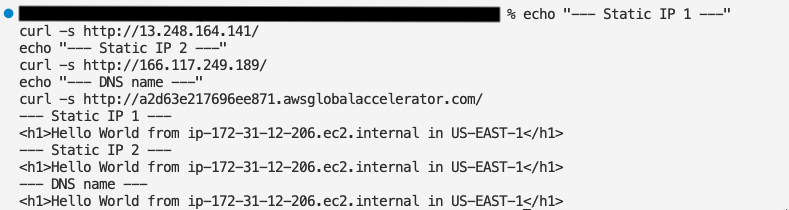
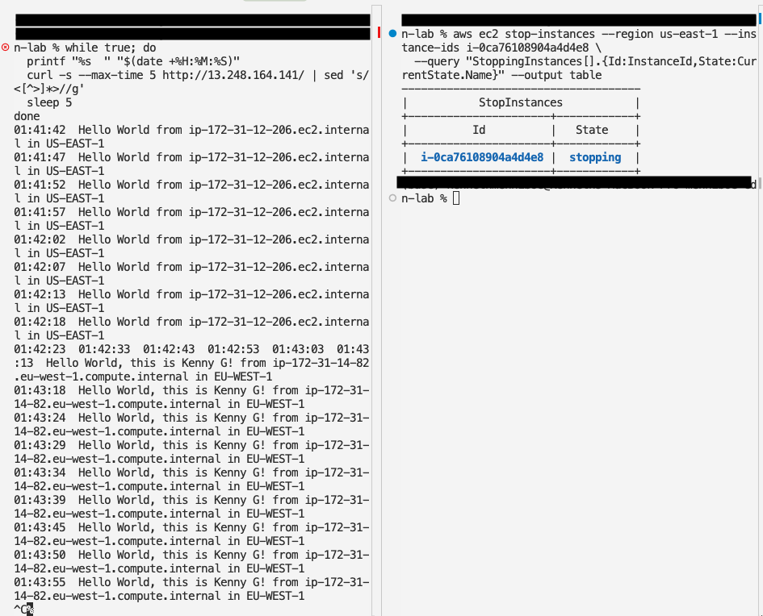
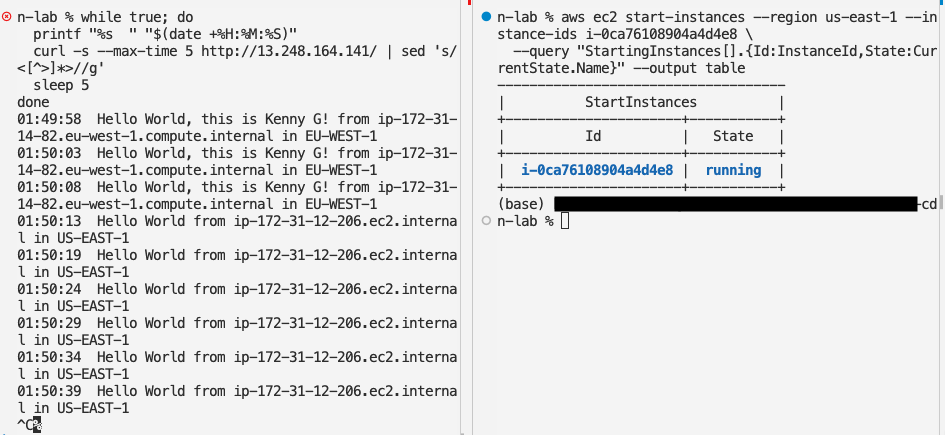

# AWS Global Accelerator — Two-Region Failover Lab

**AWS Certified Solutions Architect – Associate (SAA-C03) · Edge Services**

Built a Standard accelerator with two static anycast IPs fronting EC2 instances in
`us-east-1` and `eu-west-1`, then proved routing, failover and failback with live traffic.

Companion to [`aws-cloudfront-global-accelerator/`](../aws-cloudfront-global-accelerator),
which covers the CloudFront half of this exam section.



---

## What I Built

```
Users → 2 static anycast IPs → nearest AWS edge → AWS private backbone
      → Endpoint group us-east-1 → EC2 (Apache, "US-EAST-1")
      → Endpoint group eu-west-1 → EC2 (Apache, "EU-WEST-1")
```

| Component | Detail |
|---|---|
| Accelerator | `ga-demo` · Standard · IPv4 · Amazon IP pool |
| Static IPs | 2 anycast addresses, unchanged for the accelerator's life |
| Listener | TCP port 80 · client affinity **None** |
| Endpoint groups | `us-east-1` and `eu-west-1`, traffic dial 100% each |
| Health checks | HTTP · path `/` · port 80 · **interval 10s · threshold 2** |
| Endpoints | One EC2 per region · weight 128 · Amazon Linux 2023 + Apache via user data |

---

## Key Results

**Anycast routing — two different IPs, one destination**

```
--- Static IP 1 ---   Hello World from ip-172-31-12-206.ec2.internal in US-EAST-1
--- Static IP 2 ---   Hello World from ip-172-31-12-206.ec2.internal in US-EAST-1
--- DNS name   ---    Hello World from ip-172-31-12-206.ec2.internal in US-EAST-1
```

Both addresses and the DNS name resolved to the **nearest** region. The network chose,
not the address dialled.



**Failover — ~50 seconds, client IP unchanged**

| Time | Serving |
|---|---|
| `01:41:42` – `01:42:18` | US-EAST-1 |
| `01:42:23` – `01:43:03` | *timeouts — instance stopping* |
| `01:43:13` onward | **EU-WEST-1** |



**Failback — zero dropped requests**

| Time | Serving |
|---|---|
| `01:49:58` – `01:50:08` | EU-WEST-1 |
| `01:50:13` onward | **US-EAST-1** |



---

## The Asymmetry Worth Remembering

| | Downtime | Why |
|---|---|---|
| **Failover** | ~50s | Failure is detected **after** it happens — requests fail until health checks catch up |
| **Failback** | **0s** | The healthy region kept serving; traffic only moved **after** the recovered region passed checks |

Global Accelerator never routes to an endpoint until health checks confirm it. Recovery is
always seamless — only the original failure costs anything.

---

## Findings the Course Video Didn't Cover

| Finding | Detail |
|---|---|
| **Control plane region** | Global Accelerator is global, but **create/update/delete run through `us-west-2`**. Every CLI call needs `--region us-west-2`. (CloudFront's equivalent anchor is `us-east-1`.) |
| **CLI deletes don't cascade** | `delete-accelerator` fails with `AssociatedListenerFoundException`. Order is endpoint groups → listener → accelerator. The console hides this by cascading for you. |
| **Health checks depend on endpoint type** | Endpoint-group health settings apply only to **EC2 and Elastic IP** endpoints. For **ALB/NLB**, Global Accelerator uses the load balancer's own target-group health checks and ignores these fields. |
| **Client IP preservation is automatic for EC2** | The checkbox is pre-checked and disabled for EC2 endpoints. It's only a real choice for ALB/NLB. |
| **The unhealthy banner cries wolf** | The same yellow "Health checks might not be configured correctly" banner appears during provisioning (false alarm) and during genuine endpoint failure (accurate). |

---

## Cost

| Resource | Rate | This lab |
|---|---|---|
| Accelerator | **~$0.025/hour, fixed** | ~2 hours ≈ $0.05 |
| Data transfer premium | per GB | negligible |
| 2× t3.micro EC2 | free-tier credits | ~$0.00 |

> Global Accelerator is **not free tier**. It bills whether or not traffic flows.
> Teardown is mandatory, not optional.

**All resources destroyed:** accelerator deleted, both EC2 instances terminated,
security groups removed.

---

## Files

| File | Contents |
|---|---|
| `README.md` | This summary |
| `notes.md` | Full reference — concepts, acronyms, copy-paste redo guide, errors and fixes |
| `commands.md` | Every CLI command, grouped by workflow stage |
| `images/architecture-diagram.svg` | Final architecture |
| `screenshots/` | 18 lab screenshots, embedded inline in `notes.md` |

> Screenshots are machine-redacted: AWS account ID, local username and hostname blacked out.

---
