# AWS Global Accelerator — Full Reference Guide

**AWS SAA-C03 · Edge Services** · Two-region failover lab with EC2 endpoints

---

## Table of Contents

**Reference**
- [Architecture Diagram](#architecture-diagram)
- [Acronyms and What They Mean](#acronyms-and-what-they-mean)
- [Questions I Asked During This Session](#questions-i-asked-during-this-session)

**Concepts**
- [The Problem Global Accelerator Solves](#the-problem-global-accelerator-solves)
- [Unicast vs Anycast](#unicast-vs-anycast)
- [The Four-Level Hierarchy](#the-four-level-hierarchy)
- [Health Checks and Failover Timing](#health-checks-and-failover-timing)
- [CloudFront vs Global Accelerator](#cloudfront-vs-global-accelerator)

**Hands-On Lab (copy-paste redo guide)**
- [Lab Prerequisites and Cost Warning](#lab-prerequisites-and-cost-warning)
- [Stage 1 — Launch EC2 in us-east-1](#stage-1--launch-ec2-in-us-east-1)
  - [Step 1.1 — Name, AMI, instance type, key pair](#step-11--name-ami-instance-type-key-pair)
  - [Step 1.2 — Network settings and storage](#step-12--network-settings-and-storage)
  - [Step 1.3 — Advanced details and user data](#step-13--advanced-details-and-user-data)
- [Stage 2 — Launch EC2 in eu-west-1](#stage-2--launch-ec2-in-eu-west-1)
- [Stage 3 — Verify both instances serve](#stage-3--verify-both-instances-serve)
- [Stage 4 — Create the accelerator](#stage-4--create-the-accelerator)
  - [Step 4.1 — Accelerator name and type](#step-41--accelerator-name-and-type)
  - [Step 4.2 — Add listener](#step-42--add-listener)
  - [Step 4.3 — Add endpoint groups](#step-43--add-endpoint-groups)
  - [Step 4.4 — Add endpoints](#step-44--add-endpoints)
  - [Step 4.5 — Wait for provisioning](#step-45--wait-for-provisioning)
- [Stage 5 — Test anycast routing](#stage-5--test-anycast-routing)
- [Stage 6 — Failover test](#stage-6--failover-test)
- [Stage 7 — Failback test](#stage-7--failback-test)
- [Stage 8 — Teardown](#stage-8--teardown)
  - [Step 8.1 — Disable the accelerator](#step-81--disable-the-accelerator)
  - [Step 8.2 — Delete bottom-up](#step-82--delete-bottom-up)
  - [Step 8.3 — Terminate both EC2 instances](#step-83--terminate-both-ec2-instances)

**Wrap-up**
- [Errors and Findings — Index](#errors-and-findings--index)
- [Exam Quick Reference](#exam-quick-reference)

---

## Architecture Diagram


---

## Acronyms and What They Mean

| Acronym | Full form | Meaning in one line |
|---|---|---|
| **ALB** | Application Load Balancer | Layer 7 load balancer (HTTP/HTTPS) |
| **AMI** | Amazon Machine Image | The OS template an instance boots from |
| **Anycast** | — | One IP advertised from many locations; clients reach the nearest |
| **ARN** | Amazon Resource Name | Globally unique identifier for an AWS resource |
| **AZ** | Availability Zone | An isolated datacenter group within a region |
| **BGP** | Border Gateway Protocol | How routers advertise IP reachability across the internet |
| **DR** | Disaster Recovery | Keeping service running when a region fails |
| **EIP** | Elastic IP | Static public IPv4 address you own |
| **GA** | Global Accelerator | This service |
| **IoT** | Internet of Things | Networked devices, often using UDP telemetry |
| **NLB** | Network Load Balancer | Layer 4 load balancer (TCP/UDP) |
| **PoP** | Point of Presence | An AWS edge location |
| **SG** | Security Group | Stateful instance-level firewall |
| **TCP** | Transmission Control Protocol | Connection-oriented, ordered, reliable |
| **UDP** | User Datagram Protocol | Connectionless, fast, no delivery guarantee |
| **Unicast** | — | One IP maps to exactly one server |
| **VoIP** | Voice over IP | Real-time voice, typically over UDP |

---

## Questions I Asked During This Session

<details>
<summary><b>What IP is http://13.248.164.141/ ?</b></summary>

It's **static IP 1 of the accelerator** — not an EC2 address. Four IPs were in play:

| IP | What it is | Type |
|---|---|---|
| `32.195.72.92` | EC2 in us-east-1 | **Unicast** — one server |
| `34.242.247.130` | EC2 in eu-west-1 | **Unicast** — one server |
| `13.248.164.141` | Accelerator static IP 1 | **Anycast** — advertised worldwide |
| `166.117.249.189` | Accelerator static IP 2 | **Anycast** — advertised worldwide |

**Why it matters for the failover test:** curling the EC2 IP directly would just die when
that instance stopped — there is nowhere else to go. Curling the accelerator IP means
talking to the *service*, which can silently redirect to Ireland without the address changing.
</details>

<details>
<summary><b>If a health check is interval 10s / threshold 2, how long until an instance is marked unhealthy?</b></summary>

**~20 seconds.** Two consecutive failed checks, ten seconds apart.

Add routing convergence and the graceful OS shutdown and the observed end-to-end failover
was **~50 seconds** — inside AWS's "under a minute" claim.

**Trade-off:** aggressive checks detect failure faster but are more likely to evict a healthy
endpoint over a brief network blip. Defaults are 30s interval / threshold 3 = 90 seconds.
</details>

<details>
<summary><b>Can I do the teardown in the console?</b></summary>

Yes — and the console is actually *easier*, because it **cascades the deletion**. The CLI does
not. See [Step 8.2](#step-82--delete-bottom-up).
</details>

---

## The Problem Global Accelerator Solves

An app deployed in **one region** with users worldwide:

```
USER (America)  ─hop─hop─hop─hop─hop─> ALB (India)   ← public internet
USER (Europe)   ─hop─hop─hop─hop─────> ALB (India)
USER (Australia)─hop─hop─hop─────────> ALB (India)
```

Every hop adds **latency**, **risk of dropped connections**, and **unpredictability** as routes
change.

**The goal:** get users onto **AWS's private global network** as early as possible.

---

## Unicast vs Anycast

| | Behaviour |
|---|---|
| **Unicast** | **One server = one IP.** The address you dial decides the server you reach. |
| **Anycast** | **Many locations share the SAME IP.** You are routed to the **nearest** one. |

```
UNICAST:  Client → 12.34.56.78 → Server A only
          Client → 98.76.54.32 → Server B only

ANYCAST:  Client (Paris)  → 1.2.3.4 → nearest location (Europe)
          Client (Sydney) → 1.2.3.4 → nearest location (Australia)
                           same IP, different destination
```

**Analogy:** an **emergency number (911)**. Same number everywhere; you reach the **nearest
dispatch centre**. A unicast address is one specific office's direct line.

> [!NOTE]
> **You have met anycast before:** the 13 DNS **root server** addresses are served from
> hundreds of physical machines worldwide via anycast, and so is `8.8.8.8`.

> [!TIP]
> "Nearest" means nearest by **network path** (BGP), not necessarily geographically closest.

---

## The Four-Level Hierarchy

```
Accelerator          (global — owns the 2 static anycast IPs)
 └── Listener        (protocol + port, e.g. TCP 80; client affinity)
      └── Endpoint group   (ONE per REGION — health checks, traffic dial %)
           └── Endpoint    (ALB / NLB / EC2 / Elastic IP — plus weight)
```

| Level | Controls | Key setting |
|---|---|---|
| **Accelerator** | The 2 static IPs, enabled state | Standard vs Custom routing |
| **Listener** | What port/protocol to accept | Client affinity |
| **Endpoint group** | **One region** | **Health checks**, traffic dial |
| **Endpoint** | One resource | Weight |

> [!IMPORTANT]
> **Traffic dial vs weight — frequently confused:**
> - **Traffic dial** is a percentage on the **endpoint group** — it controls traffic *across* regions
> - **Weight** is on the **endpoint** — it distributes traffic *within* one region
>
> Weight `0` drains an endpoint without removing it — the graceful way to take an instance
> out of service.

> [!NOTE]
> **Standard vs Custom routing.** Standard routes to the nearest healthy endpoint.
> **Custom routing** deterministically maps a port to one specific EC2 instance in a VPC
> subnet — used for multiplayer game session servers where a player must land on one exact
> instance. Appears as a distractor on the exam.

---

## Health Checks and Failover Timing

**Where they live:** on the **endpoint group**, because each group represents one region.

> [!WARNING]
> **The nuance the console reveals and most notes miss:**
>
> *"For load balancer endpoints, Global Accelerator always uses the health check settings
> that you've configured on the Elastic Load Balancing console. Health check settings that
> you configure here are used only for EC2 instance and Elastic IP address endpoints."*
>
> | Endpoint type | Whose health check wins |
> |---|---|
> | **EC2 / Elastic IP** | The **endpoint group's** settings |
> | **ALB / NLB** | The **load balancer's own** target group health check — endpoint group settings are **ignored** |
>
> That makes sense: an ALB already knows which targets are healthy, so GA defers rather than
> duplicating the work.

**Timing math used in this lab:**

| Setting | Value | Effect |
|---|---|---|
| Interval | 10 s | Check frequency |
| Threshold | 2 | Consecutive failures required |
| **Detection** | **~20 s** | interval × threshold |
| **Observed end-to-end** | **~50 s** | detection + graceful shutdown + routing convergence |

---

## CloudFront vs Global Accelerator

**Shared:** the same AWS global edge network, and AWS Shield DDoS protection.

| | CloudFront | Global Accelerator |
|---|---|---|
| **Core job** | **Caches** content at the edge | **Proxies** traffic to your app |
| **Caching** | Yes | **No** — every request reaches your app |
| **Protocols** | HTTP / HTTPS | **TCP / UDP** |
| **IPs** | Changing, resolved via DNS | **2 static anycast IPs** |
| **Control plane region** | `us-east-1` | **`us-west-2`** |
| **Best for** | Images, video on demand, websites, API acceleration | Gaming, IoT, VoIP, HTTP needing static IPs, fast regional failover |

> [!TIP]
> **Memory hook**
> - **CloudFront = Copies** — it keeps copies of your content near users
> - **Global Accelerator = Gets you there** — a fast private road to your app

> [!WARNING]
> **A trap I fell into:** "video → Global Accelerator because you can't cache it" is **wrong**.
> **Video on demand is a flagship CloudFront use case** — every viewer requests the same file
> chunks, so edge caching is enormously effective.
>
> The dividing line is **pre-recorded vs real-time**, not video vs not-video:
>
> | Traffic | Service | Why |
> |---|---|---|
> | Video on demand, movies, images, JS/CSS | **CloudFront** | Same bytes for everyone → cacheable |
> | Live gaming, VoIP, IoT telemetry, video **calls** | **Global Accelerator** | Every packet unique → nothing to cache |

**Teach-back (final wording)**

> CloudFront caches content at edge locations so repeat requests never reach the origin — it
> shortens the distance to the **content**. Global Accelerator caches nothing; every request
> is proxied over the AWS private network to a real instance — it shortens the **path to the
> server**. Choose CloudFront for content many users share. Choose Global Accelerator for
> TCP/UDP traffic that's unique per user, when you need static IPs to allowlist, or when you
> need sub-minute regional failover. Invalidation exists only in CloudFront because only
> CloudFront stores anything.

---

# Hands-On Lab

## Lab Prerequisites and Cost Warning

| Requirement | This lab used |
|---|---|
| AWS account | Personal account |
| Regions | `us-east-1` and `eu-west-1` |
| AWS CLI | Configured and authenticated |
| Shell | zsh on macOS |

> [!CAUTION]
> **Global Accelerator is NOT free tier.** It charges a **fixed ~$0.025/hour (~$18/month)**
> per accelerator, whether or not traffic flows, plus a data transfer premium.
>
> A 2-hour lab costs about **5 cents**. A forgotten accelerator costs **$18/month**.
> **Teardown is mandatory**, not optional — see [Stage 8](#stage-8--teardown).

**Placeholders — substitute your own:**

```
<US_INSTANCE_ID>    e.g. i-0xxxxxxxxxxxxxxxx
<EU_INSTANCE_ID>    e.g. i-0xxxxxxxxxxxxxxxx
<ACCEL_IP_1>        first static anycast IP
<ACCEL_IP_2>        second static anycast IP
<ACCEL_DNS>         xxxxxxxxxxxxx.awsglobalaccelerator.com
<ACCOUNT_ID>        your 12-digit AWS account ID
```

---

## Stage 1 — Launch EC2 in us-east-1

### Step 1.1 — Name, AMI, instance type, key pair

**Console → EC2 → confirm Region is `us-east-1` → Launch instance**

| Panel | Field | Value |
|---|---|---|
| **Name and tags** | Name | `ga-demo-us-east-1` |
| **Application and OS Images** | Quick Start | Amazon Linux |
| | AMI | Amazon Linux 2023 AMI (default, Free tier eligible) |
| | Architecture | 64-bit (x86) |
| **Instance type** | | `t3.micro` |
| **Key pair (login)** | | **Proceed without a key pair (Not recommended)** |

> [!NOTE]
> **Why no key pair:** the instance is configured entirely by user data. SSH would be dead
> weight and an open port for nothing.

### Step 1.2 — Network settings and storage

| Field | Value |
|---|---|
| VPC | `vpc-xxxxx (default)` |
| Subnet | No preference (any AZ) |
| **Auto-assign public IP** | **Enable** |
| Firewall (security groups) | **Create security group** |
| Security group name | `ga-demo-sg` |
| Description | `Allow HTTP from internet for Global Accelerator demo` |

**Inbound security group rules:**

| Checkbox | Setting |
|---|---|
| Allow SSH traffic from | ☐ unchecked |
| Allow HTTPS traffic from the internet | ☐ unchecked |
| **Allow HTTP traffic from the internet** | ☑ **CHECKED** |

**Configure storage:** 1× **8 GiB gp3** (default)

> [!TIP]
> **Only one inbound rule is needed** because security groups are **stateful** — the reply to
> an allowed inbound request is automatically permitted back out. If this were a **NACL**
> (stateless), you would also need an outbound rule for ephemeral ports **1024–65535**.

### Step 1.3 — Advanced details and user data

Expand **Advanced details**. Leave every field at its default:

| Field | Value |
|---|---|
| Purchasing option | unchecked (On-Demand) |
| Domain join directory | No directory |
| IAM instance profile | blank |
| Hostname type | IP name |
| Shutdown behavior | Stop |
| Termination protection | Disable |
| Detailed CloudWatch monitoring | Disable |
| Tenancy | Shared |
| Metadata version | V2 only (token required) |
| Allow tags in metadata | Disabled |

Scroll to the bottom and paste into **User data**:

```bash
#!/bin/bash
dnf install -y httpd
systemctl enable --now httpd
echo "<h1>Hello World from $(hostname -f) in US-EAST-1</h1>" > /var/www/html/index.html
```

| Line | Purpose |
|---|---|
| `#!/bin/bash` | Run as a shell script at first boot |
| `dnf install -y httpd` | Install Apache (Amazon Linux 2023 uses `dnf`, not `yum`) |
| `systemctl enable --now httpd` | Start Apache **and** enable it on reboot |
| `echo ... > index.html` | Write a homepage naming the instance and region |

Click **Launch instance**.

---

## Stage 2 — Launch EC2 in eu-west-1

**Switch Region to `eu-west-1` (Ireland)** and repeat Stage 1 with two changes:

| Field | Value |
|---|---|
| Name | `ga-demo-eu-west-1` |
| User data region label | `EU-WEST-1` |

```bash
#!/bin/bash
dnf install -y httpd
systemctl enable --now httpd
echo "<h1>Hello World from $(hostname -f) in EU-WEST-1</h1>" > /var/www/html/index.html
```

> [!IMPORTANT]
> **Security groups are regional.** `ga-demo-sg` from us-east-1 will not appear here — create
> a new one with the same name and the same single HTTP inbound rule.

---

## Stage 3 — Verify both instances serve

Prove each layer works alone before adding the accelerator, so any later breakage has one
obvious cause.

```bash
US_IP=$(aws ec2 describe-instances --region us-east-1 \
  --filters "Name=tag:Name,Values=ga-demo-us-east-1" "Name=instance-state-name,Values=running" \
  --query "Reservations[].Instances[].PublicIpAddress" --output text)

EU_IP=$(aws ec2 describe-instances --region eu-west-1 \
  --filters "Name=tag:Name,Values=ga-demo-eu-west-1" "Name=instance-state-name,Values=running" \
  --query "Reservations[].Instances[].PublicIpAddress" --output text)

echo "US: $US_IP"
echo "EU: $EU_IP"
echo "---"
curl -s --max-time 10 http://$US_IP/
curl -s --max-time 10 http://$EU_IP/
```

**Actual result:**

```
US: 32.195.72.92
EU: 34.242.247.130
---
<h1>Hello World from ip-172-31-12-206.ec2.internal in US-EAST-1</h1>
<h1>Hello World, this is Kenny G! from ip-172-31-14-82.eu-west-1.compute.internal in EU-WEST-1</h1>
```

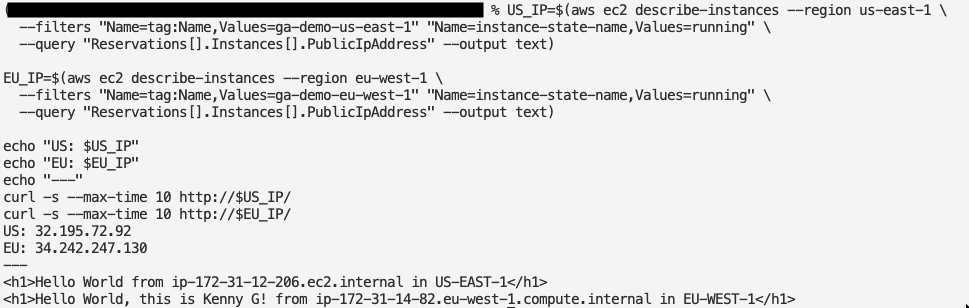

> [!TIP]
> If one times out, user data may still be installing Apache. Wait 60 seconds and retry.
> If it still fails, the HTTP checkbox in the security group is the usual culprit.

---

## Stage 4 — Create the accelerator

> [!CAUTION]
> **Billing starts here** — the ~$0.025/hour clock begins the moment the accelerator exists.

**Console → search "Global Accelerator" → Create accelerator**

### Step 4.1 — Accelerator name and type

| Field | Value |
|---|---|
| **Accelerator name** | `ga-demo` |
| **Accelerator type** | **Standard** |
| **IP address type** | **IPv4** |
| **IP address pool** | Use Amazon's pool of IPv4 addresses |
| **Tags** | `Project` = `ga-lab` |

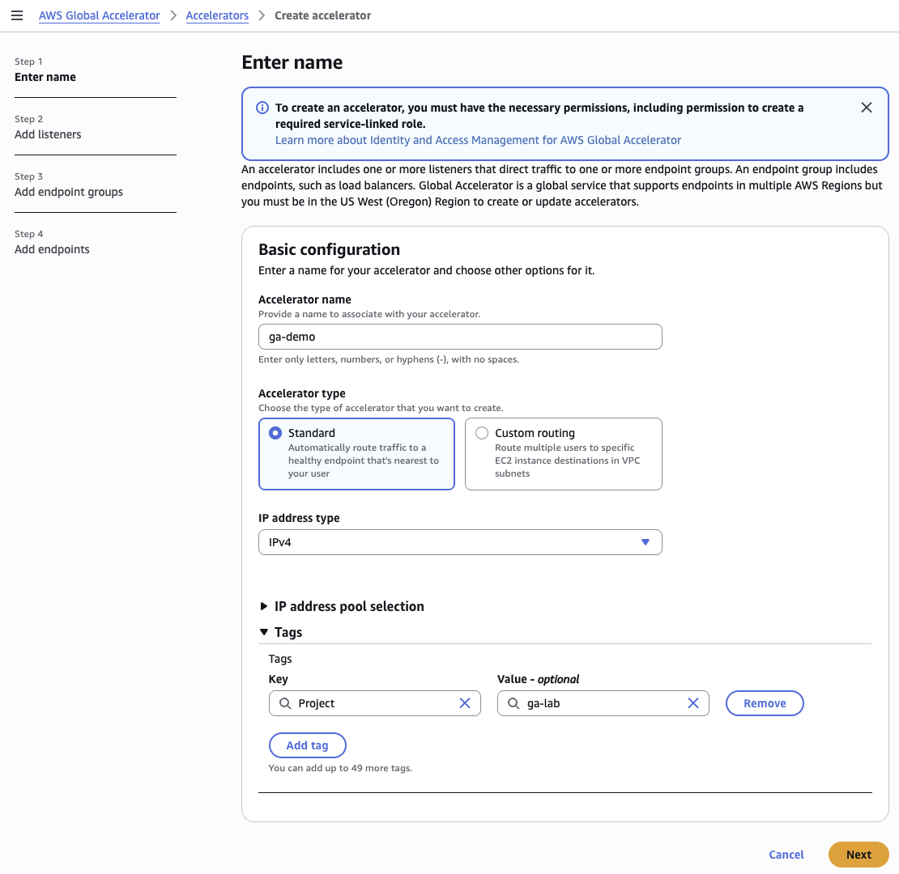

> [!IMPORTANT]
> **Read the notice on this screen:**
> *"Global Accelerator is a global service that supports endpoints in multiple AWS Regions
> but you must be in the **US West (Oregon)** Region to create or update accelerators."*
>
> **The control plane lives in `us-west-2`.** Every CLI command needs `--region us-west-2`,
> even though nothing is actually "in" Oregon. Omit it and you get an endpoint error.
>
> **Compare with CloudFront:** also global, but its control plane anchor is `us-east-1` —
> which is why CloudFront's ACM certificate must live there. Two globals, two different home
> regions. The exam tests exactly this.

> [!NOTE]
> **Bring your own IP (BYOIP)** is the alternative to Amazon's pool, for organizations that
> own their address ranges and need to keep them.

### Step 4.2 — Add listener

| Field | Value |
|---|---|
| **Ports** | `80` |
| **Protocol** | **TCP** |
| **Client affinity** | **None** |

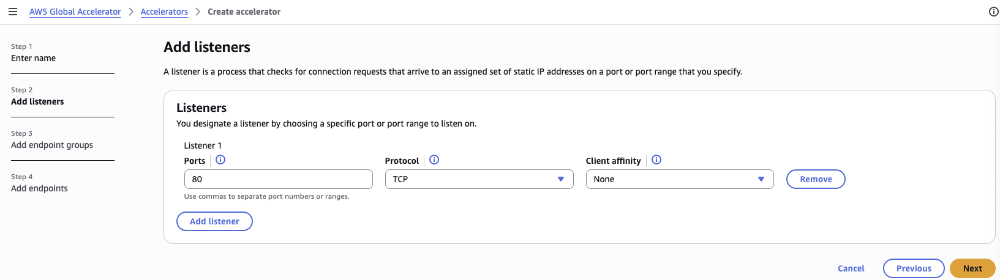

> [!NOTE]
> The listener asks for **TCP or UDP**, not HTTP. This is **Layer 4** — Global Accelerator has
> no idea it's carrying web traffic. That's exactly why it works for gaming, IoT and VoIP.

> [!TIP]
> **Client affinity — exam material:**
>
> | Setting | Behaviour |
> |---|---|
> | **None** | Each connection routed independently — **5-tuple hash** (source IP, source port, dest IP, dest port, protocol) |
> | **Source IP** | All connections from one client IP go to the **same endpoint** — **2-tuple hash** |
>
> Use **Source IP** when the app keeps session state on the instance (a cart in local memory,
> a game session). Use **None** when any instance can serve any request.
>
> **Azure anchor:** this is **session persistence** on the Azure Load Balancer — the same
> choice between the default 5-tuple hash and Client IP affinity.

### Step 4.3 — Add endpoint groups

Add **two** groups, one per region.

| Field | Group 1 | Group 2 |
|---|---|---|
| **Region** | `us-east-1` | `eu-west-1` |
| **Traffic dial** | `100` | `100` |
| **Health check port** | `80` | `80` |
| **Health check protocol** | HTTP | HTTP |
| **Health check path** | `/` | `/` |
| **Health check interval** | `10` seconds | `10` seconds |
| **Threshold count** | `2` | `2` |

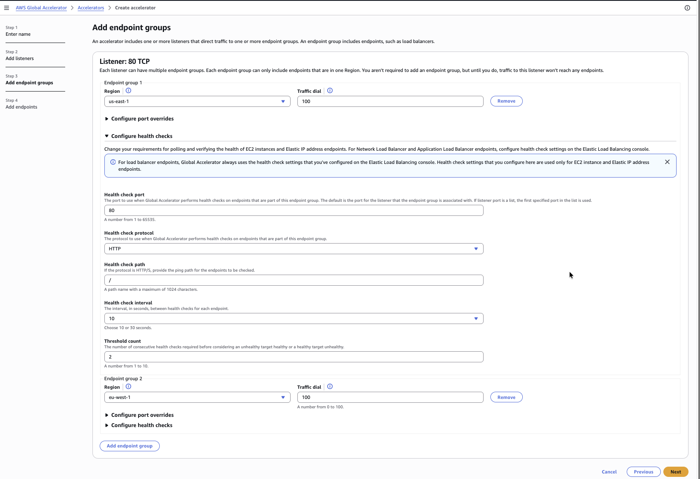

> [!WARNING]
> **Easy miss:** the second endpoint group's **Configure health checks** section is
> **collapsed by default** and silently keeps the defaults (30s interval, threshold 3 = 90s
> detection). Expand it and set the same four values, or EU failover will be three times
> slower than US.

> [!IMPORTANT]
> **This is the screen that answers the exam question:** health checks are configured on the
> **endpoint group**, not the accelerator, listener, or individual endpoint. Each group is one
> region, so each region gets its own health policy.
>
> See also the [ALB/NLB nuance](#health-checks-and-failover-timing) — these settings only
> apply to **EC2 and Elastic IP** endpoints.

### Step 4.4 — Add endpoints

One per group.

| Field | Value |
|---|---|
| **Endpoint type** | **EC2 instance** |
| **Endpoint** | `ga-demo-us-east-1` / `ga-demo-eu-west-1` |
| **Weight** | `128` (default, range 0–255) |
| **Preserve client IP address** | pre-checked and **disabled** for EC2 |

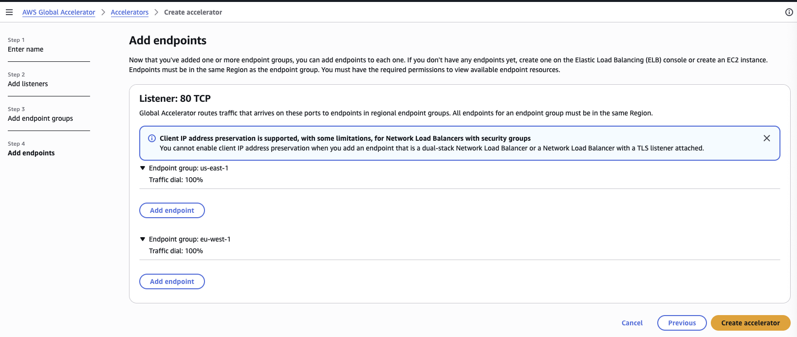

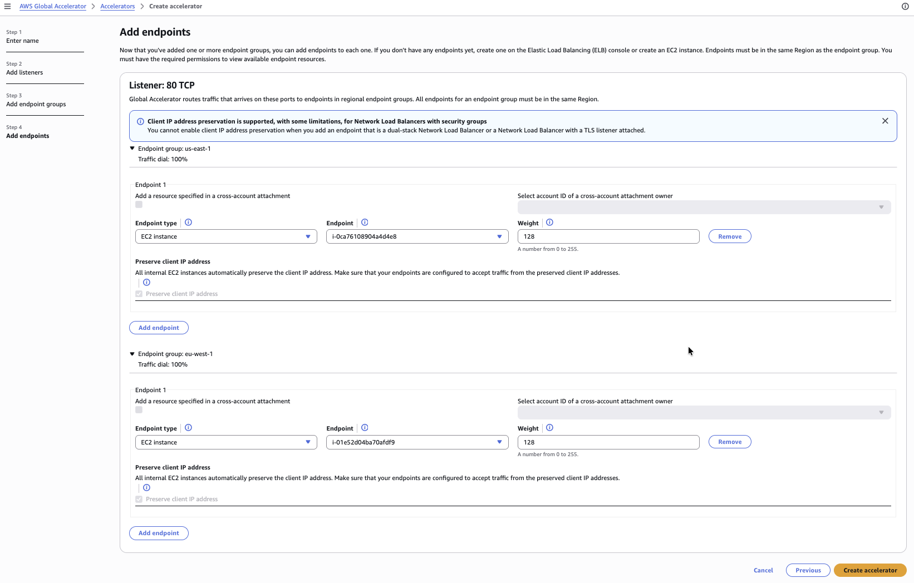

> [!NOTE]
> **Client IP preservation is automatic for EC2 endpoints** — the console states *"All
> internal EC2 instances automatically preserve the client IP address"* and greys the toggle
> out. It's only a real choice for **ALB and NLB** endpoints, where the load balancer sits in
> the path and preservation has to be negotiated.

> [!WARNING]
> **The follow-on warning matters:** *"Make sure that your endpoints are configured to accept
> traffic from the preserved client IP addresses."*
>
> Because the real client IP is preserved, your security group must allow traffic from **those**
> IPs — **not** from Global Accelerator's edge IPs. This lab's SG allows `0.0.0.0/0` so it
> works. Locking the SG to a narrow range expecting edge IPs would drop every request — a
> classic real-world Global Accelerator failure.

Click **Create accelerator**.

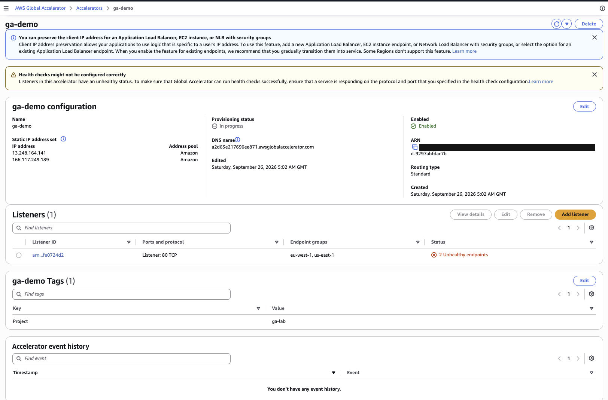

**Artifacts produced:**

| Item | Example |
|---|---|
| Static IP 1 | `13.248.164.141` |
| Static IP 2 | `166.117.249.189` |
| DNS name | `a2d63e217696ee871.awsglobalaccelerator.com` |

> [!TIP]
> **Those two IPs are the whole point of the service.** They never change for the life of the
> accelerator. That's what enterprise customers put in firewall allowlists, and what makes
> failover invisible to clients.

### Step 4.5 — Wait for provisioning

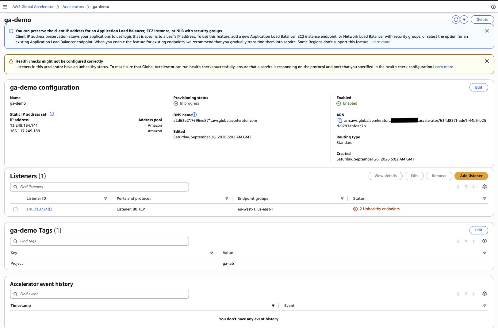

> [!NOTE]
> **The yellow "Health checks might not be configured correctly" banner and the
> "2 Unhealthy endpoints" count are EXPECTED here.** Provisioning hasn't finished, so nothing
> has been health-checked yet. Do not troubleshoot it.
>
> Later in the lab the **same banner** appears for a **genuine** failure. A warning that cried
> wolf during setup is easy to dismiss when it later tells the truth.

```bash
ACC=$(aws globalaccelerator list-accelerators --region us-west-2 \
  --query "Accelerators[?Name=='ga-demo'].AcceleratorArn" --output text)

LIS=$(aws globalaccelerator list-listeners --region us-west-2 \
  --accelerator-arn $ACC --query "Listeners[0].ListenerArn" --output text)

aws globalaccelerator describe-accelerator --region us-west-2 \
  --accelerator-arn $ACC --query "Accelerator.Status" --output text

aws globalaccelerator list-endpoint-groups --region us-west-2 --listener-arn $LIS \
  --query "EndpointGroups[].{Region:EndpointGroupRegion,Health:EndpointDescriptions[0].HealthState}" \
  --output table
```

**Actual result:**

```
DEPLOYED
------------------------------
| Health   | Region           |
+----------+------------------+
| HEALTHY  | eu-west-1        |
| HEALTHY  | us-east-1        |
------------------------------
```

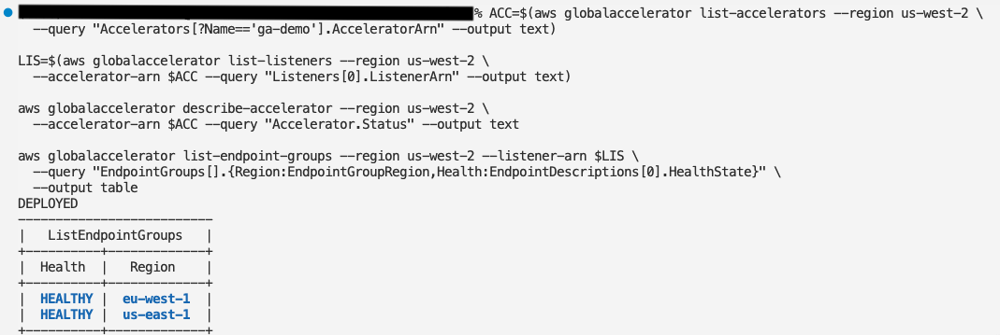

---

## Stage 5 — Test anycast routing

```bash
echo "--- Static IP 1 ---"
curl -s http://<ACCEL_IP_1>/
echo "--- Static IP 2 ---"
curl -s http://<ACCEL_IP_2>/
echo "--- DNS name ---"
curl -s http://<ACCEL_DNS>/
```

**Actual result — all three landed on the nearest region:**

```
--- Static IP 1 ---
<h1>Hello World from ip-172-31-12-206.ec2.internal in US-EAST-1</h1>
--- Static IP 2 ---
<h1>Hello World from ip-172-31-12-206.ec2.internal in US-EAST-1</h1>
--- DNS name ---
<h1>Hello World from ip-172-31-12-206.ec2.internal in US-EAST-1</h1>
```


> [!IMPORTANT]
> **This is Module 8 made concrete:** two different IP addresses, one destination, chosen by
> network proximity rather than by which address you dialled. A unicast IP would force you to
> pick a server. Anycast picks for you.

---

## Stage 6 — Failover test

Needs **two terminal tabs**.

**Terminal 1 — watch loop:**

```bash
while true; do
  printf "%s  " "$(date +%H:%M:%S)"
  curl -s --max-time 5 http://<ACCEL_IP_1>/ | sed 's/<[^>]*>//g'
  sleep 5
done
```

**Terminal 2 — stop the US instance:**

```bash
aws ec2 stop-instances --region us-east-1 --instance-ids <US_INSTANCE_ID> \
  --query "StoppingInstances[].{Id:InstanceId,State:CurrentState.Name}" --output table
```

**Actual result:**

| Time | Serving |
|---|---|
| `01:41:42` – `01:42:18` | **US-EAST-1**, 8 consecutive good responses |
| `01:42:23` – `01:43:03` | **blank lines** — instance stopping, requests timing out |
| `01:43:13` | **First EU-WEST-1 response** |
| `01:43:18` onward | **EU-WEST-1** steadily |

**Total failover: ~50 seconds.**


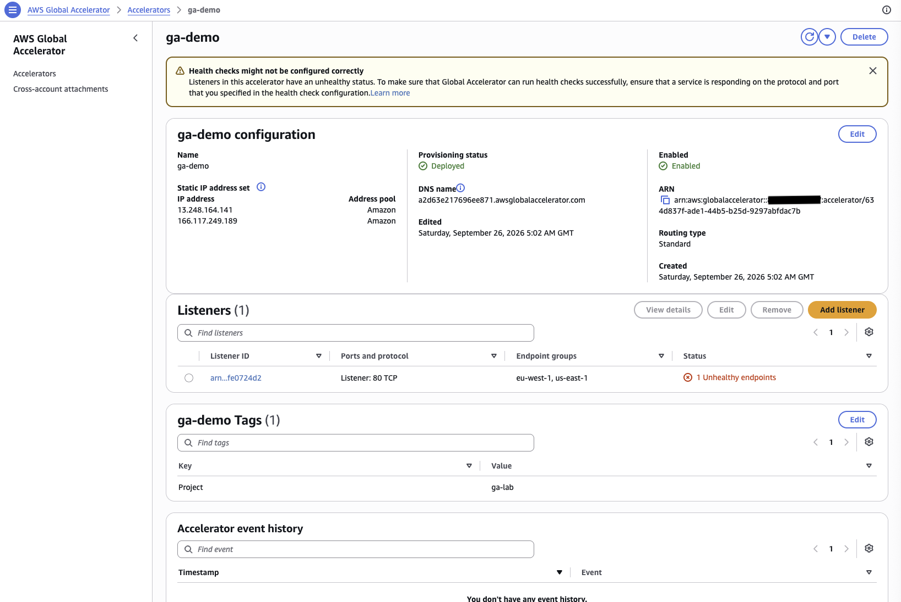

> [!IMPORTANT]
> **The critical observation: the IP never changed.** The same address was curled throughout.
> The machine answering it moved from Virginia to Ireland and the client never knew.
>
> With **Route 53 DNS failover**, resolvers would keep handing out the dead US address until
> the record's TTL expired — potentially minutes, and inconsistently across users.
> **That difference is the exam question.**

> [!NOTE]
> **Why ~50s rather than the ~20s the health check math predicts** — three things stack:
> 1. `stop-instances` triggers a **graceful OS shutdown**, so Apache lingers briefly
> 2. Two failed checks at 10s intervals ≈ **20s** detection
> 3. Routing convergence across edge locations adds a few seconds
>
> Also note the loop interval stretched from 5s to 10s during the outage — that's
> `curl --max-time 5` burning its full timeout on each dead request, on top of `sleep 5`.

---

## Stage 7 — Failback test

```bash
aws ec2 start-instances --region us-east-1 --instance-ids <US_INSTANCE_ID> \
  --query "StartingInstances[].{Id:InstanceId,State:CurrentState.Name}" --output table
```

Re-run the watch loop from Stage 6.

**Actual result:**

| Time | Serving |
|---|---|
| `01:49:58` – `01:50:08` | EU-WEST-1 |
| `01:50:13` onward | **US-EAST-1** |


> [!TIP]
> **Notice what's missing: there was no gap.** Not one timeout. Compare with the failover's
> ~50 seconds of dead requests.
>
> | | Downtime | Why |
> |---|---|---|
> | **Failover** | ~50s | Failure detected **after** it happens — requests fail until health checks catch up |
> | **Failback** | **0s** | EU kept serving; GA only switched **after** US proved healthy |
>
> Global Accelerator never moves traffic to an endpoint until health checks confirm it.
> Recovery is always seamless; only the original failure costs anything.

---

## Stage 8 — Teardown

> [!CAUTION]
> **Mandatory.** The accelerator bills at ~$0.025/hour regardless of traffic.
> **Disabling alone does not stop charges** — the accelerator still exists and still holds
> its two IP addresses. Only deletion stops billing.

### Step 8.1 — Disable the accelerator

**Console:** `ga-demo` → dropdown arrow beside **Delete** → **Disable accelerator**

**Or CLI:**

```bash
ACC=$(aws globalaccelerator list-accelerators --region us-west-2 \
  --query "Accelerators[?Name=='ga-demo'].AcceleratorArn" --output text)

aws globalaccelerator update-accelerator --region us-west-2 \
  --accelerator-arn $ACC --no-enabled \
  --query "Accelerator.{Name:Name,Enabled:Enabled,Status:Status}" --output table
```

Poll until `Enabled: False` **and** `Status: DEPLOYED`:

```bash
aws globalaccelerator describe-accelerator --region us-west-2 \
  --accelerator-arn $ACC --query "Accelerator.{Enabled:Enabled,Status:Status}" --output table
```

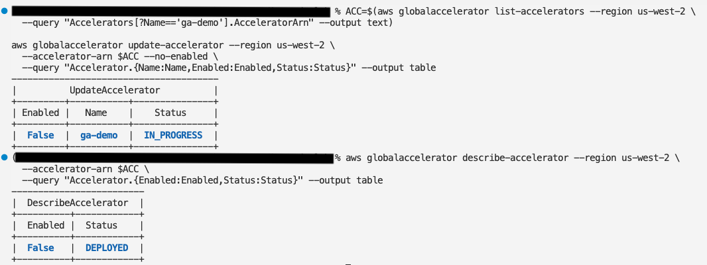

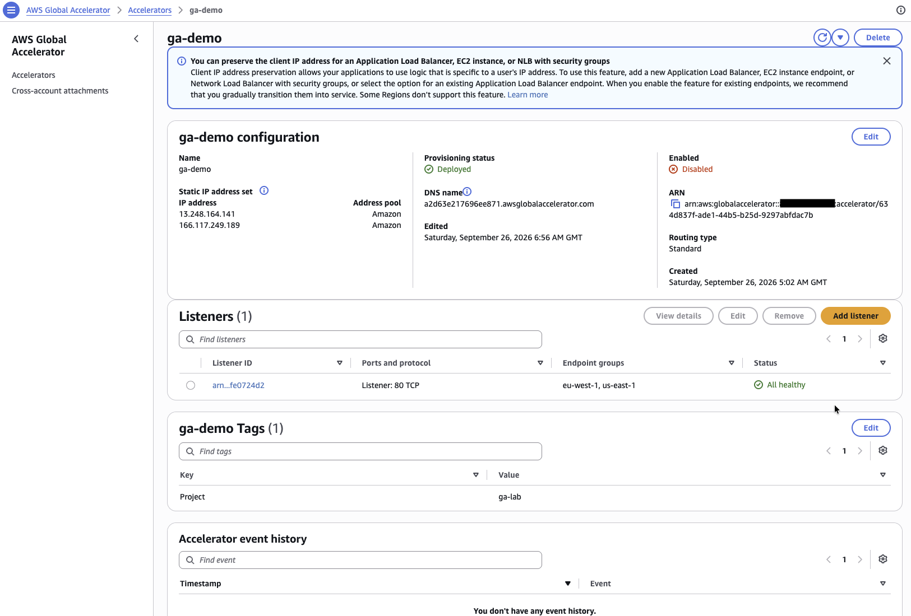

> [!NOTE]
> **Why disable is mandatory before delete:** the two IPs are advertised globally via **BGP**.
> Deleting while traffic could still route there would black-hole requests. Disabling withdraws
> the announcements cleanly first. Takes a few minutes, because every edge location worldwide
> must be updated.

### Step 8.2 — Delete bottom-up

#### ❌ Error — `AssociatedListenerFoundException`

**Symptom:**

```
aws: [ERROR]: An error occurred (AssociatedListenerFoundException) when calling the
DeleteAccelerator operation: Cannot delete accelerator ... because an associated
listener was found.
```

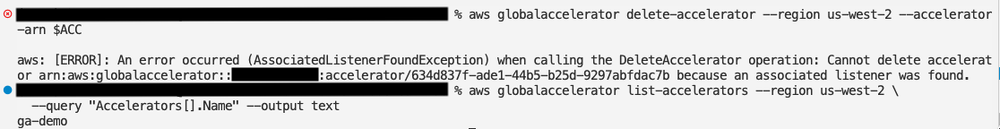

**Cause:** the course said "disable, then delete." That is true in the **console**, which
cascades the deletion for you. The **CLI does not cascade** — the hierarchy must be dismantled
bottom-up:

```
Accelerator          ← delete LAST
 └── Listener        ← delete 2nd
      └── Endpoint group  ← delete FIRST
```

**Fix:**

```bash
LIS=$(aws globalaccelerator list-listeners --region us-west-2 \
  --accelerator-arn $ACC --query "Listeners[0].ListenerArn" --output text)

# 1. Delete both endpoint groups
for EG in $(aws globalaccelerator list-endpoint-groups --region us-west-2 \
  --listener-arn $LIS --query "EndpointGroups[].EndpointGroupArn" --output text); do
  aws globalaccelerator delete-endpoint-group --region us-west-2 --endpoint-group-arn $EG
done

# 2. Delete the listener
aws globalaccelerator delete-listener --region us-west-2 --listener-arn $LIS

# 3. Now the accelerator will delete
aws globalaccelerator delete-accelerator --region us-west-2 --accelerator-arn $ACC

# 4. Verify — should return nothing
aws globalaccelerator list-accelerators --region us-west-2 --query "Accelerators[].Name" --output text
```

**Or click Delete in the console**, which handles the cascade itself.

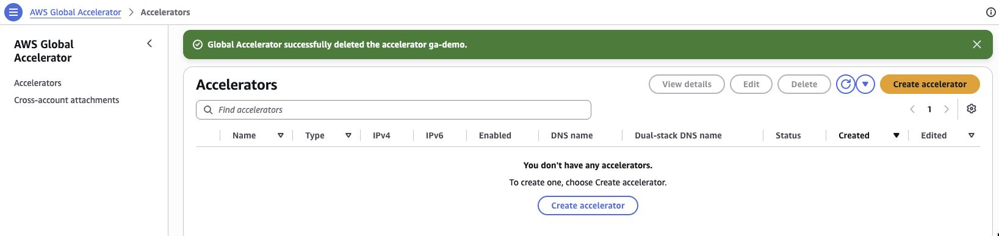

> [!TIP]
> **Why this matters beyond the lab:** this is exactly the ordering Terraform must encode.
> `depends_on` and resource-graph ordering exist because AWS enforces these parent-child
> constraints. Hitting the error by hand makes the Terraform behaviour obvious later.

> [!NOTE]
> Once deleted, the two IPs return to Amazon's pool. A new accelerator gets **different** IPs —
> which is why, in production, you never delete an accelerator whose IPs customers have
> allowlisted.

### Step 8.3 — Terminate both EC2 instances

```bash
aws ec2 terminate-instances --region us-east-1 --instance-ids <US_INSTANCE_ID> \
  --query "TerminatingInstances[].{Id:InstanceId,State:CurrentState.Name}" --output table

aws ec2 terminate-instances --region eu-west-1 --instance-ids <EU_INSTANCE_ID> \
  --query "TerminatingInstances[].{Id:InstanceId,State:CurrentState.Name}" --output table
```

Verify nothing is left in either region:

```bash
for R in us-east-1 eu-west-1; do
  echo "--- $R ---"
  aws ec2 describe-instances --region $R \
    --filters "Name=instance-state-name,Values=running,stopped,pending,stopping" \
    --query "Reservations[].Instances[].{Id:InstanceId,State:State.name,Name:Tags[?Key=='Name']|[0].Value}" \
    --output table
done
```

> [!WARNING]
> **Both regions matter.** Forgetting the EU instance is the classic Global Accelerator lab
> mistake — it sits in a region you don't normally look at and quietly runs for weeks.

**Optional:** delete the `ga-demo-sg` security groups in both regions. They cost nothing, but
they can only be removed once the instances are fully terminated.

---

# Wrap-up

## Errors and Findings — Index

| # | Where | Error / Finding | Fix or note |
|---|---|---|---|
| 1 | [Step 4.1](#step-41--accelerator-name-and-type) | Control plane is **`us-west-2`** | Every CLI call needs `--region us-west-2` |
| 2 | [Step 4.3](#step-43--add-endpoint-groups) | Second endpoint group's health checks collapsed at defaults | Expand and set interval 10 / threshold 2 |
| 3 | [Step 4.3](#step-43--add-endpoint-groups) | Endpoint-group health checks apply only to EC2/EIP | ALB/NLB use their own target-group checks |
| 4 | [Step 4.4](#step-44--add-endpoints) | Client IP preservation is automatic for EC2 | Only a real choice for ALB/NLB |
| 5 | [Step 4.5](#step-45--wait-for-provisioning) | "Unhealthy endpoints" banner during provisioning | False alarm — wait for `DEPLOYED` |
| 6 | [Stage 6](#stage-6--failover-test) | Failover took ~50s, not the ~20s the math predicts | Graceful shutdown + detection + routing convergence |
| 7 | [Step 8.2](#step-82--delete-bottom-up) | **`AssociatedListenerFoundException`** | CLI doesn't cascade — endpoint groups → listener → accelerator |
| 8 | Concept | "Video → Global Accelerator" | **Wrong** — video on demand is a flagship **CloudFront** use case. The line is pre-recorded vs real-time. |

---

## Exam Quick Reference

| Concept | Key fact |
|---|---|
| IPs | **2 static anycast IPs** that never change |
| Layer | **4 — TCP and UDP** |
| Caching | **None** — every request reaches your app |
| Hierarchy | Accelerator → Listener → Endpoint group → Endpoint |
| Health checks | On the **endpoint group** (= one region), for **EC2/EIP** endpoints only |
| ALB/NLB endpoints | Use the **load balancer's own** health checks |
| Failover | **Under 1 minute** (~50s observed with interval 10 / threshold 2) |
| Failback | **Zero downtime** — GA only switches once the endpoint is proven healthy |
| Traffic dial | Percentage **across** regions (on the endpoint group) |
| Weight | Distribution **within** a region (on the endpoint); `0` drains gracefully |
| Client affinity | None = 5-tuple hash; Source IP = 2-tuple hash |
| Control plane | **`us-west-2`** (CloudFront's is `us-east-1`) |
| Teardown | **Disable before delete**; CLI deletes **bottom-up** |
| Billing | **Not free tier** — ~$0.025/hour fixed, regardless of traffic |

**Choosing between CloudFront and Global Accelerator**

| Clue in the question | Answer |
|---|---|
| CDN, cache, static content, video on demand, reduce origin load | **CloudFront** |
| UDP, live gaming, IoT telemetry, VoIP, video calls | **Global Accelerator** |
| Static IPs to allowlist in a firewall | **Global Accelerator** |
| Deterministic, fast regional failover | **Global Accelerator** |
| HTTP app that also needs fixed IPs | **Global Accelerator** |

> [!NOTE]
> **Common trap:** an **ALB cannot have an Elastic IP** — only an NLB can. If a question offers
> "attach Elastic IPs to the ALB," it's wrong.

---
