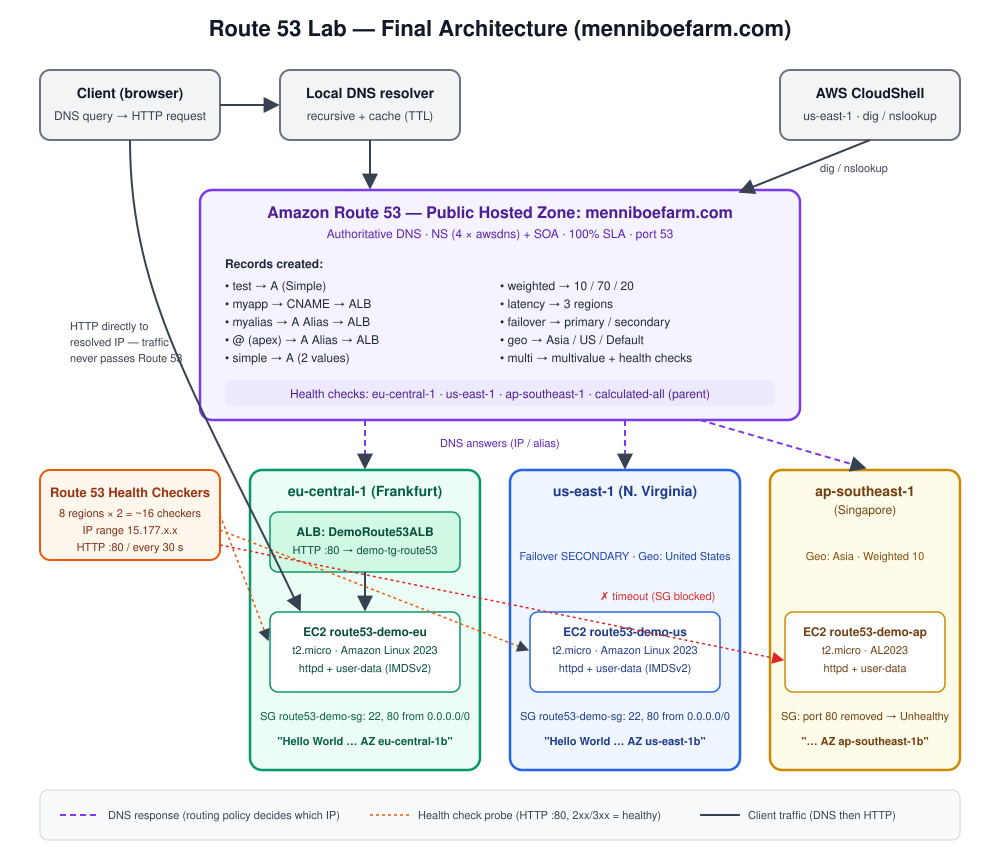

# Amazon Route 53 — DNS, Records, Routing Policies & Health Checks

**Cert track:** AWS Solutions Architect – Associate (SAA-C03)
**Lab domain:** `menniboefarm.com` (already owned, hosted in Route 53)
**Regions used:** eu-central-1 (Frankfurt), us-east-1 (N. Virginia), ap-southeast-1 (Singapore)

## What I learned

- **DNS fundamentals** — the recursive lookup chain (local resolver → root → TLD → authoritative), FQDN anatomy, and the difference between a *registrar*, an *authoritative* DNS service, and a *recursive* resolver.
- **Route 53 basics** — public vs private hosted zones, the four must-know record types (A, AAAA, CNAME, NS), why the service is named after port 53, and the 100% availability SLA.
- **TTL** — caching behavior, reading the `dig` countdown, and the lower-TTL → wait → change → raise strategy for safe record changes.
- **CNAME vs Alias** — CNAME is rejected at the zone apex; Alias works at the apex, is free to query, evaluates target health, follows target IP changes, has no user-settable TTL, and cannot target an EC2 DNS name.
- **Routing policies** — Simple, Weighted, Latency, Failover, Geolocation, Geoproximity, IP-based, Multi-value, and the trigger phrases the exam uses for each.
- **Health checks** — endpoint, calculated, and CloudWatch-alarm types; ~16 global checkers from the `15.177.x.x` range; 2xx/3xx = healthy; private resources need the CloudWatch-alarm path.
- **Registrar vs DNS service** and **Route 53 Resolver** inbound/outbound endpoints for hybrid DNS.

## Hands-on build

Three EC2 web servers in three regions + one ALB in Frankfurt, then ten Route 53 records exercising every routing policy, plus endpoint and calculated health checks with a deliberately broken security group to trigger failures.

## Key outputs / results

| Test | Result |
|---|---|
| `dig NS menniboefarm.com` | 4 × `awsdns` name servers → Route 53 is authoritative |
| `test` A record → fake IP `11.22.33.44` | DNS answered; browser failed (nothing listening) |
| `test` → eu-central-1 IP | TTL countdown observed (`297` → … → reset to `300` with new IP) |
| `myapp` CNAME → ALB | 3-line answer: CNAME hop + 2 ALB IPs |
| `myalias` Alias → ALB | 2-line answer: ALB IPs returned directly, TTL `60` (managed by Route 53) |
| CNAME at apex | **Rejected:** `RRSet of type CNAME with DNS name menniboefarm.com. is not permitted at apex` |
| Alias A at apex | `http://menniboefarm.com` served Hello World via ALB |
| `simple` with 2 values | Both IPs returned; browser landed randomly |
| `weighted` 10/70/20 | Mostly us-east-1, occasional eu / ap |
| `latency` from CloudShell (us-east-1) | Single answer: us-east-1 IP |
| Health checks | Singapore SG port 80 removed → `Unhealthy`, "Connection timed out" from all checkers |
| `calculated-all` (AND of 3) | Unhealthy while Singapore was down |
| `failover` | Frankfurt check unhealthy → browser switched to us-east-1b, failed back on restore |
| `geo` | US client → us-east-1 (United States record) |
| `multi` | 2 answers with Singapore unhealthy → 3 after restore |

## Errors hit and fixed

1. `dig: command not found` in CloudShell → `sudo yum install -y bind-utils` (re-run every new session)
2. User-data printed blank AZ on Amazon Linux 2023 → IMDSv2 requires a token; rewrote the script
3. `CNAME ... not permitted at apex` → replaced with an Alias A record
4. Health check delete refused: "still referenced from parent health check(s)" → delete the calculated parent first

## Exam one-liners

- "root domain / apex" + AWS resource → **Alias**
- "known CIDR / IP ranges" → **IP-based**; "country / continent / licensing" → **Geolocation**; "fastest" → **Latency**
- "shift traffic between regions" → **Geoproximity + bias**
- "private resource health check" → **CloudWatch alarm**
- Simple returns unhealthy IPs; **Multi-value** only returns healthy ones
- Geolocation without a **Default** record = no answer for unmatched users

## Files

- `notes.md` — full reference guide + copy-paste redo of the lab
- `commands.md` — every CLI command from the session
- `images/architecture-diagram.svg` — final architecture