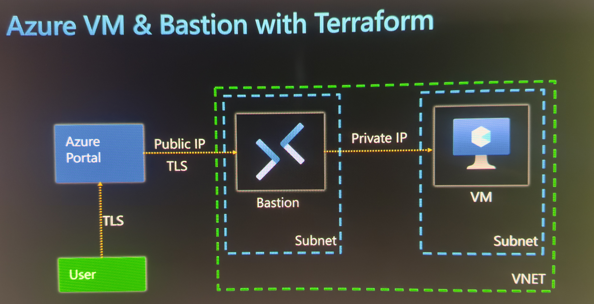

# Azure Bastion + Jumpbox VM (AZ-104)

## Overview
Deployed a secure jumpbox access pattern using Azure Bastion — a managed PaaS bastion host — to connect to a VM with **no public IP**, matching the AZ-104 "Deploying Jumpbox environment: Bastion and VM" module.

## What Was Built
- VNet with two subnets:
  - Regular subnet (VM workloads)
  - `AzureBastionSubnet` (reserved name, /26 minimum)
- Azure Bastion resource (Basic SKU) — public IP, deployed via VNet's one-step "Security tab" checkbox
- VM with:
  - No public IP
  - Public inbound ports: **None**
- Connected to VM via **Connect → Bastion** in Portal (browser-based, TLS/HTTPS session)

## Key Concepts
- Bastion is the *only* internet-facing component — hardened and Microsoft-managed
- VM stays fully private; access is relayed internally over the VNet
- Session runs through browser over HTTPS, no RDP client, no VPN, no public IP touched

## Method Used
One-step (VNet creation "Security" tab checkbox) — auto-creates AzureBastionSubnet + Bastion resource together. Also reviewed the two-step method (manual subnet, then separate Bastion resource) for comparison — same end result, more visibility into each dependency.

