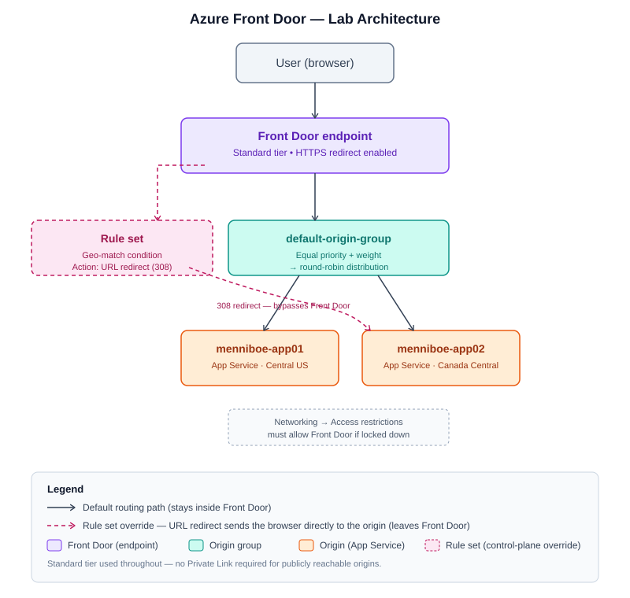

# 🚦 Azure Front Door — Notes & Reference Guide

Reference guide covering the concept, the routing logic, tiers, and rule sets — plus
a full copy-paste redo of the hands-on lab, with every error placed right where it
happened.

## 📑 Contents

- [Acronyms](#-acronyms)
- [1. What Azure Front Door is](#1-what-azure-front-door-is)
- [2. Core components](#2-core-components)
- [3. Routing funnel](#3-routing-funnel-default-routing-logic)
- [4. Tiers & pricing](#4-tiers--pricing)
- [5. Rule sets](#5-rule-sets)
- [6. Hands-on build — full redo guide](#6-hands-on-build--full-redo-guide)
  - [6.1 Prerequisites](#61-prerequisites)
  - [6.2 Create the first App Service](#62-create-the-first-app-service)
  - [6.3 Create the second App Service](#63-create-the-second-app-service-different-region)
  - [6.4 Create Azure Front Door](#64-create-azure-front-door-standard)
  - [6.5 Confirm HTTPS redirect](#65-confirm-https-redirect)
  - [6.6 Add the second origin](#66-add-the-second-origin-round-robin)
  - [6.7 Rule set — geo-match redirect](#67-rule-set--geo-match-redirect)
  - [6.8 Final architecture](#68-final-architecture)
- [7. Deferred — Module 6](#7-deferred--module-6-private-link--aks)

---

## 🔤 Acronyms

| Acronym | Meaning |
|---|---|
| AFD | Azure Front Door |
| L4 / L7 | Layer 4 (transport, TCP/UDP) / Layer 7 (application, HTTP/HTTPS) — OSI model layers |
| WAF | Web Application Firewall |
| CDN | Content Delivery Network |
| FQDN | Fully Qualified Domain Name |
| PLS | Private Link Service (Premium-tier feature — see [Module 6](#7-deferred--module-6-private-link--aks)) |
| SKU | Stock Keeping Unit — Azure's term for a resource's tier/pricing plan |
| TLS | Transport Layer Security (successor to SSL) |
| NSG | Network Security Group |

---

## 1. What Azure Front Door is

Azure has four load-balancing services, differentiated by OSI layer, scope
(regional vs. global), and protocol support:

| Service | Layer | Scope | Protocols |
|---|---|---|---|
| Azure Load Balancer | L4 | Regional | TCP/UDP |
| Application Gateway | L7 | Regional | HTTP/HTTPS |
| Traffic Manager | DNS-based | Global | Any (DNS redirect only) |
| **Front Door** | **L7** | **Global** | **HTTP/HTTPS** |

Front Door is the only one that's both **global** and **Layer 7** — it understands
URLs, headers, and cookies, and it's deployed across Microsoft's edge network
worldwide. It optionally bundles **CDN** (caching/acceleration) and **WAF**
(security) on top.

**When to reach for each:**

- Regional, TCP-only, no HTTP awareness needed → **Load Balancer**
- Regional, need path-based routing / HTTP logic → **Application Gateway**
- Global, need a single HTTP entry point in front of multiple regions, with WAF and
  custom routing rules → **Front Door**
- Global, but only need DNS-level redirection, no L7 features → **Traffic Manager**

---

## 2. Core components

```
User → Front Door endpoint → Origin group → Origin
                ↑                    ↑
            Rule set            Health probes
        (overrides routing)   (gates which origins
                                are eligible)
```

| Component | What it does |
|---|---|
| **Front Door endpoint** | The public FQDN (`*.azurefd.net`) users connect to |
| **Origin group** | A logical bucket of one or more origins |
| **Origin** | One actual backend — App Service, VM, storage, AKS, on-prem, anything reachable. Origins in the same group can span regions or even clouds |
| **Health probes** | Continuously check each origin (HTTP HEAD/GET); unhealthy origins are removed automatically |
| **Rule set** | Optional override layer — custom conditions + actions that take priority over the default routing decision |

> [!NOTE]
> If every origin in a group is unhealthy, Front Door has nothing to route to and
> returns an error — there's no queuing or silent fallback.

---

## 3. Routing funnel (default routing logic)

When multiple origins are healthy, Front Door narrows down to one, in this order:

1. **Health probes** — drop unhealthy origins
2. **Priority** — keep only the highest-priority tier among healthy origins (lowest
   number = highest importance). Lower tiers get **zero** traffic unless every
   origin above them is unhealthy → this is the active-passive / failover pattern
3. **Latency sensitivity** — drop any remaining origin whose response time is more
   than the configured sensitivity window slower than the fastest one
4. **Weight** — remaining origins split traffic proportionally by weight, not
   equally by default. Equal weights → round-robin
5. **Session affinity** *(optional, off by default)* — pins a user to the same
   origin for the rest of their session, overriding the per-request decision above

> [!TIP]
> **Worked example:** 4 origins A, B, D, F. F is down (dropped by health probes).
> A, B, D share priority 1 (kept). Response times: A=15ms, B=30ms, D=60ms, with a
> 30ms latency sensitivity window → D is dropped (60ms is more than 30ms slower
> than A). A (weight 5) and B (weight 8) remain → 5 of every 13 requests go to A,
> 8 of every 13 go to B.
>
> **A/B testing pattern:** same priority + a weight ratio (e.g. 1:9) = both
> versions live simultaneously in the split you want.
> **Failover pattern:** different priority tiers = 100% to the primary until it's
> unhealthy, then all traffic shifts to the backup.

---

## 4. Tiers & pricing

Originally three separate legacy services (Front Door Classic, Azure CDN Classic,
Azure WAF Classic) were unified in 2022 into two tiers:

| | Standard | Premium |
|---|---|---|
| Global L7 routing, CDN, core WAF | ✅ | ✅ |
| Advanced WAF (bot protection, threat reports) | ❌ | ✅ |
| Private Link (reach origins with **no public endpoint**) | ❌ | ✅ |

> [!IMPORTANT]
> **Decision rule** (for the exam and for real deployments): if the origin has no
> public endpoint at all (e.g. a private AKS service, internal load balancer only),
> **Premium is required** — that's the one hard requirement, not the price
> difference. Classic is legacy and not recommended for new deployments.

**Pricing structure** (figures change over time/region — know the *shape*, not
exact numbers): a tier base fee, plus data-transfer charges for most of the path.
The one free leg is **origin → edge** (data leaving your app toward Front Door).
Client → edge and edge → client (outbound) are billed.

---

## 5. Rule sets

A rule set is **condition → action**, evaluated only for matching traffic —
anything that doesn't match falls through to the normal routing funnel above.

**Conditions include:** remote address (IP match or geo-match), URL path, request
headers, cookies, HTTP method, device type, and more.

**Actions include:**

| Action | Behavior |
|---|---|
| **URL redirect** | Sends the *browser* a new URL (e.g. 308). Browser connects **directly** to the destination — bypasses Front Door entirely for that request |
| **URL rewrite** | Changes the path/query forwarded to the origin; request still goes through Front Door normally |
| **Route / origin-group override** | Sends matching traffic to a different origin group, entirely inside Front Door — no browser-visible redirect |
| **Modify request/response header** | Add, change, or remove headers |

> [!WARNING]
> **The one real gotcha:** if an origin's access restrictions are locked to "Front
> Door only," a **redirect** action to that origin will 403 — the browser is now
> hitting the origin directly, which it doesn't trust. Route/origin-group override
> avoids this since the request never leaves Front Door's path. (Our lab's origins
> had no access restrictions, so this didn't surface — but check this first if a
> redirect-based rule ever 403s in a real deployment.)

---

## 6. Hands-on build — full redo guide

Standard tier, two Linux App Services (Central US + Canada Central) behind one
Front Door profile, HTTPS redirect, and a geo-match rule set. No Private Link
(that's [Module 6](#7-deferred--module-6-private-link--aks), deferred).

### 6.1 Prerequisites

- An Azure subscription
- *(First time only)* the `Microsoft.Cdn` resource provider must be registered —
  see the inline fix in [6.4](#64-create-azure-front-door-standard) if you hit the error

### 6.2 Create the first App Service

**Portal → App Services → Create → Web App**

| Field | Value |
|---|---|
| Resource group | New — e.g. `rg-fd-demo` |
| Name | `<yourprefix>-app01` (unique) |
| Publish | Docker Container |
| Operating System | Linux |
| Region | e.g. Central US |
| Pricing plan | Basic B1 |

**Database tab:** skip — this app has no persistent data.

**Container tab:**

| Field | Value |
|---|---|
| Container type | Single Container |
| Image source | Other container registries |
| Access type | Public |
| Registry server URL | `docker.io` |
| Image and tag | `jelledruyts/inspectorgadget:latest` |
| Startup command | *(leave blank)* |

> [!WARNING]
> **Error hit here:** the image `alexeiled/inspector-gadget` (a name suggested
> mid-session) **does not exist** on Docker Hub. Deploying it produced repeated
> `ImageNotFoundFailure` cold-start-block cycles in the log stream:
> ```
> LastError: ImageNotFoundFailure ... Failed to pull image:
> docker.io/alexeiled/inspector-gadget:latest. Image pull failed because the
> image was not found.
> ```
> **Fix:** the correct image is `jelledruyts/inspectorgadget` (no hyphen, Docker
> Hub user `jelledruyts`). App Service → **Deployment Center** (or **Container
> settings**) → update **Image and tag** → `jelledruyts/inspectorgadget:latest` →
> **Save**. Wait 1–2 minutes for the corrected pull.

Skip **Networking** (defaults are fine) → **Review + create** → validate → **Create**.

> [!NOTE]
> You may see *"Basic authentication for this app is currently disabled and may
> impact deployments."* This only affects FTP/Git-based deployment credentials —
> irrelevant here since we're pulling a public image directly. Safe to ignore.

**Verify:** App Service → **Overview** → copy the **Default domain** → open it in
a browser.

> [!WARNING]
> **Transient state:** a fresh container deploy often shows `503 Service
> Unavailable` for the first 2–3 minutes while the image pulls. Check
> **Monitoring → Log stream** for pull progress if it persists past ~5 minutes.
> Resolves on its own once the image is correct.

✅ **Expect:** the Inspector Gadget page loads — request headers, environment info,
host IP, etc.

`[screenshot: app01-inspector-gadget-loaded.png]`

### 6.3 Create the second App Service (different region)

Repeat [6.2](#62-create-the-first-app-service) with:

| Field | Value |
|---|---|
| Name | `<yourprefix>-app02` |
| Region | A **different** region than app01 — e.g. Canada Central |
| Container image | Same: `jelledruyts/inspectorgadget:latest` on `docker.io` |

Verify the same way — its own `.azurewebsites.net` URL should load Inspector
Gadget directly.

### 6.4 Create Azure Front Door (Standard)

**Portal → Front Door and CDN profiles → Create → Azure Front Door → Quick Create**

| Field | Value |
|---|---|
| Resource group | Same as the App Services |
| Tier | **Standard** |
| Front Door name | e.g. `<yourprefix>-fd-demo` |
| Endpoint name | e.g. `<yourprefix>-endpoint` (Azure appends a random suffix + `.z01.azurefd.net`) |
| Origin type | Azure App Service |
| Origin host name | Select `app01` from the dropdown |
| Caching | Disabled |
| WAF policy | None (not needed for this lab) |

**Review + create** → validate → **Create**.

> [!WARNING]
> **Error hit here:** *"Microsoft.Cdn is not registered for the subscription."*
> **Fix:** Portal → **Subscriptions** → select the subscription → **Settings →
> Resource providers** → search `Microsoft.Cdn` → select it → **Register** → wait
> ~30–60 seconds for status to flip to **Registered** → retry Front Door creation.

> [!NOTE]
> Front Door config changes propagate across its global edge network and can take
> **up to 15 minutes** (up to **30 minutes** for back-to-back changes). Don't
> assume something's broken if the endpoint doesn't respond immediately — wait and
> retry before troubleshooting further.

Quick Create auto-provisions: `default-origin-group`, the `app01` origin,
`default-route`, and the public endpoint.

**Verify:** open `https://<endpoint>.z01.azurefd.net` in a browser.

`[screenshot: front-door-endpoint-loaded.png]`

Confirm traffic actually passed through Front Door (not the App Service directly)
by checking the response's HTTP headers for:

- **`X-Azure-FDID`** — Front Door's instance ID, only present when routed through AFD
- **`X-Forwarded-Host`** — shows the Front Door endpoint's hostname, proving the
  browser's original request targeted Front Door

### 6.5 Confirm HTTPS redirect

**Front Door Manager → Routes → default-route**

Check: **Accepted protocols** = HTTP and HTTPS, and **"Redirect all traffic to use
HTTPS"** is enabled. (Quick Create often enables this by default — nothing to
change if it's already on.)

**Verify:** visit `http://<endpoint>.z01.azurefd.net` (note `http://`) — the
browser should auto-switch to `https://` in the address bar.

### 6.6 Add the second origin (round-robin)

**Front Door Manager → Origin groups → default-origin-group → Add an origin**

| Field | Value |
|---|---|
| Name | `app02-origin` |
| Origin type | Azure App Service |
| Host name | Select `app02` from the dropdown |
| Priority | 1 (same as app01 — same failover tier) |
| Weight | 1000 (same as app01 — even 50/50 split) |

**Add** → **Update** on the origin group.

**Verify round-robin — browser test (unreliable, see below):** refresh the Front
Door endpoint repeatedly and check which origin served each request.

> [!WARNING]
> **Issue hit here:** hard refreshes in the browser looked "stuck" on one origin —
> no visible alternation.
> **Why:** browsers persist HTTP/2 connections aggressively, so a handful of quick
> refreshes often reuse the same backend connection instead of triggering a fresh
> routing decision each time.
> **Fix:** use `curl` with a forced fresh connection instead (see `commands.md`).
> Testing that way over 6 requests showed a 4:2 split across both origins —
> genuine round-robin for equal weight (not strictly alternating, since Front
> Door's edge POPs don't share one single global counter, but it correctly
> distributes over enough requests).

`[screenshot: curl-round-robin-output.png]`

### 6.7 Rule set — geo-match redirect

**Front Door Manager → Rule sets → Add a rule set**

| Field | Value |
|---|---|
| Name | e.g. `ruleset-geo-test` |
| Condition | Remote address |
| Operator | Geo Match |
| Value | Your country (must include wherever you're actually testing from) |
| Action | URL redirect |
| Redirect type | Permanent redirect (308) |
| Redirect protocol | Match request |
| Destination host | The **target origin's own** `.azurewebsites.net` hostname (e.g. app02's) |
| Destination path / query string / fragment | *(leave blank — preserves the original request)* |

Save the rule → rule set's **⋮ menu → Associate a route** → select the endpoint +
`default-route` → **Associate**.

> [!WARNING]
> **Timing issue hit here:** after editing **Destination host** post-creation (a
> "back-to-back" change), the redirect didn't fire for ~15–20 minutes even though
> the condition, action, and route association were all correct. Resolved on its
> own — a propagation delay, consistent with the note in
> [6.4](#64-create-azure-front-door-standard).

**Verify:** visit the Front Door endpoint again. If your geo-match condition
matches your actual location, the browser's **address bar itself changes** to the
destination origin's raw `.azurewebsites.net` URL — proof this is a real
browser-level redirect (unlike everything else in this lab, where the address bar
always stayed on the Front Door endpoint).

`[screenshot: rule-set-redirect-address-bar.png]`

> [!TIP]
> **For real deployments:** if the destination origin has access restrictions
> locked to "Front Door only," this redirect will 403, since the browser now hits
> the origin directly. Use a route/origin-group override action instead if that's
> a concern.

### 6.8 Final architecture



Endpoint → origin group → both origins (solid path), plus the rule set's redirect
path that bypasses Front Door entirely (dashed path).

---

## 7. Deferred — Module 6: Private Link + AKS

Not built this session. Requires:

- A separate AKS cluster with its own VNet/subnet
- A Kubernetes service with `service.beta.kubernetes.io/azure-load-balancer-internal`
  and PLS-creation annotations, to get an internal load balancer + Private Link Service
- A **Premium**-tier Front Door origin with Private Link enabled, pointing at the
  internal load balancer's private IP, plus manual approval of the resulting
  private endpoint connection

Treat as its own dedicated lab session given the AKS cluster overhead.