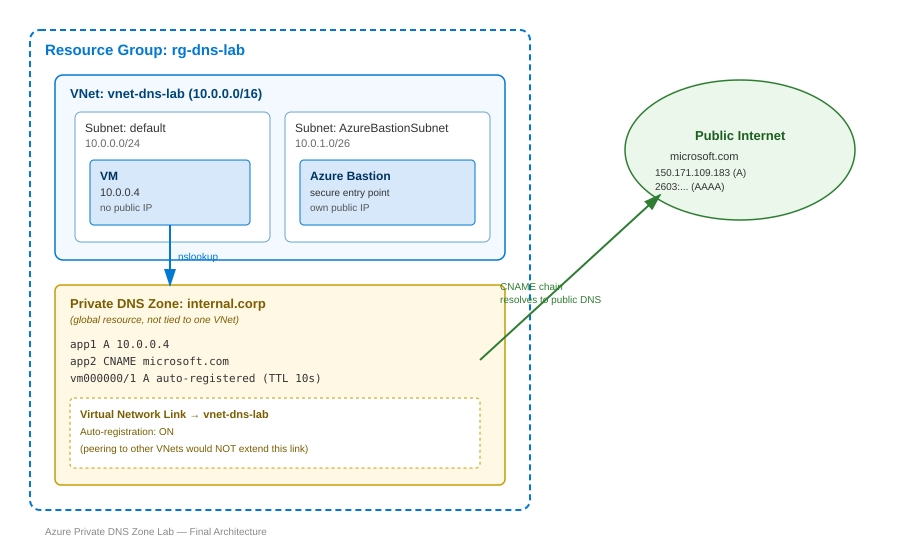

# Azure Private DNS Zone — Study & Lab Notes

## Table of Contents
1. [Core Concept](#1-core-concept)
2. [Domain Naming Rules](#2-domain-naming-rules)
3. [Record Types A vs CNAME](#3-record-types-a-vs-cname)
4. [VNet Linking and Auto Registration](#4-vnet-linking-and-auto-registration)
5. [AWS Anchor Summary](#5-aws-anchor-summary)
6. [Acronyms](#6-acronyms)
7. [Hands On Lab Redo Guide](#7-hands-on-lab-redo-guide)
   - [Step 1: Resource Group and VNet](#step-1-resource-group-and-vnet)
   - [Step 2: VM and Bastion](#step-2-vm-and-bastion)
   - [Step 3: Private DNS Zone and VNet Link](#step-3-private-dns-zone-and-vnet-link)
   - [Step 4: Add Records](#step-4-add-records)
   - [Step 5: Test Resolution](#step-5-test-resolution)
8. [Final Architecture Diagram](#8-final-architecture-diagram)
9. [Key Takeaways and Exam Notes](#9-key-takeaways-and-exam-notes)

---

## 1. Core Concept

A **Private DNS Zone** resolves domain names *only* for VMs inside VNets it's explicitly linked to — it is invisible from the public internet, unlike a Public DNS Zone.

**Resolution flow:**
1. Create a Private DNS Zone (e.g. `internal.corp`) in a resource group.
2. Add records inside it (e.g. `app1` → `10.0.0.100`).
3. Link the zone to a VNet via a **Virtual Network Link**.
4. A VM inside that linked VNet runs `nslookup app1.internal.corp` → Azure's internal DNS resolver checks the linked zone → returns `10.0.0.100`.
5. A VM outside that VNet gets nothing — the zone doesn't exist for it.

> [!NOTE]
> A Private DNS Zone can still resolve **public** names too (used later for `app2` → `microsoft.com`). It handles your internal names and falls through to public DNS for anything it doesn't own — this is split-horizon DNS behavior.

---

## 2. Domain Naming Rules

You can name a zone almost anything, **except** a specific list of domains reserved by Azure's own platform services:

| Blocked domain | Why |
|---|---|
| `azure.com` | Reserved Azure platform domain |
| `windows.net` | Reserved Azure platform domain |
| `microsoft.com` | Reserved Microsoft domain |
| `trafficmanager.net` | Used internally by Traffic Manager |
| `core.windows.net` | Used internally by Storage/other services |

> [!WARNING]
> Creating a zone with one of these names would shadow the real Azure platform domain for any VM in the linked VNet, silently breaking things like storage account or Traffic Manager resolution — that's why Azure blocks it outright.

---

## 3. Record Types: A vs CNAME

| | A record | CNAME record |
|---|---|---|
| Points to | A fixed **IP address** | Another **domain name** |
| Behavior if target changes | Frozen — stays at the old IP until manually edited | Auto-follows — re-resolves through the chain at query time |
| Example from lab | `app1` → `10.0.0.4` | `app2` → `microsoft.com` |

Also available in the same zone: **MX** (mail routing) and **TXT** (arbitrary text, commonly domain-ownership verification) — not used in this lab, but same zone, different purpose.

> [!IMPORTANT]
> In AWS Route 53, a plain CNAME **cannot** be used at the zone apex (root domain) — only AWS's proprietary **Alias record** can. Azure doesn't have this restriction. Good exam gotcha to remember when switching between clouds.

---

## 4. VNet Linking and Auto Registration

- Creating a Private DNS Zone alone does nothing — **no VM can query it** until a **Virtual Network Link** ties the zone to a specific VNet.
- One zone can have **multiple** VNet Links (serve several VNets from one zone).
- **Auto-registration** (optional, set on the link): Azure automatically creates/updates an A record for every VM in that VNet, keyed to its hostname, using a short TTL (10s in this lab) so it updates fast if the VM's IP changes.

> [!WARNING]
> **VNet Peering does NOT automatically share DNS zone links.** Peering only handles routing (IP reachability) — it says nothing about DNS. If VNet-A has a zone linked and VNet-B is peered to VNet-A, a VM in VNet-B still cannot resolve that zone unless you add a *separate, explicit* VNet Link for VNet-B. This is a common exam trap.

---

## 5. AWS Anchor Summary

| Azure | AWS | Role |
|---|---|---|
| Private DNS Zone | Route 53 **Private Hosted Zone** | Isolated, non-internet-facing lookup table |
| Public DNS Zone | Route 53 **Public Hosted Zone** | Internet-facing, resolvable by anyone |
| Virtual Network Link | **VPC Association** | Grants a VPC/VNet permission to query the zone |
| Azure DNS resolver (`168.63.129.16`) | Route 53 Resolver (`.2` address in VPC CIDR) | Internal resolver instances actually query |
| Auto-registration | *No built-in equivalent* | Closest AWS option is **AWS Cloud Map** (Service Discovery) |

> [!NOTE]
> Cross-account VPC association in AWS requires an extra authorization step (`create-vpc-association-authorization` + `associate-vpc-with-hosted-zone`). Azure's cross-subscription VNet linking is simpler — just supply the VNet's resource ID, given the right RBAC permissions.

---

## 6. Acronyms

| Acronym | Meaning |
|---|---|
| DNS | Domain Name System |
| VNet | Virtual Network |
| VM | Virtual Machine |
| RG | Resource Group |
| IP | Internet Protocol (address) |
| TTL | Time To Live (how long a record is cached before re-querying) |
| SOA | Start of Authority (the zone's core administrative record) |
| A | Address record (IPv4) |
| AAAA | Address record (IPv6) |
| CNAME | Canonical Name record (alias to another name) |
| MX | Mail Exchange record |
| TXT | Text record |
| FQDN | Fully Qualified Domain Name |
| VPC | Virtual Private Cloud (AWS's VNet equivalent) |

---

## 7. Hands-On Lab: Redo Guide

No Portal validation errors occurred during this session — every step below passed validation on the first attempt.

### Step 1: Resource Group and VNet

1. Create a **Resource Group**: `rg-dns-lab`
2. Create a **Virtual Network** in that RG:
   - Name: `vnet-dns-lab`
   - Address space: `10.0.0.0/16`
   - Subnets:
     - `default` → `10.0.0.0/24`
     - `AzureBastionSubnet` → `10.0.1.0/26`

> [!IMPORTANT]
> The Bastion subnet name must be **exactly** `AzureBastionSubnet` (case-sensitive) and at least `/26` — Azure won't recognize it for Bastion otherwise.


### Step 2: VM and Bastion

1. Create a **Virtual Machine** in `rg-dns-lab`:
   - VNet: `vnet-dns-lab`, subnet: `default`
   - Size: `Standard_B1s` (small — just for `nslookup` testing)
   - OS: Linux (Ubuntu) — gives native `nslookup`
   - Public IP: **None**
   - Set a username/password for Bastion login
2. Create the **Bastion** resource:
   - Search "Bastion" → Create
   - VNet: `vnet-dns-lab` (auto-detects `AzureBastionSubnet`)
   - Public IP: create new
   - SKU: Standard

> [!TIP]
> The VM does **not** need a public IP — Bastion is the entry point and needs its own public IP instead. Bastion provisioning typically takes 5–10 minutes.


### Step 3: Private DNS Zone and VNet Link

1. Search **"Private DNS zone"** (not the plain "DNS zone" option, which is public-facing).
2. Create in `rg-dns-lab`:
   - Name: `internal.corp`
   - VNet link (available directly in the newer creation wizard): `vnet-dns-lab`

> [!TIP]
> The current Portal wizard lets you attach the Virtual Network Link **during zone creation**, instead of needing a separate step afterward via the "Virtual network links" blade. Validation screen confirmed: `0 record sets`, `1 virtual network link(s)` before hitting Create.

> [!NOTE]
> Auto-registration defaulted to **ON** in this wizard flow — confirmed afterward by seeing auto-created `vm000000` / `vm000001` A records with TTL `10` in the Record sets list.


### Step 4: Add Records

In the zone's **Record sets** blade → **+ Add**:

| Name | Type | TTL | Value |
|---|---|---|---|
| `app1` | A | 3600 | `10.0.0.4` |
| `app2` | CNAME | 3600 | `microsoft.com` |


### Step 5: Test Resolution

Connect to the VM via **Bastion**, then run:

```bash
nslookup app1.internal.corp
```
```
Server:  127.0.0.53
Address: 127.0.0.53#53
Non-authoritative answer:
Name:    app1.internal.corp
Address: 10.0.0.4
```

```bash
nslookup app2.internal.corp
```
```
Server:  127.0.0.53
Address: 127.0.0.53#53
Non-authoritative answer:
app2.internal.corp     canonical name = microsoft.com.
Name:    microsoft.com
Address: 150.171.109.183
Name:    microsoft.com
Address: 2603:1061:14:b6::1
```

> [!NOTE]
> `app2` shows the `canonical name =` line first, then resolves to `microsoft.com`'s own addresses — both an A (`150.171.109.183`) and an AAAA (IPv6) — because the CNAME just points at a name and lets *that* name's own records answer. The CNAME itself doesn't care what record types the target publishes.


---

## 8. Final Architecture Diagram



The diagram shows: `rg-dns-lab` containing `vnet-dns-lab` (with `default` and `AzureBastionSubnet` subnets holding the VM and Bastion), the `internal.corp` Private DNS Zone as a global resource linked to the VNet (auto-registration on), its records (`app1`, `app2`, and the auto-registered VM entries), and the CNAME chain resolving out to `microsoft.com` on the public internet.

---

## 9. Key Takeaways and Exam Notes

- **Peering ≠ DNS sharing** — VNet peering never auto-extends a Private DNS Zone's VNet Link; each VNet needs its own explicit link.
- **Reserved zone names** — can't create a zone matching Azure's own platform domains (`azure.com`, `windows.net`, etc.).
- **A vs CNAME** — A is a frozen IP; CNAME auto-follows its target, at the cost of one extra resolution hop.
- **Auto-registration is Azure-native** — AWS has no built-in equivalent; would need AWS Cloud Map for similar dynamic self-registration.
- **AWS zone-apex quirk** — Route 53 requires an Alias record (not CNAME) at the zone apex; Azure has no such restriction.