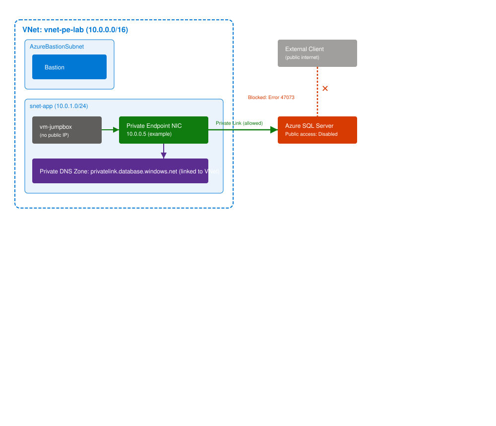

# Azure Private Endpoint — Notes & Redo Guide

## Table of Contents
- [1. Overview](#1-overview)
- [2. Concepts](#2-concepts)
  - [2.1 The Problem & the Concept of Private Endpoint](#21-the-problem--the-concept-of-private-endpoint)
  - [2.2 The DNS Redirect Mechanism](#22-the-dns-redirect-mechanism)
  - [2.3 The Access Control Lifecycle](#23-the-access-control-lifecycle)
  - [2.4 Private Endpoint vs. Private Link Service](#24-private-endpoint-vs-private-link-service)
  - [2.5 Supported Services & the Private Link Center](#25-supported-services--the-private-link-center)
  - [2.6 Subnet Requirements & Connection Approval States](#26-subnet-requirements--connection-approval-states)
- [3. Architecture Diagram](#3-architecture-diagram)
- [4. Hands-On Lab (Redo Guide)](#4-hands-on-lab-redo-guide)
  - [4.1 Prerequisite Infrastructure](#41-prerequisite-infrastructure)
  - [4.2 Azure SQL Server + Database](#42-azure-sql-server--database)
  - [4.3 Testing Public Connectivity](#43-testing-public-connectivity)
  - [4.4 Creating the Private Endpoint](#44-creating-the-private-endpoint)
  - [4.5 Disabling Public Network Access](#45-disabling-public-network-access)
  - [4.6 Verifying Private Access from the Jumpbox](#46-verifying-private-access-from-the-jumpbox)
- [5. Errors & Fixes](#5-errors--fixes)
- [6. Acronyms](#6-acronyms)

---

## 1. Overview

Azure PaaS services (SQL Database, Key Vault, Storage, App Service, etc.) get a **public endpoint** by default — even with firewall rules, the resource still sits on a public IP. **Private Endpoint** solves this by giving the service a private IP inside your own VNet, connected via **Azure Private Link**, so the public path can be disabled entirely.

---

## 2. Concepts

### 2.1 The Problem & the Concept of Private Endpoint

Private Endpoint = a network interface (NIC) with a **private IP from your VNet**, connecting privately over Microsoft's backbone to a PaaS service. Once set up, the public endpoint can be disabled and the resource becomes reachable only from inside the VNet (or peered/connected networks).

> [!TIP]
> **AWS anchor:** This is Azure's version of an **AWS Interface VPC Endpoint (AWS PrivateLink)** — same idea, a private ENI lands in your subnet, traffic never touches the public internet.

**Knowledge check:** *A fintech app's Azure SQL Database must become completely unreachable from the public internet, but still reachable by app VMs inside the VNet.* → **Private Endpoint** (not NSG rules, not Service Endpoint — Service Endpoint still routes over a public IP with VNet-based access control, not full removal).

### 2.2 The DNS Redirect Mechanism

When you enable **"Integrate with private DNS zone"** during Private Endpoint creation:

1. The resource's public FQDN (e.g. `sqlserver.database.windows.net`) gets a **CNAME record** (public DNS) redirecting to a `privatelink` name: `sqlserver.privatelink.database.windows.net`
2. Inside **your own Private DNS Zone** (named `privatelink.database.windows.net`), an **A record** maps that `privatelink` name to the Private Endpoint's private IP

The app's connection string never changes — it always points at the original FQDN, which always redirects. Only clients that can resolve *your* private DNS zone (VMs in the linked VNet) get the private IP back.

> [!IMPORTANT]
> **Gotcha:** Private DNS Zones are **not resolvable from outside Azure/the linked VNet**. If DNS integration is enabled but public access is *not yet* disabled, an external client's `nslookup` will follow the CNAME but hit a dead end — it cannot resolve the `privatelink` name at all.

**Knowledge check:** *An app connects using a storage account's original public FQDN after Private Endpoint + DNS integration is enabled.* → The FQDN gets a **CNAME redirecting to the privatelink FQDN**, which the private zone resolves to the private IP.

### 2.3 The Access Control Lifecycle

Azure SQL's public exposure is controlled by a **service-level firewall** (on the SQL Server resource itself — separate from NSGs):
- **Selected networks** — whitelist specific IPs and/or VNet rules
- **Disabled** — no public path exists at all

**Lifecycle:** whitelist IP → connect publicly → add Private Endpoint → disable public access entirely → only the Private Endpoint path works.

Once disabled, any external connection attempt returns:
```
Error 47073: Reason: An instance-specific error occurred while establishing a connection to SQL Server.
Connection was denied because Deny Public Network Access is set to Yes.
```

> [!TIP]
> **AWS anchor:** SQL's firewall ≈ RDS **Security Group rules**. Disabling public access entirely ≈ setting RDS **"Publicly Accessible" to No** — after that, only VPC-internal (or Private Endpoint) paths work, regardless of firewall rules.

### 2.4 Private Endpoint vs. Private Link Service

| | Private Endpoint | Private Link Service |
|---|---|---|
| Role | Consumer side | Provider side |
| Lives in | The consumer's VNet | Wraps the provider's Standard Load Balancer |
| Use case | Reach a service (Microsoft's, or someone else's) | Expose your own LB-backed service to other VNets/tenants |

> [!TIP]
> **AWS anchor:** Directly parallels **Interface VPC Endpoint** (consumer) vs. **Endpoint Service, built on an NLB** (provider).

**Knowledge check:** *Company A exposes an API behind a Standard Load Balancer; Partner B wants to reach it privately from their own subscription.* → Company A (owns the LB) creates a **Private Link Service**. Partner B creates a **Private Endpoint** in their own VNet — regardless of who initiates the connection, the object type is tied to **which side owns the Load Balancer**.

### 2.5 Supported Services & the Private Link Center

Private Endpoint applies broadly across PaaS: **Key Vault, Storage Accounts, App Service, Container Registry (ACR), Redis Cache, Cosmos DB, Data Factory, PostgreSQL/MySQL, Event Grid, Service Bus, AKS**, and more — same NIC + private IP pattern every time.

**Private Link Center** (Portal search "Private Link") is the single dashboard showing:
- **Private endpoints** tab — everything consumed (your side)
- **Private link services** tab — anything published for others (provider side)

### 2.6 Subnet Requirements & Connection Approval States

- **Subnet requirement:** the Private Endpoint's subnet needs "Private Endpoint Network Policies" configured appropriately (controls whether NSG/UDR rules apply to the endpoint's traffic) — a subnet-level setting, separate from the target resource's own config.
- **Connection approval states:** `Pending → Approved → Rejected → Disconnected`
  - Own-subscription resources (e.g. your own SQL server) → **auto-approved**
  - Someone else's Private Link Service (cross-subscription/tenant) → sits **Pending** until the provider manually approves

---

## 3. Architecture Diagram



Public path (external client → SQL Server) is blocked after Step 4.5. Private path (jumpbox → Private Endpoint NIC → SQL Server, with DNS resolution via the linked Private DNS Zone) is the only route that works.

---

## 4. Hands-On Lab (Redo Guide)

### 4.1 Prerequisite Infrastructure

**Resource Group:** `rg-private-endpoint-lab`

**VNet:** `vnet-pe-lab`
- Address space: `10.0.0.0/16`
- Subnet `snet-app` → `10.0.1.0/24`
- Subnet `AzureBastionSubnet` → `10.0.2.0/24` (name is mandatory, exact)

**Bastion:** `bastion-pe-lab`, Basic SKU, attached to `AzureBastionSubnet`

**Jumpbox VM:** Windows VM `vm-jumpbox`, deployed into `snet-app`, **no public IP** (Bastion-only access)

[SCREENSHOT: VNet address space + subnets overview]
[SCREENSHOT: Bastion deployment confirmation]

### 4.2 Azure SQL Server + Database

**SQL Server creation:**
- Server name: globally unique (e.g. `sql-pelab-<initials><digits>`)
- Admin login: avoid reserved words (`admin`, `sa`, `root`) — e.g. `sqladminuser`
- Password: 12+ chars, mixed case/number/symbol

**Database:**
- Name: `productdb`
- Free offer tier used → **Backup storage redundancy must be set to Locally-redundant (LRS)** — see [Errors & Fixes](#5-errors--fixes)

**Networking (at creation):**
| Setting | Value |
|---|---|
| Allow Azure services and resources to access this server | **No** |
| Add current client IP address | **Yes** |
| Private endpoints | Skip — added manually in 4.4 |
| Connection policy | Default |
| Minimum TLS version | Default (TLS 1.2) |

[SCREENSHOT: SQL Server networking tab at creation]

### 4.3 Testing Public Connectivity

> [!WARNING]
> **Azure Data Studio was retired February 28, 2026.** Microsoft's replacement is **VS Code + the MSSQL extension**.

1. Install VS Code, then the **MSSQL extension** (Extensions panel → search "MSSQL" → install, publisher Microsoft)
2. Open the SQL Server sidebar → **Add Connection**
3. Server name: `<servername>.database.windows.net`
4. Authentication: SQL Login → admin credentials
5. Advanced → search "timeout" → set **Connect Timeout = 60** (see [Errors & Fixes](#5-errors--fixes) for why)
6. Connect, then run:
   ```sql
   SELECT name FROM sys.tables;
   ```
   Expect `(0 rows affected)` — confirms connectivity to an empty `productdb`.

[SCREENSHOT: successful public connection + query result]

### 4.4 Creating the Private Endpoint

**SQL Server → Networking → Private access tab → "+ Private endpoint"**

| Tab | Setting |
|---|---|
| Basics | Resource group: `rg-private-endpoint-lab`; Name: `pe-sql-pelab`; Region: same as VNet |
| Resource | Resource type: `Microsoft.Sql/servers`; Resource: your SQL server; Sub-resource: `sqlServer` |
| Virtual Network | VNet: `vnet-pe-lab`; Subnet: `snet-app`; NIC/IP: default |
| DNS | Integrate with private DNS zone: **Yes** → accept auto-suggested `privatelink.database.windows.net` |

Review + Create. Confirms three new resources: the Private Endpoint, its NIC, and the Private DNS Zone.

**Verify:** Private Endpoint overview should show `Connection status: Approved`, `Request/Response: Auto-approved` (own resource — see [2.6](#26-subnet-requirements--connection-approval-states)).

[SCREENSHOT: Private Endpoint creation — DNS tab]
[SCREENSHOT: Private Endpoint overview showing Approved/Auto-approved]

### 4.5 Disabling Public Network Access

**SQL Server → Networking → Public access tab → Public network access: Disabled → Save**

Confirm lockdown: retry the public connection from Step 4.3 (from your local machine) — expect:
```
Error 47073: Deny Public Network Access is set to Yes.
```

### 4.6 Verifying Private Access from the Jumpbox

1. Connect to `vm-jumpbox` via **Bastion**
2. Run:
   ```powershell
   nslookup <sql-server-name>.database.windows.net
   ```
   Expect: resolves via `168.63.129.16` (Azure's internal DNS), aliases to `<server>.privatelink.database.windows.net`, resolves to a private IP (e.g. `10.0.0.5`).

3. **Jumpbox has no outbound internet access** (no public IP, no NAT Gateway) — installers like VS Code or winget won't work. Instead, use the built-in .NET SqlClient via PowerShell:
   ```powershell
   $connString = "Server=tcp:<server>.database.windows.net,1433;Database=productdb;User ID=<user>;Password=<password>;Encrypt=True;Connection Timeout=60;"
   $conn = New-Object System.Data.SqlClient.SqlConnection($connString)
   $conn.Open()
   Write-Host "Connected! Server:" $conn.DataSource
   $cmd = $conn.CreateCommand()
   $cmd.CommandText = "SELECT name FROM sys.tables"
   $reader = $cmd.ExecuteReader()
   while ($reader.Read()) { Write-Host $reader[0] }
   $conn.Close()
   ```
   Expect `Connected! Server: tcp:<server>.database.windows.net,1433` with no table rows printed (empty DB) — full proof of private connectivity, zero internet dependency.

[SCREENSHOT: nslookup output from jumpbox]
[SCREENSHOT: PowerShell SqlClient "Connected!" output]

> [!IMPORTANT]
> Never paste real passwords into chat/AI tools, even for disposable lab resources — good habit to build even when the credentials don't matter long-term.

---

## 5. Errors & Fixes

| Error | Cause | Fix |
|---|---|---|
| `ProvisioningDisabled: Only local backup storage redundancy is allowed for Free Limit database with auto pause exhaustion behavior` | Free offer database defaulted to non-LRS backup redundancy | Set **Backup storage redundancy → Locally-redundant (LRS)** during database creation |
| `Connection Timeout Expired` (`Post-Login complete=29350`ms) | Serverless Free-offer database was **auto-paused**; resume takes 30–90s, default client timeout (~30s) expired first | Retry the connection (wakes the DB), and/or set **Connect Timeout = 60+** in the client |
| Azure Data Studio unavailable/not installable | **Retired February 28, 2026** | Use **VS Code + MSSQL extension** instead — same workflow |
| `sqlcmd: command not found` | Not installed by default on Windows Server | `winget install sqlcmd` — or skip entirely and use PowerShell's built-in `System.Data.SqlClient` |
| `winget install sqlcmd` → "Failed when opening source(s)" | Winget source registration flaky on fresh Azure VMs; also VM has no outbound internet by design | Don't fight it — use built-in `System.Data.SqlClient` via PowerShell instead (no install needed) |
| Jumpbox can't reach `code.visualstudio.com` (`ERR_CONNECTION_TIMED_OUT`) | Jumpbox has no public IP and no outbound internet route (Bastion is inbound-only) — this is expected/secure by design | Use PowerShell's built-in SqlClient instead of installing anything |
| `Error 47073: Deny Public Network Access is set to Yes` | **Expected** — occurs after disabling public access, confirms lockdown worked | N/A — this is the success condition for Step 4.5 |

---

## 6. Acronyms

| Acronym | Meaning |
|---|---|
| PaaS | Platform as a Service |
| NIC | Network Interface Card |
| VNet | Virtual Network |
| FQDN | Fully Qualified Domain Name |
| CNAME | Canonical Name (DNS record type — alias to another name) |
| A record | DNS "Address" record — maps a name directly to an IP |
| NSG | Network Security Group |
| DTU | Database Transaction Unit (SQL DB pricing/performance model) |
| vCore | Virtual Core (SQL DB pricing/performance model) |
| LRS | Locally-Redundant Storage |
| ACR | Azure Container Registry |
| AKS | Azure Kubernetes Service |
| TLS | Transport Layer Security |
| ADS | Azure Data Studio (retired Feb 2026) |