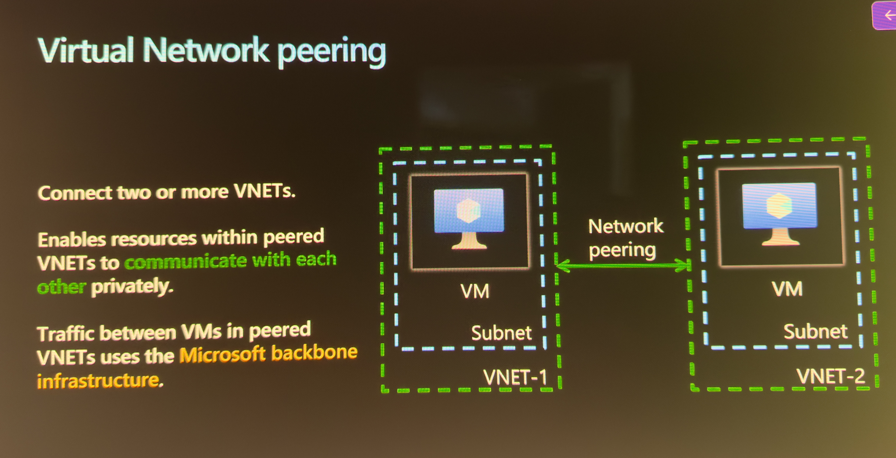
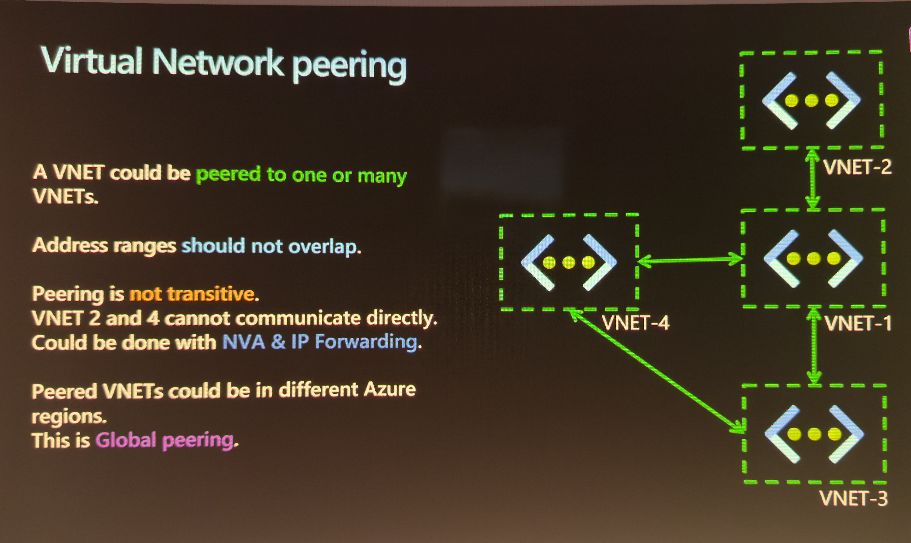
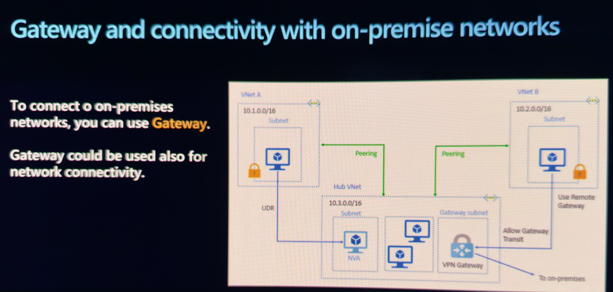
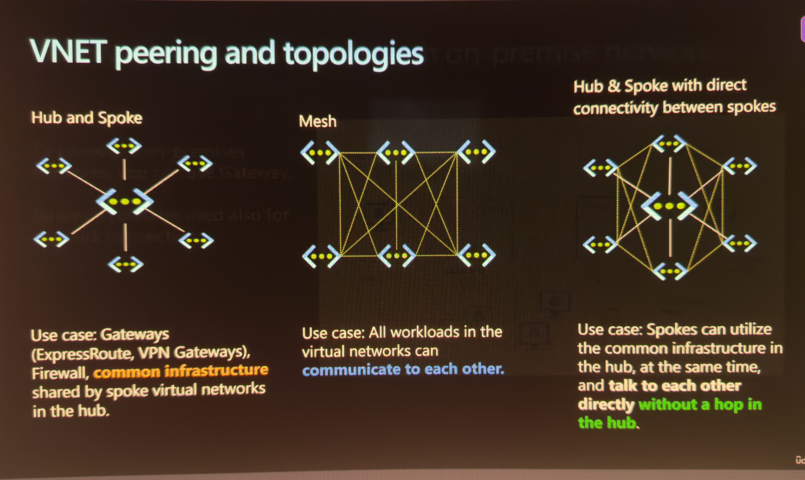

# AZ-104 Notes: VNet Peering & Network Topologies

## 1. What is VNet Peering?
Connects two Azure Virtual Networks so resources communicate using **private IP addresses** — traffic never touches the public internet, it stays on Microsoft's private backbone.

**Analogy:** Two company buildings build a private tunnel between them instead of routing mail through the public postal system.

**Benefits:** lower latency, more secure, no public exposure.

## 2. Prerequisites for Peering
1. Two VNets must already exist (same region or different regions)
2. **Non-overlapping IP address spaces** — this is mandatory. Peering fails if both VNets use the same range (e.g., both `10.0.0.0/16`).

**Analogy:** Two neighborhoods can't share a mail route if they both use identical street addresses.

## 3. Same Region vs. Cross-Region
| | Same Region | Different Regions |
|---|---|---|
| Name | Regular VNet Peering | Global VNet Peering |
| Mechanism | Same — private backbone | Same — private backbone |

For this lab, both VNets were kept in the **same region** for simplicity.

## 4. Network Topology Patterns

### Mesh
Every VNet peers directly with every other VNet — no central hub.
- ✅ Lowest latency (direct connections)
- ❌ Connections grow rapidly as VNets are added (hard to manage/secure centrally)
- **Use case:** Small number of VNets (2–4) needing equally fast direct communication (e.g., tightly-coupled microservices)

### Hub & Spoke (standard)
- One central **Hub** VNet holds shared services (firewall, DNS, VPN gateway)
- Multiple **Spoke** VNets each peer with the Hub only
- Spokes do NOT talk directly to each other by default
- **Use case:** Enterprises with many VNets (Dev/Test/Prod/App) needing centralized security and rarely needing spoke-to-spoke traffic

**Analogy:** Regional airports (spokes) all connect through one main hub airport rather than flying direct to each other.

> Note: Spoke-to-spoke traffic through the Hub requires the Hub to have routing configured to allow it — it is **not automatic**.

### Hybrid (Hub & Spoke + Direct Spoke Connectivity)
- Mostly standard Hub & Spoke
- BUT specific high-traffic spoke pairs also peer **directly** with each other, bypassing the Hub
- **Trade-off:** Faster for that pair, but loses centralized inspection (e.g., bypasses the Hub firewall) for that traffic
- **Use case:** An App spoke and its Database spoke exchanging heavy traffic, while Dev/Prod isolation elsewhere still matters

### Topology Comparison
| | Mesh | Hub & Spoke | Hybrid |
|---|---|---|---|
| Central control | No | Yes | Yes (mostly) |
| Connections for 5 VNets | 10 | 4 | 4 + extras |
| Best for | Small, tightly-coupled sets | Most enterprise setups | Enterprise + high-traffic pairs |

## 5. Gateway Connectivity to On-Premises
To connect Azure to an on-premises datacenter:
- **VPN Gateway** — encrypted tunnel over the public internet
- **ExpressRoute** — private, dedicated line, doesn't touch the public internet (faster/more reliable, costs more)

Gateway is placed in the **Hub** VNet so all Spokes can reach on-prem through a single shared connection, instead of each Spoke needing its own gateway.

**Analogy:** The Hub airport also has the international terminal — all regional airports (spokes) route international travelers (on-prem traffic) through it.

## 6. Hands-On Build

### Step-by-step
1. Created `vnet-hub` — address space `10.0.0.0/16`
2. Created `vnet-spoke` — address space `10.1.0.0/16` (non-overlapping with hub)
3. Went to `vnet-hub` → **Peerings** → **+ Add**
4. Configured **Remote VNet peering settings** (vnet-spoke's perspective):
   - Peering link name: `vnet-hub-to-vnet-spoke`
   - ✅ Allow the peered virtual network to access 'vnet-hub'
   - ⬜ Allow forwarded traffic (no NVA/firewall in this lab)
   - ⬜ Gateway transit options (no gateway in this lab)
5. Configured **Local VNet peering settings** (vnet-hub's perspective):
   - Peering link name: `vnet-spoke-to-vnet-hub`
   - ✅ Allow 'vnet-hub' to access 'vnet-spoke'
   - ⬜ Forwarded traffic / gateway options (unchecked, same reasoning)
6. Clicked Create — verified **Peering status: Connected** under `vnet-hub` → Peerings

> **Key concept:** Peering is bidirectional — each VNet independently controls what it allows in from the other side. That's why both directions need explicit settings even though it's one form.

### Deploying Test VMs
- `vm-hub` deployed inside `vnet-hub` (must land in the peered VNet — landing in a different VNet would make the peering irrelevant to it)
- `vm-spoke` deployed inside `vnet-spoke`
- Same SSH key pair (`adminuser`) used for both VMs

### Validating the Peering
- SSH'd into `vm-hub` using its **public IP**
- Pinged `vm-spoke` using its **private IP** (not public — this is what actually tests the peered private connection)
- Result: 0% packet loss, confirming peering works end-to-end

## 7. Screenshots To Add
- [ ] Screenshot: vnet-hub address space configuration
- [ ] Screenshot: vnet-spoke address space configuration
- [ ] Screenshot: Peering configuration screen (both sides)
- [ ] Screenshot: Peering status = "Connected"
- [ ] Screenshot: Successful ping output from vm-hub to vm-spoke

## 8. Errors / Gotchas
- None encountered this session — clean run. (SSH key permissions were pre-checked with `chmod 400` before connecting, which prevents SSH from rejecting an overly-permissive key file.)

## 9. Cleanup Reminder
Delete in this order to avoid dependency errors:
1. VMs (`vm-hub`, `vm-spoke`)
2. Associated disks/NICs/public IPs (if not auto-deleted with VM)
3. VNets (`vnet-hub`, `vnet-spoke`) — peering is removed automatically when either VNet is deleted
4. Resource Group (if dedicated to this lab)