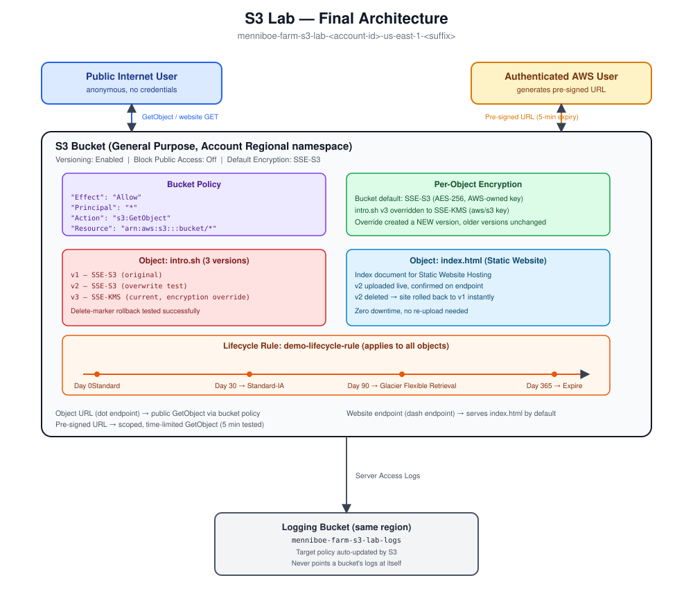

# AWS S3 — Fundamentals to Advanced Notes

Reference guide covering the full AWS SAA S3 exam domain plus a copy-paste redo guide for the hands-on lab.

## Table of Contents

- [Acronym Glossary](#acronym-glossary)
- [Module 1 — Fundamentals: Buckets, Objects, Keys](#module-1--fundamentals-buckets-objects-keys)
- [Module 2 — Security: IAM vs Bucket Policies, Block Public Access, Static Hosting](#module-2--security-iam-vs-bucket-policies-block-public-access-static-hosting)
- [Module 3 — Versioning & MFA Delete](#module-3--versioning--mfa-delete)
- [Module 4 — Replication (CRR / SRR)](#module-4--replication-crr--srr)
- [Module 5 — Storage Classes, Lifecycle Rules, Express One Zone, Requester Pays](#module-5--storage-classes-lifecycle-rules-express-one-zone-requester-pays)
- [Module 6 — Encryption](#module-6--encryption)
- [Module 7 — Event Notifications, EventBridge, Batch Operations](#module-7--event-notifications-eventbridge-batch-operations)
- [Module 8 — Performance & Storage Lens](#module-8--performance--storage-lens)
- [Module 9 — CORS, Pre-signed URLs, Access Logs](#module-9--cors-pre-signed-urls-access-logs)
- [Module 10 — Object Lock, Glacier Vault Lock, Access Points, Object Lambda](#module-10--object-lock-glacier-vault-lock-access-points-object-lambda)
- [Hands-On Lab — Full Redo Guide](#hands-on-lab--full-redo-guide)
  - [Step 1 — Create the Bucket](#step-1--create-the-bucket)
  - [Step 2 — Upload, Overwrite, Roll Back a Version](#step-2--upload-overwrite-roll-back-a-version)
  - [Step 3 — Public Bucket Policy](#step-3--public-bucket-policy)
  - [Step 4 — Static Website Hosting](#step-4--static-website-hosting)
  - [Step 5 — Check and Override Encryption](#step-5--check-and-override-encryption)
  - [Step 6 — Build a Lifecycle Rule](#step-6--build-a-lifecycle-rule)
  - [Step 7 — Pre-Signed URL](#step-7--pre-signed-url)
  - [Step 8 — Server Access Logging](#step-8--server-access-logging)
- [Final Architecture Diagram](#final-architecture-diagram)
- [Exam Cheat Sheet](#exam-cheat-sheet)

---

## Acronym Glossary

| Acronym | Meaning |
|---|---|
| **S3** | Simple Storage Service |
| **IAM** | Identity and Access Management |
| **ARN** | Amazon Resource Name |
| **ACL** | Access Control List |
| **CRR** | Cross-Region Replication |
| **SRR** | Same-Region Replication |
| **SSE** | Server-Side Encryption |
| **SSE-S3** | Server-Side Encryption with Amazon S3-managed keys |
| **SSE-KMS** | Server-Side Encryption with AWS Key Management Service keys |
| **SSE-C** | Server-Side Encryption with Customer-provided keys |
| **DSSE-KMS** | Dual-layer Server-Side Encryption with KMS keys |
| **KMS** | Key Management Service |
| **TLS / SSL** | Transport Layer Security / Secure Sockets Layer (encryption in transit) |
| **CORS** | Cross-Origin Resource Sharing |
| **IA** | Infrequent Access (storage class) |
| **MFA** | Multi-Factor Authentication |
| **WORM** | Write Once, Read Many |
| **CSV** | Comma-Separated Values |
| **SQS** | Simple Queue Service |
| **SNS** | Simple Notification Service |
| **VPC** | Virtual Private Cloud |
| **PII** | Personally Identifiable Information |
| **EC2** | Elastic Compute Cloud |

---

## Module 1 — Fundamentals: Buckets, Objects, Keys

> [!NOTE]
> S3 has **no real directories**. A "folder" you see in the console is just text drawn on screen because multiple object keys share a common starting substring.

**Bucket**
- A region-scoped container. Naming: lowercase letters, numbers, hyphens only — no uppercase, no underscores, can't look like an IP.
- **Global namespace** (legacy): name must be unique across every AWS account on Earth.
- **Account Regional namespace** (current, recommended): AWS appends an account/region suffix, so the same short name is reusable across your own accounts and regions.

**Object / Key**
- Every object has a **key** — its full name inside the bucket, e.g. `docs/2026/report.pdf`.
- The **bucket name** + **key** together form the full address: `s3://bucket-name/key`.
- What looks like a "folder" (`docs/2026/`) is just the prefix portion of the key — there is no separate folder object.
- Deleting a "folder" in the console = S3 listing every key starting with that prefix and deleting them individually — nothing is destroyed as a unit.

**Object size & multi-part upload**
- Max object size: **5 TB**.
- Multi-part upload: **recommended over 100 MB**, **required over 5 GB**. A 5 TB file needs at least 1,000 parts of 5 GB each (max part count: 10,000).

**Azure anchor:** Bucket ≈ Storage Account + Blob container. Same global-uniqueness pain point Azure also has; Account Regional namespace is AWS's newer escape hatch with no Azure equivalent.

---

## Module 2 — Security: IAM vs Bucket Policies, Block Public Access, Static Hosting

**Two places a rule can live**
- **IAM policy** — attached to a user/group/role. User-based.
- **Bucket policy** — attached to the bucket itself. Resource-based. Required for **public access** or **cross-account access**.

**Access decision rule:** Allowed if IAM policy **OR** bucket policy allows it, **AND** no explicit Deny exists anywhere. An explicit Deny always wins.

**Bucket policy anatomy**
```json
{
  "Effect": "Allow",
  "Principal": "*",
  "Action": "s3:GetObject",
  "Resource": "arn:aws:s3:::bucket-name/*"
}
```
> [!IMPORTANT]
> The Resource line needs `/*` after the bucket name. `arn:aws:s3:::bucket-name` (no `/*`) refers to the **bucket itself**, not the objects inside it — `s3:GetObject` will never match without the `/*`.

**Block Public Access**
- An account-level **and** bucket-level ceiling. While it's ON, no bucket policy can make anything public, no matter what the policy says.
- Recommended control for "none of our 300 buckets should ever be public": one account-level switch instead of per-bucket policies.

**Static website hosting**
- Enable at the bucket level, set an **index document** (`index.html`).
- Requires public read access via bucket policy — hosting alone grants nothing.
- Website endpoint uses a **dash** (`s3-website-region`); the plain object endpoint uses a **dot** (`s3.region`). Same bucket, two different doors — the website endpoint serves the index document by default, the object endpoint always requires an exact key.

**Azure anchor:** IAM policy ≈ Azure RBAC role assignment. Bucket policy has no clean RBAC equivalent — closest is container anonymous-access level + SAS tokens. Static website hosting ≈ Azure Storage's static website feature on a Blob container (same two-step: enable + allow public read).

---

## Module 3 — Versioning & MFA Delete

**Versioning**
- Bucket-level setting. Once on, every overwrite of a key creates a new **version** instead of erasing the old one.
- Pre-versioning objects get version ID **`null`** automatically the moment versioning is enabled — no re-upload needed.
- A normal delete (no version ID) never destroys bytes — it adds a **delete marker** on top as the new "current" version. Delete the marker, and the object reappears.
- A **permanent delete** (targeting a specific version ID) is the only truly destructive, irreversible action.
- Versioning can be **suspended**, never fully disabled — existing versions are never deleted by suspending.

**MFA Delete**
- Adds a second lock on top of versioning for two destructive actions only: **permanently deleting a version** and **suspending versioning**.
- Requires the **root account's** MFA device — cannot be delegated to an IAM user.
- Can **only** be enabled/disabled via **CLI/API** — the console shows status but the toggle is greyed out.
- Does **not** apply to normal deletes or listing versions.

> [!WARNING]
> MFA Delete needing root credentials means you should not be logged in as root routinely — only for this specific, occasional operation.

**Azure anchor:** Versioning ≈ Azure Blob versioning (same mechanics). MFA Delete has no clean Azure equivalent — closest is a resource lock (`CanNotDelete`) + soft-delete, but neither requires a live MFA code at delete time.

---

## Module 4 — Replication (CRR / SRR)

- **CRR** = source and destination buckets in **different** regions.
- **SRR** = source and destination in the **same** region.
- **Requirement:** versioning must be enabled on **both** source and destination — no versioning, no replication.
- Needs an **IAM role** granting S3 read (source) and write (destination) permission.
- Source and destination **can** be in different AWS accounts.
- Replication is **not retroactive** — only objects uploaded after the rule is created replicate. Backfilling history requires **S3 Batch Replication**.
- **No chaining**: Bucket A → Bucket B → Bucket C does not carry A's objects through to C.
- **Delete markers** replicate only if explicitly enabled (default off).
- **Permanent deletes never replicate**, by design — this is what makes replication a real ransomware-protection pattern: an attacker's permanent delete against the source never reaches the backup copy.

**Azure anchor:** Azure Storage object replication — same shape: async, requires blob versioning on both accounts, only replicates new writes going forward.

---

## Module 5 — Storage Classes, Lifecycle Rules, Express One Zone, Requester Pays

**Durability vs. Availability**
- **Durability** = will the bytes ever be lost? **11 nines (99.999999999%)** — the same across every class.
- **Availability** = will the service respond right now? This **does** vary by class (Standard 99.99%, One Zone-IA 99.5%, etc.) because fewer AZs = lower availability, not lower durability.

**Decision chain for picking a class**
1. Is the object recreatable? No → rules out One Zone classes.
2. How fast might it need to come back? Instant → Standard / Standard-IA / Glacier Instant Retrieval. Minutes–hours OK → Glacier Flexible Retrieval. Never in a hurry → Glacier Deep Archive.
3. How often is it actually accessed (by the system, not by end users)? Frequent → Standard. Infrequent → everything else.

| Class | Availability | Min. duration | Retrieval |
|---|---|---|---|
| Standard | 99.99% | none | instant |
| Standard-IA | 99.9% | 30 days | instant |
| One Zone-IA | 99.5% | 30 days | instant |
| Intelligent-Tiering | varies (auto) | none | instant |
| Glacier Instant Retrieval | — | 90 days | milliseconds |
| Glacier Flexible Retrieval | — | 90 days | minutes–hours |
| Glacier Deep Archive | — | 180 days | 12–48 hours |

**Intelligent-Tiering** — use when the access pattern is unknown or shifting. S3 auto-moves objects between tiers for a small monitoring fee, no retrieval charges.

**Lifecycle rules** — use when the pattern is known and fixed. Automate **transitions** (move to a cheaper class after N days) and **expirations** (delete after N days), filterable by prefix or tag, separately for current vs. non-current versions.

**S3 Express One Zone**
- A different bucket type ("directory bucket"), confined to **one AZ**, built for extreme low latency (single-digit ms) by co-locating storage with compute.
- ~10x Standard's performance, ~50% lower cost than Standard — this is a **performance** tier, not a cost-savings tier.

**Requester Pays**
- Downloader pays data-transfer cost; owner still pays storage.
- Requester **must be authenticated** — cannot work for anonymous/public requests, since AWS needs someone to bill.

**Azure anchor:** Storage tiers ≈ Hot/Cool/Cold/Archive. No Azure equivalent to Intelligent-Tiering's full automation or to Express One Zone's AZ-compute co-location. Requester Pays has no standard Azure equivalent — Azure bills egress to the account owner by default.

---

## Module 6 — Encryption

| Method | Who holds the key | S3 performs encryption? | Console-configurable? |
|---|---|---|---|
| **SSE-S3** | AWS (S3-owned, invisible) | Yes | Yes (default) |
| **SSE-KMS** | AWS KMS (you can manage it) | Yes | Yes |
| **SSE-C** | You, sent per-request | Yes (discards key after) | No — CLI/SDK only |
| **Client-side** | You, entirely outside AWS | No — S3 never knows | No — not an S3 concept |

- **SSE-S3**: AES-256, on by default for every new bucket/object since 2023. No key management for you at all.
- **SSE-KMS**: gives audit logging (CloudTrail) and independent revocation via the KMS key. **Two permissions required to read an object**: S3 access to the object *and* KMS access to the key. KMS enforces its own **API request quota** (5,000–30,000/sec by region) — a high-throughput SSE-KMS workload can throttle against KMS, not S3.
- **SSE-C**: HTTPS mandatory (the key travels in a header), no console support, key is never stored by AWS — lose it, lose the object permanently.
- **Client-side**: encryption/decryption entirely outside AWS; S3 stores opaque already-encrypted bytes with zero awareness encryption ever happened.

**Encryption in transit**
- HTTP (unencrypted) vs. HTTPS (TLS/SSL) endpoints. Nearly all SDKs default to HTTPS.
- Enforce HTTPS-only with a bucket policy that **denies** the insecure path:
```json
{
  "Effect": "Deny",
  "Principal": "*",
  "Action": "s3:GetObject",
  "Resource": "arn:aws:s3:::bucket-name/*",
  "Condition": { "Bool": { "aws:SecureTransport": "false" } }
}
```

> [!TIP]
> Bucket policies are evaluated **before** default encryption settings — a policy can actively *reject* a PUT missing the right encryption header, which is a stronger guarantee than a default that just silently fills in what's missing.

**Azure anchor:** SSE-S3 ≈ Microsoft-managed key SSE. SSE-KMS ≈ Customer-Managed Keys via Key Vault (same two-permission and quota-throttle traps). SSE-C and client-side encryption map closely to Azure's customer-provided-key and client-side-encryption options respectively.

---

## Module 7 — Event Notifications, EventBridge, Batch Operations

**Event Notifications** — fire on object events (created, removed, restored, etc.), filterable by prefix/suffix, routed to one of three destinations: **SQS**, **SNS**, or **Lambda**.

> [!WARNING]
> The **destination** needs a resource-based policy granting S3 permission to write to it — not an IAM role on S3's side. Direction matters: giving Lambda permission to call S3 is the *opposite* of what's needed. S3 tests this connection at save-time and fails immediately if the destination hasn't granted it.

**EventBridge** — every S3 event can also flow here unconditionally via a single toggle, unlocking:
- Advanced filtering (by metadata, size, name — not just prefix/suffix)
- Fan-out to 18+ AWS services from **one** event
- Archive and replay
- More reliable delivery guarantees

**Batch Operations** — bulk actions (copy, re-encrypt, tag, restore, invoke Lambda) across many existing objects in one managed job, with built-in retries, progress tracking, and completion reports. Standard pipeline: **S3 Inventory** (generates the object list) → **Athena** (filters the list) → **Batch Operations** (executes on the filtered list).

> [!NOTE]
> Enabling default encryption **never** retroactively encrypts existing objects — that's exactly why the Inventory → Athena → Batch pipeline exists for a "re-encrypt everything unencrypted" cleanup.

**Azure anchor:** Event Notifications / EventBridge ≈ Azure Event Grid subscriptions on a Storage Account (Event Grid is already the central router in Azure, so this is actually closer to Azure's default pattern than AWS's direct-notification path is). Batch Operations has no single unified Azure equivalent — closest is blob inventory + AzCopy/Functions without the built-in retry/report handling.

---

## Module 8 — Performance & Storage Lens

**Baseline performance**
- **3,500 PUT/COPY/POST/DELETE per second, per prefix**
- **5,500 GET/HEAD per second, per prefix**
- "Per prefix," not per bucket — no cap on the number of prefixes, so spreading keys across more prefixes multiplies effective throughput linearly.

**Multi-part upload** — recommended >100 MB, required >5 GB. Parallelizes upload, improves resilience (retry one part, not the whole file).

**Transfer Acceleration** — routes uploads/downloads through the nearest of 200+ AWS **edge locations**, then over AWS's private backbone to the bucket's region. Fixes long-distance latency; compatible with multi-part upload.

**Byte-range fetches** — request a specific byte range instead of the whole object. Two uses: parallelize large downloads, or grab just a small known portion (e.g., a file header).

**S3 Storage Lens** — org-wide usage/cost/protection analytics.
- Default dashboard: automatic, covers **all accounts and regions**, cannot be deleted (only disabled).
- Free tier: ~28 metrics, 14-day retention.
- Paid tier: + activity/advanced cost/data-protection/status-code metrics, CloudWatch integration, prefix-level granularity, 15-month retention.

> [!NOTE]
> Data-protection metrics (like "versioning-enabled bucket count") are part of the **free** tier default dashboard — the paid tier adds more metrics and longer retention, it doesn't gate basic visibility.

**Azure anchor:** Baseline throughput ≈ Azure's per-storage-account bandwidth caps (different model — Azure doesn't do per-prefix limits). Transfer Acceleration ≈ Azure Front Door/CDN in front of Blob Storage. Byte-range fetches ≈ ranged GET requests (universal HTTP feature). Storage Lens ≈ Azure Storage Insights + Azure Monitor.

---

## Module 9 — CORS, Pre-signed URLs, Access Logs

**CORS (Cross-Origin Resource Sharing)**
- A **browser-only** enforcement mechanism — has nothing to do with IAM or bucket policies, and does **not** apply to non-browser clients (`boto3`, `curl`, backend services).
- **Origin** = scheme + host + port. Different subdomains = different origins.
- Flow: browser sends a **pre-flight request** to the target origin → target responds with `Access-Control-Allow-Origin` headers → browser proceeds only if permitted.
- For S3: if Bucket A's website references an asset in Bucket B, **Bucket B** needs a CORS config allowing Bucket A's origin, or the browser blocks the load — regardless of whether both buckets are owned by the same account.

**Pre-signed URLs**
- Temporary, scoped access to a **private** object without changing any bucket/object permissions.
- Generated by someone with legitimate access; the URL embeds their credentials as a signature.
- Max expiration: **12 hours via console**, **168 hours (7 days) via CLI**.
- No support for relative time windows in a bucket policy the way a pre-signed URL naturally expires — a bucket policy would need an absolute timestamp condition and would still expose the object more broadly than one specific generated link.

**S3 Access Logs**
- Logs every request (successful or denied) to a **separate, same-region** target bucket.
- S3 automatically updates the target bucket's policy to allow the logging service to write to it.

> [!WARNING]
> **Never** point a bucket's logs at itself — this creates a logging loop (each log write is itself a request, generating another log entry, forever) and runaway cost. S3 does **not** detect or block this automatically.

**Azure anchor:** CORS is a universal web standard — identical behavior in Azure Storage CORS rules. Pre-signed URLs ≈ SAS (Shared Access Signature) tokens. Access Logs ≈ Storage Analytics logging / Azure Monitor diagnostic settings.

---

## Module 10 — Object Lock, Glacier Vault Lock, Access Points, Object Lambda

**Glacier Vault Lock** — WORM at the **whole-vault** level. Write a Vault Lock Policy, then lock it — once locked, it can never be changed or deleted by anyone, including AWS. All-or-nothing.

**S3 Object Lock** — WORM at the **individual object version** level, inside a normal bucket. **Requires versioning enabled first.**
- **Compliance mode** — nobody, not even root, can delete/overwrite the locked version or shorten the retention period, until it expires.
- **Governance mode** — same protection for most users, but holders of `s3:BypassGovernanceRetention` can override it.
- Retention periods can be **extended**, never shortened.

> [!IMPORTANT]
> `s3:BypassGovernanceRetention` only bypasses **Governance** mode. It has zero effect on Compliance mode — and you cannot switch a Compliance-mode object to Governance mode mid-retention, since that would defeat the point.

**Legal Hold** — independent of retention mode/period entirely. **No expiration.** Toggled via `s3:PutObjectLegalHold`. Stays active until explicitly removed, regardless of whatever retention timer is (or isn't) running underneath it.

**S3 Access Points** — multiple named entry points into one bucket, each with its **own policy** and **own DNS name**, instead of one sprawling bucket policy trying to manage every team's needs. Can be internet-accessible or VPC-restricted.

> [!NOTE]
> A **VPC-restricted** access point needs a **VPC Endpoint** with its own policy as a third gate — VPC Endpoint policy, Access Point policy, and bucket policy must **all** agree, not just whichever ones you configured first.

**S3 Object Lambda** — sits on an access point and intercepts GET requests, running a Lambda function to transform the object on the fly (redact PII, enrich with another data source, convert formats, watermark). The original object never changes; the transformation happens only in the response. One copy of data, many views.

**Azure anchor:** Object Lock ≈ immutable blob storage (time-based retention + legal hold policies) — Azure's time-based retention is closer to Compliance mode by default, with no built-in Governance-style override tier. Access Points and Object Lambda have no direct Azure equivalent — closest for Object Lambda is an Azure Function gateway in front of Blob Storage via API Management, but it's not a native Blob Storage feature the way Object Lambda is native to S3.

---

## Hands-On Lab — Full Redo Guide

> [!NOTE]
> Replace `<account-id>` and `<suffix>` below with whatever the console actually generates for your bucket under the Account Regional namespace — these are unique to your account and cannot be chosen manually.

### Step 1 — Create the Bucket

**Console: S3 → Create bucket**

| Field | Value |
|---|---|
| AWS Region | US East (N. Virginia) `us-east-1` |
| Bucket type | General purpose |
| Bucket namespace | Account Regional namespace (recommended) |
| Bucket name | `menniboe-farm-s3-lab` |
| Object Ownership | ACLs disabled (recommended) → Bucket owner enforced |
| Block Public Access | Leave **ON** (all four sub-settings checked) |
| Bucket Versioning | **Enable** |
| Tags | skip |
| Default encryption | SSE-S3, Bucket Key: Disable |
| Object Lock (Advanced settings) | Disable |

Click **Create bucket**.


---

### Step 2 — Upload, Overwrite, Roll Back a Version

1. Upload a small file, e.g. `intro.sh`.
2. Edit it locally, re-upload with the **same key** — creates a second version.
3. Toggle **Show versions** → confirm two versions listed.
4. Turn **Show versions** back off.
5. Select `intro.sh` → **Delete** → type `delete` to confirm.
6. Confirm the object disappears from the normal (non-versioned) view.
7. Turn **Show versions** back on → confirm **three** entries: the two real versions plus a **delete marker**.
8. Select the delete marker specifically → **Delete** → type `permanently delete` to confirm.
9. Turn **Show versions** off → confirm `intro.sh` **reappears**, showing the most recent real version as current.


---

### Step 3 — Public Bucket Policy

1. **Permissions** tab → Block Public Access → **Edit** → uncheck **Block all public access** → confirm.
2. Get the bucket's exact ARN (Properties tab or top of Permissions tab).
3. Use the **AWS Policy Generator** (S3 Bucket Policy, Effect: Allow, Principal: `*`, Action: GetObject, Resource: `<bucket-arn>/*`) → Generate Policy.
4. Permissions → Bucket policy → **Edit** → paste the JSON → **Save changes**.

> [!WARNING]
> **Error hit:** first attempt was missing the `Principal` field entirely, and the Resource ARN was missing the trailing `/*` (it pointed at the bucket, not the objects inside it).
>
> **Fix — corrected policy:**
> ```json
> {
>   "Version": "2012-10-17",
>   "Statement": [
>     {
>       "Effect": "Allow",
>       "Principal": "*",
>       "Action": ["s3:GetObject"],
>       "Resource": ["arn:aws:s3:::menniboe-farm-s3-lab-<account-id>-us-east-1-<suffix>/*"]
>     }
>   ]
> }
> ```

5. Verify: Objects tab → click `intro.sh` → copy Object URL → open in a new tab → confirms no AccessDenied.


---

### Step 4 — Static Website Hosting

1. **Properties** tab → Static website hosting → **Edit** → **Enable**.
2. Hosting type: Host a static website. Index document: `index.html`.
3. **Save changes.**
4. Create a local `index.html`:
```html
<html><body><h1>Menniboe Farm Lab</h1><p>Static hosting works.</p></body></html>
```
5. Objects tab → Upload → `index.html`.
6. Copy the **bucket website endpoint** (note: **dash** before region, `s3-website-us-east-1`, vs. the **dot** in the plain object endpoint, `s3.us-east-1`) → open in a new tab → confirms the page renders.

**Extra test — live rollback:**
1. Edit `index.html` locally to different content, re-upload with the same key (versioning stacks a new version).
2. Hard-refresh (`Ctrl+Shift+R` / `Cmd+Shift+R`) the website endpoint → confirms new content is live.
3. Toggle Show versions → select the **newer** version → Delete → `permanently delete` to confirm.
4. Hard-refresh the endpoint again → confirms the site instantly reverted to the original content, zero downtime, no re-upload.


---

### Step 5 — Check and Override Encryption

1. Objects tab → `intro.sh` → scroll to **Server-side encryption settings** → confirm **SSE-S3** (bucket default).
2. **Edit** → Encryption settings: **Override bucket settings for default encryption**.
3. Encryption type: **SSE-KMS**.
4. AWS KMS key: **AWS managed key (`aws/s3`)** — free, unlike a customer-managed key.
5. Additional copy settings: **Don't specify settings**.
6. **Save changes.**
7. Show versions → confirm a **new (third) version** was created with SSE-KMS, while the two older versions still show SSE-S3.


---

### Step 6 — Build a Lifecycle Rule

1. **Management** tab → **Create lifecycle rule**.
2. Rule name: `demo-lifecycle-rule`.
3. Rule scope: **Apply to all objects in the bucket** → check the acknowledgment box.
4. Lifecycle rule actions: check **Transition current versions of objects between storage classes** and **Expire current versions of objects**. Leave the noncurrent-version actions unchecked (kept for a future, separate exercise).
5. Transitions:
   - Standard-IA — Days after object creation: `30`
   - **Add transition** → Glacier Flexible Retrieval — Days after object creation: `90`
6. Expire current versions of objects — Days after object creation: `365`.

> [!WARNING]
> **Error hit #1:** the required checkbox **"I acknowledge that this lifecycle rule will incur a transition cost per request"** was not checked — the console blocks saving without it.
>
> **Error hit #2:** the **"Transition noncurrent versions of objects between storage classes"** action was checked but its "Days after objects become noncurrent" field was left blank, producing a **"A valid integer value is required"** error in the review panel (`Day --`).
>
> **Fix:** either fill in a number of days for that field, or — as done here — **uncheck** that action entirely since it wasn't part of this exercise's scope. Then check the cost-acknowledgment box.

7. Review the generated timeline (Day 0 → 30 → 90 → 365) → **Create rule**.


---

### Step 7 — Pre-Signed URL

1. Temporarily make the object private again: Permissions → Bucket policy → **Edit** → delete the JSON → **Save changes** (removes public access for this test).
2. Confirm `intro.sh`'s object URL now returns AccessDenied.
3. Objects tab → select an object (tested with both `intro.sh` and `month2_calendar.png`) → **Object actions** → **Share with a presigned URL**.
4. Expiration: **5 minutes** → **Create presigned URL**.

> [!TIP]
> The URL appears in a banner that's copied to the clipboard automatically — copy it immediately, since it's never stored anywhere in the console and can't be retrieved again once the banner is dismissed (just regenerate if missed).

5. Open the URL in an **incognito window**:
   - `.png` files render **inline** in the browser tab.
   - `.sh` files trigger a **download** instead (browser has no inline display behavior for that MIME type) — same pre-signed-URL mechanism, different browser handling based on file type.
6. Wait past 5 minutes → try the same URL again → confirms it now fails with a signature-expired error.
7. Restore the original public bucket policy (paste the Step 3 JSON back in) to re-enable public access and the static website.


---

### Step 8 — Server Access Logging

1. Create a **second** bucket, same region (`us-east-1`), e.g. `menniboe-farm-s3-lab-logs`. Defaults are fine (Block Public Access ON, versioning not required).
2. Main bucket → **Properties** → **Server access logging** → **Edit** → **Enable**.
3. Target bucket: the new logging bucket. Target prefix: optional (e.g. `logs/`).
4. Log object key format: default.
5. **Save changes** — S3 automatically updates the logging bucket's policy to allow the S3 logging service to write to it.
6. Generate some activity against the main bucket (upload a file, browse objects).
7. Check the logging bucket after a few minutes to a few hours — log delivery is not instant.

> [!WARNING]
> Never set the target logging bucket to be the same as the bucket being monitored — this creates an infinite logging loop (each log write is itself a loggable request) and runaway storage cost. AWS does not detect or prevent this automatically.


---

## Final Architecture Diagram



---

## Exam Cheat Sheet

- Durability (11 nines) is **constant** across storage classes; availability is what actually varies.
- `Resource` ARNs need `/*` for object-level actions — `arn:...:bucket` ≠ `arn:...:bucket/*`.
- Block Public Access is a **ceiling**, not a policy — it overrides bucket policies regardless of what they say.
- A normal delete on a versioned bucket = delete marker only. Permanent delete = specific version ID, irreversible.
- MFA Delete needs **root**, CLI-only, protects only permanent-delete and versioning-suspend.
- Replication needs versioning on **both** sides, is not retroactive, never chains, and never replicates permanent deletes.
- SSE-KMS needs **two** permissions to decrypt: S3 object access **and** KMS key access.
- CORS is **browser-only** — `boto3`/`curl` are never subject to it.
- Pre-signed URL max expiry: 12h console / 168h CLI.
- Never point a logging bucket at itself.
- `s3:BypassGovernanceRetention` only affects **Governance** mode — never Compliance mode.
- Legal Hold is independent of retention period/mode and has no expiration.