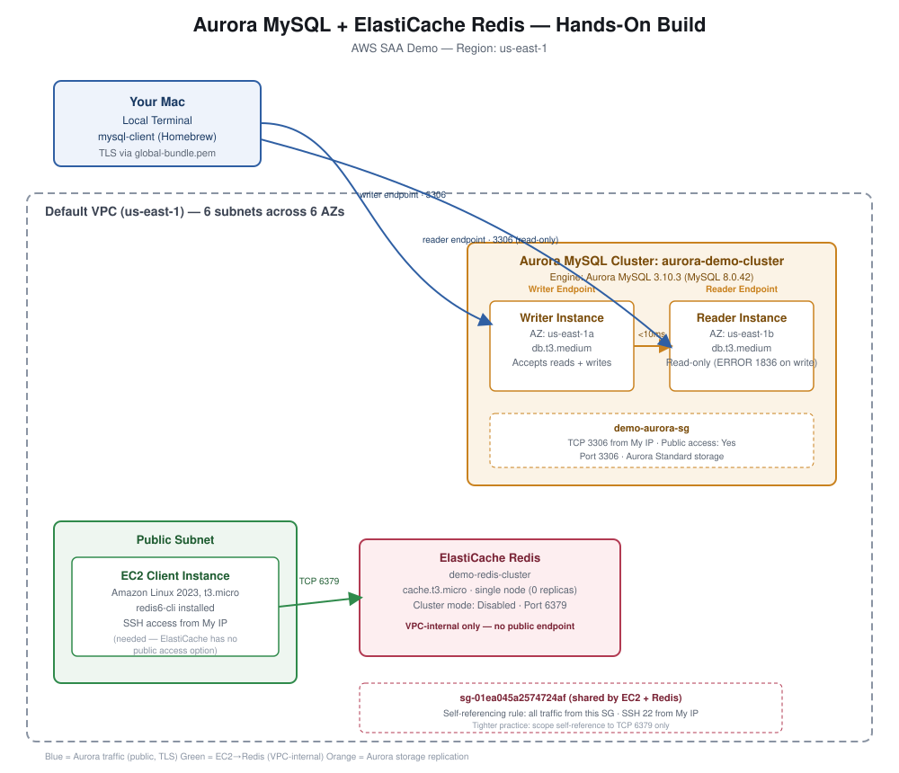

# RDS, Aurora & ElastiCache — Reference Guide

AWS Solutions Architect Associate study notes. Covers RDS, Aurora, and ElastiCache concepts, plus a full copy-paste redo guide for the hands-on build (Aurora MySQL cluster + ElastiCache Redis cluster with an EC2 client).

## Table of Contents

- [Acronyms & Meaning](#acronyms--meaning)
- [Module 1: RDS Fundamentals](#module-1-rds-fundamentals)
- [Module 2: Read Replicas vs. Multi-AZ](#module-2-read-replicas-vs-multi-az)
- [Module 3: RDS Backup, Restore & RDS Custom](#module-3-rds-backup-restore--rds-custom)
- [Module 4: RDS Security & RDS Proxy](#module-4-rds-security--rds-proxy)
- [Module 5: Aurora Fundamentals & Storage Architecture](#module-5-aurora-fundamentals--storage-architecture)
- [Module 6: Aurora Scaling — Endpoints, Auto-Scaling & Serverless](#module-6-aurora-scaling--endpoints-auto-scaling--serverless)
- [Module 7: Aurora Advanced Features](#module-7-aurora-advanced-features)
- [Module 8: ElastiCache — Redis vs. Memcached](#module-8-elasticache--redis-vs-memcached)
- [Ports Quick Reference](#ports-quick-reference)
- [Final Architecture Diagram](#final-architecture-diagram)
- [Hands-On Redo Guide: Aurora MySQL Cluster](#hands-on-redo-guide-aurora-mysql-cluster)
  - [Step 1: Create the Cluster (Console)](#step-1-create-the-cluster-console)
  - [Step 2: Install MySQL Client (Local Machine)](#step-2-install-mysql-client-local-machine)
  - [Step 3: Fix Security Group & Connect](#step-3-fix-security-group--connect)
  - [Step 4: Prove Writer/Reader Replication](#step-4-prove-writerreader-replication)
  - [Step 5: Clean Up Aurora](#step-5-clean-up-aurora)
- [Hands-On Redo Guide: ElastiCache Redis Cluster](#hands-on-redo-guide-elasticache-redis-cluster)
  - [Step 1: Create the Cluster (Console)](#step-1-create-the-cluster-console-1)
  - [Step 2: Why You Need an EC2 Client](#step-2-why-you-need-an-ec2-client)
  - [Step 3: Launch & Configure the EC2 Client](#step-3-launch--configure-the-ec2-client)
  - [Step 4: Install redis-cli & Connect](#step-4-install-redis-cli--connect)
  - [Step 5: Lazy Loading & TTL Demo](#step-5-lazy-loading--ttl-demo)
  - [Step 6: Sorted Set Leaderboard Demo](#step-6-sorted-set-leaderboard-demo)
  - [Step 7: Clean Up ElastiCache & EC2](#step-7-clean-up-elasticache--ec2)

---

## Acronyms & Meaning

| Acronym | Meaning |
|---|---|
| RDS | Relational Database Service |
| SQL | Structured Query Language |
| KMS | Key Management Service |
| TLS | Transport Layer Security |
| PITR | Point-in-Time Restore |
| AZ | Availability Zone |
| IAM | Identity and Access Management |
| ACU | Aurora Capacity Unit |
| RTO | Recovery Time Objective |
| T-SQL | Transact-SQL (Microsoft SQL Server's SQL dialect) |
| SASL | Simple Authentication and Security Layer |
| AOF | Append-Only File (Redis's durability/persistence mechanism) |
| TTL | Time To Live |
| VPC | Virtual Private Cloud |
| SG | Security Group |
| CIDR | Classless Inter-Domain Routing |

---

## Module 1: RDS Fundamentals

**RDS** = managed service for SQL-based relational databases. Supported engines: **PostgreSQL, MySQL, MariaDB, Oracle, SQL Server, IBM DB2, Aurora**.

Managed means AWS handles: provisioning, OS patching, continuous backups with PITR, monitoring, Read Replicas, Multi-AZ, maintenance windows, vertical/horizontal scaling. Storage is backed by EBS.

> [!IMPORTANT]
> Standard RDS **never** allows SSH access to the underlying instance — that's the trade-off for it being fully managed. The one exception is **RDS Custom** (Oracle and SQL Server only).

**Storage Auto Scaling** — RDS automatically grows storage up to a max threshold you set. It triggers only when **all three** conditions are true simultaneously:
1. Free storage < **10%** of allocated storage
2. That condition has lasted **> 5 minutes**
3. **≥ 6 hours** have passed since the last storage modification

Works across all RDS engines. Prevents jittery resizing from brief spikes.

---

## Module 2: Read Replicas vs. Multi-AZ

| | Read Replica | Multi-AZ |
|---|---|---|
| Purpose | Scale reads | High availability / DR |
| Replication | Asynchronous (eventually consistent) | Synchronous |
| Readable by clients? | Yes | No — standby is inaccessible |
| Can be promoted to standalone? | Yes | N/A (auto-failover instead) |
| Count | Up to 15, same-AZ / cross-AZ / cross-region | 1 standby |
| Statements allowed | SELECT only | N/A — no direct access |

> [!NOTE]
> Same-region replication (even cross-AZ) is **free**. Cross-region replication **incurs a data transfer fee**.

> [!TIP]
> A Read Replica can itself be configured as Multi-AZ — combining read scaling and DR. Common exam question.

Going from Single-AZ → Multi-AZ is a **zero-downtime** operation (click Modify). Behind the scenes: RDS snapshots the primary, restores it as the new standby, then syncs.

---

## Module 3: RDS Backup, Restore & RDS Custom

**Automated Backups**
- Daily full backup + transaction logs every 5 min → restore to any point in time
- Retention: 1–35 days (0 = disabled); **expires** automatically

**Manual DB Snapshots**
- User-triggered, **retained as long as you want** — never auto-expire

> [!TIP]
> Cost-saving trick: for a database used only a few hours/month, take a manual snapshot then **delete** the instance instead of stopping it (stopped instances still bill for storage). Restore the snapshot when needed again.

> [!IMPORTANT]
> Restoring an automated backup or manual snapshot **always creates a brand-new database instance** — never an in-place update. Your app must be repointed to the new endpoint afterward.

**RDS Custom** — the only exception to "no SSH." Oracle and SQL Server only. Gives OS/DB-level access. Best practice: **snapshot first**, **disable automation mode** before customizing.

Restore paths: MySQL RDS backup from S3 → new RDS MySQL instance. On-prem backup → Aurora MySQL requires **Percona XtraBackup** → S3 → new Aurora cluster.

---

## Module 4: RDS Security & RDS Proxy

**Encryption at rest** — KMS-based, must be enabled **at launch**. If the master isn't encrypted, replicas can't be either.

> [!WARNING]
> To encrypt an already-existing unencrypted database, there's no in-place toggle. You must **snapshot the unencrypted DB, then restore that snapshot as encrypted**.

**Encryption in transit** — on by default; clients need AWS's TLS root certificates.

**Authentication** — username/password, or **IAM roles** (e.g., an EC2 instance with an IAM role authenticates without a stored password).

**Audit Logs** expire unless exported to **CloudWatch Logs**.

**RDS Proxy** — sits between app and DB, pools connections.
- Fully serverless, auto-scaling, Multi-AZ by design
- Reduces failover time by **up to 66%** — app talks to the stable Proxy endpoint, Proxy handles reconnection internally
- Enforces **IAM authentication**, credentials in **AWS Secrets Manager**
- **Never publicly accessible** — VPC-only
- Classic use case: **Lambda** functions (hundreds/thousands of short-lived connections) would otherwise exhaust the DB's connection limit

---

## Module 5: Aurora Fundamentals & Storage Architecture

Aurora = AWS proprietary engine, **wire-compatible** with MySQL and PostgreSQL (existing drivers work unchanged). Cloud-optimized:
- **5x** performance over MySQL on RDS, **3x** over PostgreSQL on RDS
- Storage auto-grows: 10 GB → up to **256 TB**
- Up to 15 read replicas, sub-**10ms** replication lag
- **Instantaneous** failover, HA by default
- ~20% more costly than RDS, but more efficient at scale

**Storage model** — every write stored as **6 copies across 3 AZs** (2 per AZ):
- Writes need only **4 of 6** copies → survives losing a whole AZ
- Reads need only **3 of 6** copies → survives losing a whole AZ
- Self-healing via peer-to-peer replication in the background

---

## Module 6: Aurora Scaling — Endpoints, Auto-Scaling & Serverless

**Writer Endpoint** — stable DNS name, always points to the current master. Survives failover transparently.

**Reader Endpoint** — stable DNS name, load-balances across all read replicas. Load balancing is **connection-level**, not statement-level.

**Replica Auto-Scaling** — define a policy (e.g., target 60% CPU); Aurora adds/removes replicas automatically, Reader Endpoint auto-extends.

**Custom Endpoints** — target a subset of replicas (e.g., only the larger instance types for analytics queries), separate from general app traffic.

**Aurora Serverless** — for infrequent/unpredictable workloads. Capacity defined in **ACUs** (min/max range). Pay-per-second, no capacity planning.

---

## Module 7: Aurora Advanced Features

**Global Database** — 1 primary region (read/write) + up to **10 secondary regions** (read-only), up to 16 replicas per secondary. Replication lag **< 1 second**. Promote a secondary on primary failure: **RTO < 1 minute**.

**Aurora Machine Learning** — query ML predictions via plain SQL. Integrates with **SageMaker** (any custom model) or **Amazon Comprehend** (sentiment analysis). No ML expertise required.

**Babelfish for Aurora PostgreSQL** — lets Aurora PostgreSQL understand **T-SQL** directly, so a legacy SQL Server app can migrate with little to no code changes.

**Aurora Backups** — same as RDS (1–35 day automated retention, PITR, manual snapshots retained indefinitely) **except automated backups cannot be disabled** on Aurora (they can on RDS).

**Aurora Database Cloning** — copy-on-write. Clone initially shares the source's data volume (near-instant, minimal storage cost); storage only splits as either side gets new writes. **Faster than snapshot-and-restore.**

---

## Module 8: ElastiCache — Redis vs. Memcached

In-memory managed cache. Requires **application code changes** to actually use (not a flip-a-switch service like RDS).

| | Redis | Memcached |
|---|---|---|
| HA / failover | Multi-AZ with auto-failover | None |
| Read scaling | Read replicas | Sharding |
| Durability | AOF persistence + backup/restore | None (serverless version only) |
| Data structures | Sets/Sorted Sets (leaderboards) | Simple key-value |
| Auth | IAM auth + Redis AUTH | SASL only |

**Caching strategies:**
- **Lazy Loading** — cache on miss only; can go stale
- **Write Through** — update cache on every DB write; always fresh, slower writes
- **Session Store** — store session data in cache for statelessness; expire via **TTL**

---

## Ports Quick Reference

| Type | Port |
|---|---|
| FTP | 21 |
| SSH / SFTP | 22 |
| HTTP | 80 |
| HTTPS | 443 |
| PostgreSQL | 5432 |
| MySQL / MariaDB | 3306 |
| Oracle RDS | 1521 |
| MSSQL Server | 1433 |
| Aurora | 5432 (PostgreSQL-compatible) or 3306 (MySQL-compatible) |
| Redis (ElastiCache) | 6379 |

> [!NOTE]
> You don't need these memorized precisely — just recognize an "important port" (SSH, HTTPS) vs. a "database port" if the exam mentions one in passing.

---

## Final Architecture Diagram



*Blue = Aurora traffic (public, TLS). Green = EC2 → Redis (VPC-internal only). Orange = Aurora's internal storage replication.*

---

## Hands-On Redo Guide: Aurora MySQL Cluster

### Step 1: Create the Cluster (Console)

RDS Console → **Databases** → **Create database** → **Standard create**.

| Field | Value |
|---|---|
| Engine type | Amazon Aurora (MySQL Compatible) |
| Engine version | Aurora MySQL 3.10.3 (compatible with MySQL 8.0.42) — default |
| Templates | Production |
| Cluster scalability type | Provisioned |
| Instance config | Burstable classes → `db.t3.medium` |
| DB cluster identifier | `aurora-demo-cluster` |
| Master username | `admin` |
| Credentials management | Self managed |
| Cluster storage configuration | Aurora Standard |
| Availability & durability | **"Create an Aurora Replica or Reader node in a different AZ"** (this is what gives you the Reader instance) |
| Compute resource | Don't connect to an EC2 compute resource |
| Network type | IPv4 |
| VPC | Default VPC |
| Public access | **Yes** |
| VPC security group | Create new → `demo-aurora-sg` |
| Database port | 3306 |
| Database Insights | **Standard** (not Advanced — Advanced bills separately via CloudWatch) |
| RDS Extended Support | Leave **unchecked** |
| Initial database name | `mydb` |
| Backup retention | 7 days |
| Encryption | Default (AWS-owned KMS key) |

> [!WARNING]
> The **Initial database name** field is easy to skip. If left blank, Aurora won't create a schema for you — you'd have to run `CREATE DATABASE mydb;` manually after connecting. Fill it in before creating.

Click **Create database** and wait ~5–10 minutes for status **Available**.

**Confirm the build:** RDS → Databases → expand `aurora-demo-cluster` → you should see two instances, tagged **Writer** and **Reader** as role badges.

### Step 2: Install MySQL Client (Local Machine)

```bash
mysql --version
```

> [!WARNING]
> **Error:** `zsh: command not found: mysql`
> **Fix:** Install the client only (not a full server), then fix the PATH — `mysql-client` installs **keg-only** on Homebrew and won't auto-link.
> ```bash
> brew install mysql-client
> echo 'export PATH="/opt/homebrew/opt/mysql-client/bin:$PATH"' >> ~/.zshrc
> source ~/.zshrc
> mysql --version   # now prints a version number
> ```

### Step 3: Fix Security Group & Connect

Download the AWS TLS certificate bundle (Aurora enforces TLS by default):
```bash
curl -o global-bundle.pem https://truststore.pki.rds.amazonaws.com/global/global-bundle.pem
```

> [!WARNING]
> **Error:** Connection attempt fails / times out.
> **Cause:** The inbound rule for port 3306 was added to the **wrong security group** — a leftover group from an earlier lab (`ec2-fundamentals-demo-sg`), not the one actually attached to the Aurora cluster.
> **Fix:** Go to the Aurora cluster's **Connectivity & security** tab, confirm the attached SG is `demo-aurora-sg`, and add the inbound rule *there*:
> - Type: MYSQL/Aurora · Protocol: TCP · Port: 3306 · Source: My IP

Connect to the **Writer** endpoint (cluster endpoint — no `-ro-` in the hostname):
```bash
mysql -h aurora-demo-cluster.cluster-<your-id>.us-east-1.rds.amazonaws.com -P 3306 -u admin -p --ssl-mode=VERIFY_IDENTITY --ssl-ca=./global-bundle.pem
```

> ![screenshot placeholder — successful `mysql>` prompt after connecting]

### Step 4: Prove Writer/Reader Replication

On the **Writer** connection:
```sql
USE mydb;
CREATE TABLE demo_table (id INT AUTO_INCREMENT PRIMARY KEY, note VARCHAR(50));
INSERT INTO demo_table (note) VALUES ('hello from writer');
SELECT * FROM demo_table;
```

Open a **second terminal tab**, connect to the **Reader** endpoint (same command, hostname has `-ro-` inserted):
```bash
mysql -h aurora-demo-cluster.cluster-ro-<your-id>.us-east-1.rds.amazonaws.com -P 3306 -u admin -p --ssl-mode=VERIFY_IDENTITY --ssl-ca=./global-bundle.pem
```

```sql
USE mydb;
SELECT * FROM demo_table;   -- succeeds, shows the replicated row
INSERT INTO demo_table (note) VALUES ('trying to write from reader');
```

> [!IMPORTANT]
> **Result:** `ERROR 1836 (HY000): Running in read-only mode`
> This isn't a permissions setting — it's enforced at the engine level. The Reader endpoint replicates data (sub-10ms lag) but architecturally cannot accept writes.

### Step 5: Clean Up Aurora

1. Exit both `mysql` sessions (`\q` or `exit`)
2. RDS Console → Databases → expand `aurora-demo-cluster`
3. Delete the **Reader instance** first (Actions → Delete → type `delete me`) — wait for it to finish
4. Delete the **Writer instance** the same way
5. Once both instances are gone, delete the **cluster** itself (uncheck "create final snapshot" for a demo)

---

## Hands-On Redo Guide: ElastiCache Redis Cluster

### Step 1: Create the Cluster (Console)

ElastiCache Console → **Redis clusters** → **Create Redis cluster** → **Design your own cache** → **Cluster cache**.

| Field | Value |
|---|---|
| Engine | Redis OSS |
| Cluster mode | Disabled |
| Name | `demo-redis-cluster` |
| Description | "SAA demo" |
| Location | AWS Cloud |
| Multi-AZ / Auto-failover | Disable (requires ≥1 replica; we're using 0) |
| Engine version | 7.1 (default) |
| Port | 6379 |
| Parameter group | `default.redis7` |
| Node type | `cache.t3.micro` |
| Number of replicas | 0 |
| Network type | IPv4 |
| Subnet group | Create new → `demo-redis-subnet-group`, default VPC |

> [!WARNING]
> **Error:** After creating a new subnet group, the subnet table shows **"No selected subnets."** A new subnet group starts empty — you must click **Manage** and explicitly check all 6 subnets (one per AZ) before proceeding.

Continue to Security:

| Field | Value |
|---|---|
| Encryption at rest | Disabled |
| Encryption in transit | Disabled |
| Automatic backups | Disabled |
| Security groups | Attach one (see warning below) |

> [!WARNING]
> **Trap:** The console defaults **Encryption in transit** to **Enabled** with mode **"Required"** on the review screen even if you don't explicitly toggle it. This forces TLS on every client connection, which adds unnecessary complexity for a demo. Go back to **Edit** on the Advanced settings step and confirm it's **Disabled** before creating.

> [!WARNING]
> **Trap:** Security groups defaults to **0 selected**, which would make the cluster completely unreachable. Click **Manage** and attach a security group — a dedicated `demo-redis-sg` if offered, or your VPC's default SG (which is what happened here: `sg-01ea045a2574724af`).

Review the final config, confirm encryption at rest/in transit and backups are all **Disabled**, then click **Create**.

### Step 2: Why You Need an EC2 Client

> [!IMPORTANT]
> Unlike RDS/Aurora, **ElastiCache has no "public access" toggle at all.** Node-based clusters are VPC-internal only, always — no security group rule can make them reachable directly from your laptop over the public internet.
>
> **Error hit:** `Could not connect to Redis at <endpoint>:6379: Operation timed out` when trying to connect from a local machine.
> **Fix:** Launch a small EC2 instance inside the same VPC to act as the client.

### Step 3: Launch & Configure the EC2 Client

1. Launch EC2: **Amazon Linux 2023**, `t3.micro`, same default VPC as the Redis cluster, **public subnet**, with a key pair
2. Attach (or reuse) a security group — this build reused the Redis cluster's own SG (`sg-01ea045a2574724af`) for both EC2 and Redis
3. On that SG, add inbound rules:
   - **SSH (22)** from My IP
   - **All traffic**, source = **the SG itself** (self-referencing rule) — lets EC2 and Redis talk to each other without hardcoding IPs

> [!WARNING]
> **Error:** `You may not specify a referenced group id for an existing IPv4 CIDR rule` when trying to add a *third*, more specific rule (Custom TCP 6379, self-referencing) alongside an existing "All traffic" self-referencing rule.
> **Cause:** Redundant — the "All traffic" self-reference already covers port 6379.
> **Fix:** Delete the duplicate draft rule.

> [!TIP]
> "All traffic" self-reference is broader than best practice (opens every port between SG members). Tighter alternative: scope the self-reference to just **Custom TCP, port 6379** instead of "All traffic." Fine for a demo, worth tightening for production.

SSH in:
```bash
ssh -i your-key.pem ec2-user@<ec2-public-ip>
```

### Step 4: Install redis-cli & Connect

```bash
sudo yum update
redis-cli --version
```

> [!WARNING]
> **Error:** `-bash: redis-cli: command not found`, and `sudo yum install -y redis` → `No match for argument: redis`.
> **Cause:** Amazon Linux 2023 doesn't ship a plain `redis` package; it offers `redis6` and `valkey` instead.

```bash
sudo dnf install -y redis6
redis-cli --version   # still "command not found"!
```

> [!WARNING]
> **Error:** Even after installing `redis6`, `redis-cli` is still not found.
> **Cause:** The `redis6` package prefixes every binary with `redis6-` — there is no plain `redis-cli` symlink.
> **Diagnosis command:** `rpm -ql redis6 | grep bin` → shows `/usr/bin/redis6-cli` (and `redis6-server`, `redis6-benchmark`, etc.)
> **Fix:** Use `redis6-cli` instead of `redis-cli` for the rest of the session.

Connect:
```bash
redis6-cli -h demo-redis-cluster.<your-id>.ng.0001.use1.cache.amazonaws.com -p 6379
```

> ![screenshot placeholder — connected redis6-cli prompt]

### Step 5: Lazy Loading & TTL Demo

```
GET user:1001
```
```
(nil)
```

```
SET user:1001 "Kenneth - Cloud AI Engineer"
GET user:1001
```
```
OK
"Kenneth - Cloud AI Engineer"
```

```
EXPIRE user:1001 30
```
Wait 30+ seconds, then:
```
GET user:1001
```
```
(nil)
```

> [!NOTE]
> This full miss → set → hit → TTL-expiry sequence is the **Lazy Loading** and **Session Store** patterns from Module 8, made concrete.

### Step 6: Sorted Set Leaderboard Demo

> [!WARNING]
> **Error:** `Invalid argument(s)` when three `ZADD` commands were pasted on one line with no spaces between them.
> **Fix:** `redis-cli`/`redis6-cli` only accepts **one command per line** — run each `ZADD` separately.

```
ZADD leaderboard 1500 "alice"
ZADD leaderboard 2200 "bob"
ZADD leaderboard 1800 "carol"

ZREVRANGE leaderboard 0 -1 WITHSCORES
```
```
1) "bob"
2) "2200"
3) "carol"
4) "1800"
5) "alice"
6) "1500"
```

```
ZINCRBY leaderboard 800 "alice"
ZREVRANGE leaderboard 0 -1 WITHSCORES
```
```
1) "alice"
2) "2300"
3) "bob"
4) "2200"
5) "carol"
6) "1800"
```

```
ZREVRANK leaderboard "alice"
```
```
(integer) 0
```

Alice's score updated atomically with `ZINCRBY` and the leaderboard re-sorted itself automatically — no application-side sort logic required.

### Step 7: Clean Up ElastiCache & EC2

1. Exit `redis6-cli` and the SSH session (`exit`, `exit`)
2. ElastiCache Console → select `demo-redis-cluster` → **Actions → Delete** → uncheck "create final backup" → confirm
3. EC2 Console → Instances → select the client instance → **Instance State → Terminate**
4. Optional tidiness: delete `demo-redis-subnet-group` and any dedicated SGs no longer in use (these don't cost anything sitting idle)