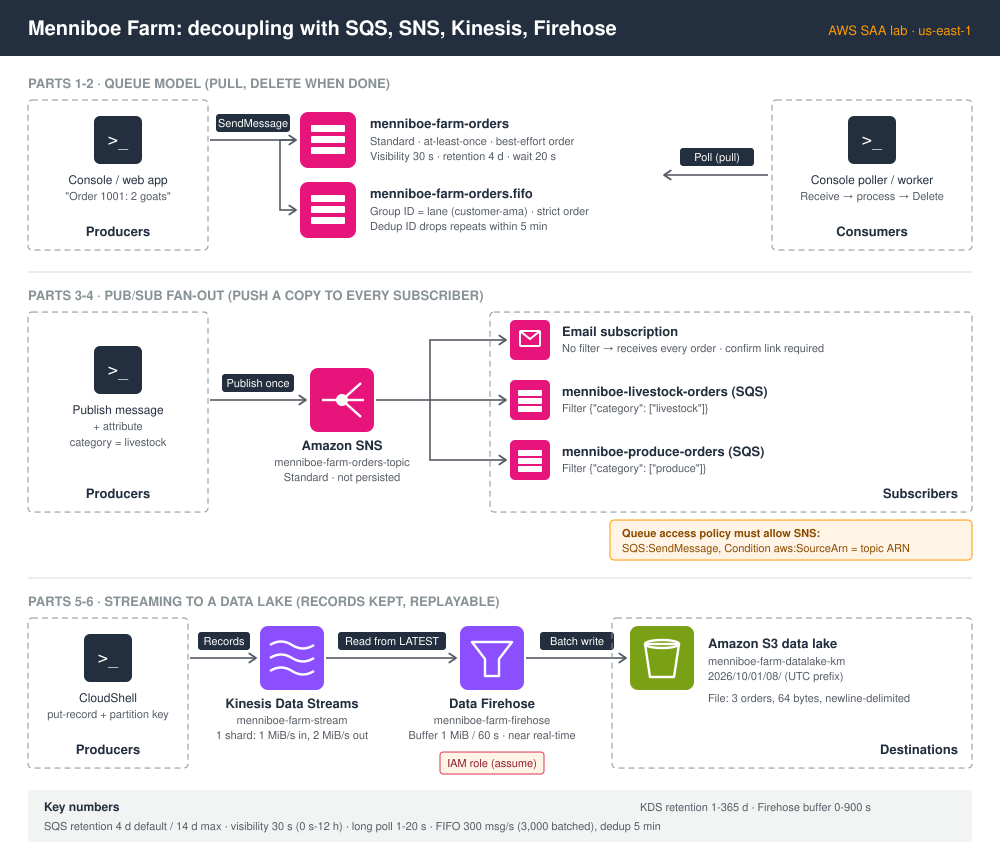

# AWS Decoupling & Messaging: SQS, SNS, Kinesis, Data Firehose, Amazon MQ

**Track:** AWS Solutions Architect Associate (SAA-C03) · **Region:** us-east-1 · **Theme:** Menniboe Farm orders

## What I learned

- **Sync vs async:** a direct call couples services together; middleware (a queue, topic, or stream) lets each side scale on its own and absorb traffic spikes.
- **SQS standard:** producers `SendMessage`, consumers poll, process, then `DeleteMessage`. It gives at-least-once delivery and best-effort ordering, keeps messages 4 days by default (14 max), and supports messages up to 1 MiB.
- **Visibility timeout:** a received message hides for 30 s by default. If it isn't deleted in that window it reappears, and that's how duplicates happen. For one slow message, call `ChangeMessageVisibility`.
- **Long polling:** the consumer waits 1–20 s for a message instead of getting an empty reply, which means fewer API calls and lower latency.
- **SQS FIFO:** strict order inside each message group ID, plus deduplication within a 5-minute window. Limits: 300 msg/s, or 3,000 with batching. The queue name must end in `.fifo`.
- **SQS + Auto Scaling:** scale consumers with a CloudWatch alarm on `ApproximateNumberOfMessages`, and use SQS as a write buffer in front of a database.
- **SNS:** pub/sub that pushes a copy to every subscriber and doesn't store messages ("SNS shouts, SQS remembers").
- **Fan-out:** SNS sends to multiple SQS queues, and filter policies route subsets to each queue. The queue's access policy must allow SNS to send.
- **Kinesis Data Streams:** real-time streaming. Records stay until they expire (1–365 days), so they can be replayed. Each shard handles 1 MiB/s in and 2 MiB/s out, and records with the same partition key go to the same shard in order.
- **Data Firehose:** a managed, near-real-time loader into S3, Redshift, OpenSearch, or HTTP endpoints. It buffers by size or time, stores nothing, and can't replay.
- **Amazon MQ:** managed RabbitMQ/ActiveMQ for open protocols (MQTT, AMQP, STOMP). For high availability, run active/standby brokers across two AZs with shared EFS storage.

## Key results

| Lab part | Result |
|---|---|
| SQS standard | Watched the visibility timeout: same message ID, **receive count 1 → 2** after 30 s without a delete |
| SQS FIFO | 3 orders came back **in sent order** (23 → 21 → 17 bytes). A reused dedup ID **silently dropped** an order; a resend after 5 minutes was **accepted** |
| SNS | Email subscription went **Pending → Confirmed**; a published order arrived by **push**, with no polling |
| Fan-out + filters | Livestock orders went only to the livestock queue; email got everything. Found and fixed **two real routing bugs** |
| Kinesis | 3 records in 1 shard with increasing sequence numbers; **base64 decoded**; **replayed** with the same iterator |
| Firehose → S3 | Fixed an IAM **assume-role** error; got a **64-byte file with 3 orders** under a UTC date prefix about 60 s after sending |
| Cleanup | All lab resources deleted and verified (only the pre-existing `Default_CloudWatch_Alarms_Topic` remains) |

## Files

| File | Contents |
|---|---|
| [notes.md](notes.md) | Full tutorial, copy-paste redo guide, errors and fixes in context, exam scenarios, acronyms |
| [commands.md](commands.md) | Every CLI command, grouped by stage |
| [images/](images/) | Architecture diagram and redacted lab screenshots |
