# AWS Decoupling & Messaging: Reference Guide and Lab Redo

**Cert:** AWS Solutions Architect Associate (SAA-C03) · **Region:** us-east-1 (N. Virginia) · **Theme:** Menniboe Farm orders
**Services:** Amazon SQS (Standard + FIFO), Amazon SNS, Amazon Kinesis Data Streams, Amazon Data Firehose, Amazon S3, Amazon MQ (concept only)


---

## Table of contents

- [1. Session overview](#1-session-overview)
- [2. Acronyms](#2-acronyms)
- [3. Concepts](#3-concepts)
  - [3.1 Sync vs async communication](#31-sync-vs-async-communication)
  - [3.2 SQS standard queues](#32-sqs-standard-queues)
  - [3.3 Visibility timeout](#33-visibility-timeout)
  - [3.4 Long polling](#34-long-polling)
  - [3.5 SQS FIFO queues](#35-sqs-fifo-queues)
  - [3.6 SQS with Auto Scaling Groups](#36-sqs-with-auto-scaling-groups)
  - [3.7 SNS publish and subscribe](#37-sns-publish-and-subscribe)
  - [3.8 SNS and SQS fan-out with filtering](#38-sns-and-sqs-fan-out-with-filtering)
  - [3.9 Kinesis Data Streams](#39-kinesis-data-streams)
  - [3.10 Amazon Data Firehose](#310-amazon-data-firehose)
  - [3.11 Choosing SQS vs SNS vs Kinesis](#311-choosing-sqs-vs-sns-vs-kinesis)
  - [3.12 Amazon MQ](#312-amazon-mq)
- [4. Questions I asked](#4-questions-i-asked)
- [5. Hands-on lab redo guide](#5-hands-on-lab-redo-guide)
  - [Part 1: SQS standard queue](#part-1-sqs-standard-queue)
    - [Step 1.1: Create the standard queue](#step-11-create-the-standard-queue)
    - [Step 1.2: Test long polling and send the first order](#step-12-test-long-polling-and-send-the-first-order)
    - [Step 1.3: Watch the visibility timeout](#step-13-watch-the-visibility-timeout)
    - [Step 1.4: Delete the message](#step-14-delete-the-message)
    - [Step 1.5: Batch receive and best-effort ordering](#step-15-batch-receive-and-best-effort-ordering)
  - [Part 2: SQS FIFO queue](#part-2-sqs-fifo-queue)
    - [Step 2.1: Create the FIFO queue](#step-21-create-the-fifo-queue)
    - [Step 2.2: Send ordered messages](#step-22-send-ordered-messages)
    - [Step 2.3: Deduplication window test and purge](#step-23-deduplication-window-test-and-purge)
  - [Part 3: SNS topic with email](#part-3-sns-topic-with-email)
    - [Step 3.1: Create the SNS topic](#step-31-create-the-sns-topic)
    - [Step 3.2: Create the email subscription](#step-32-create-the-email-subscription)
    - [Step 3.3: Publish a message](#step-33-publish-a-message)
  - [Part 4: SNS to SQS fan-out with filters](#part-4-sns-to-sqs-fan-out-with-filters)
    - [Step 4.1: Create two subscriber queues](#step-41-create-two-subscriber-queues)
    - [Step 4.2: Subscribe the livestock queue](#step-42-subscribe-the-livestock-queue)
    - [Step 4.3: Subscribe the produce queue](#step-43-subscribe-the-produce-queue)
    - [Step 4.4: Add filter policies](#step-44-add-filter-policies)
    - [Step 4.5: Publish filtered orders](#step-45-publish-filtered-orders)
    - [Step 4.6: Debug and fix the routing](#step-46-debug-and-fix-the-routing)
  - [Part 5: Kinesis Data Streams](#part-5-kinesis-data-streams)
    - [Step 5.1: Create the data stream](#step-51-create-the-data-stream)
    - [Step 5.2: Produce records from CloudShell](#step-52-produce-records-from-cloudshell)
    - [Step 5.3: Consume and decode records](#step-53-consume-and-decode-records)
  - [Part 6: Data Firehose to S3](#part-6-data-firehose-to-s3)
    - [Step 6.1: Create the S3 bucket](#step-61-create-the-s3-bucket)
    - [Step 6.2: Create the Firehose stream](#step-62-create-the-firehose-stream)
    - [Step 6.3: Send new records and verify S3](#step-63-send-new-records-and-verify-s3)
  - [Part 7: Cleanup](#part-7-cleanup)
    - [Step 7.1: Delete resources](#step-71-delete-resources)
    - [Step 7.2: Verify nothing remains](#step-72-verify-nothing-remains)
- [6. Troubleshooting summary](#6-troubleshooting-summary)
- [7. Exam scenarios](#7-exam-scenarios)
- [8. Takeaways and next steps](#8-takeaways-and-next-steps)

---

## 1. Session overview

When applications talk to each other, they either call each other directly (synchronous) or hand work off through middleware (asynchronous). This session covered AWS's middleware options:

| Service | Model | One-line purpose |
|---|---|---|
| **SQS** | Queue (pull) | Hold work items until one worker processes and deletes each |
| **SNS** | Pub/sub (push) | Broadcast one message to many subscribers |
| **Kinesis Data Streams** | Stream (pull or push) | Real-time big data that can be replayed |
| **Data Firehose** | Managed loader | Buffer streaming data and batch-load it into S3, Redshift, OpenSearch |
| **Amazon MQ** | Managed broker | RabbitMQ/ActiveMQ for apps that speak open protocols |

**Learning path used:** Foundations (Modules 1–4) → Intermediate (5–8) → Advanced (9–12) → hands-on lab (Parts 1–7) → cleanup.

**Lab theme:** Menniboe Farm orders (goats, chickens, tilapia, pigs, produce) flowing through every service.

---

## 2. Acronyms

| Acronym | Meaning |
|---|---|
| **SQS** | Simple Queue Service |
| **SNS** | Simple Notification Service |
| **KDS** | Kinesis Data Streams |
| **KDF** | Kinesis Data Firehose (old name for Amazon Data Firehose) |
| **MQ** | Message Queue (Amazon MQ, managed message broker) |
| **FIFO** | First In, First Out |
| **DLQ** | Dead-Letter Queue (holds messages that keep failing) |
| **API** | Application Programming Interface |
| **SDK** | Software Development Kit |
| **CLI** | Command Line Interface |
| **ARN** | Amazon Resource Name |
| **IAM** | Identity and Access Management |
| **KMS** | Key Management Service |
| **SSE** | Server-Side Encryption |
| **SSE-SQS** | SSE with an SQS-managed key |
| **SSE-S3** | SSE with S3-managed keys |
| **SSE-KMS** | SSE with an AWS KMS key |
| **ASG** | Auto Scaling Group |
| **EC2** | Elastic Compute Cloud |
| **RDS** | Relational Database Service |
| **EFS** | Elastic File System |
| **AZ** | Availability Zone |
| **HA** | High Availability |
| **KPL** | Kinesis Producer Library (optimized producer) |
| **KCL** | Kinesis Client Library (optimized consumer) |
| **ETL** | Extract, Transform, Load |
| **MD5** | Message-Digest algorithm 5 (checksum SQS returns to verify a message body) |
| **UTC** | Coordinated Universal Time |
| **JSON** | JavaScript Object Notation |
| **HTTP(S)** | HyperText Transfer Protocol (Secure) |
| **SMS** | Short Message Service (text message) |
| **MQTT** | Message Queuing Telemetry Transport (IoT protocol) |
| **AMQP** | Advanced Message Queuing Protocol |
| **STOMP** | Simple (or Streaming) Text Oriented Messaging Protocol |
| **WSS** | WebSocket Secure |
| **IoT** | Internet of Things |
| **ORC** | Optimized Row Columnar (file format) |
| **MiB / KiB** | Mebibyte (1,048,576 bytes) / Kibibyte (1,024 bytes) |
| **TTL** | Time To Live |

---

## 3. Concepts

### 3.1 Sync vs async communication

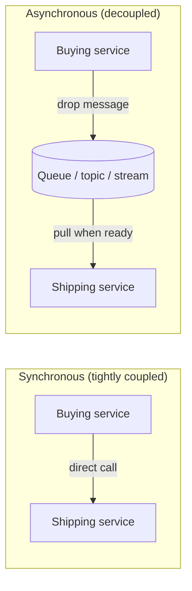
```mermaid
flowchart LR
  subgraph Sync["Synchronous (tightly coupled)"]
    A1[Buying service] -->|direct call| B1[Shipping service]
  end
  subgraph Async["Asynchronous (decoupled)"]
    A2[Buying service] -->|drop message| Q[(Queue / topic / stream)]
    Q -->|pull when ready| B2[Shipping service]
  end
```

- **Synchronous:** the caller waits for an answer. If traffic spikes (1,000 video encodes instead of 10), the callee gets overwhelmed and fails.
- **Asynchronous:** middleware absorbs the spike, and each side scales on its own.

**Rule of thumb (my teach-back):**
- Choose **synchronous** when the user needs a response right away to continue, for example a checkout that must show *approved* or *declined*.
- Choose **asynchronous** when the work only needs to happen *eventually*: receipt emails, video encoding, analytics.

> [!TIP]
> Exam trigger words for async: *decouple*, *sudden spike*, *unpredictable traffic*, *timeouts*.

**Azure anchor:** SQS ≈ Queue Storage / Service Bus queues · SNS ≈ Service Bus topics / Event Grid · Kinesis ≈ Event Hubs.

---

### 3.2 SQS standard queues

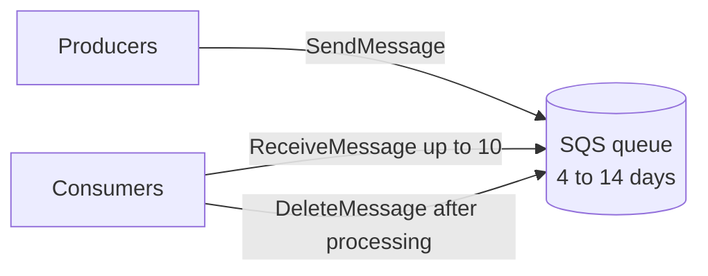
```mermaid
flowchart LR
  P[Producers] -->|SendMessage| Q[(SQS queue<br/>4 to 14 days)]
  C[Consumers] -->|ReceiveMessage up to 10| Q
  C -->|DeleteMessage after processing| Q
```

| Feature | Value |
|---|---|
| Throughput | Unlimited; unlimited messages in queue |
| Retention | Default **4 days**, max **14 days** (unprocessed messages then expire for good) |
| Latency | Under 10 ms to send or receive |
| Message size | Up to **1 MiB** (1,024 KiB); some courses still say 256 KB |
| Batch receive | Up to **10 messages per poll** |
| Delivery | **At-least-once** (duplicates possible) |
| Ordering | **Best-effort** (can arrive out of order) |
| Consumers | EC2, on-prem servers, Lambda; scale horizontally |

**Lifecycle:** `SendMessage` → persisted → `ReceiveMessage` (hidden during visibility timeout) → process → `DeleteMessage`.

> [!IMPORTANT]
> SQS doesn't know when you've finished. The consumer **must** call `DeleteMessage`, or the message comes back after the visibility timeout.

**Security**
- In flight: HTTPS
- At rest: SSE-SQS (default) or SSE-KMS
- Client-side encryption: possible, but your code does it
- Access: **IAM policies** (who can call the API) and **SQS access policies** (resource-based, like S3 bucket policies) for cross-account access or for letting SNS or S3 write to the queue

**Analogy:** a restaurant ticket rail. Waiters (producers) clip orders on, cooks (consumers) grab a ticket, cook, then throw the ticket away. Hire more cooks to go faster.

---

### 3.3 Visibility timeout

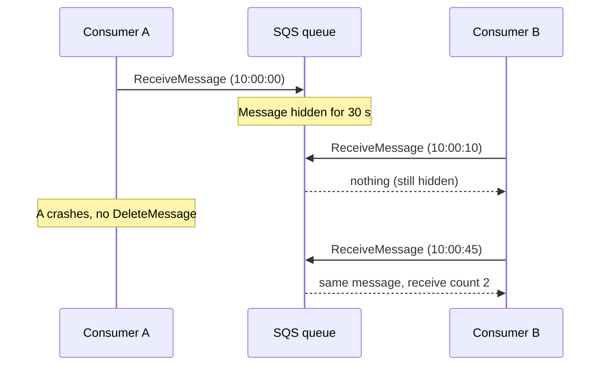
```mermaid
sequenceDiagram
  participant A as Consumer A
  participant Q as SQS queue
  participant B as Consumer B
  A->>Q: ReceiveMessage (10:00:00)
  Note over Q: Message hidden for 30 s
  B->>Q: ReceiveMessage (10:00:10)
  Q-->>B: nothing (still hidden)
  Note over A: A crashes, no DeleteMessage
  B->>Q: ReceiveMessage (10:00:45)
  Q-->>B: same message, receive count 2
```

| Setting | Value |
|---|---|
| Default | **30 seconds** |
| Range | **0 seconds to 12 hours** |
| Extend one message | `ChangeMessageVisibility` API |

**Tuning**
- **Too high** (hours): a crashed consumer leaves the message stuck and invisible for hours
- **Too low** (seconds): messages reappear mid-processing and get handled twice
- **All messages slow** → raise the queue's visibility timeout
- **Only some messages slow** → call `ChangeMessageVisibility` for those

**Analogy (my teach-back):** a library hold shelf. A reserved book is held 30 minutes. Pick it up in time and it's yours; miss it and it goes back on the shelf. Calling to say "I'm running late" is `ChangeMessageVisibility`. If *everyone* needs 60 minutes, the library changes its hold policy (raise the queue timeout).

> [!NOTE]
> **Visibility timeout vs retention:** when the visibility timeout ends, the message **comes back**. When the retention period ends, the message is **gone forever**.

---

### 3.4 Long polling

| | Short polling | Long polling |
|---|---|---|
| Empty queue | Returns immediately, empty | Waits up to 1–20 s |
| API calls | Many wasted empty calls | Far fewer |
| Latency | Lag between polls | Message handed over the moment it arrives |
| Where to enable | n/a | Queue setting **Receive message wait time**, or per call with `WaitTimeSeconds` |

> [!TIP]
> `WaitTimeSeconds=20` is a *ceiling*: if a message arrives at second 3, the call returns at second 3. To turn on long polling for **one consumer only** on a shared queue, use `WaitTimeSeconds` on the API call instead of changing the queue.

**Analogy:** short polling is a kid asking "Are we there yet?" every 5 seconds. Long polling is "Wake me when we arrive."

---

### 3.5 SQS FIFO queues

| Feature | Standard | FIFO |
|---|---|---|
| Throughput | Unlimited | **300 msg/s**, **3,000 msg/s** with batching (more with high-throughput mode) |
| Delivery | At-least-once | **Exactly-once processing** |
| Ordering | Best-effort | **Strict, per message group ID** |
| Name | Any | Must end in **`.fifo`** |

- **Message group ID** = *which line you stand in*. Messages with the same group ID are delivered in order. Different groups are processed in parallel. Example: use `customer-id` or `trader-id`.
- **Deduplication ID** = *your receipt number*. The same ID within **5 minutes** is dropped. Alternatively, **content-based deduplication** hashes the body for you.

> [!WARNING]
> If every message uses the same group ID (for example `"orders"`), there is only one lane, so adding consumers doesn't speed anything up. Use a per-entity value such as the customer ID.

> [!NOTE]
> **High throughput FIFO** (console checkbox) switches dedup scope to *message group* and the throughput limit to *per message group ID*, so each lane gets its own throughput.

**Memory hook:** "FIFO, five" (the dedup window is 5 minutes).

---

### 3.6 SQS with Auto Scaling Groups

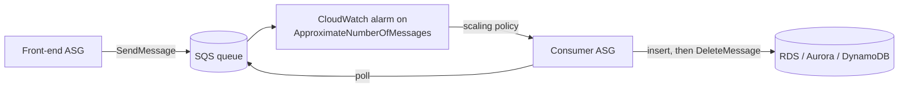
```mermaid
flowchart LR
  FE[Front-end ASG] -->|SendMessage| Q[(SQS queue)]
  Q --> CW[CloudWatch alarm on<br/>ApproximateNumberOfMessages]
  CW -->|scaling policy| BE[Consumer ASG]
  BE -->|poll| Q
  BE -->|insert, then DeleteMessage| DB[(RDS / Aurora / DynamoDB)]
```

**Scaling:** a CloudWatch alarm on `ApproximateNumberOfMessages` (queue length) fires above a threshold, for example 1,000, and triggers the ASG scaling policy. `ApproximateAgeOfOldestMessage` is another option.

**Pattern 1, buffer database writes:** during a flash sale, the front end writes orders to SQS instead of the database. A consumer ASG inserts each order and deletes the message **only after the insert succeeds**, so no transactions are lost.
- Only works if the client **doesn't need an immediate write confirmation**.

**Pattern 2, decouple application tiers:** front end (cheap instances) → SQS → back end (GPU instances for video encoding). Each tier scales independently.

> [!WARNING]
> Deleting right after `ReceiveMessage` and *then* writing to the database loses data if the write fails. Always **process first, delete last**.

---

### 3.7 SNS publish and subscribe

- One message published to a **topic** → SNS **pushes** a copy to every subscriber
- Up to 12,500,000 subscriptions per topic, 100,000 topics per account (limits aren't tested)
- **Subscriber types:** Email, Email-JSON, SMS, mobile push, HTTP/HTTPS, SQS, Lambda, Data Firehose
- **Publishers include:** CloudWatch alarms, ASG notifications, CloudFormation, Budgets, S3 events, RDS events, DMS, Lambda, DynamoDB
- **Not persisted:** if a subscriber is offline (and nothing like SQS is holding the message), the message is missed

**Memory hook:** **"SNS shouts, SQS remembers."** SNS is an announcement across a room; SQS is a note left on a desk.

**Security** follows the same model as SQS: HTTPS in flight, KMS at rest, IAM policies, plus **SNS access policies** for cross-account publishing or letting S3 publish.

**Resource-policy rule: the lock goes on the door being entered**

| Flow | Policy that must allow it |
|---|---|
| S3 → SNS | **SNS access policy** on the topic |
| SNS → SQS | **SQS access policy** on the queue |
| S3 → SQS | **SQS access policy** on the queue |
| Account B → Account A's topic | **SNS access policy** on Account A's topic |
| Account B → your S3 bucket | **S3 bucket policy** |

---

### 3.8 SNS and SQS fan-out with filtering

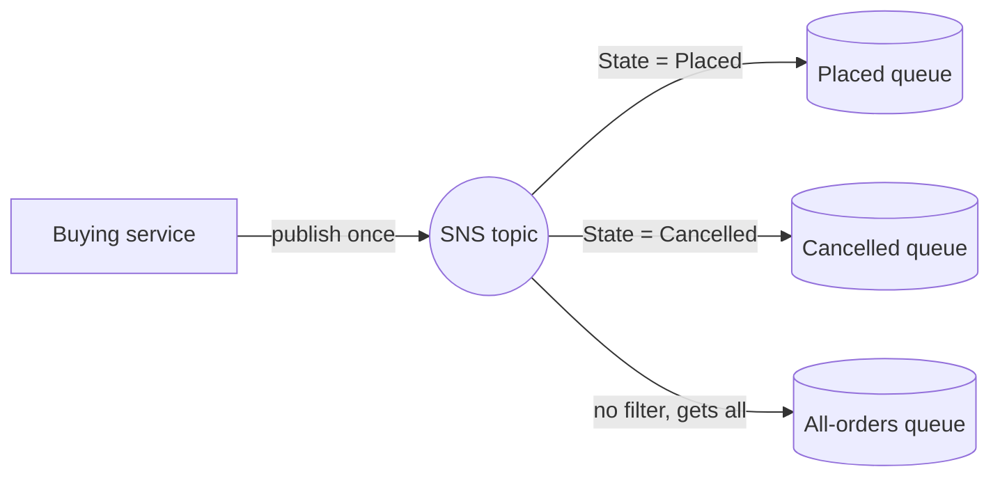
```mermaid
flowchart LR
  P[Buying service] -->|publish once| T((SNS topic))
  T -->|"State = Placed"| Q1[(Placed queue)]
  T -->|"State = Cancelled"| Q2[(Cancelled queue)]
  T -->|no filter, gets all| Q3[(All-orders queue)]
```

**Why not loop over each queue in the producer?** If the app crashes mid-loop, some queues get the message and others don't, and every new queue means a code change.

**Fan-out benefits:** fully decoupled, no data loss (SQS adds persistence, delay and retries), new queues added without code changes, and it works across Regions.

**Use cases**
1. **S3 events to many targets:** S3 allows only **one event rule per event type + prefix**. Send the event to SNS, then fan out.
2. **SNS → Firehose → S3:** persist topic messages to any Firehose destination.
3. **SNS FIFO → SQS FIFO:** fan-out *plus* ordering *plus* deduplication.

**Filter policies:** a JSON policy on a **subscription**. No filter means the subscription receives everything (the default).

```json
{ "category": ["livestock"] }
```

> [!IMPORTANT]
> The SQS access policy must allow the SNS topic to call `SQS:SendMessage`. Subscribing from the **SQS console** adds this statement for you (Step 4.2 shows it).

---

### 3.9 Kinesis Data Streams

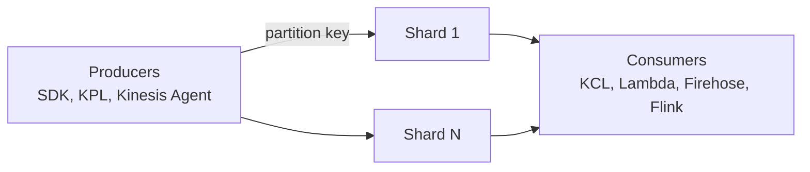
```mermaid
flowchart LR
  P[Producers<br/>SDK, KPL, Kinesis Agent] -->|partition key| S1[Shard 1]
  P --> S2[Shard N]
  S1 --> C[Consumers<br/>KCL, Lambda, Firehose, Flink]
  S2 --> C
```

| Feature | Value |
|---|---|
| Purpose | Collect and store streaming data in **real time** (clickstreams, IoT, logs) |
| Retention | **1 to 365 days**, so records can be **replayed** |
| Delete records | Not possible; you wait for them to expire |
| Record size | Up to **10 MiB** (default max 1,024 KiB, configurable up to 10,240 KiB) |
| Ordering | Same **partition key** → same shard → in order |
| Shard write | **1 MiB/s or 1,000 records/s** |
| Shard read | **2 MiB/s** |
| Security | KMS at rest (off by default; enable on the stream), HTTPS in flight |

**Capacity modes**
- **Provisioned:** you choose the shard count, scale manually, and pay per shard-hour
- **On-demand:** default 4 MiB/s (4,000 records/s) in, auto-scales on the past 30 days' peak, pay per stream-hour plus data in and out

**Consumption modes**
- **Shared (standard, pull):** 2 MiB/s per shard, *split across all consumers*
- **Enhanced fan-out (push):** 2 MiB/s per shard, *per consumer*

> [!TIP]
> Shard math: to ingest 6 MB/s, you need **6 shards** (writes are the bottleneck at 1 MiB/s each).

**Analogy:** a DVR. The live broadcast streams in, the recording is kept for a while, and anyone can rewind and rewatch until it's auto-deleted.

---

### 3.10 Amazon Data Firehose

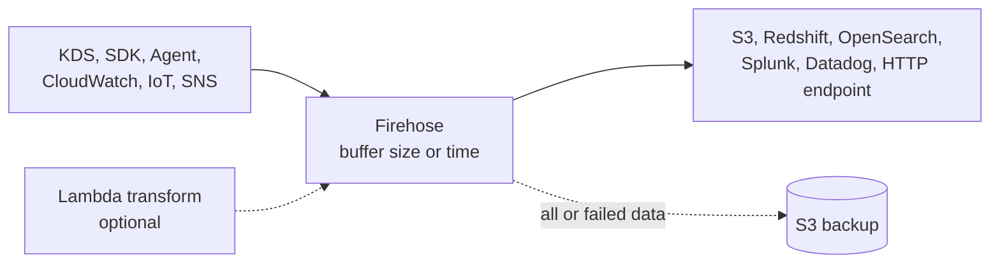
```mermaid
flowchart LR
  S[KDS, SDK, Agent,<br/>CloudWatch, IoT, SNS] --> F[Firehose<br/>buffer size or time]
  L[Lambda transform<br/>optional] -.-> F
  F --> D[S3, Redshift, OpenSearch,<br/>Splunk, Datadog, HTTP endpoint]
  F -.->|all or failed data| B[(S3 backup)]
```

- Fully managed, serverless, auto-scaling, pay for what you use
- **Near real-time**, because it buffers by **size or time** (whichever comes first) and then flushes in batches
- Destinations to memorize: **S3, Redshift, OpenSearch**, plus partners and custom HTTP endpoints
- Built-in conversion to **Parquet / ORC** and compression (gzip, Snappy, Zip)
- Custom transforms (CSV → JSON, masking data) → **Lambda**
- **No storage, no replay**

| | Kinesis Data Streams | Data Firehose |
|---|---|---|
| Role | Collect streaming data | Load streaming data into targets |
| Code | You write producers and consumers | Fully managed |
| Latency | Real-time | Near real-time |
| Scaling | Provisioned or on-demand | Automatic |
| Storage | 1–365 days | None |
| Replay | Yes | No |

> [!NOTE]
> The console now allows a **buffer interval of 0 seconds** (older material says the minimum is 60). For the exam, "Firehose = near real-time" still holds.

**Analogy:** a mail carrier. Letters pile up in the bag (buffer) and get delivered when the bag is full or the route time comes.

---

### 3.11 Choosing SQS vs SNS vs Kinesis

| Question | Answer |
|---|---|
| Does the message disappear once processed? | **SQS** |
| Does everyone get a copy, immediately? | **SNS** |
| Is it kept for rereading, like a log? | **Kinesis Data Streams** |
| Load a stream into S3/Redshift with no code? | **Data Firehose** |
| Migrating an app that uses MQTT/AMQP/STOMP? | **Amazon MQ** |
| Order matters or no duplicates allowed? | **FIFO** (SQS FIFO, or SNS FIFO → SQS FIFO) |

| | SQS | SNS | Kinesis Data Streams |
|---|---|---|---|
| Model | Consumers pull, then delete | Push to all subscribers | Pull (shared) or push (enhanced fan-out) |
| Persistence | Until deleted or retention ends | None | 1–365 days, replayable |
| Ordering | FIFO only | FIFO topics only | Per shard |
| Provisioning | None | None | Shards (provisioned) or on-demand |

---

### 3.12 Amazon MQ

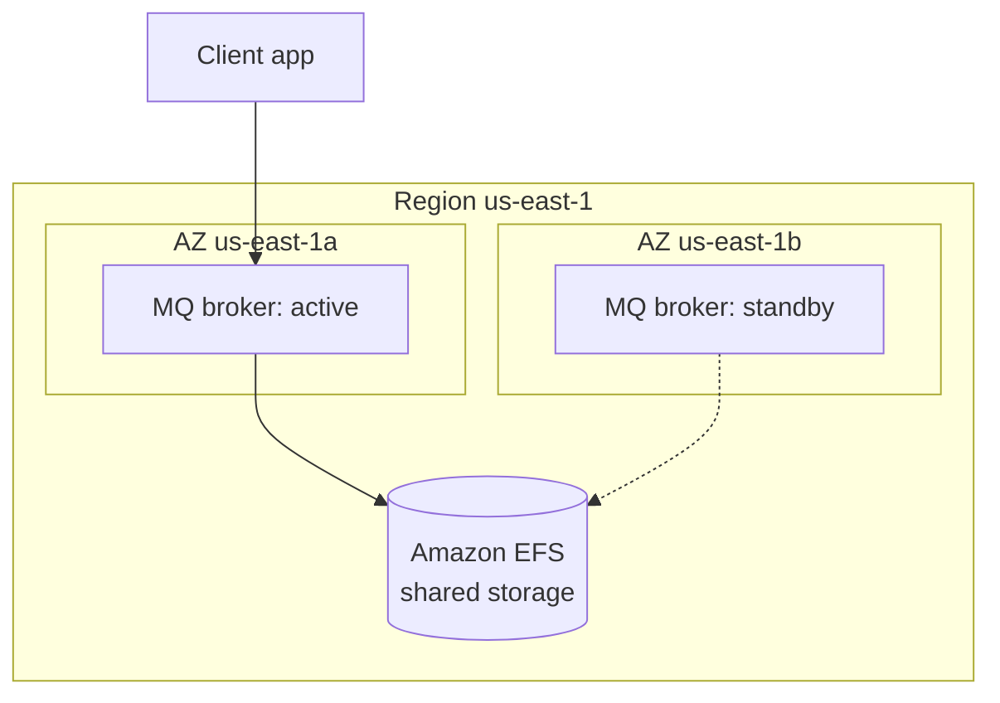
```mermaid
flowchart TB
  C[Client app] --> A
  subgraph R["Region us-east-1"]
    subgraph AZa["AZ us-east-1a"]
      A[MQ broker: active]
    end
    subgraph AZb["AZ us-east-1b"]
      S[MQ broker: standby]
    end
    A --> E[(Amazon EFS<br/>shared storage)]
    S -.-> E
  end
```

- Managed **RabbitMQ** and **ActiveMQ** for open protocols: **MQTT, AMQP, STOMP, OpenWire, WSS**
- Lets you migrate on-prem apps **without rewriting them** for SQS/SNS APIs
- Has both queue features (like SQS) and topic features (like SNS)
- Runs on servers, so it **doesn't scale like SQS/SNS**
- **HA:** active/standby brokers in two AZs, both using **EFS** so the standby has the same data after failover

> [!TIP]
> A new cloud-native app with no legacy protocols → **SQS + SNS** (near-unlimited scale). Choose MQ only to keep open protocols.

**Azure anchor:** Service Bus speaks AMQP natively. Azure has no direct managed RabbitMQ/ActiveMQ service, so you'd run those on VMs, AKS, or a Marketplace offering.

---

## 4. Questions I asked

**Q: When we click "Send message", who are we sending it to? Ourselves?**
To nobody yet. The message goes **into the queue**, and the queue just holds it. In the console demo I play both roles on one page: the **Send** section is the producer (`SendMessage`), and the **Poll** section is the consumer (`ReceiveMessage` / `DeleteMessage`).

**Q: In production, does a customer "send a message"?**
No. The customer fills in an order form. The web app turns it into a message and calls `SendMessage`. A worker (Lambda or EC2) polls the queue, writes the order to a database, and deletes the message. The farm admin sees orders on a **dashboard that reads the database**, never the queue itself, because a deleted or expired message is gone. The queue is a hand-off point between programs, not a record.

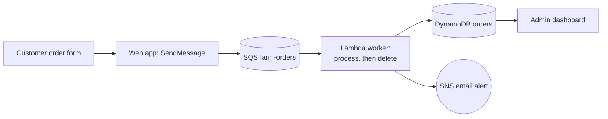
```mermaid
flowchart LR
  Cu[Customer order form] --> W[Web app: SendMessage]
  W --> Q[(SQS farm-orders)]
  Q --> L[Lambda worker:<br/>process, then delete]
  L --> D[(DynamoDB orders)]
  L --> N((SNS email alert))
  D --> A[Admin dashboard]
```

**Q: If SQS were my only order history, what happens after 4 days?**
Unprocessed messages are **permanently deleted** when the retention period ends. That's why production apps store orders in a database.

**Q: Does the message body have to look like `Order 1002: 10 chickens`?**
No. The body is free text up to 1 MiB, and SQS never reads it. In production it's usually JSON:

```json
{"orderId": "1002", "customerId": "ama", "item": "chickens", "qty": 10}
```

The body, message group ID, and deduplication ID are separate fields, so their order on the form doesn't matter.

**Q: Is the order number random, or do we provide it?**
Two kinds of ID:
- **Order number** (1002) and **deduplication ID** (`order-1002`): your app creates them
- **Message ID** (the long `1ba05f72-...` string): SQS creates it automatically

**Q: I got an "error" when I reused a deduplication ID.**
It wasn't an error. SQS accepted the send but **silently dropped** the duplicate. See [Step 2.2](#step-22-send-ordered-messages).

**Q: How long does the Kinesis part take, and does it matter for my roadmap?**
About 45–60 minutes including cleanup. It matters for SAA (Kinesis vs Firehose vs SQS is a common exam scenario) and for the Cloud AI track (streaming ingestion into a data lake is a typical ML data pipeline).

---

## 5. Hands-on lab redo guide

> [!IMPORTANT]
> Use **us-east-1** for everything so CloudShell and all resources are in the same Region. Parts 1–4 fit the free tier. **Kinesis has no free tier** (shards bill per hour), so do Parts 5 and 6 back to back and clean up right away.

> [!WARNING]
> **Redaction checklist before committing screenshots:** account ID in ARNs, queue URLs, `Topic owner`, policy `Principal` and `Resource`, success banners showing subscription ARNs, SNS `UnsubscribeURL` (in the console *and* in emails), and email addresses.

---

### Part 1: SQS standard queue

#### Step 1.1: Create the standard queue

Console → **SQS** → **Create queue**

| Section | Field | Value |
|---|---|---|
| Details | Type | **Standard** |
| | Name | `menniboe-farm-orders` |
| Configuration | Visibility timeout | **30 Seconds** |
| | Message retention period | **4 Days** |
| | Delivery delay | **0 Seconds** |
| | Maximum message size | **1024 KiB** (default) |
| | Receive message wait time | **20 Seconds** (turns on long polling) |
| Encryption | Server-side encryption | **Enabled** |
| | Encryption key type | **Amazon SQS key (SSE-SQS)** |
| Access policy | Choose method | **Basic** |
| | Who can send | **Only the queue owner** |
| | Who can receive | **Only the queue owner** |
| Redrive allow policy | | **Disabled** |
| Dead-letter queue | | **Disabled** |
| Tags | Key / Value | `Project` / `menniboe-farm` |

Click **Create queue**.

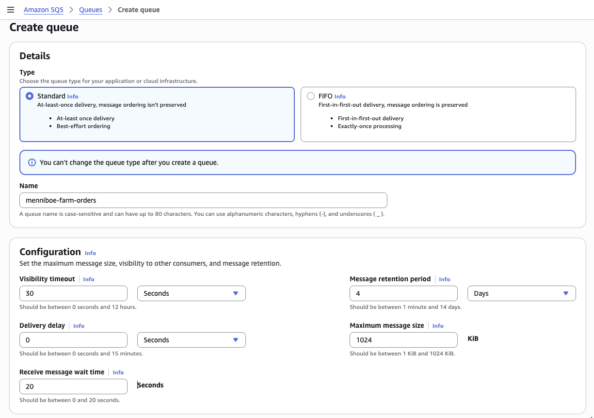

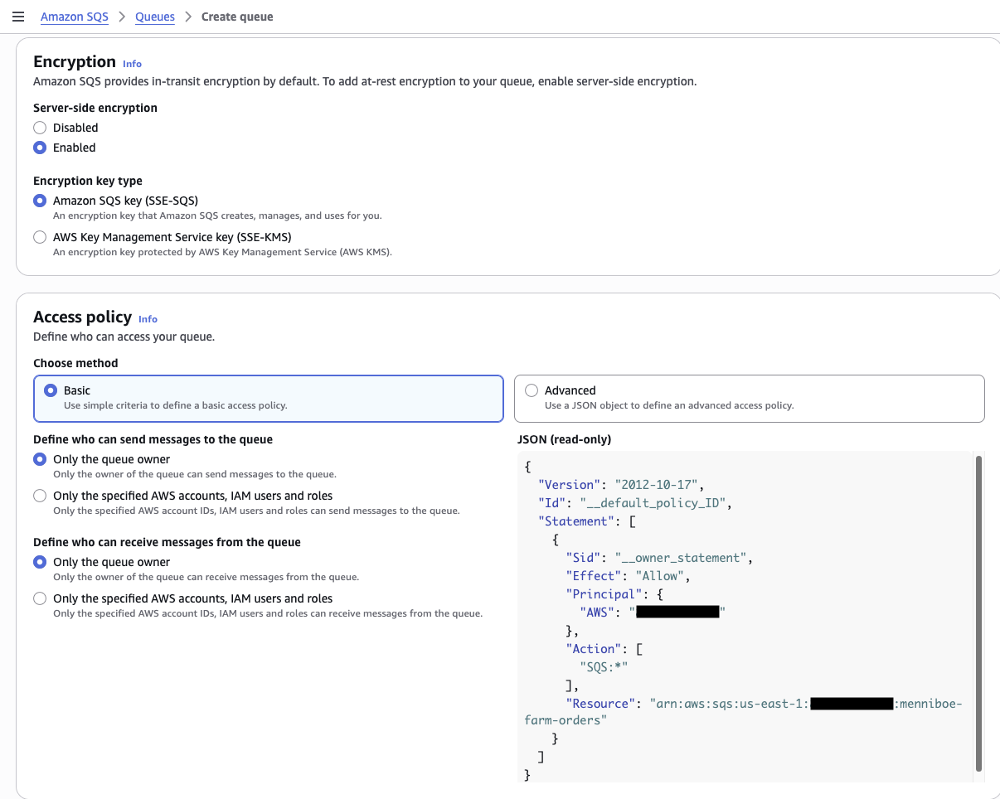

> [!NOTE]
> The JSON on the right of **Access policy** is a **resource-based policy**: `Principal` = your account only, `Action` = `SQS:*`, `Resource` = this queue's ARN. With this policy as-is, **SNS couldn't write here**, which comes back in Part 4.

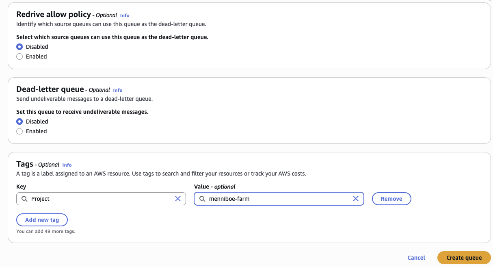

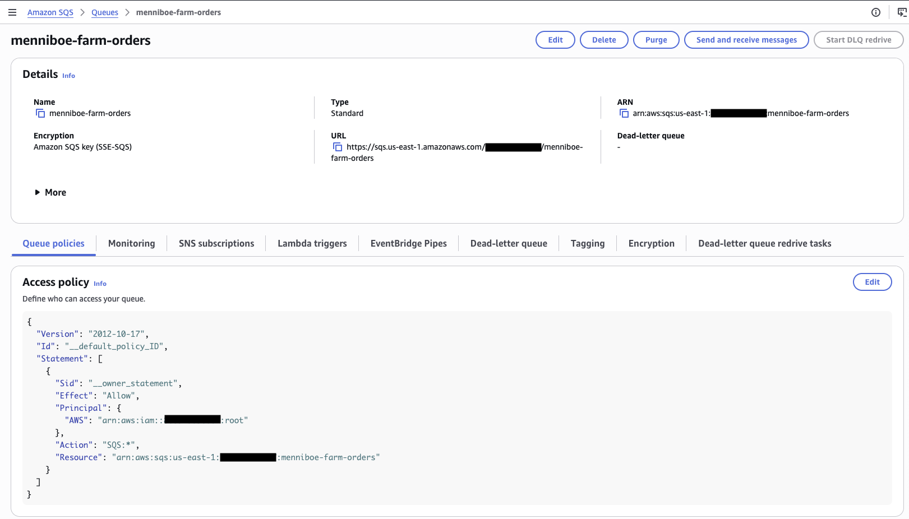

> [!NOTE]
> After saving, AWS rewrites `Principal` as `arn:aws:iam::<account-id>:root`. "root" means **the whole account**, not the root user.

---

#### Step 1.2: Test long polling and send the first order

1. Top right → **Send and receive messages**
2. **Receive messages** → **Poll for messages** while the queue is empty
   - **Prediction:** the call waits up to 20 s, then returns empty
   - **Result:** confirmed

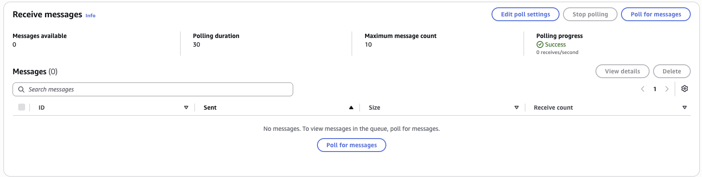

> [!NOTE]
> **Polling duration: 30** is the console's own polling window. It's separate from the queue's 20-second `WaitTimeSeconds` per `ReceiveMessage` call.

3. **Send message**:
   - Message body: `Order 1001: 2 goats`
   - Message group ID: leave **blank** (on a standard queue this is the newer *fair queues* feature and does **not** guarantee order)
   - Delivery delay: **0** seconds
   - Message attributes: none
   - **Send message**

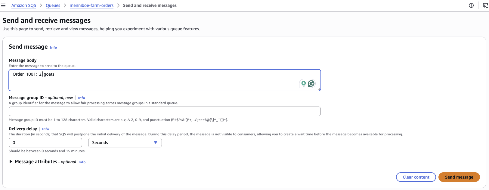

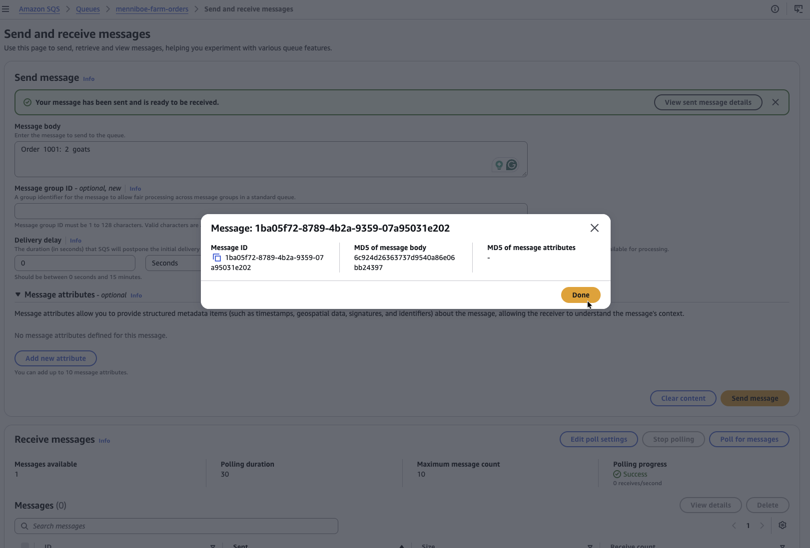

> [!NOTE]
> **MD5 of message body** is a checksum the producer can use to verify the message arrived unaltered.

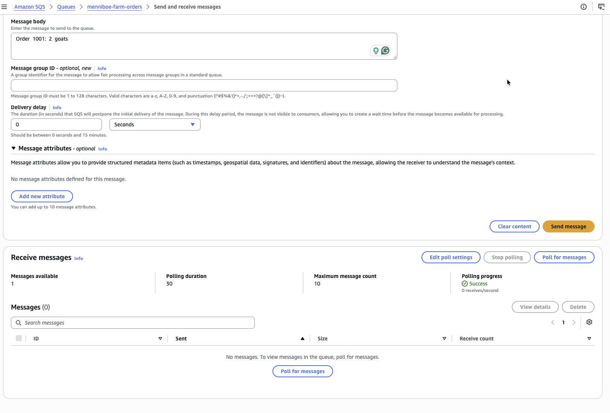

---

#### Step 1.3: Watch the visibility timeout

1. **Poll for messages** → message appears with **Receive count: 1**
2. Click the message ID → check the body says `Order 1001: 2 goats` → close
3. **Don't delete it**
4. Wait **more than 30 seconds** → **Poll for messages** again

- **Prediction:** same message ID, receive count 2
- **Result:** confirmed (`1ba05f72...`, **22 bytes**, count 1 → 2)

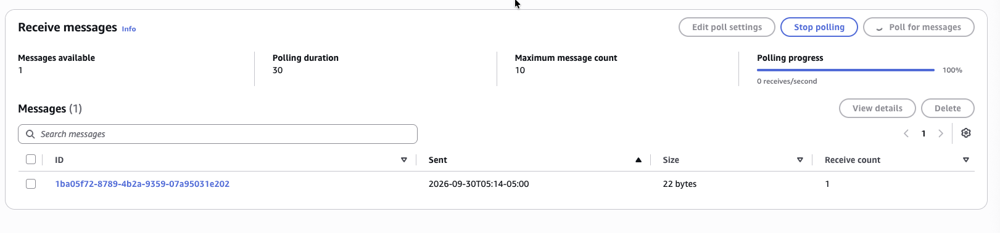

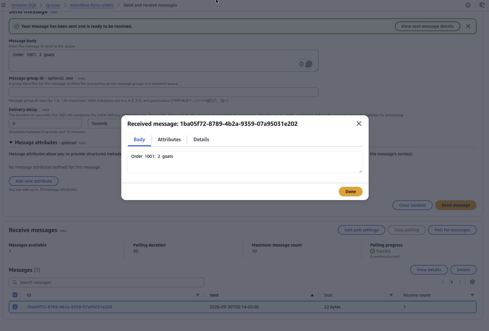

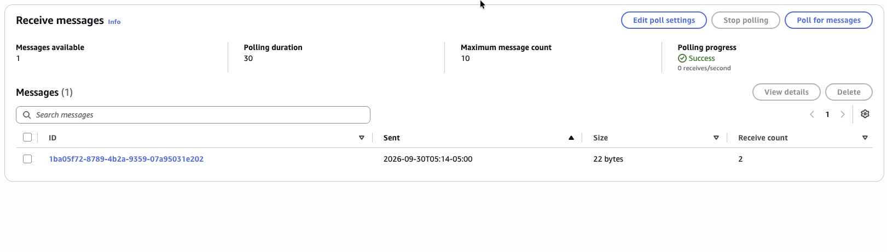

> [!IMPORTANT]
> This is exactly how a **real duplicate** happens: a slow or crashed consumer doesn't delete within the visibility timeout.

---

#### Step 1.4: Delete the message

1. Tick the message → **Delete** → confirm
2. **Poll for messages** → **Messages available: 0**, list empty

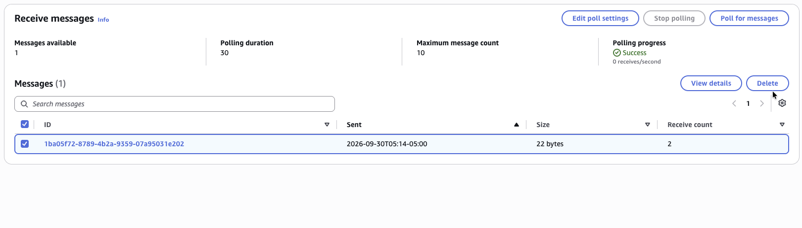

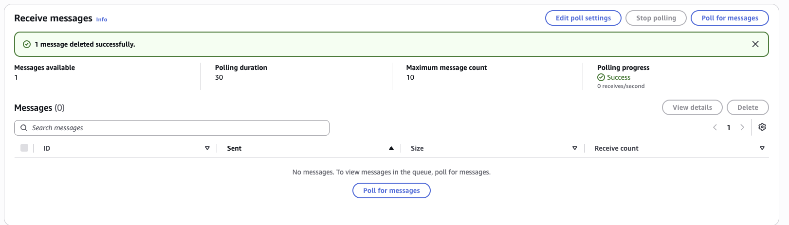

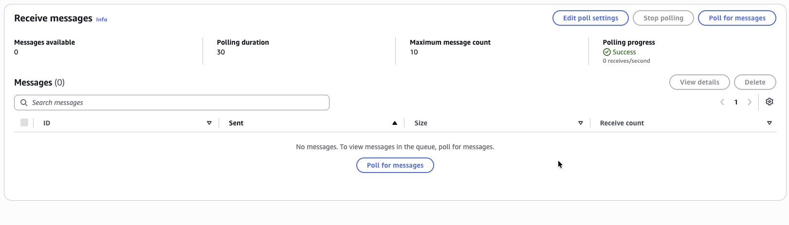

---

#### Step 1.5: Batch receive and best-effort ordering

> [!WARNING]
> **Mistake in the flow:** I typed all three orders into **one** message body. SQS stored them as **1 message, 63 bytes**, because it treats the body as one opaque blob.
>
> 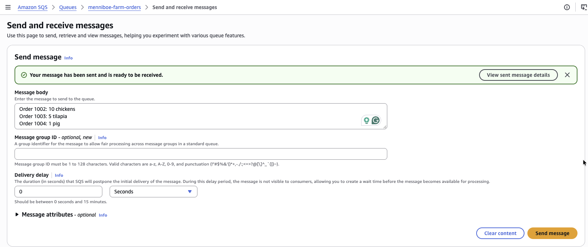
>
> 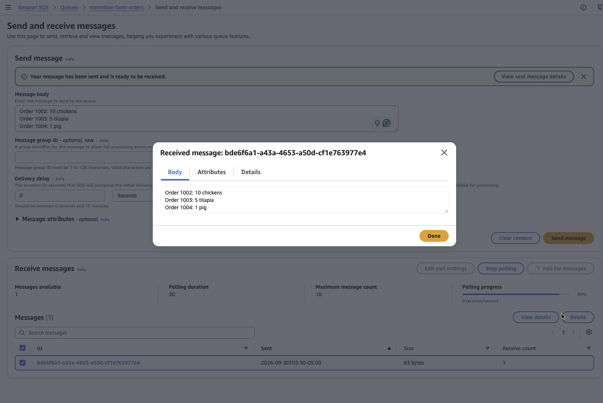
>
> **Why it matters:** if a worker fails on the pig, the *whole* message reappears and the chickens and tilapia get reprocessed too.
> **Fix:** delete it, then send **one order per message** so each can be retried and spread across workers independently.

Redo: send three **separate** messages, clicking **Send message** after each:

| Body | Bytes |
|---|---|
| `Order 1002: 10 chickens` | 23 |
| `Order 1003: 5 tilapia` | 21 |
| `Order 1004: 1 pig` | 17 |

**Poll for messages** once → three rows, three message IDs.

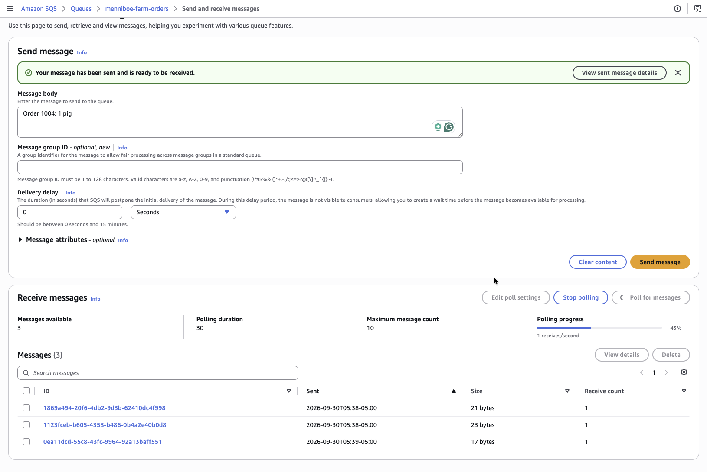

**Detective work with byte sizes:** the list came back as **21 → 23 → 17** (tilapia, chickens, pig). Chickens were sent first, but tilapia showed up first: that's **best-effort ordering**.

> [!NOTE]
> The console list sorts by "Sent" time shown to the minute, so treat this as a hint rather than proof. The rule still stands: a standard queue never *guarantees* order.

Select all → **Delete**. Keep the queue for Part 4.

---

### Part 2: SQS FIFO queue

#### Step 2.1: Create the FIFO queue

SQS → **Create queue**

| Section | Field | Value |
|---|---|---|
| Details | Type | **FIFO** |
| | Name | `menniboe-farm-orders.fifo` (**must** end in `.fifo`) |
| Configuration | Visibility timeout | **30 Seconds** |
| | Message retention period | **4 Days** |
| | Delivery delay | **0 Seconds** |
| | Maximum message size | **1024 KiB** |
| | Receive message wait time | **20 Seconds** |
| FIFO queue settings | Content-based deduplication | **Off** (we send our own dedup IDs) |
| | High throughput FIFO queue | **Off** |
| | Deduplication scope | **Queue** |
| | FIFO throughput limit | **Per queue** |
| Encryption | Server-side encryption | **Enabled**, **SSE-SQS** |
| Access policy | Method / send / receive | **Basic** / **Only the queue owner** / **Only the queue owner** |
| Redrive allow policy | | **Disabled** |
| Dead-letter queue | | **Disabled** |
| Tags | Key / Value | `Project` / `menniboe-farm` |

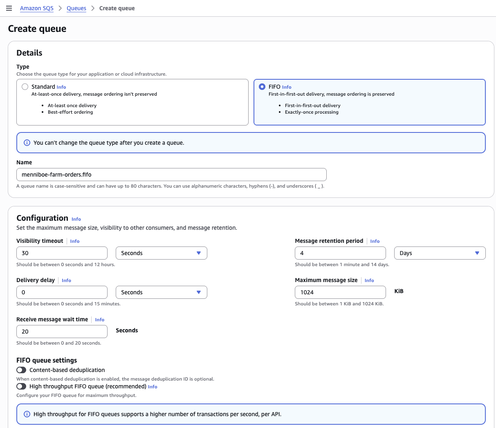

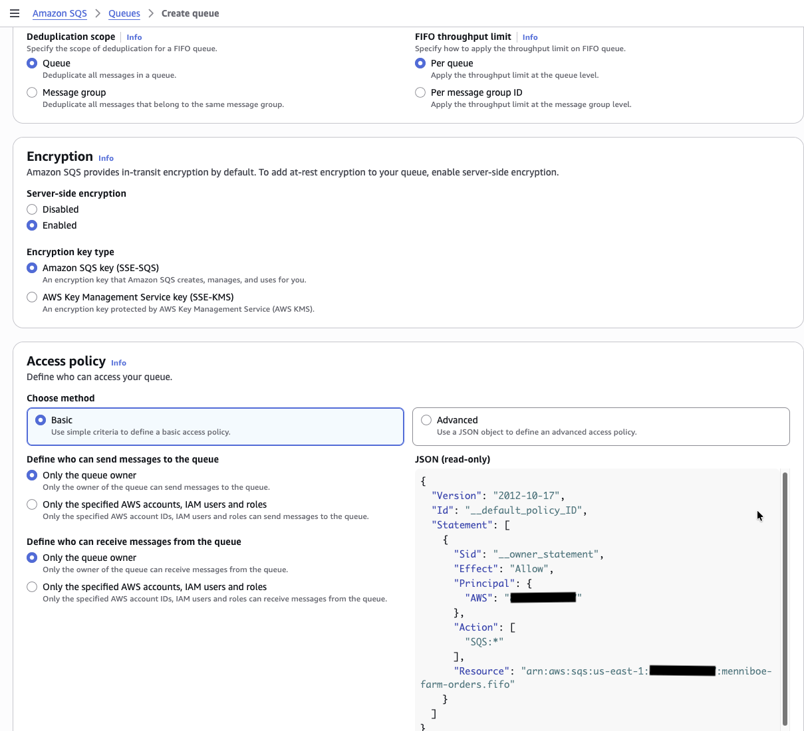

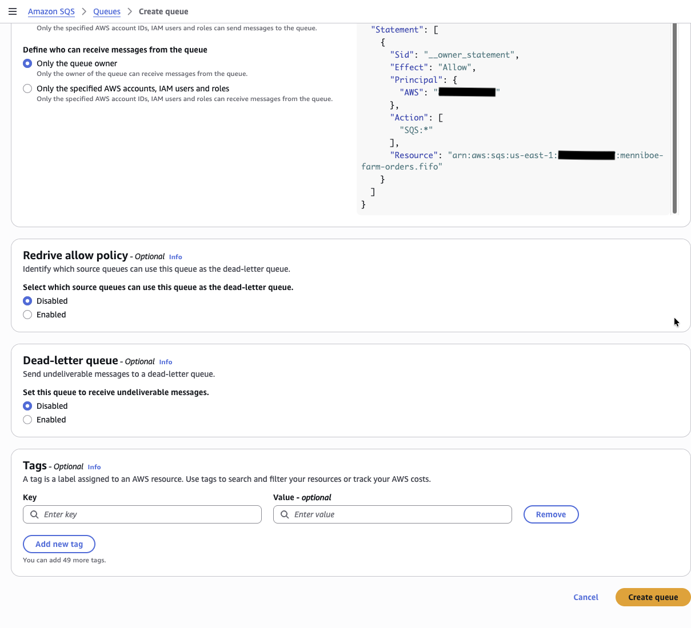

> [!TIP]
> My screenshot shows **Tags empty**. Add `Project` / `menniboe-farm` before clicking Create, to match the other resources for cost tracking.

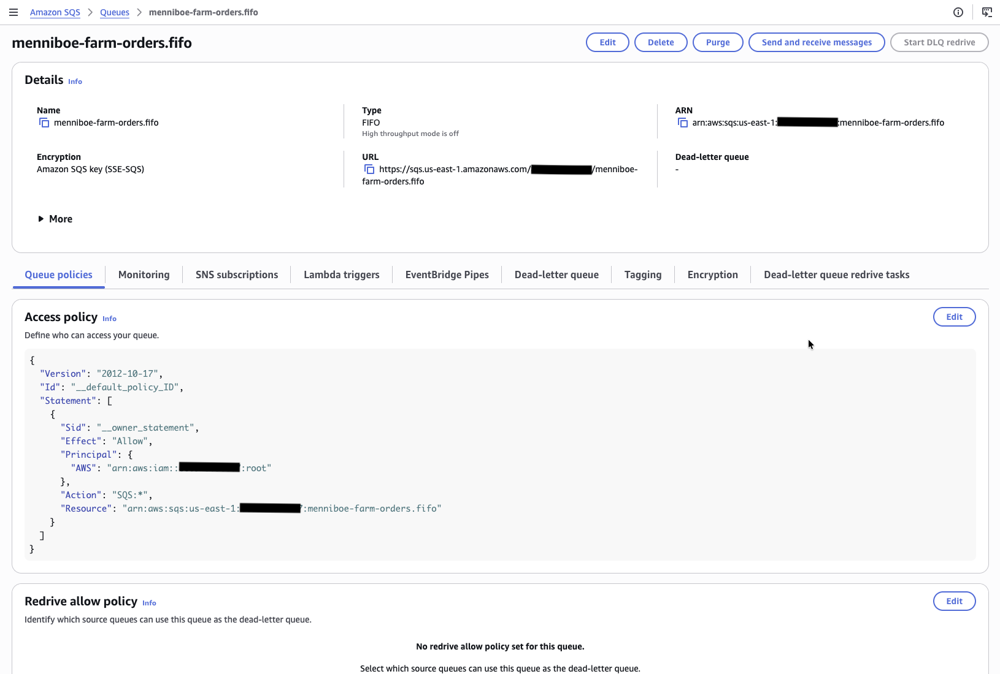

> [!NOTE]
> The details page shows **"High throughput mode is off."**

---

#### Step 2.2: Send ordered messages

**Prediction:** same group ID → they come back exactly in sent order.

**Send and receive messages** → send these three, one at a time. FIFO now **requires** the group and dedup fields:

| # | Message body | Message group ID | Message deduplication ID |
|---|---|---|---|
| 1 | `Order 1002: 10 chickens` | `customer-ama` | `order-1002` |
| 2 | `Order 1003: 5 tilapia` | `customer-ama` | `order-1003` |
| 3 | `Order 1004: 1 pig` | `customer-ama` | `order-1004` |

> [!WARNING]
> **Accidental dedup demo:** I sent the pig order with the dedup ID **still set to `order-1003`** (left over from tilapia). The green banner said *"sent and ready to be received"* with **no error**, but **Messages available stayed at 2**.
>
> 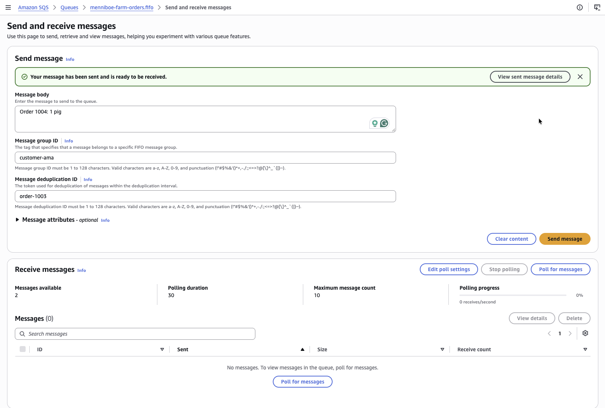
>
> **Cause:** SQS saw `order-1003` again within 5 minutes, treated the pig as a duplicate of tilapia, and **silently dropped** it. Dedup looks **only at the dedup ID, not the body**.
> **Fix:** resend with dedup ID `order-1004` → count goes to 3.
> **Production lesson:** derive the dedup ID from something unique per order, like the order number.

**Poll for messages** → sizes **23 → 21 → 17** = chickens → tilapia → pig, exactly as sent. Compare with the standard queue in Step 1.5.

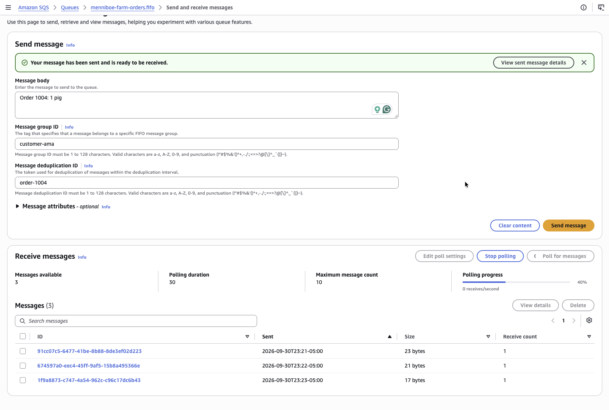

---

#### Step 2.3: Deduplication window test and purge

1. Resend: body `Order 1002: 10 chickens`, group `customer-ama`, dedup `order-1002`
2. Expected within 5 minutes: count stays **3**
3. **Actual: count went to 4**

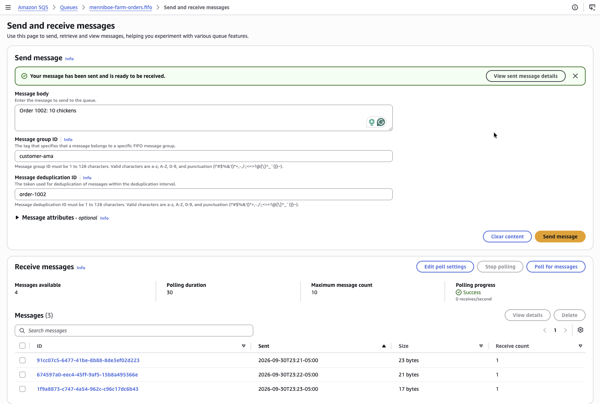

> [!NOTE]
> The original chickens order was sent at **23:21**, and the resend came more than **5 minutes** later, so the **dedup window had closed** and SQS accepted it as new.
> - Same dedup ID within 5 min → dropped
> - Same dedup ID after 5 min → accepted as new
>
> FIFO dedup only protects against quick retries. For long-term protection, make the consumer **idempotent** (for example, check "already processed order 1002?" in the database).

**Purge to clean up:** queue page → **Purge** → type `purge` → confirm (can take up to 60 s).

> [!WARNING]
> **Purge** deletes *every* message in the queue. Handy in dev, dangerous in production.

---

### Part 3: SNS topic with email

#### Step 3.1: Create the SNS topic

> [!NOTE]
> The account already had `Default_CloudWatch_Alarms_Topic` (AWS creates it when you set up CloudWatch alarm email notifications in the console). It's a real example of CloudWatch alarm → SNS → email. **Leave it alone** and don't delete it during cleanup.
>
> 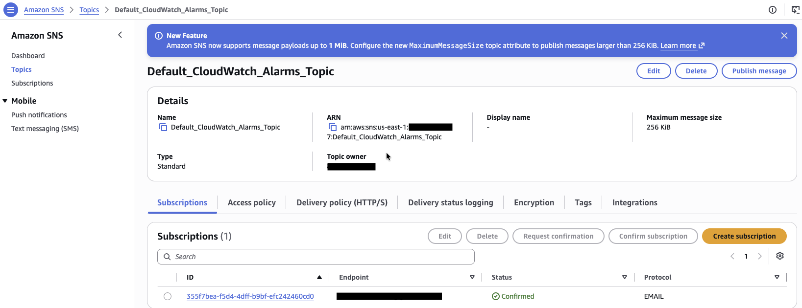

Console → **SNS** → **Topics** → **Create topic**

> [!WARNING]
> **Default gotcha:** the console preselected **FIFO**. FIFO topics only support **SQS** subscribers, and our next step is email. Topic type **can't be changed after creation**, so switch to **Standard**.
>
> 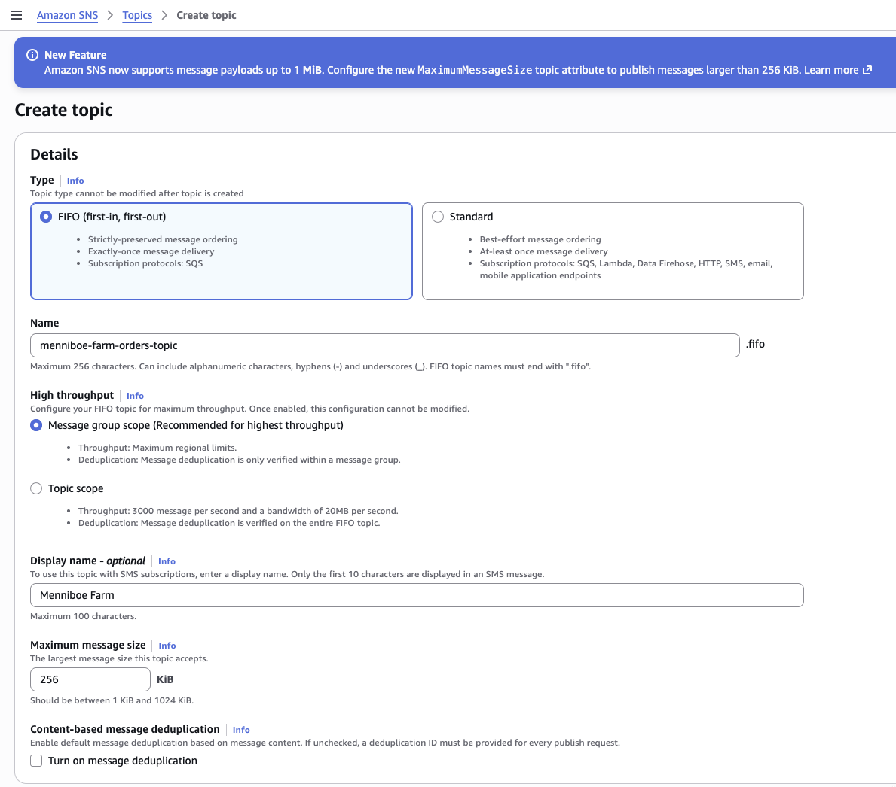

| Section | Field | Value |
|---|---|---|
| Details | Type | **Standard** |
| | Name | `menniboe-farm-orders-topic` |
| | Display name | `Menniboe Farm` (sender name for email/SMS) |
| | Maximum message size | **256 KiB** (default; up to 1 MiB now supported) |
| Encryption | | **Off** |
| Access policy | Method | **Basic** |
| | Publishers | **Only the topic owner** |
| | Subscribers | **Only the topic owner** |
| Archive policy | | Leave default (FIFO topics only) |
| Data protection policy | | None |
| Delivery policy (HTTP/S) | | Defaults |
| Message delivery status logging | | Unconfigured |
| Tags | Key / Value | `Project` / `menniboe-farm` |
| Active tracing | | **Off** |

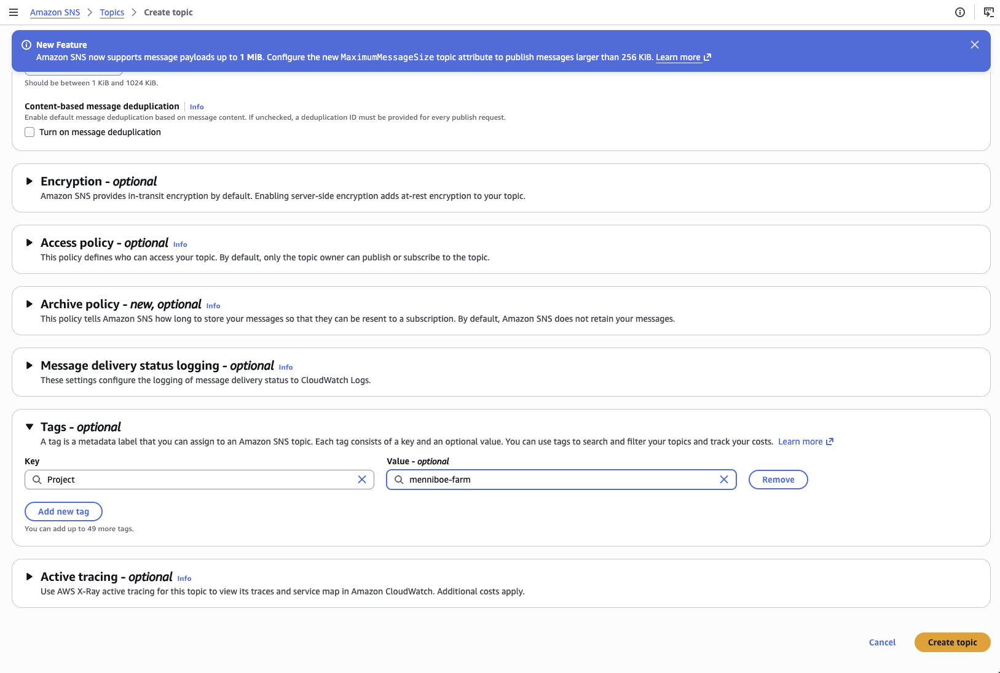

**Create topic** → topic shows **Subscriptions (0)**.

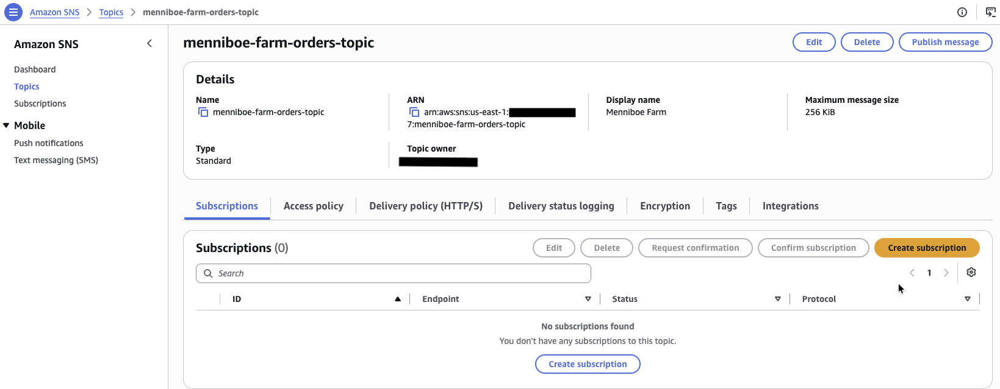

> [!NOTE]
> New console features: SNS **maximum message size** now goes up to **1 MiB** (default 256 KiB), and **Archive policy** lets FIFO topics keep messages for replay. By default SNS still retains nothing.

---

#### Step 3.2: Create the email subscription

Topic page → **Create subscription**

| Field | Value |
|---|---|
| Topic ARN | Prefilled |
| Protocol | **Email** |
| Endpoint | *(your inbox)* |
| Subscription filter policy | **Off** |
| Redrive policy (DLQ) | **Off** |

**Create subscription** → status **Pending confirmation**.

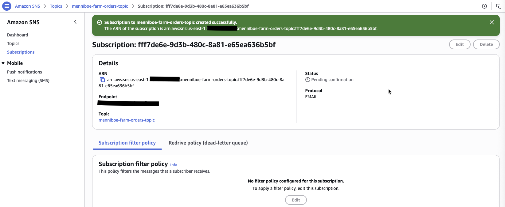

Open the email from **Menniboe Farm** → **Confirm subscription** → refresh the console → **Confirmed**.

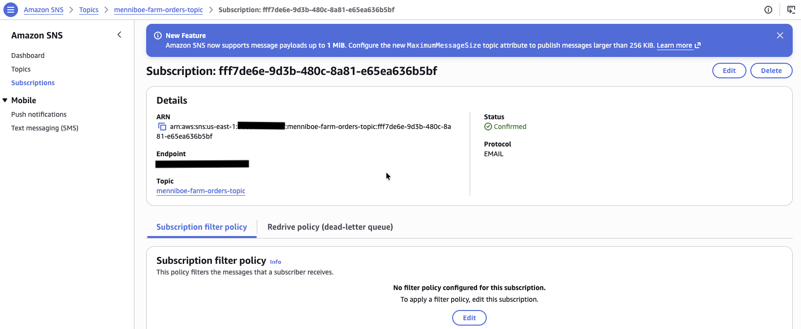

> [!IMPORTANT]
> Before confirmation, SNS delivers **nothing** to the endpoint (only the confirmation request), which protects people from topics they never agreed to. Same-account **SQS** subscriptions confirm automatically.

---

#### Step 3.3: Publish a message

Topic → **Publish message**

| Field | Value |
|---|---|
| Subject | `New order 1001` |
| Message group ID | Blank |
| Time to Live (TTL) | Blank |
| Message structure | **Identical payload for all delivery protocols** |
| Message body | `Order 1001: 2 goats. Please prepare for pickup.` |
| Message attributes | None |

**Publish message**.

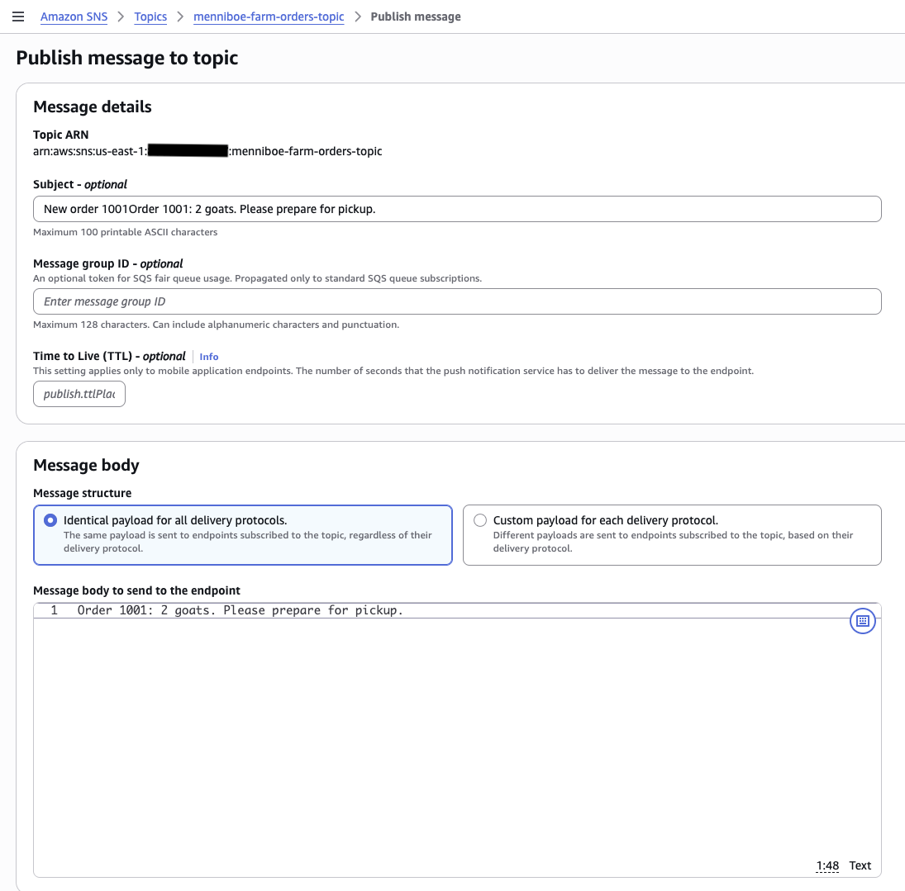

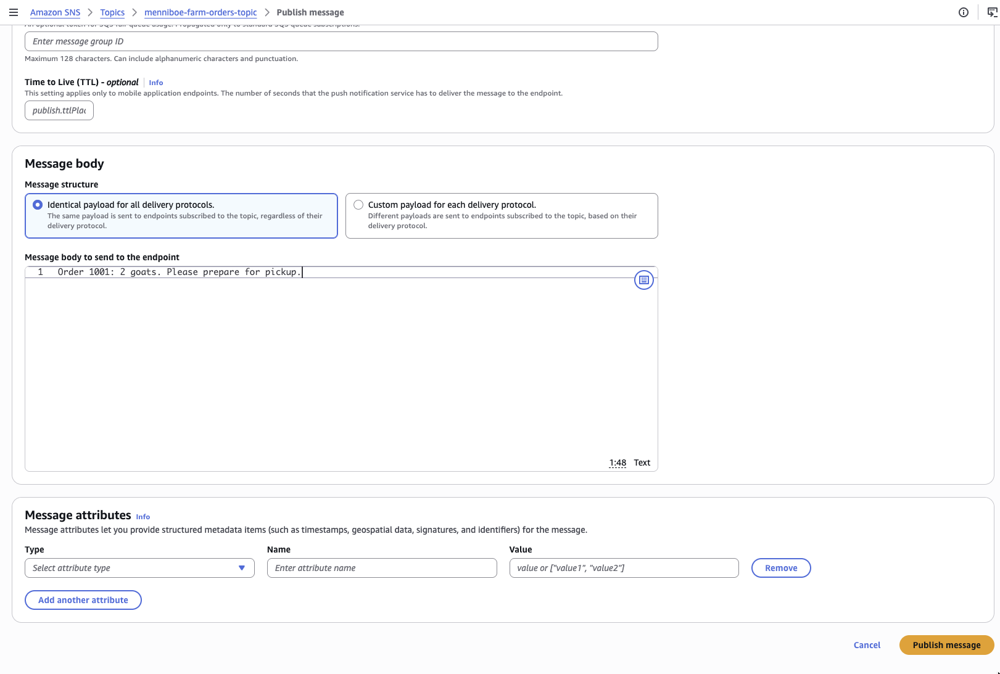

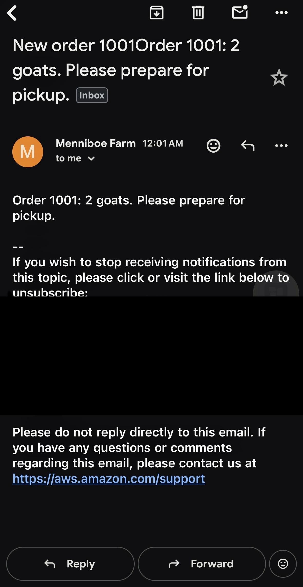

> [!WARNING]
> **Small mistake:** the body text also got pasted into **Subject**, so the email subject read "New order 1001Order 1001: 2 goats…". Harmless; type only `New order 1001` in Subject.

> [!WARNING]
> The email's **unsubscribe link** contains the account ID and subscription ARN. Redact it, and **don't click it** or the subscription is removed.

**Prediction answered:** there was **no poll step**.
- **SQS (Part 1):** pull. I clicked "Poll for messages" to go get it.
- **SNS (Part 3):** push. SNS delivered it straight to my inbox when I published.

---

### Part 4: SNS to SQS fan-out with filters

#### Step 4.1: Create two subscriber queues

Create each queue with these settings:

| Section | Field | Value |
|---|---|---|
| Details | Type | **Standard** |
| | Name | Queue 1: `menniboe-livestock-orders` · Queue 2: `menniboe-produce-orders` |
| Configuration | Visibility timeout | **30 Seconds** |
| | Message retention period | **4 Days** |
| | Delivery delay | **0 Seconds** |
| | Maximum message size | Default |
| | Receive message wait time | **20 Seconds** |
| Encryption | | **Enabled**, **SSE-SQS** |
| Access policy | | **Basic**, **Only the queue owner** (send and receive) |
| Redrive allow policy / DLQ | | **Disabled** / **Disabled** |
| Tags | | `Project` / `menniboe-farm` |

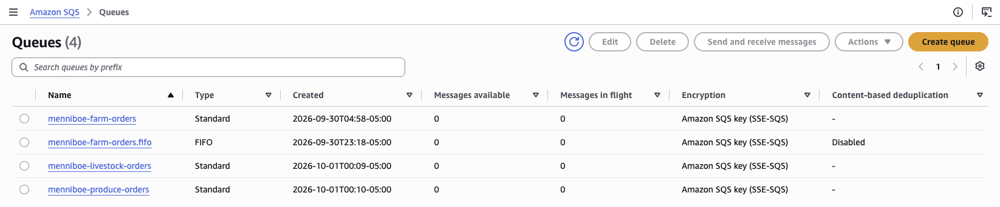

> [!NOTE]
> **Messages in flight** = received but not yet deleted (hidden by the visibility timeout).

**Prediction:** with "Only the queue owner" can send, can SNS deliver into these queues? **No.** SNS is a separate service principal, and the queue's policy must let it in.

---

#### Step 4.2: Subscribe the livestock queue

Subscribing from the **SQS side** makes the console update the queue policy for you.

1. SQS → `menniboe-livestock-orders` → **Queue policies** tab (note: one owner statement only)
2. **Subscribe to Amazon SNS topic** → select `menniboe-farm-orders-topic` → **Save**
3. **SNS subscriptions (1)** appears, with **no confirmation needed**

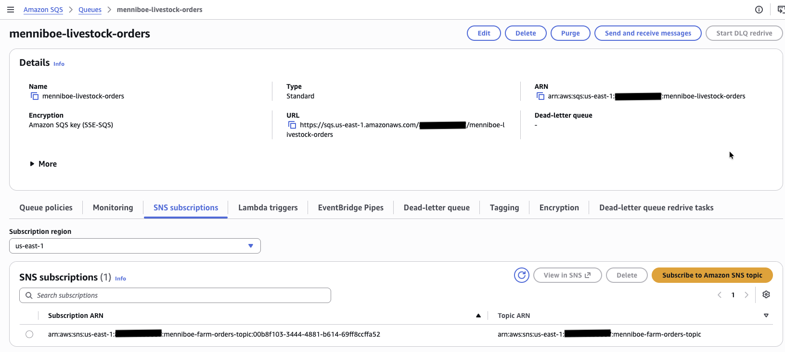

4. **Queue policies** tab again → a **second statement** appears, with a `Sid` naming the topic

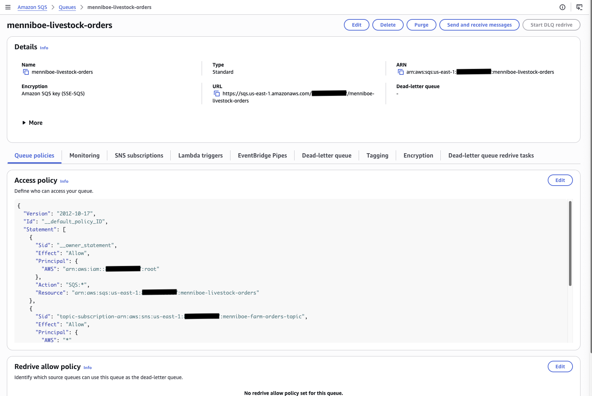

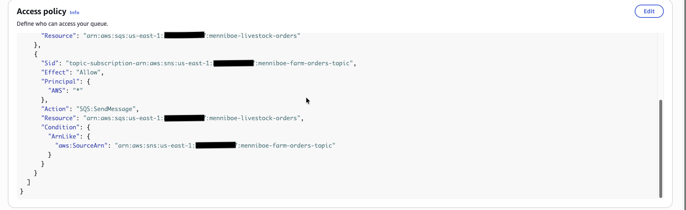

**Reading the auto-generated statement**

| Field | Value | Meaning |
|---|---|---|
| `Effect` | `Allow` | Grants permission |
| `Principal` | `{"AWS": "*"}` | Anyone, in principle… |
| `Action` | `SQS:SendMessage` | …but only to **send** (no receive, no delete) |
| `Resource` | `…:menniboe-livestock-orders` | …only into **this** queue |
| `Condition` → `ArnLike` → `aws:SourceArn` | `…:menniboe-farm-orders-topic` | …and only when the request **comes from my topic** |

```json
{
  "Sid": "topic-subscription-arn:aws:sns:us-east-1:<account-id>:menniboe-farm-orders-topic",
  "Effect": "Allow",
  "Principal": { "AWS": "*" },
  "Action": "SQS:SendMessage",
  "Resource": "arn:aws:sqs:us-east-1:<account-id>:menniboe-livestock-orders",
  "Condition": {
    "ArnLike": {
      "aws:SourceArn": "arn:aws:sns:us-east-1:<account-id>:menniboe-farm-orders-topic"
    }
  }
}
```

> [!TIP]
> The `*` is fenced in by the condition, so only my topic can send. That's least privilege: the owner gets `SQS:*`, the topic gets only `SendMessage`. A tighter production version uses `"Principal": {"Service": "sns.amazonaws.com"}` with the same `SourceArn` condition.

---

#### Step 4.3: Subscribe the produce queue

Repeat Step 4.2 for `menniboe-produce-orders` → **SNS subscriptions (1)**. The same auto-generated statement appears.

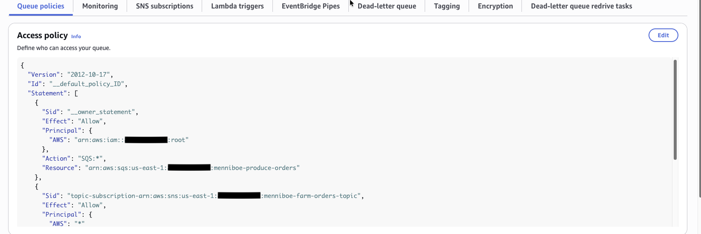

The topic now has **3 subscriptions**: 1 EMAIL + 2 SQS. That's the fan-out.

---

#### Step 4.4: Add filter policies

SNS → **Subscriptions** → click the subscription **ID** whose endpoint ends in `menniboe-livestock-orders` → **Edit**

| Field | Value |
|---|---|
| Enable raw message delivery | **Off** |
| Subscription filter policy | Expand the collapsed section → toggle **On** |
| Filter policy scope | **Message attributes** |
| JSON editor | `{"category": ["livestock"]}` |
| Redrive policy | **Off** |

**Save changes**.

> [!TIP]
> **"I don't see this step":** the **Subscription filter policy - optional** section is **collapsed by default** on the Edit page. Click its ▶ title to expand it, then flip the toggle.

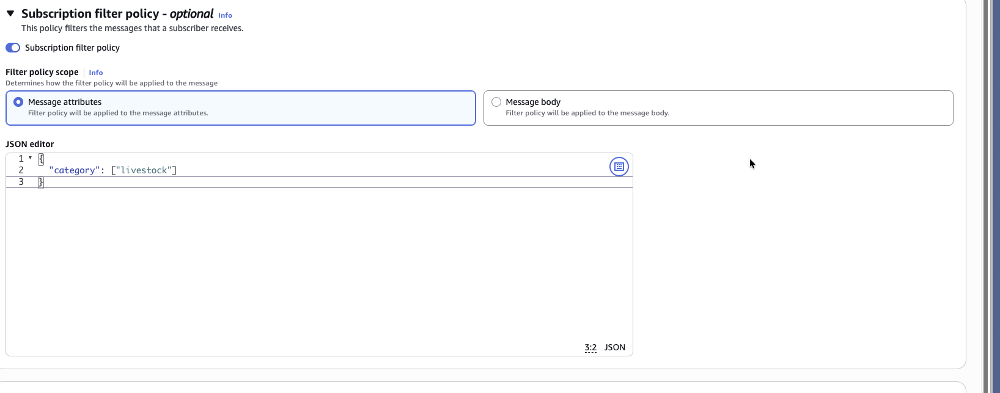

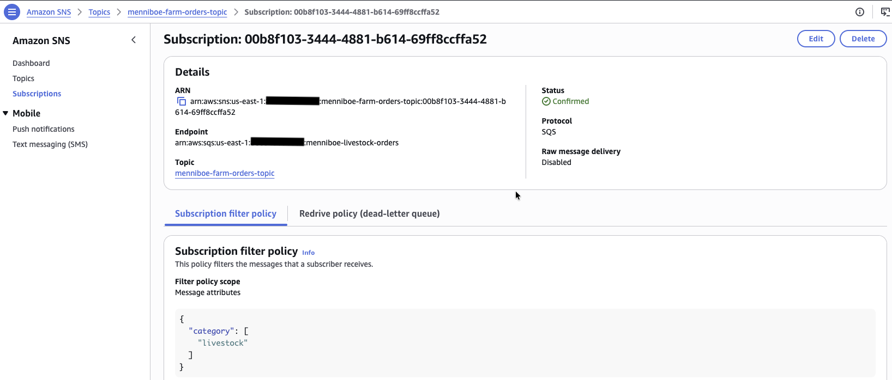

Repeat for the **produce** subscription with:

```json
{ "category": ["produce"] }
```

Email subscription: **no filter** (a farm manager who wants every order).

**Prediction:** an order with `category = livestock` reaches the **livestock queue and email only**.

---

#### Step 4.5: Publish filtered orders

Topic → **Publish message**, twice:

| Field | Message 1 | Message 2 |
|---|---|---|
| Subject | `New order 2001` | `New order 2002` |
| Message structure | Identical payload | Identical payload |
| Body | `Order 2001: 3 goats` | `Order 2002: 20 kg tomatoes` |
| Attribute Type / Name / Value | String / `category` / `livestock` | String / `category` / `produce` |

Then SQS → **Queues** → refresh → check **Messages available**.

---

#### Step 4.6: Debug and fix the routing

> [!WARNING]
> **Bug found:** results didn't match the design.
>
> | Subscriber | Expected | Actual |
> |---|---|---|
> | Livestock queue | 1 | **0** |
> | Produce queue | 1 | **2** |
> | Email (no filter) | 2 | 2 ✓ |
>
> 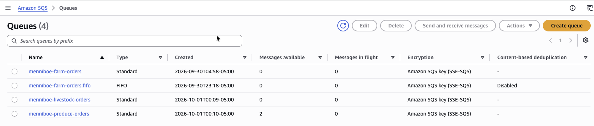
>
> 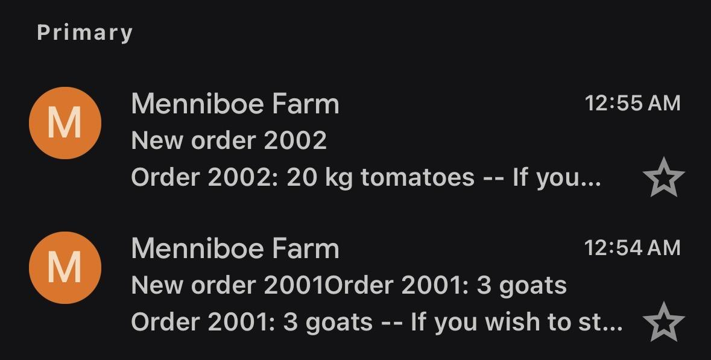

**Investigation:** Poll the produce queue → open the goats message → **Body** tab. With raw message delivery **off**, SNS wraps the order in a JSON **envelope**:

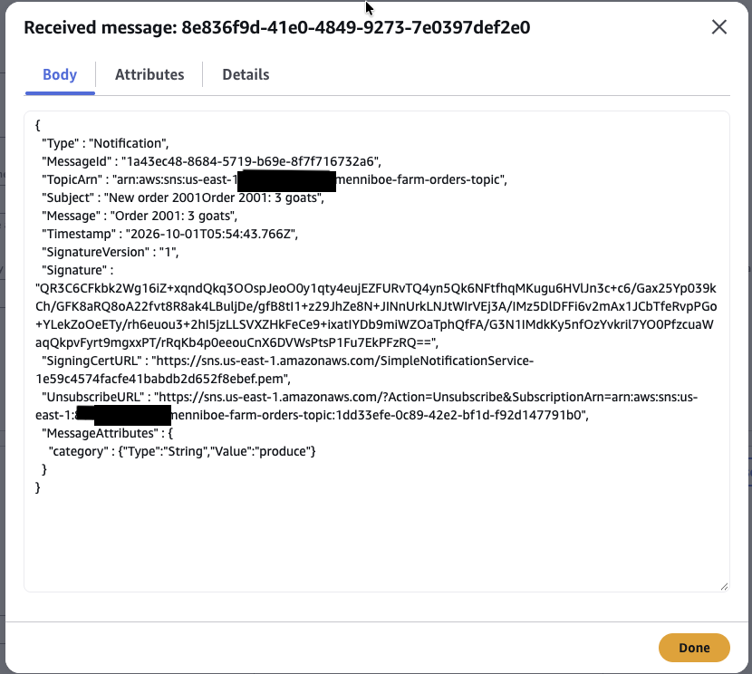

```json
"Message" : "Order 2001: 3 goats",
"MessageAttributes" : {
  "category" : {"Type":"String","Value":"produce"}
}
```

> [!WARNING]
> **Root cause 1, wrong attribute on the message:** Order 2001 (goats) was published with `category = produce`. The filters worked exactly as designed. **SNS filters match the attribute, never the message content**, and SNS never reads "3 goats".
> **Fix:** publish `Order 2003: 4 goats` with `category = livestock` (all lowercase).
> **Production lesson:** producers should set attributes in code, not by hand.

After the fix: livestock **1**, but produce went from **2 to 3**, even though Order 2003 was tagged `livestock`.

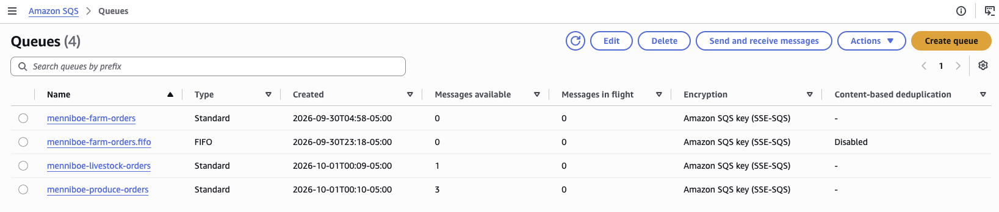

> [!WARNING]
> **Root cause 2, filter never saved:** the **produce** subscription had **no filter policy**. A subscription with no filter receives **everything** (the default). A filter only takes effect after **Save changes** on that specific subscription.
> **Fix:** SNS → Subscriptions → produce subscription → confirm "No filter policy configured" → **Edit** → add `{"category": ["produce"]}` → **Save changes**.

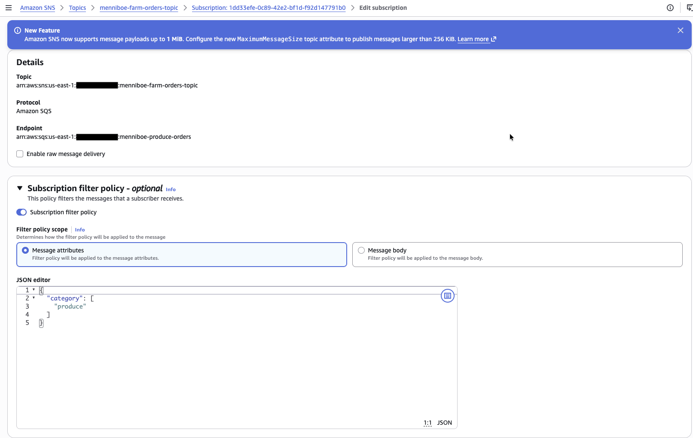

**Verify:** publish `Order 2004: 2 pigs` with `category = livestock` → livestock **2**, produce stays **3**.


**About the SNS envelope:** `Type`, `MessageId`, `TopicArn`, `Subject`, `Timestamp`, `Signature` (lets receivers verify it came from SNS), `SigningCertURL`, `UnsubscribeURL`, `MessageAttributes`. The actual order is just the `"Message"` field. **Raw message delivery = on** drops the wrapper and delivers only the body.

---

### Part 5: Kinesis Data Streams

> [!WARNING]
> From here on, the clock is running: a provisioned shard bills **every hour**, with **no free tier**. Take any breaks **before** creating the stream.

#### Step 5.1: Create the data stream

Console → **Kinesis** → **Data streams** → **Create data stream**

| Section | Field | Value |
|---|---|---|
| Data stream configuration | Name | `menniboe-farm-stream` |
| Data stream capacity | Capacity mode | **Provisioned** |
| | Provisioned shards | **1** (shows write 1 MiB/s and 1,000 records/s, read 2 MiB/s) |
| Maximum record size | | **1024 KiB** (default; max 10,240 KiB) |
| Data stream settings | Retention | **1 day** (editable later) |
| | Server-side encryption | **Disabled** (editable later) |
| | Monitoring enhanced metrics | Disabled |
| Tags | Key / Value | `Project` / `menniboe-farm` |

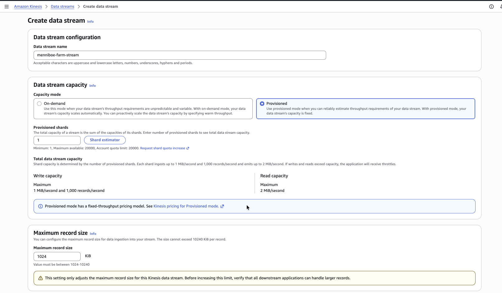

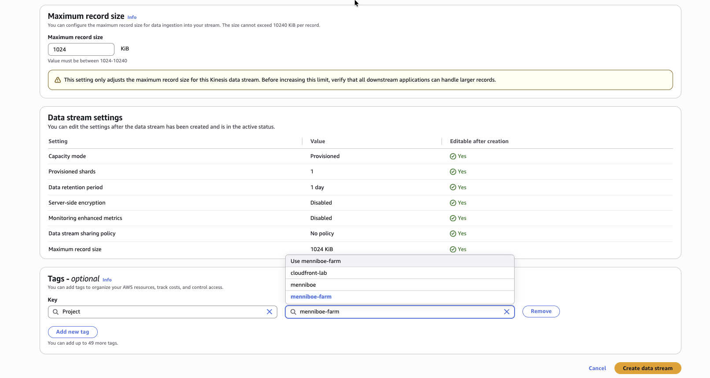

> [!NOTE]
> Unlike SQS (SSE-SQS on by default), Kinesis **SSE is disabled by default**.

**Create data stream** → wait for **Active** (under a minute).

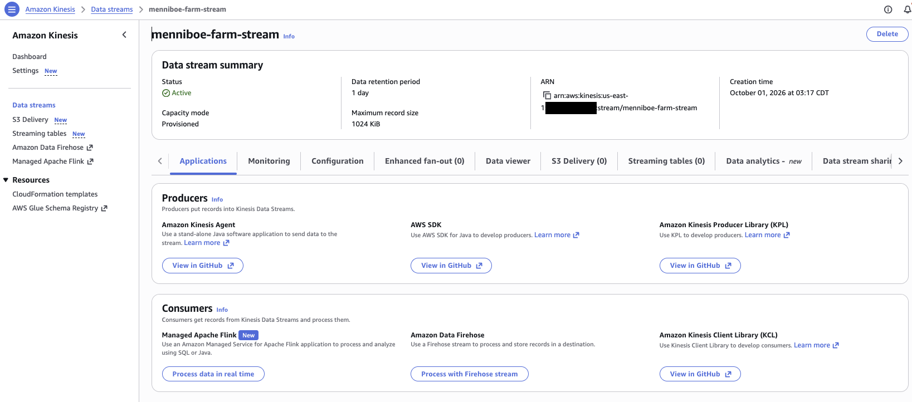

> [!NOTE]
> The **Producers** panel lists Kinesis Agent, SDK, KPL; the **Consumers** panel lists Managed Apache Flink, Firehose, KCL. There's also an **Enhanced fan-out (0)** tab.

---

#### Step 5.2: Produce records from CloudShell

Open **CloudShell** (`>_` icon in the top bar). Check the CLI version:

```bash
aws --version
```

Output: `aws-cli/2.37.5 …` (CLI v2, so `--cli-binary-format` is needed).

```bash
aws kinesis put-record \
  --stream-name menniboe-farm-stream \
  --partition-key customer-ama \
  --data "Order 3001: 3 goats" \
  --cli-binary-format raw-in-base64-out

aws kinesis put-record \
  --stream-name menniboe-farm-stream \
  --partition-key customer-kofi \
  --data "Order 3002: 50 kg tilapia" \
  --cli-binary-format raw-in-base64-out

aws kinesis put-record \
  --stream-name menniboe-farm-stream \
  --partition-key customer-ama \
  --data "Order 3003: 12 eggs trays" \
  --cli-binary-format raw-in-base64-out
```

| Flag | Meaning |
|---|---|
| `--partition-key` | Picks the shard; same key → same shard → ordered |
| `--cli-binary-format raw-in-base64-out` | Lets you type plain text; CLI v2 otherwise expects base64 input |

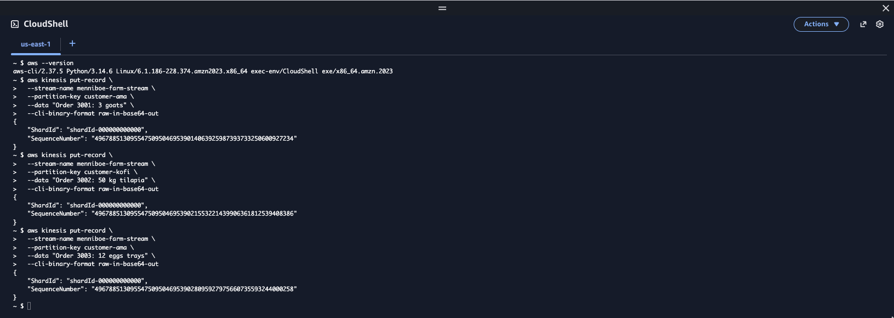

**Result:** all three records landed in `shardId-000000000000`. With one shard, every partition key maps to it; keys only spread records when there are several shards. **SequenceNumbers increase** with each record, which is how Kinesis tracks order in a shard.

---

#### Step 5.3: Consume and decode records

Low-level reading takes three moves: find the shard, get an iterator (bookmark), read.

```bash
aws kinesis list-shards --stream-name menniboe-farm-stream

SHARD_ITERATOR=$(aws kinesis get-shard-iterator \
  --stream-name menniboe-farm-stream \
  --shard-id shardId-000000000000 \
  --shard-iterator-type TRIM_HORIZON \
  --query 'ShardIterator' \
  --output text)

aws kinesis get-records --shard-iterator "$SHARD_ITERATOR"
```

| Iterator type | Starts at |
|---|---|
| `TRIM_HORIZON` | Oldest record still in the stream |
| `LATEST` | Only records arriving after now |

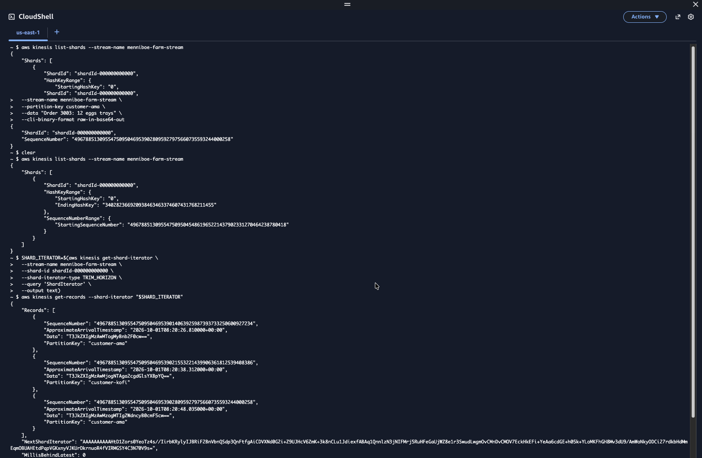

The `Data` field is **base64** (for example `T3JkZXIgMzAwMTogMyBnb2F0cw==` = `Order 3001: 3 goats`), because Kinesis stores raw bytes. Decode:

```bash
aws kinesis get-records --shard-iterator "$SHARD_ITERATOR" \
  --query 'Records[].Data' --output text \
  | tr '\t' '\n' | while read d; do echo "$d" | base64 --decode; echo; done
```

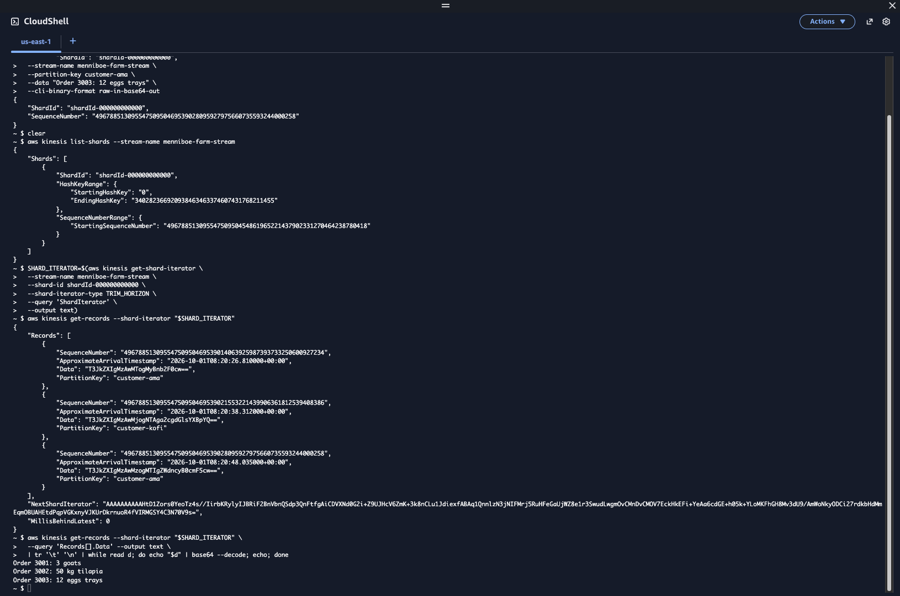

**Results**
- Order: **3001 → 3002 → 3003**, matching increasing SequenceNumbers
- I called `get-records` **twice** with the same iterator and got all three both times. Nothing was deleted: that's **replay**
- `NextShardIterator` = bookmark for the next read (a real consumer keeps moving forward)
- `MillisBehindLatest: 0` = consumer fully caught up

---

### Part 6: Data Firehose to S3

#### Step 6.1: Create the S3 bucket

S3 → **Create bucket**

| Section | Field | Value |
|---|---|---|
| General configuration | Bucket type | **General purpose** |
| | Bucket name | `menniboe-farm-datalake-<initials>` (globally unique) |
| Object Ownership | | **ACLs disabled (recommended)**, Bucket owner enforced |
| Block Public Access | | **Block all public access** ✓ |
| Bucket Versioning | | **Disable** |
| Tags | Key / Value | `Project` / `menniboe-farm` |
| Default encryption | Type | **SSE-S3** |
| | Bucket Key | **Enable** |
| Advanced settings | Object Lock | **Disable** |

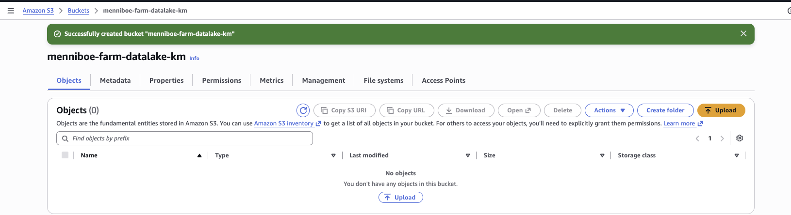

---

#### Step 6.2: Create the Firehose stream

**Prediction:** records already in the stream (3001–3003) **won't** be delivered. Firehose starts reading from **LATEST** when it's created.

Console → **Amazon Data Firehose** → **Create Firehose stream**

> [!WARNING]
> **First attempt: four problems caught before clicking Create.** Source and destination **can't be changed after creation**, so check everything first.
>
> 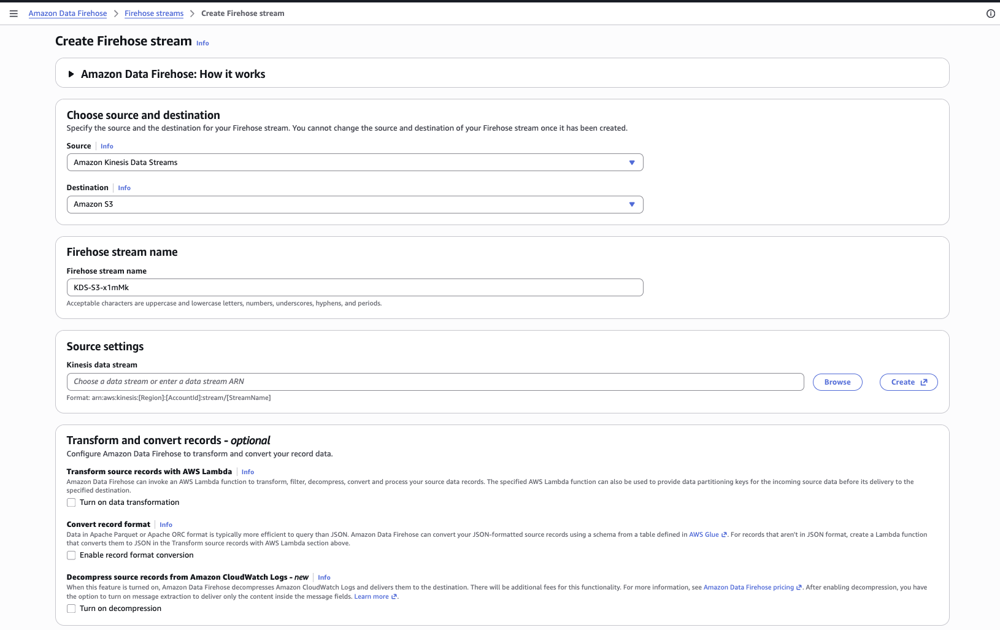
>
> 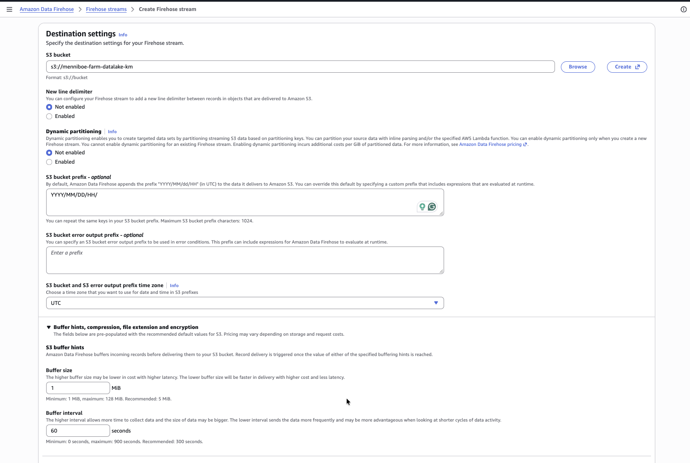
>
> 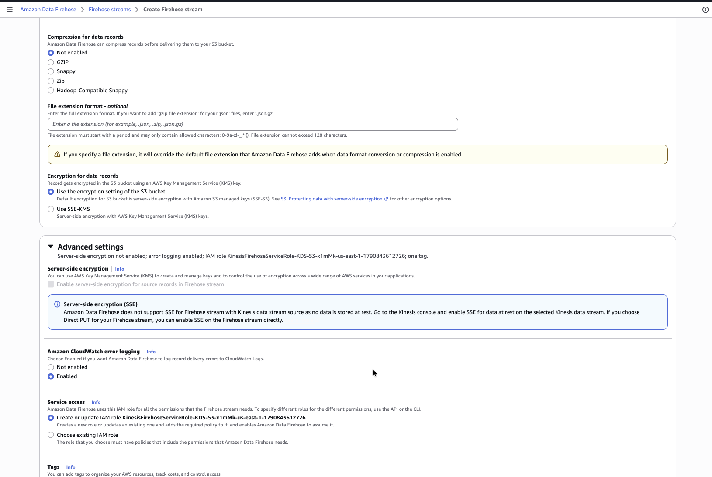
>
> 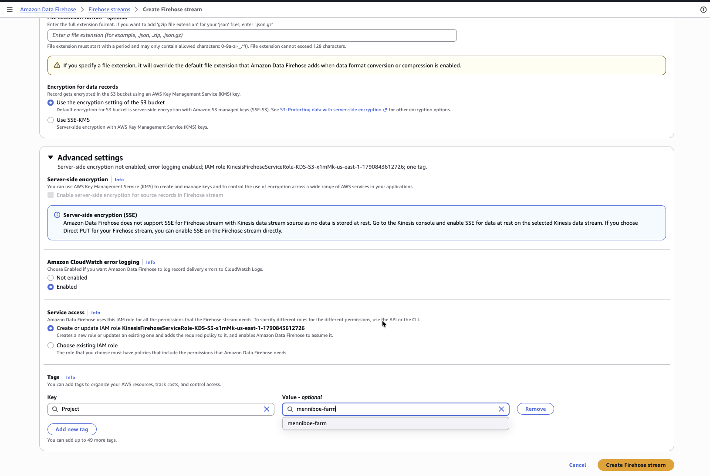
>
> | # | Problem | Fix |
> |---|---|---|
> | 1 | **Kinesis data stream** field empty | **Browse** → `menniboe-farm-stream` → **Choose** |
> | 2 | Name left as default `KDS-S3-x1mMk` | `menniboe-farm-firehose` (the IAM role name updates to match) |
> | 3 | **New line delimiter: Not enabled** | **Enabled**, so each record is on its own line |
> | 4 | **S3 bucket prefix: `YYYY/MM/DD/HH/`** typed literally | **Clear it.** Firehose already adds a `YYYY/MM/dd/HH` (UTC) path by default; typed text would create a folder literally named `YYYY`. Custom prefixes use expressions like `orders/!{timestamp:yyyy/MM/dd/HH}/` |

**Correct settings**

| Section | Field | Value |
|---|---|---|
| Choose source and destination | Source | **Amazon Kinesis Data Streams** |
| | Destination | **Amazon S3** |
| Firehose stream name | | `menniboe-farm-firehose` |
| Source settings | Kinesis data stream | **Browse** → `menniboe-farm-stream` |
| Transform and convert records | Transform with Lambda | **Off** |
| | Convert record format | **Off** |
| | Decompress CloudWatch Logs | **Off** |
| Destination settings | S3 bucket | `s3://menniboe-farm-datalake-<initials>` |
| | New line delimiter | **Enabled** |
| | Dynamic partitioning | **Not enabled** |
| | S3 bucket prefix | **Blank** |
| | S3 bucket error output prefix | **Blank** |
| | Prefix time zone | **UTC** |
| Buffer hints | Buffer size | **1 MiB** (min 1, max 128, recommended 5) |
| | Buffer interval | **60 seconds** (min 0, max 900, recommended 300) |
| | Compression | **Not enabled** (keeps the file readable) |
| | File extension format | Blank |
| | Encryption for data records | **Use the encryption setting of the S3 bucket** (SSE-S3) |
| Advanced settings | Server-side encryption | Greyed out (see note) |
| | CloudWatch error logging | **Enabled** |
| | Service access | **Create or update IAM role** |
| Tags | Key / Value | `Project` / `menniboe-farm` |

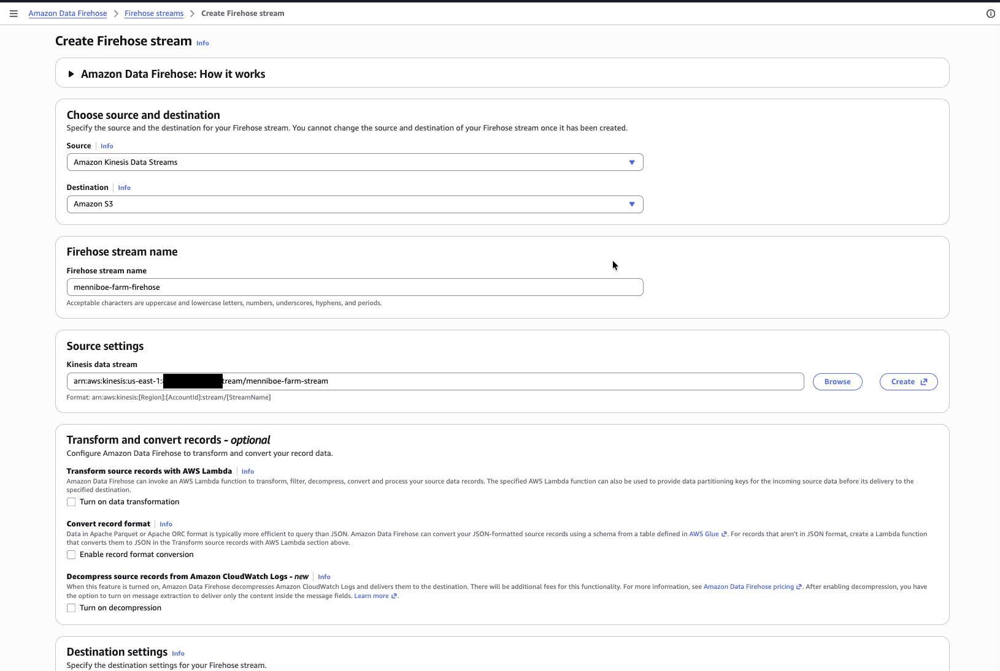

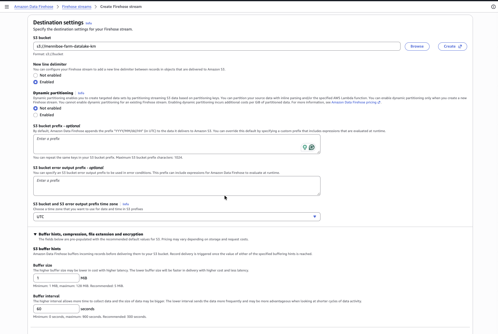

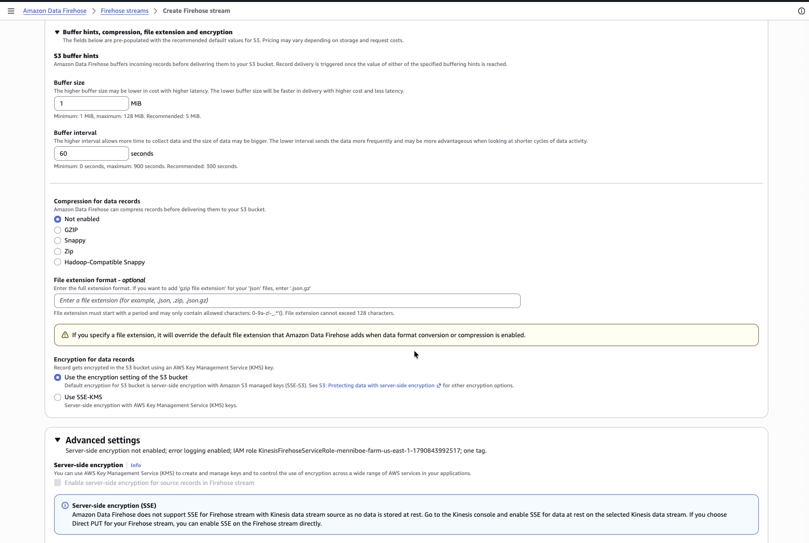

> [!NOTE]
> **Server-side encryption is greyed out** because, with a Kinesis source, Firehose doesn't store data at rest. To encrypt, enable SSE on the **Kinesis stream** itself (or use Direct PUT as the source).

Click **Create Firehose stream**.

> [!WARNING]
> **Error: "Your Firehose stream was not created… Wait a few minutes and try again."**
>
> 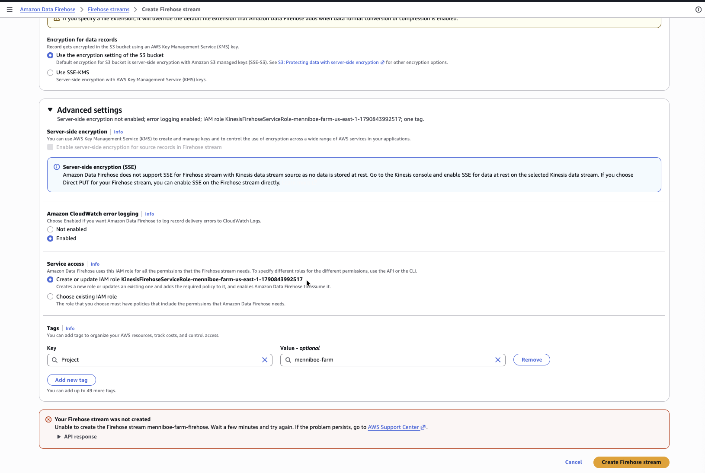
>
> Expand **▶ API response** to see the real cause:
>
> 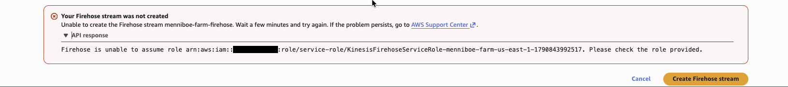
>
> `Firehose is unable to assume role arn:aws:iam::<account-id>:role/service-role/KinesisFirehoseServiceRole-menniboe-farm-us-east-1-… Please check the role provided.`
>
> **Cause:** **IAM eventual consistency.** The console created the role a moment before Firehose tried to use it, and a new role takes a few seconds to become usable everywhere.
> **Fix:** wait about **60 seconds** and click **Create Firehose stream** again (the settings stay on the page). If it fails again, choose **Choose existing IAM role** and pick the role created on the first attempt.

**Concept: assume role.** A service temporarily takes on a role's permissions. The **trust policy** says *who* may assume it (`firehose.amazonaws.com`); the **permissions policy** says *what* it can do (read the stream, write to the bucket). It's the same idea as an EC2 instance profile.

The retry worked: **Status: Active**.

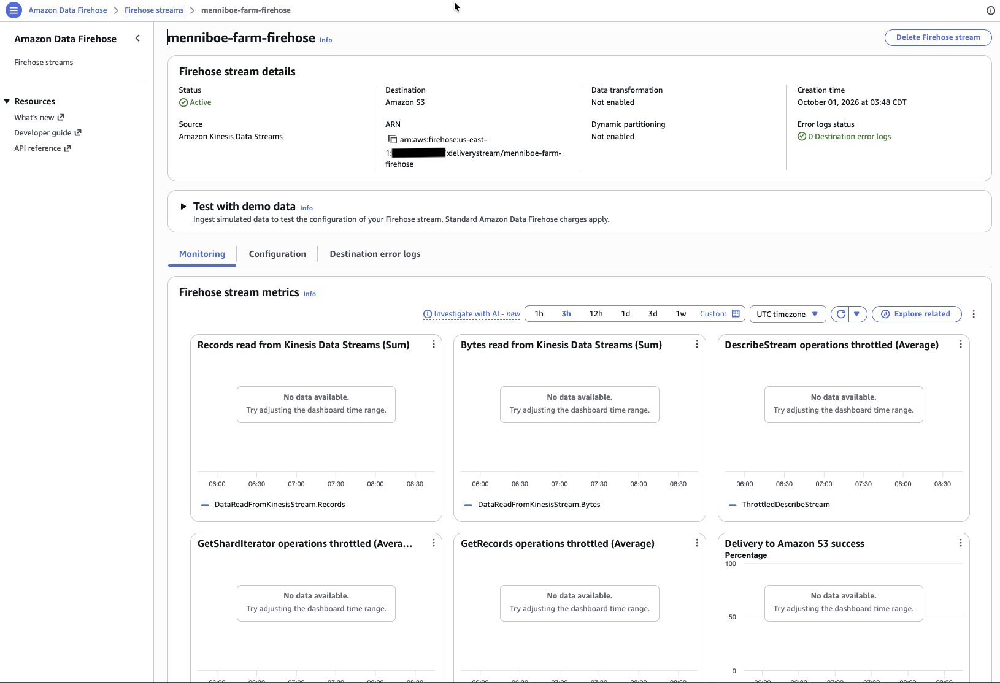

> [!NOTE]
> The Monitoring tab shows **GetShardIterator**, **GetRecords**, and **Records read from Kinesis Data Streams**: the exact calls I made by hand in CloudShell. Firehose is a managed consumer running that loop for you, plus buffering and S3 writes.

---

#### Step 6.3: Send new records and verify S3

```bash
aws kinesis put-record \
  --stream-name menniboe-farm-stream \
  --partition-key customer-ama \
  --data "Order 4001: 6 goats" \
  --cli-binary-format raw-in-base64-out

aws kinesis put-record \
  --stream-name menniboe-farm-stream \
  --partition-key customer-kofi \
  --data "Order 4002: 30 kg tilapia" \
  --cli-binary-format raw-in-base64-out

aws kinesis put-record \
  --stream-name menniboe-farm-stream \
  --partition-key customer-esi \
  --data "Order 4003: 2 pigs" \
  --cli-binary-format raw-in-base64-out
```

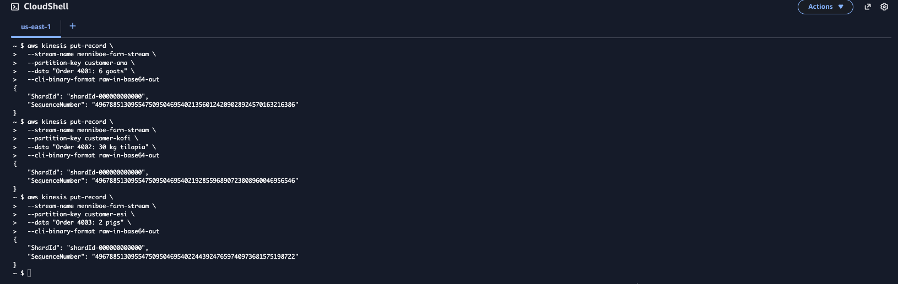

1. S3 → bucket → refresh right away → **0 objects** (buffer filling)
2. Wait **60–90 s** → refresh
3. Click through `2026/` → `10/` → `01/` → `08/`

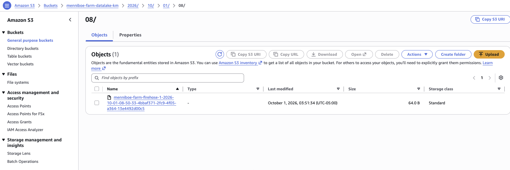

**Reading the result**
- **Folder `08/` while my clock said about 3:51 AM:** the prefix is in **UTC** (03:51 CDT = 08:51 UTC)
- **File name pattern:** `<stream name>-<version>-<UTC timestamp>-<unique ID>` → `menniboe-farm-firehose-1-2026-10-01-08-50-33-…`
- **About 1 minute** between the first record and the object: the **60-second buffer interval**
- **Size 64.0 B:** 19 + 25 + 18 = 62 characters + 2 newlines = **64** → **3 orders, not 6**

4. Select the file → **Open**

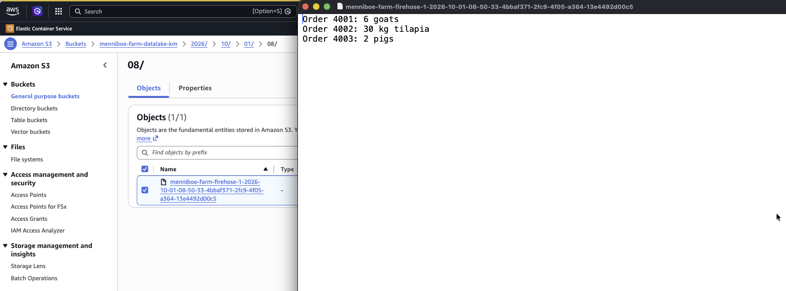

```
Order 4001: 6 goats
Order 4002: 30 kg tilapia
Order 4003: 2 pigs
```

**Prediction confirmed:** only the 4000-series orders (sent after Firehose went active) were delivered. The 3000-series records are still in the stream for other consumers to replay; Firehose just didn't start from the beginning.

**Pipeline:** `CloudShell (put-record) → Kinesis Data Streams → Data Firehose (60 s buffer) → S3 data lake`

---

### Part 7: Cleanup

#### Step 7.1: Delete resources

Delete the **billing** resources first, and Firehose before the stream it reads from. Run in CloudShell:

```bash
# 1. Firehose (stops it reading the stream)
aws firehose delete-delivery-stream --delivery-stream-name menniboe-farm-firehose
aws firehose list-delivery-streams

# 2. Kinesis stream (stops the hourly shard charge)
aws kinesis delete-stream --stream-name menniboe-farm-stream
aws kinesis list-streams

# 3. Empty, then delete the S3 bucket
aws s3 rm s3://menniboe-farm-datalake-<initials> --recursive
aws s3 rb s3://menniboe-farm-datalake-<initials>

# 4. SNS topic (also removes its 3 subscriptions)
ACCOUNT_ID=$(aws sts get-caller-identity --query Account --output text)
aws sns delete-topic --topic-arn arn:aws:sns:us-east-1:${ACCOUNT_ID}:menniboe-farm-orders-topic

# 5. All four SQS queues
for q in menniboe-farm-orders menniboe-farm-orders.fifo menniboe-livestock-orders menniboe-produce-orders; do
  aws sqs delete-queue --queue-url "$(aws sqs get-queue-url --queue-name "$q" --query QueueUrl --output text)"
  echo "Deleted $q"
done

# 6. Firehose CloudWatch log group
aws logs delete-log-group --log-group-name /aws/kinesisfirehose/menniboe-farm-firehose
```

**7. IAM role and policy (console):**
- IAM → **Roles** → search `KinesisFirehoseServiceRole-menniboe-farm` → **Delete** → type the name to confirm
- IAM → **Policies** → search `KinesisFirehoseServicePolicy-menniboe-farm` → **Delete**

> [!IMPORTANT]
> **Don't delete `Default_CloudWatch_Alarms_Topic`.** It's the real alarm topic, not part of this lab.

---

#### Step 7.2: Verify nothing remains

```bash
aws firehose list-delivery-streams
aws kinesis list-streams
aws sqs list-queues
aws sns list-topics
```

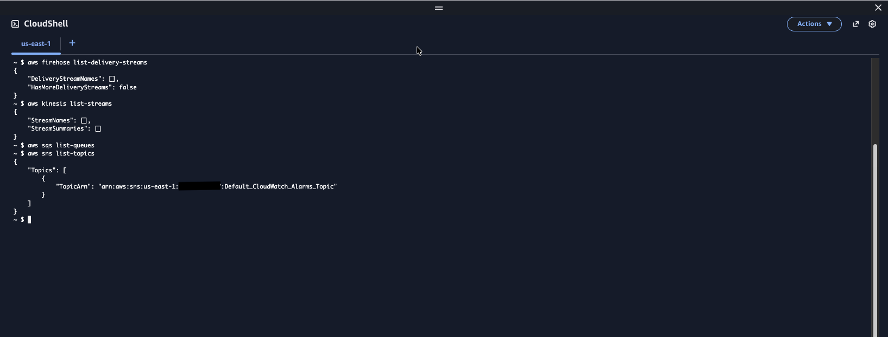

**Result:** Firehose `[]`, Kinesis `[]`, SQS returns nothing, SNS shows only `Default_CloudWatch_Alarms_Topic`. ✅

---

## 6. Troubleshooting summary

| # | Where | Symptom | Cause | Fix |
|---|---|---|---|---|
| 1 | [Step 1.3](#step-13-watch-the-visibility-timeout) | Same message, receive count 2 | Not deleted within the 30 s visibility timeout | `DeleteMessage` after processing; `ChangeMessageVisibility` for slow jobs |
| 2 | [Step 1.5](#step-15-batch-receive-and-best-effort-ordering) | 3 orders became 1 message (63 bytes) | All orders typed into one body | One order per message |
| 3 | [Step 2.2](#step-22-send-ordered-messages) | Pig order "sent" but count stayed 2 | Reused dedup ID `order-1003` within 5 min, silently dropped | Unique dedup ID per order (`order-1004`) |
| 4 | [Step 2.3](#step-23-deduplication-window-test-and-purge) | Resend with same dedup ID accepted (count 4) | More than 5 min passed; dedup window closed | Expected; make consumers idempotent |
| 5 | [Step 3.1](#step-31-create-the-sns-topic) | Topic type preselected FIFO | Console default | Choose **Standard** (FIFO only supports SQS subscribers) |
| 6 | [Step 3.3](#step-33-publish-a-message) | Email subject contained the body | Body pasted into Subject | Subject = `New order 1001` only |
| 7 | [Step 4.4](#step-44-add-filter-policies) | Couldn't find the filter policy | Section collapsed on the Edit page | Expand ▶ **Subscription filter policy**, toggle On |
| 8 | [Step 4.6](#step-46-debug-and-fix-the-routing) | Goats order landed in the produce queue | Published with `category = produce` | Correct the attribute; set it in code |
| 9 | [Step 4.6](#step-46-debug-and-fix-the-routing) | Produce queue received livestock orders | Produce filter never saved, so no filter means all messages | Add the filter and **Save changes** |
| 10 | [Step 6.2](#step-62-create-the-firehose-stream) | Firehose form: empty source, default name, newline off, literal `YYYY/MM/DD/HH/` prefix | Missed fields; prefix typed as plain text | Select stream, rename, enable newline, **clear the prefix** |
| 11 | [Step 6.2](#step-62-create-the-firehose-stream) | "Firehose is unable to assume role" | IAM eventual consistency on a brand-new role | Wait about 60 s and retry, or choose the existing role |
| 12 | Redaction | Account ID visible in banners, ARNs, `Topic owner`, `UnsubscribeURL`, email unsubscribe link | Easy to miss | Redaction checklist at the top of [Section 5](#5-hands-on-lab-redo-guide) |

---

## 7. Exam scenarios

| Scenario | Answer | Why |
|---|---|---|
| Web app calls an encoder directly; a promotion causes crashes and lost requests | **Put SQS between them** | Queue absorbs the spike; encoder scales on its own |
| One order event must reach email, fraud, shipping; services added/removed without producer changes | **SNS (pub/sub)** | Publish once, subscribers come and go |
| User must see approved/declined before the page moves on; API handles load fine | **Synchronous call** | Caller needs the answer right away |
| 50,000 IoT sensors; 3 teams read the same data in real time; one wants to reprocess the last 7 days | **Kinesis Data Streams** | Real-time, multiple consumers, replay |
| Standard queue occasionally double-charges; must keep unlimited throughput | **Make processing idempotent** | At-least-once delivery means duplicates happen |
| Consumer down for up to 10 days; no message loss | **Retention 14 days (max)** | Default 4 days isn't enough |
| S3 → SQS notifications never arrive | **SQS access policy** allowing S3 | Lock on the door being entered |
| Encrypt at rest with a team-controlled, rotatable, CloudTrail-logged key | **SSE-KMS customer managed key** | SSE-SQS keys are AWS-managed |
| A few messages take 3 min; timeout is 30 s; don't raise it for all | **`ChangeMessageVisibility`** | Per-message extension |
| Visibility timeout set to 12 h; consumer crashes | **Message reappears only hours later** | Too high delays retries |
| Every message takes about 60 s; timeout is 30 s; nearly all processed twice | **Raise the queue timeout to about 90 s** | All messages are slow |
| Polling in a tight loop; mostly empty responses; bill climbing | **Enable long polling** | Fewer API calls |
| Long polling for one team only on a shared queue | **`WaitTimeSeconds` on `ReceiveMessage`** | Doesn't change the queue setting |
| `WaitTimeSeconds=20`, message arrives at 3 s | **Returned at 3 s** | The wait is a ceiling |
| Bank deposits/withdrawals in exact order, never twice, about 200 msg/s | **SQS FIFO** | Order + exactly-once, under 300 msg/s |
| FIFO queue named `OrdersQueue` fails to create | **Name must end in `.fifo`** | Naming rule |
| All messages use group ID `orders`; adding consumers doesn't help | **Group ID = customer ID** | Parallel lanes, order kept per customer |
| Producer retries the same dedup ID 2 min later | **Second copy deduplicated** | Inside the 5-min window |
| Scale EC2 consumers on backlog | **CloudWatch alarm on `ApproximateNumberOfMessages`** | Queue-depth metric |
| Flash sale overloads RDS; customers only need "order received" | **Write to SQS; consumer ASG inserts into RDS** | Buffer pattern |
| Consumers delete, *then* insert; RDS throttles and orders vanish | **Delete only after the insert succeeds** | Process first, delete last |
| Front end + bursty GPU encoder, each scaling independently | **SQS between two ASGs** | Tier decoupling |
| CloudWatch alarm → email + Lambda ticket + HTTPS webhook | **SNS topic** | Fan out to mixed protocols |
| Published right after subscribing; nothing in the inbox | **Subscription pending confirmation** | Confirm the link first |
| HTTPS subscriber down for hours; notifications lost | **Subscribe an SQS queue; service reads it** | SNS doesn't persist |
| Account B publishes to Account A's topic | **SNS access policy on the topic** | Resource-based policy |
| S3 can't publish to SNS | **SNS access policy allowing S3** | Lock on the door being entered |
| SNS → SQS messages never arrive | **SQS access policy on the queue** | Lock on the door being entered |
| Every order to fraud and shipping at their own pace; more services later | **SNS → multiple SQS queues** | Fan-out |
| S3 `images/` object-created events must reach 3 queues | **S3 → SNS → fan out** | One event rule per type + prefix |
| Refunds queue should get only `state = refunded` | **Filter policy on that subscription** | Least overhead |
| Fan-out with per-order ordering and no duplicates | **SNS FIFO → SQS FIFO** | FIFO end to end |
| Ingest 6 MB/s into provisioned KDS | **6 shards** | 1 MiB/s write per shard |
| Each IoT device's readings in order across 10 shards | **Partition key = device ID** | Same key → same shard |
| 5 consumers throttled at 2 MB/s shared per shard | **Enhanced fan-out** | 2 MiB/s per shard per consumer |
| Logs to S3, near real-time, converted to Parquet, no code | **Data Firehose** | Managed loader + format conversion |
| Records sent; S3 empty until about a minute later | **Buffer by size or time** | Near real-time |
| Archive to S3 with no code **and** real-time fraud reads with 7-day replay | **KDS → Firehose → S3** | Streams for replay, Firehose for loading |
| Mask emails and convert CSV → JSON before S3 | **Lambda transform on Firehose** | Custom transform |
| Thumbnail jobs, each done once by one of many workers | **SQS** | Work queue |
| Keeps data after reading; many readers; shard-level ordering | **Kinesis Data Streams** | Stream semantics |
| Push notification to 2 million users; no storage needed | **SNS** | Pub/sub to mobile |
| 50,000 updates/s; live dashboard; compliance rereads 24 h daily | **Kinesis Data Streams** | Real-time + replay |
| Event to 3 services; one offline up to 2 days; no replay needed | **SNS → one SQS queue per service** | Fan-out + persistence |
| Migrate an on-prem RabbitMQ/AMQP app without code changes | **Amazon MQ** | Open protocols |
| Amazon MQ must survive an AZ failure | **Active/standby across 2 AZs with EFS** | Shared storage failover |
| New cloud-native app, huge unpredictable spikes, queue + pub/sub | **SQS + SNS** | Near-unlimited scale |

---

## 8. Takeaways and next steps

**Memory hooks**
- "SNS shouts, SQS remembers."
- "FIFO, five" (dedup window).
- Group ID = which line you stand in; dedup ID = your receipt number.
- Lock on the door being entered (resource policies).
- Process first, delete last.
- Visibility timeout ends → message comes back. Retention ends → message is gone.

